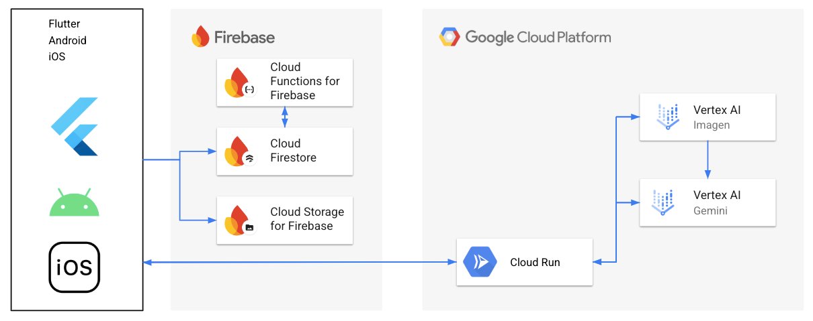

##  AI Agent Hackathon with Google Cloud用の記事です。

##  はじめに

「わからないことを質問すれば、AIが答えてくれる」こうした学習スタイルが急速に浸透しています。生成AIを利用すれば、複雑な概念も短時間で理解できるようになり、学習や情報検索の体験は大きく変わりつつあります。  
しかし、学習のプロセスを振り返ってみると、情報を頭に取り込む「理解」のステップは大きく進化したものの **「暗記する」というステップ** は、進化しておらず、依然として地味な反復や自作ノートに頼る場面が多いと感じています。

そこで生成AIを活用し、暗記方法をアップデートするアプリ、「Goroにゃーん」を開発しました。  
これはAIエージェントの仕組みを“暗記”というプロセスに特化して活かすことで、単語帳や年号暗記などの退屈になりがちな作業を、もっと楽しく、もっと効果的に変える試みです。AndroidとiOS向けにこのアプリは、ユーザーが覚えたい内容（単語、年号、フレーズなど）を音声で入力すると、AIが語呂合わせを生成し、さらに可愛い猫イラストを添えて記憶カードを作成します。ユーザーはそのカードを使ってクイズ形式の学習を繰り返し、正答すれば経験値やレベルアップが得られる――いわば“RPG風”のゲーミフィケーションを取り入れた暗記サポートアプリです。

##  作ったものの概要

「Goroにゃーん」は、ユーザーが覚えたい回答を音声入力すると、

  1. **問題と回答**
     * 音声から問題と回答を自動整理
  2. **意味、解説**
     * 単なる答えだけでなく、関連する背景情報や由来を短くまとめることで理解が深まり、記憶に残りやすくします。
  3. **ユーザーの興味に関連するエピソード**
     * ユーザーの好みや興味分野に絡めた小話やエピソードを挟むことで、学習をよりパーソナルに演出します。
  4. **語呂合わせ**
     * ダジャレや言葉遊びを交えた語呂合わせを自動生成し、暗記しやすく、かつクスッと笑える要素を付与。
  5. **かわいい猫をモチーフにした画像**
     * 「猫が◯◯している」シチュエーションの画像を生成して、ビジュアル面からも記憶を強化。（興味・意外性が学習効果を高める）。

これらから構成される記憶カード自動生成し、アプリ内でいつでもカードをめくる感覚で問題→回答をチェックできます。  
さらに、その記憶カードでクイズを出題して、**記憶の定着** をサポートします。  
アプリを使えば使うほど **経験値（XP）** が貯まり、ユーザーのアバターである“猫キャラ”が**レベルアップ** していくゲーミフィケーション要素を搭載。学習をゲームのように楽しめるため、モチベーションとリテンションが向上しやすいのが特徴です。

##  対象ユーザー

  * 試験や資格のために単語や年号を覚えたい方
  * 語学学習を継続したい方
  * 暗記作業が退屈で長続きしない、モチベーションが欲しい方

「Goroにゃーん」は、暗記が必要なあらゆる学習者に向けて設計しました。  
にゃーん度（ふざけ度）を設定できますので、テンション高く勉強したい場合はMAXに、また、低めにすればおとなしい語呂にもできるので、大人の学習シーンでも無理なく使えます。

##  背景、課題

  1. **暗記自体が“地味な反復”になりがち**
     * 多くの学習者は、暗記用ノートや単語帳を作って繰り返すしか方法がなく、興味が湧かないと飽きやすい。
  2. **語呂合わせ作成は意外とハードルが高い**
     * 自作の語呂を考えるのはセンスや時間を要し、挫折しやすい。
  3. **モチベーション維持が難しい**
     * 頑張って覚えても成果を実感しにくく、途中で諦める人も多い。
  4. **マルチモーダル学習の不足**
     * チャットの文字情報だけでは単調になりがち。

##  課題へのソリューション

  1. **ユーモアとイラストで飽きにくくなる**
     * 「次はどんな猫イラストが来るかな？」という楽しみが学習を継続させる。
  2. **AIが自動で語呂を作り、面倒を省く**
     * Geminiがダジャレや楽しくなるような言葉で語呂合わせの文章を即時生成 → 作る苦労が不要。
  3. **自分の興味に繋ぐ文章を生成**
     * ユーザーの興味につながる文章を生成するので、暗記しようとしているもの自体に興味が湧く。
  4. **音声入力＋マルチモーダル**
     * 発話することで記憶に残りやすい（音韻ループ効果） + イラストで視覚も刺激。。

##  デモ動画

<https://youtu.be/vl5q_zRYQL8>

##  画面構成

  * **ホーム画面**
    * レベル・猫アバター、直近に作った記憶カードが表示され、利用状況が一目瞭然
  * **記憶カード一覧画面**
    * 覚えていないカード一覧と全てのカードをタブビューでわけ、効率的に見直すことができます。
  * **作成ボトムモーダル**
    * 生成までは画面遷移しないので、スムーズに記憶カードを生成可能。
  * **クイズ画面**
    * シンプルなフラッシュカード方式のクイズ。
  * **設定画面**
    * 趣味興味の設定、にゃーん度（ふざけ度）の設定

##  システムアーキテクチャ

##  使用技術

###  Flutter

クロスプラットフォーム対応のUIフレームワークで、Dart言語を用いてAndroid・iOS向けのアプリを単一コードベースから構築できます。今回の実装においては、短期間でのプロトタイピングと将来的な拡張性のバランスを取りやすく、今後の開発を進める上でもスターター用途のリポジトリとしてちょうど良い規模感にまとまりました。

###  Gemini 2.0 Flash

テキスト生成に利用。こちらにより低価格で高品質な文章を生成することか可能となります。

###  Imagen3

画像生成に利用。高品質な画像を生成します。  
プロンプトの制御もしやすく、ねこの画像出力も安定しやすいです。

###  Cloud Firestore

NoSQLドキュメントデータベース。スケーラブルかつリアルタイムなデータ同期が可能

###  Cloud Functions for Firebase

サーバーレスな関数実行環境。Cloud Firestoreのトリガーで使用しています。  
TypeScriptで構築しました。

###  Cloud Storage for Firebase

強力かつシンプルでコスト効果の高いオブジェクトストレージサービス。  
Cloud Firestoreとの相性の良さで採用。

##  Firebase Authentication

ユーザー専用の記憶カードにするために、匿名認証を導入しました。

###  Cloud Run

マネージドなコンテナ実行環境。Hono/Node.js/TypeScriptで構築しました。  
Vertex AIををCloud Runから利用しています。

##  プロンプト

###  語呂合わせ生成
    
    
    # 指定された内容に関して記憶しやすい短い語呂合わせ、面白いフレーズ、言葉遊びを1から3つ作成してください。
    
    ## 出力形式
    
    - 各語呂合わせや言葉遊びを含む1から3つの箇条書きを提示してください。
    - 各語呂合わせや言葉遊びは指定された内容に直接関連し、簡潔かつ記憶に残りやすいものにしてください。
    
    ## 注意事項
    
    - 語呂合わせや言葉遊びは、音や意味の関連性を意識して作成してください。
    - 説明やコメントは避け、フレーズ自体に集中してください。
    - {CAT_LEVEL_TEXT}
    
    ## 語呂合わせを作成する内容:
    - 問題: {QUESTION}
    - 答え: {ANSWER}
    

###  語呂合わせ生成 2
    
    
    [
    	"シンプルで真面目な語呂合わせやフレーズを作成してください。",
    	"ユーモアを含んだ語呂合わせやフレーズを作成してください",
    	"猫語を使ったハイテンションなフレーズを作成してください。語呂合わせでなくても構いません。とにかくテンション高く、自由にふざけて表現してください（「にゃんにゃん」などの猫要素を盛り込むこと）",
    ];
    

###  画像生成
    
    
    An anthropomorphic cat avatar (or multiple anthropomorphic cats if appropriate) in a slightly loose and deformed anime style, 
    with thick line art, minimal use of color (mostly monotone), and designed to be memorable or attention-catching. 
    They should be integrated into a scene that visually represents the theme or context described by the following text:
    
    "{MEANING}"
    

##  ソースコード

<https://github.com/stdhkr/ai-agent-hackathon>

##  今後の展望

  * **生成クオリティの向上**
    * 現在は複数のプロンプトを連携させ、記憶に残るような項目（語呂合わせやエピソードなど）を生成していますが、今後はプロンプトエンジニアリングをさらに洗練し、猫キャラ特有のボキャブラリや口調を充実させることで、より自然で面白い語呂合わせを生み出すことを目指します。
  * **画像生成のオプション化・制限設定**
    * Imagenでの高品質なイラスト生成には時間がかかるため、ユーザーが「画像生成OFF」モードを選択すれば、テキストだけで語呂合わせを楽しめる設定を用意します。**利用シーンや端末環境に応じて生成内容をコントロール** したり、クオリティを調整したりすることで、サービス全体の運用コストやユーザー体験を最適化します
  * **カテゴリー追加**
    * もともと複数のプロンプトをchain的に走らせているため、**覚えたい内容をカテゴリー単位で分け、生成内容を最適化する** 仕組みを導入していきたいと考えています。たとえば英単語であれば例文やネイティブスピーカーの日常会話での使い方、類語などを付与し、歴史の年号であれば同じ時期に起きた出来事や豆知識を追加するなど、**カテゴリー別に学習効果を高める情報** を自動生成していく構想です。
  * **記憶カード共有**
    * ユーザー同士が作った面白い語呂やイラストをオンラインギャラリーで共有できる機能を計画中。お気に入りやコメント機能を通じて互いに刺激を受け合い、学習コミュニティの活性化とリテンション向上を図ります。

##  新規性

  1. 暗記学習 × 生成AI 
     * 多くの生成AIサービスは「わからないことを対話形式で解決する」ケースを想定しています。しかし「Goroにゃーん」は、**暗記そのもの** をより効率的かつ楽しくする視点に立ち、生成AIを活用しています。わからないことを調べるのではなく、**覚えたい事項を覚えやすい形に変換** し、学習モチベーションを維持する点が特徴です。
  2. 語呂合わせ × イラストで学習継続を誘発 
     * 単調な反復は暗記のモチベーションが下がりますが、「Goroにゃーん」では、語呂合わせと可愛い猫イラストをAIが生成し、**学習者を飽きさせない仕掛け** を提供します。笑いや意外性が脳の活性を促し、自然と繰り返し学びたくなるため、**覚えるプロセスへのモチベーション** が大きく高まります。
  3. 高いカスタマイズ性と拡張性 
     * カテゴリーごとの分岐プロンプト設計をするだけで、英単語・歴史・IT・医療用語など、あらゆるジャンルに対応可能です。**教育機関や企業研修、個人の語学学習** など、多方面への応用が期待できます。

##  まとめ

「Goroにゃーん」 は、地味で退屈になりがちな暗記作業を、AIエージェントの力でまったく新しい体験へと変える試みです。ユーザーは音声入力で覚えたい情報を手軽に登録でき、Gemini がダジャレたっぷりの語呂合わせとキュートな猫イラストを即座に生成。さらに、クイズ出題とレベルアップ演出によるゲーミフィケーションを組み合わせることで、学習意欲と記憶定着を両立させています。
