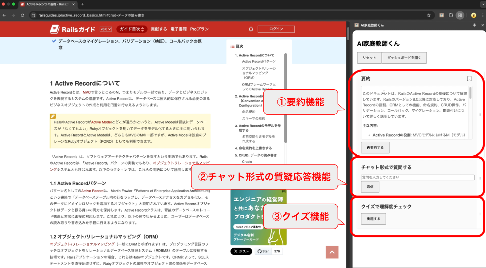
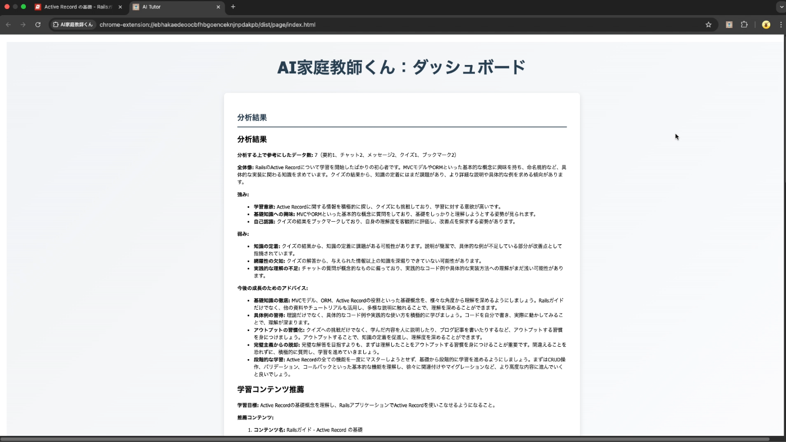
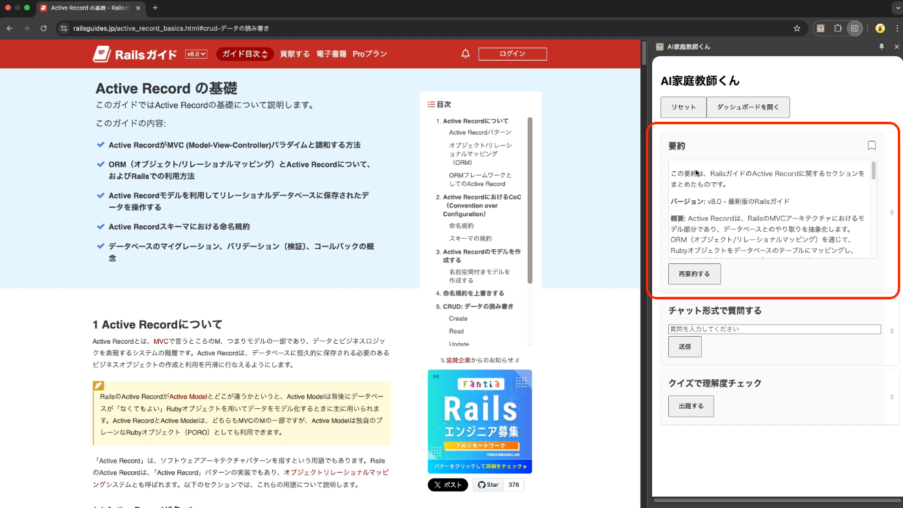
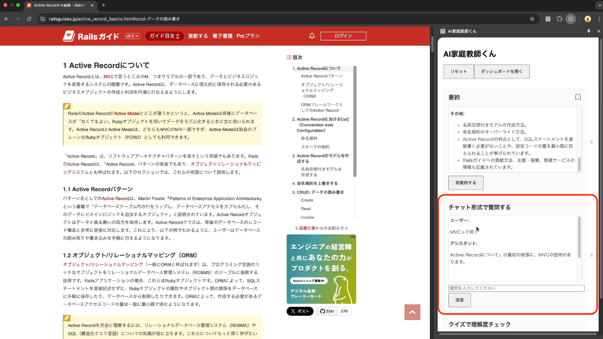
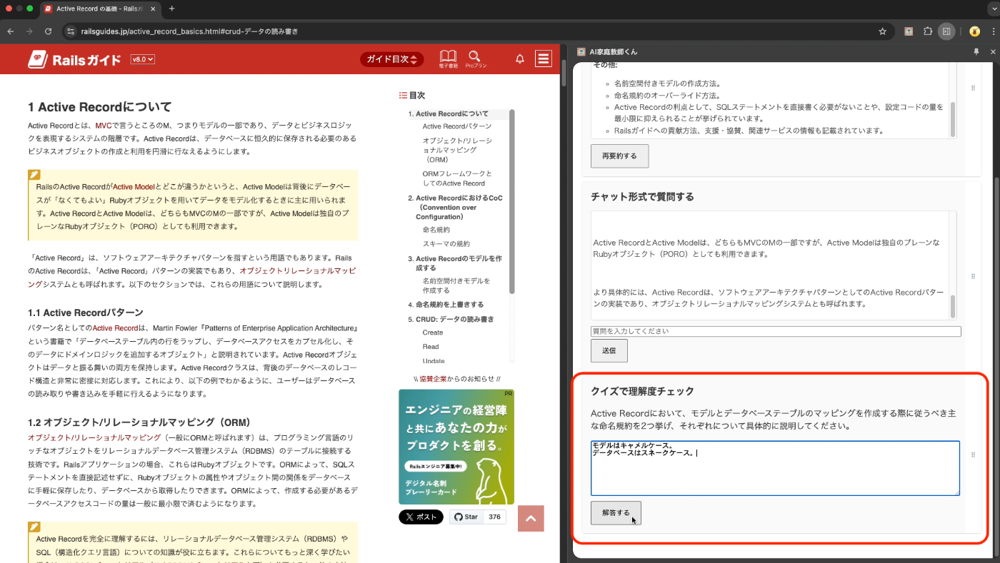
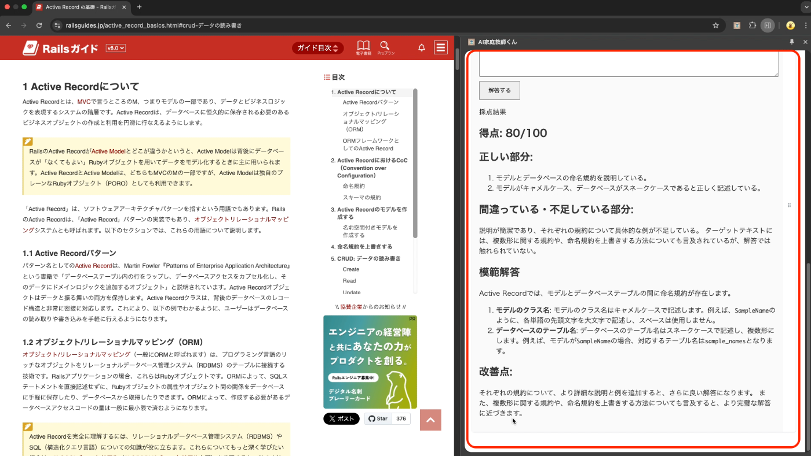
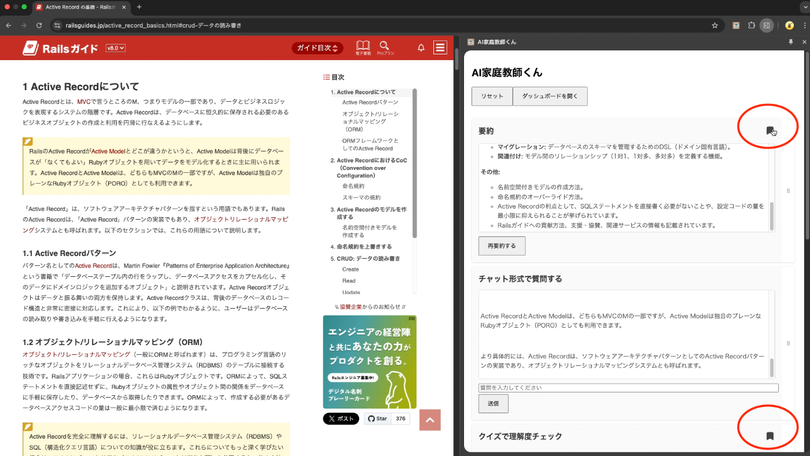
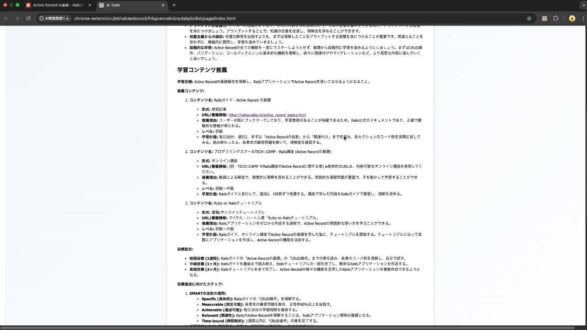
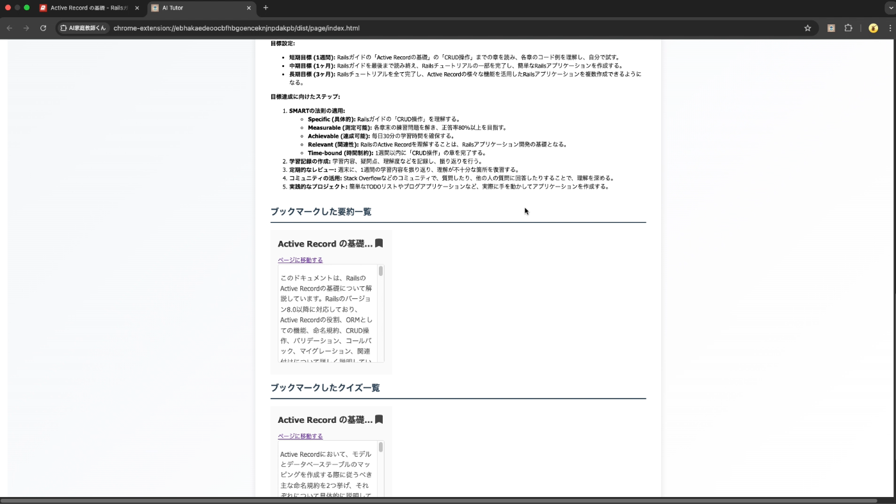
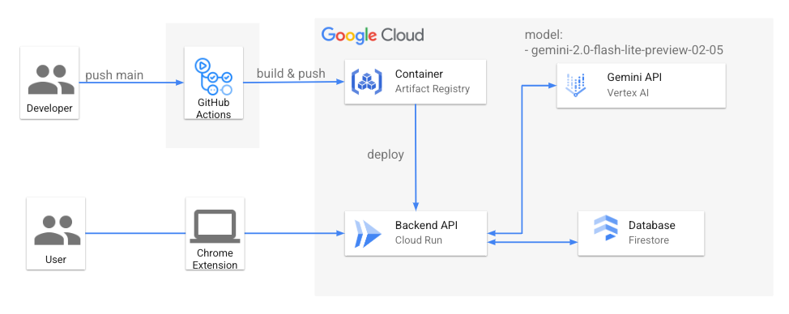

本記事はAI Agent Hackathon提出用に作成した説明記事です。  
<https://zenn.dev/hackathons/2024-google-cloud-japan-ai-hackathon>

チーム「もつなべ」の4名で開発しました。

#  Chrome拡張「AI家庭教師くん」

##  デモ動画

<https://www.youtube.com/watch?v=qR0-b6jWMGQ>

##  はじめに

現代は、Web上に膨大な情報があふれる時代です。特にエンジニアリングやIT分野に関心を持つ大学生や若手社会人は、最新技術や豊富な学習コンテンツにアクセスできる一方、情報の取捨選別や理解の定着に苦労することが多くなっています。従来の学習方法では、長文の技術記事や動画講座をただ眺めるだけで「分かった気になる」状態に陥り、実務に即応するスキルの獲得が難しいという課題がありました。

そこで登場するのが我々が開発した「AI家庭教師くん」です。本プロダクトは、Chrome拡張としてユーザーのWebブラウジング環境に常駐し、要約結果やチャット形式の質疑応答、クイズなどを通して、学習内容の整理・理解・定着を効果的に支援します。さらに、単なる学習支援ツールにとどまらず、AIエージェントとして自律的に動作する仕組みを備えており、データベースやWebサービス、さらには利用状況などから情報を収集し、状況に応じて最適な行動を選択・実行することで、ユーザーの負担を軽減します。

本記事では、「AI家庭教師くん」の概要、対象ユーザー、学習上の具体的な課題、提供する機能とその効果、採用技術について、詳細に説明します。

##  1\. 対象ユーザーとペルソナ設定

「AI家庭教師くん」は、主に大学生から若手社会人までのエンジニアやIT技術者、プログラミング学習者を対象としています。彼らは、情報工学やシステム開発、データサイエンスなどの分野で活躍しており、業務や資格試験、さらにはキャリアアップを目指して日々学習に励んでいます。

  * **年齢層と背景：** 20代前半から30代前半の学生や若手社会人。多忙な中でも短時間で効率的に学習を進める必要があり、Web上の技術記事や動画、オンライン講座などを活用して自己研鑽を続けています。
  * **学習動機：** プログラミング言語の習得、最新フレームワークやクラウド技術のキャッチアップ、資格試験合格など、実務に直結する知識やスキルの習得を強く求めています。
  * **抱える課題：** 膨大な情報から本質を見抜くことの難しさ、単なるインプットに終始して知識が定着しない点、疑問点のその場での解消ができず学習効率が低下する点などが挙げられます。

##  2\. ユーザーが直面する学習上の課題

現代のWeb学習環境において、ユーザーが直面する具体的な課題は以下の通りです。

  * **情報の氾濫と選別の難しさ：**  
同一テーマについても、初心者向けから上級者向けまで多岐にわたる情報が混在しており、必要な知識を効率よく抽出することが困難です。たとえば、新たなプログラミング言語の学習では、基礎概念と高度な実装例が混在するため、初学者がどこに注目すべきか判断しづらい状況にあります。

  * **知識の一過性と定着の不足：**  
長文記事や動画講座などのインプットだけでは、短期記憶に留まりやすく、時間が経過すると忘却してしまう傾向があります。アウトプットを伴わない学習では、実務や試験で即戦力となる知識の定着が難しいのです。

  * **疑問解消のタイムラグ：**  
学習中に生じた疑問をその場で解決できない場合、後になってから情報を探し直す手間が発生し、学習の流れが中断してしまいます。

  * **アウトプット不足：**  
ユーザーは学んだ内容を実践的に活用する機会が少なく、自己評価や復習の機会が不足しているため、学習効果の向上が図れず、結果として「分かった気になる」状態に陥りがちです。

##  3\. AI家庭教師くんの機能とその効果

「AI家庭教師くん」は、上記の課題を解決するために、AIエージェントとして自律的に学習支援を実現する多彩な機能を備えています。

###  3.1 要約機能

  * **概要：**  
ユーザーが閲覧中のWebページや技術ドキュメント、ブログ記事の内容を、AIが自動的に解析し、重要なキーワードや概念、実例を抽出して要約します。
  * **効果：**  
長文記事の全体を読むことなく、主要なポイントだけを瞬時に把握できるため、学習時間の短縮と効率的な情報整理が実現されます。自律的に最適な情報を選別することで、ユーザーは必要な知識に集中できる環境が整います。

###  3.2 チャット形式の質疑応答機能

  * **概要：**  
ユーザーが学習中に抱いた疑問を、サイドパネル上でチャット形式によりAI家庭教師くんに質問できます。

  * **自律的な対応：**  
AIエージェントとして、外部のデータベースやWebサービスから情報を収集し、状況に応じた最適な回答を自律的に提供します。

  * **効果：**  
その場で疑問が解消されるため、学習の流れが途切れることなく継続でき、理解度の向上につながります。

###  3.3 クイズ機能

  * **概要：**  
WEBページの内容をもとに、学習内容の定着を促進するクイズを自動生成します。自由記述形式のクイズを採用しており、ユーザーは選択肢に頼らず自分の言葉で解答できます。これにより、単なる丸暗記ではなく、学んだ内容を自らの表現で整理・確認できるため、より深い理解が促進されます。
  * **効果：**  
ユーザーは、自分の解答を通じて理解度を確認でき、苦手な分野や理解が不足している部分を把握することが可能です。従来のテストとは異なり、AIがユーザーの自由記述解答を解析し、正しい部分と誤りがある部分を具体的に指摘・解説します。また、解答内容の評価を細かい段階で行うことで、理解の深さに応じたフィードバックを提供し、個々の学習状況に合わせたアドバイスを自律的に提案します。

  

###  3.4 ブックマーク機能

  * **概要：**  
要約やクイズで気に入った内容をブックマークとして保存できる機能を備えています。

  * **効果：**  
保存されたブックマークは後から復習や参照が容易になり、学習効率がさらに向上します。

###  3.5 ユーザーの人物像分析

  * **概要：**  
これまでの要約結果、質問内容、クイズへの回答などから導かれるユーザーの学習傾向や人物像を分析し、表示します。
  * **効果：**  
ユーザー自身が自分の学習スタイルや強み・弱みを視覚的に確認できます。さらに、今後の学習計画の提案も行います。

  
  

##  4\. 採用技術

「AI家庭教師くん」は、Google CloudプロダクトとChrome拡張技術を組み合わせて実装されています。

  * **Gemini API in Vertex AI:**  
高度な自然言語処理と機械学習技術を活用し、Webページの解析やチャットでの質問応答において、文脈を踏まえた正確な回答を自律的に生成します。

  * **Cloud Run:**  
サーバレスアーキテクチャを採用することで、アクセスの急増にも柔軟に対応し、常に安定したパフォーマンスを維持。大規模なユーザーが同時に利用しても快適な学習環境を提供します。

  * **Firestore:**  
ユーザーごとの学習履歴、チャットログ、クイズ結果、ブックマーク情報などをリアルタイムに管理し、パーソナライズされた学習フィードバックの基盤として活用しています。

  * **FastAPI:**  
高速なWebアプリケーションフレームワークであるFastAPIを使用することで、APIサーバーを効率的に構築しています。これにより、Chrome拡張からのリクエストを迅速に処理し、Vertex AIとの連携やFirestoreへのデータ保存をスムーズに行います。

  * **Chrome拡張によるUI/UX:**  
常時サイドパネルとして表示され、要約、チャット、クイズ、ブックマークといった各種機能を直感的に操作できるインターフェースを実現しました。レスポンシブデザインにより、サイドパネルの幅を自由に変更することが可能です。

##  5\. アーキテクチャ図

  * **GitHub Actionsによるデプロイ自動化:**  
開発プロセスの効率化と品質向上のため、CI/CDパイプラインを構築しています。mainブランチへのプッシュをトリガーに、GitHub Actionsが自動的に起動します。ワークフロー内で、Dockerベースのコンテナイメージをビルドし、Artifact Registryにプッシュします。イメージのビルド時にはコミットハッシュをタグとして付与し、バージョン管理を徹底しています。その後、自動的にCloud Runへデプロイされ、最新のコードがサービスに反映されます。

##  6\. GitHubリポジトリ

<https://github.com/motsupot/katekyoshi-kun>

##  7\. まとめ

「AI家庭教師くん」は、膨大なWeb情報の中から本質的な知識を抽出し、チャット形式での即時疑問解消や定期クイズによるアウトプットを通じて、学習内容を確実に定着させる次世代型学習支援エージェントです。AIエージェントとしての自律的な機能により、ユーザーの指示を最小限に抑えつつ、必要な情報を自動的に収集・分析し、最適な学習支援を実現します。また、ユーザーの学習傾向や成果を可視化するダッシュボード、ブックマーク機能、さらには将来的なパーソナライズやコミュニティ機能の拡充により、利用者は自分自身の学習スタイルを深く理解し、効率的かつ継続的にスキルアップを図ることが可能です。

最終的に、「AI家庭教師くん」は、ユーザーがWebブラウジング中に効率的に情報を整理し、疑問を即時に解消、さらにはアウトプットを通じて知識を定着させるための、頼れる学習パートナーとして、学習者のキャリアアップや資格取得、実務での即戦力化に大きく貢献することを目指しています。
