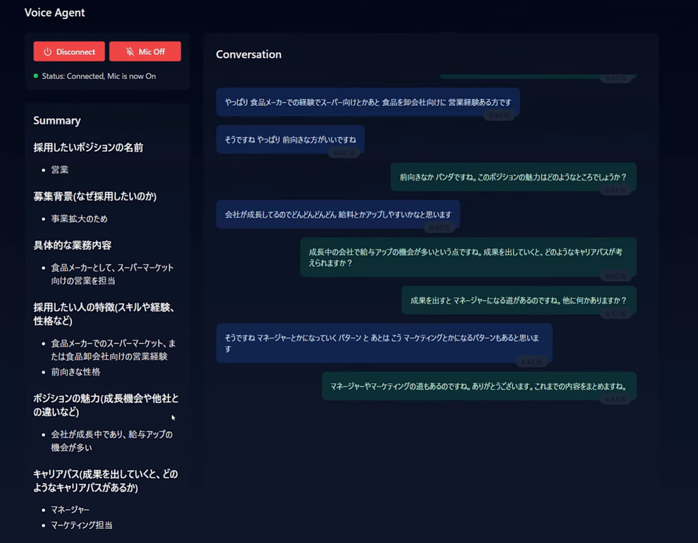
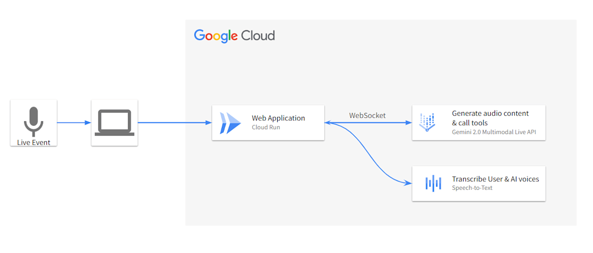

#  はじめに

タイトル通りですが、Gemini 2.0 と Multimodal Live API (Vertex AI 版) で、  
色々なヒアリングを行ってくれる Voice エージェントを作りました。

!

  * [AI Agent Hackathon with Google Cloud](https://zenn.dev/hackathons/2024-google-cloud-japan-ai-hackathon) 提出用記事のため、要件に沿った内容を書いています。

  * [ソースコード](https://github.com/ShintaroMorimoto/zenn-ai-agent-hackathon)は公開していますので、気になる方はご覧ください。

#  Web アプリの概要

  * 特定テーマに対して Gemini が音声でヒアリングします。 
    * 今回のデモでは、中途採用で募集したいポジションの詳細です。

##  機能概要

  * Connect / Disconnect ボタンで接続状態の管理
  * Mic On / Mic Off ボタンで音声入力の切り替え
  * 発言内容をリアルタイムで表示
  * 会話終了時にはその内容の要約を表示

##  デモ動画

  * デモ動画で想定しているテーマは以下の通りです

    * 話し手 (私) は食品メーカーの中途採用担当
    * 営業担当を採用したい 
      * 業務内容は、食品卸会社またはスーパーマーケット向けに、棚割拡大のための営業活動をすること

<https://youtube.com/watch?v=KNdZgyxNZL4>

  * 動画編集には [Filmora](https://filmora.wondershare.jp/) を活用しました。 
    * 無料版だとウォーターマークが入ることを、編集が終わった後に知って絶望しました (泣きながら約 6,000 円課金しました。おとなしく Premiere Pro にしておけば良かった、、)。
  * ナレーションには [AivisSpeech](https://aivis-project.com/) を活用させていただきました。 
    * アクセントがかなり自然で素晴らしいと感じました。

#  Gemini 2.0 と Multimodal Live API について

##  Gemini 2.0

  * [2024 年末に Google が発表](https://blog.google/technology/google-deepmind/google-gemini-ai-update-december-2024/)した LLM
  * リアルタイムでの処理が可能
  * 音声や動画などマルチモーダルなインプット、アウトプットに対応(GA されていない機能も多数)

##  Multimodal Live API

  * Gemini 2.0 のリアルタイムストリーミング機能を実現させる API 
    * 音声認識や画像認識、質疑応答がリアルタイムで可能
  * [Google AI Studio](https://aistudio.google.com/live) から簡単に試せる

デモ動画や他の特徴は[公式ブログ](https://developers.googleblog.com/ja/gemini-2-0-level-up-your-apps-with-real-time-multimodal-interactions/)をご覧ください。

#  対象とするユーザー像、課題

##  コンサルタント職の全般

###  前提

  * クライアントワーク全般が対象になり得る気はしますが、課題がボヤけてしまうことの防止目的で、あえてコンサルタントに対象を絞ります。

  * 私は前職で中途採用のコンサルタント的なことをやっていました。プロジェクトの受注前に、ある程度は営業がヒアリングしてくれていますが、実際にプロジェクトを進めていく際に聞きたいことが全て明確になるわけではありません。一方で、プロジェクトの入り口として聞く必要があることは、その多くが定型的な内容だったかなと記憶しています。

    * 例えば採用したいポジションの詳細 (詳しい業務内容、仕事の魅力) などです。

      * これらはメールでのヒアリングも可能ですが、大量の質問事項をテキストで羅列して送りつけるのは個人的に抵抗があります。

      * ヒアリングを受ける側にとっても、以下のような思いがあるのではと思っています。

        * メールでヒアリング項目を投げられても、文字での言語化が難しかったり、忙しかったりで返信ができない。
        * 事前に打ち合わせ時間を確保し、準備なしでヒアリングに臨む方が負担が少ない

###  課題 1：(付加価値の低い) ヒアリングを減らしたい

  * 特にプロジェクト開始時、クライアントに対してヒアリングが必要なシーンが多々ある

    * 一方でヒアリングが必要な内容は定型的であったり、ヒアリング単体で見るとプロジェクト推進上の付加価値が低い場合があるのではないか
    * 関係者の人数が増えるほど、日程調整の負担も重くなる

###  課題 2：ヒアリングの品質を標準化したい

  * 経験の浅いジュニアなメンバーはカンやコツがわからない 
    * 「この場合はこれを聞いておいた方が良さそうだな」という感覚など
  * 担当者の入れ替えがあるたびに教育が必要
  * ヒアリング漏れが発生する

#  課題へのソリューションと特徴

##  AI エージェントによるヒアリング代行

###  付加価値の低いヒアリングを減らす

  * 日程調整の手間を削減します。 
    * ヒアリングを受ける側としても、好きな時間に実施できる非同期性があります。
  * コンサルタントは付加価値の高い提案作業に集中できます。 
    * AI エージェントによるヒアリング内容をインプットとした上でクライアントと対話できます。 
      * プロジェクトの具体的な進め方や仮説提案など 
        * 今回テーマにしている中途採用だと、適切な採用媒体 (例：Findy や Forkwell) など

###  ナレッジのプロンプト化によるヒアリング品質の標準化

  * プロフェッショナルが蓄積してきたナレッジを生成 AI がプロンプトとして使用することにより、高品質なヒアリングを安定的に行います。

#  技術的な説明

##  ハイレベルアーキテクチャ

  * Cloud Run で動かしています。

  * Multimodal Live API は現時点で複数フォーマットの出力を同時にできないため、人だけでなく Gemini の音声も Speech-to-Text で文字起こししています。  

  * バックエンドは、フロントエンドと Multimodal Live API を中継するプロキシサーバーのような役割を持っています。

##  シーケンス図

##  エージェントのアーキテクチャ

  * LangGraph でよく使われるグラフっぽい見せ方をしていますが、エージェントとして状態が定義されているわけではありません。 
    * プロンプトのみで会話の流れ (と言えるほど複雑ではないですが) を制御しています。

###  プロンプト

  * 以下が今回設定しているプロンプトの抜粋です。 
    * そこまで調整していませんが「何かご用ですか？」みたいなことを言わないように、最初の一言だけは指定しています。

    
    
    const persona = '中途採用のプロフェッショナル';
    
    const instructions = `
      クライアントが採用したいポジションについて、ヒアリングを行ってください。
      第一声では必ず「この度はお時間ありがとうございます。早速ですが、採用したいポジションについて教えていただけますか。」と言ってください。
    
      ## 以下が明確になるまで、ヒアリングを続けてください。
      - 採用したいポジションの名前
      - 募集背景(なぜ採用したいのか)
      ...(省略)
    
      ## ヒアリングで意識してほしい点
      - "なぜその業務をやるのか" "なぜその経験が必要なのか"といった、目的や背景を深堀りする質問をしてください。
      ...
    
      ## ツールの使用
      - ヒアリングが終わったら、summarizeツールを使用してヒアリング内容を要約してください。
      ...
    `;
    
    const setUpPrompt = `
      あなたは${persona}です。
      <instructions>
      ${instructions}
      </instructions>
    `;
    

###  要約ツール

  * Gemini 2.0 Flash に会話履歴を読ませて要約しています。
  * 以下は `backend/index.ts` の関係部分の抜粋です。 
    * 大枠として、Multimodal Live API では以下の流れでツールを使用します。

  1. 使用できるツールを宣言
  2. Gemini への最初のリクエストでツール宣言を渡す
  3. Gemini がツールの使用を必要と判断した際に「ツールを使って！」というレスポンスがくる
  4. そのレスポンスをもとに作成しておいたツール (関数) を使う

    
    
    // 使用できるツールを宣言
    const summarizeFunctionDeclaration: FunctionDeclaration = {
      name: 'summarize',
      description: 'Summarize the conversation.',
      parameters: {
      type: SchemaType.OBJECT,
      properties: {
        conversation_history: {
          type: SchemaType.STRING,
          description:
            'Conversation history of AI and user. Must be a string, not a json object',
        },
      },
      required: ['conversation_history'],
      },
    };
    
    ..(省略)
    
    // Gemini への最初のリクエストでツール宣言を渡す
    clientWs.on('open', () => {
      // SetupMessage
      const data: SetupMessage = {
        setup: {
          model: `projects/${project}/locations/${location}/publishers/google/models/gemini-2.0-flash-exp`,
          systemInstruction: {
            parts: [
              {
                text: setUpPrompt,
              },
            ],
          },
          generationConfig: {
            responseModalities: 'audio',
          },
          tools: [{ functionDeclarations: [summarizeFunctionDeclaration] }],
        }
      };
      const json = JSON.stringify(data);
      clientWs.send(json);
    
    ..(省略)
    
    // Gemini からのレスポンスでツール呼び出しがあった場合は要約ツールを使う
    clientWs.on('message', async (message) => {
      const response: LiveIncomingMessage = (await JSON.parse(
        message.toString(),
      )) as LiveIncomingMessage;
    
      if (isToolCallMessage(response)) {
        const summarizeFunctionCall = response.toolCall.functionCalls.find(
          (fc) => fc.name === summarizeFunctionDeclaration.name,
        );
        if (summarizeFunctionCall) {
          if (!audioProcessor.getCurrentTranscription().trim()) {
            console.log('No conversation to summarize');
            return;
          }
          const summary = await summarizeService.summarize(
            audioProcessor.getCurrentTranscription(),
          );
          serverWs.send(
            JSON.stringify({
              type: 'toolResponse',
              text: summary,
            }),
          );
    

文字数の関係で割愛しますが、`summarize` 関数はシンプルに Gemini にリクエストを投げて要約してもらっているだけです。

##  技術スタック

言語、ライブラリ：TypeScript、React  
フレームワーク：Hono  
スタイリング：Tailwind CSS、Shadcn/ui (ほぼ [v0](https://v0.dev/) の力で仕上げました)

#  この Web アプリを現実で使うことを想定した際の課題

##  技術面

  * Multimodal Live API は [15 分までしかセッションが維持できない](https://cloud.google.com/vertex-ai/generative-ai/docs/model-reference/multimodal-live#maximum-session-duration)
    * インプットできるコンテキストのサイズ制限を超過した場合は 15 分経たずに終了してしまう
    * セッション再接続の仕組みが必要
  * Gemini の喋り方が不自然 
    * それが原因で、Speech-to-Text の文字起こし精度が低め
    * 現段階では Text-to-Speech で音声出力した方がソリューションとしての完成度は高くなると感じる (とはいえ今回は Multimodal Live API でやりたい気持ちを優先しました)
  * 稀に外国語で返答してくる 
    * フランス語や英語で返してくることがあった
    * 日本語で返してくださいと伝えると、そこからは日本語になった
    * プロンプトでの調整で解決できる可能性あり
  * 管理者向けの画面がない 
    * 時間の問題で作るに至らなかったが、管理者向け画面を作って、そこから生成 AI との対話画面 URL の発行やプロンプトの調整、想定シーンの設定などが必要

##  心理面

  * AI の精度がそこそこ良くなっても、1 対 1 で クライアント (お客様) と AI を対話させるのは心理的なハードルが高く感じる可能性が高い 
    * 過渡期的には、Web 会議に AI を参加させて、コンサルタントのヒアリングが不足していた場合に横から口を挟んでサポートするような感じになるのかなと感じている

#  おわりに

このテーマに取り組もうと考えた理由としては、  
以下 2 つの観点から生成 AI との音声でのやり取りが増えてくるんじゃないかと思い、  
技術的なキャッチアップをしておきたかったからです。

  * [Browser Use](https://github.com/browser-use/browser-use) や [NVIDIA の Project R2X](https://blogs.nvidia.co.jp/blog/nvidia-launches-ai-foundation-models-for-rtx-ai-pcs/#:~:text=%E3%82%82%E3%81%A7%E3%81%8D%E3%81%BE%E3%81%99%E3%80%82-,%E3%82%A8%E3%83%BC%E3%82%B8%E3%82%A7%E3%83%B3%E3%83%88%E5%9E%8B%20AI%E3%81%AB%E8%A1%A8%E6%83%85%E3%82%92%E4%B8%8E%E3%81%88%E3%82%8B,-%E3%83%A6%E3%83%BC%E3%82%B6%E3%83%BC%E3%82%84%E9%96%8B%E7%99%BA%E8%80%85) など、AI エージェントが活動できる範囲が技術的に広がっている
  * 生成 AI とテキストでやり取りするのがめんどくさいと思っている人が多いのではないか

OpenAI の Realtime API を触って何かしてみようかなーと思っていたところだったので、  
Gemini 2.0 の発表も、このハッカソンも非常に良いタイミングでした。

[HeyGen](https://www.heygen.com/) なんかがすでに足を踏み入れていますが、  
「人と Web ミーティングしてたと思ったら、AI だった、、」  
なんて未来も遠くないのかもしれないですね。ワクワクです。  
私も Zoom の SDK を触ってみるところから始めます。

#  参照 URL

##  Gemini 2.0

  * [Google Cloud 公式ドキュメント](https://cloud.google.com/vertex-ai/generative-ai/docs/gemini-v2)

##  Multimodal Live API

  * [Google Cloud 公式ドキュメント](https://cloud.google.com/vertex-ai/generative-ai/docs/model-reference/multimodal-live)
  * [Google Cloud 提供のデモ (Vertex AI)](https://github.com/GoogleCloudPlatform/generative-ai/tree/main/gemini/multimodal-live-api/websocket-demo-app)
  * [Google Cloud 提供のデモ (Gemini Developer API)](https://github.com/google-gemini/multimodal-live-api-web-console)

