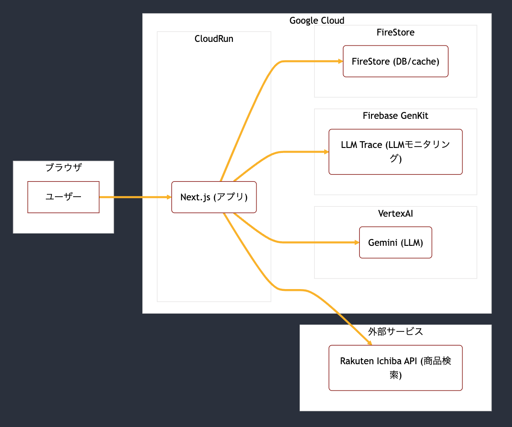
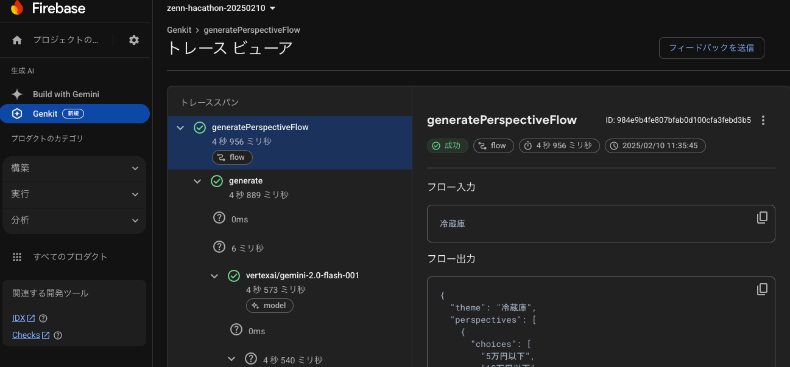

!

この記事は、[AI Agent Hackathon with Google Cloud](https://zenn.dev/hackathons/2024-google-cloud-japan-ai-hackathon)の提出を目的としたものです。

##  要約

  * 瞬時に、一人一人に合わせた、買い物の比較検討ができるAI Agentアプリを作りました 
    * 結果表示ができていませんが、触っていただければコンセプトはご理解頂けると思います
  * デモ動画はこちら
  * [アプリのURLはこちら](https://ec-concierge-872619022049.asia-northeast1.run.app/)
  * LLMやFirebase Genkitなど技術的な工夫点はこちら

##  はじめに

「新しい家電、どれがいいんだろう？」「自分にぴったりのサービス、見つからない…」

そんな悩みを抱えるあなたへ。

Smart Choice は、AI エージェントがあなたの代わりに徹底比較 & 最適な選択肢を提案する、革新的なサービスです。もう、情報過多の海に溺れる必要はありません。Smart Choice があれば、あなたの貴重な時間を無駄にすることなく、最高の一品に出会えます。

##  背景

###  本プロジェクトの対象ユーザー

Smart Choice は、以下のような特徴を持つ、**20代〜30代の若い男女** をメインターゲットとしています。

  * **情報リテラシーが高い：** 最新のテクノロジーやサービスに抵抗がなく、積極的に活用する。
  * **生活スタイルの変わりやすい：** 進学、就職、結婚、引っ越しなど、ライフステージの変化が頻繁に起こる。
  * **時間は限られている：** 仕事、趣味、自己投資など、やりたいことが多く、常に時間に追われている。
  * **UI/UXへの期待値が高い：** 直感的で使いやすく、視覚的に理解しやすいインターフェースを求める。
  * **費用対効果を重視する：** コストパフォーマンスに敏感で、無駄な出費を避けたいと考えている。
  * **スマートフォンの利用がメイン：** 情報収集やサービスの利用は、主にスマートフォンで行う。

###  対象ユーザーが抱える課題

####  課題の概要

  * 既存の比較サービスは、画一的な情報を提供するものが多く、ユーザーにとって最適な選択肢を探すのに時間がかかる
  * 既存の生成AIチャット系サービス 
    * UIが最適化されていないため、見ずらい
    * 求める情報を得るのに、プロンプトチューニングの手間が必要な場合がある
    * 情報を得るまでに長い待ち時間が発生する

####  競合サービス

  * [mybest](https://my-best.com/)

    * **概要**
      * メディアとして、商品やサービスの比較・検証、おすすめ商品が提供されている
    * **長所**
      * 徹底比較タグのついた記事は、前半の観点ごとの説明が詳しい上、比較観点ごとに商品がテーブル構造で整理されており、コンテンツの質は高い
    * **課題**
      * 情報量が多いため、消費者ユーザーは自分に最適なものを探すのに時間がかかってしまう、認知負荷が高く、意思決定をするコストが高いという課題がある
      * 徹底比較タグのついていない記事は、簡単な説明とレコメンド順位のみが提供されており、比較観点を十分に検討することができない
  * [価格.com](https://kakaku.com/)

    * **概要**
      * 商品カテゴリごとに一覧でき、条件で詳細な絞り込みができる
    * **長所**
      * ある商品のショップごとの最安値が確認できる
    * **課題**
      * 該当カテゴリに知識のあるユーザーしか自分にとって適切な絞りこみができない
  * 生成AI系ツール

    * **対象サービス** : [ChatGPT](https://chatgpt.com/), [GenSpark](https://www.genspark.ai/), [DeepSeek Chat](https://chat.deepseek.com/)
    * **長所**
      * 一度の命令で、大量のWebページの内容を一つのレポートにまとめることができる
    * **課題**
      * 表示が商品比較などに個別最適化されておらず、最適化のためにはプロンプトチューニングが必要である
      * 一度の返答に最大30秒〜30分の時間がかかり、情報を得るまでの待ち時間が長い

##  解決策の提案

###  解決策の概要

「Smart Choice」を利用することで、上記の課題を解決し、ユーザーの買い物や製品比較の体験を向上させます。Smart Choiceは、本ハッカソンのテーマである”AI Agent"という概念をもとに設計されています。

###  ”AI Agent”という概念

本ハッカソンでは、(意図的に？) "AI Agent"の定義は行われていないため、認識齟齬を減らすために個人的な解釈を示します。

補足

  * 方向性的な意味合いを含むため、一人一人の言葉の解釈は分かれても問題ない認識です
  * 一方で、一つのモノを作るためには関係者の認識を合わせる必要があります

####  個人の解釈

  * ユーザーの目的を達成するために、(ソフトウェア上で)**必要な操作や意思決定を最大限減らしたい**

  * 一方で、**ユーザーの目的達成の質** に大きく関わる方向性の意思決定は、人間が判断したい

  * 上記にトレードオフが存在する場合もあり、ユースケースによって判断する必要がある

  * 参考にした文献

    * [AI エージェントとは? | AWS](https://aws.amazon.com/jp/what-is/ai-agents/)
    * [What are AI agents? | IBM](https://www.ibm.com/think/topics/ai-agents)
    * [「AIエージェント」の定義揺れすぎ問題に向き合ってみた【大手ベンダ6社調査】| Qiita](https://qiita.com/t_horumon/items/9c330de1c2e9a6d2ad84)

###  解決策の特徴

  * **曖昧な入力でも大丈夫！:** 商品名やサービス名を正確に入力する必要はありません。略称からでも、AI が比較対象を特定します。
  * **比較観点を自動提示：** カテゴリごとに最適な比較観点を AI が自動的に提示。あなたは、提示された選択肢を選ぶだけ！
  * **パーソナライズされたレコメンド：** あなたのニーズに合わせて最適化されたおすすめ順を提示。固定的なランキングではありません！
  * **視覚的な比較：** 比較結果は、グラフなどを用いて一目でわかるように表示。長い文章を読む必要はありません！
  * **スマホファーストなUI/UX:** スマートフォンでの利用に最適化された、使いやすいデザイン。

##  デモ動画

<https://youtu.be/QiNhlvOLCcI>

##  今後の展望

  * **完成度** :

    * 触ってみるとわかるように、時間が間に合わず結果画面を充実させることができませんでした。
  * **選択肢の精度の向上** :

    * 観点ごとの選択肢の生成は、すべてを一回のLLM呼び出しで呼び出しているので、タスク分割することで更なる精度向上が見込めます
  * **対応カテゴリの充実**

    * 現在は、主なユースケースとして家電を想定していますが、書籍や宿泊ホテルなど、あらゆる比較検討に拡張できます
  * **購入先のレコメンド**

    * ユーザーの最終目的は、比較だけに終わらず、買い物を完了させることなので、価格や保証などを総合的に考えて、購入先をレコメンドすることができると考えています

##  審査基準への対応

###  アイデアの質

Smart Choice は、AI エージェントを活用した比較サービスという点で、独創性があります。

###  問題の明確さと解決策の有効性

Smart Choice は、情報過多、時間的制約、パーソナライズ不足といった現代社会の課題を明確に捉え、AI エージェントを活用することで、これらの課題を効果的に解決しています。

###  アイデアの実現

Smart Choice は、MVP として必要な機能を実装し、実際に動作するプロトタイプを開発しました。また、拡張性、運用性、費用対効果についても考慮しています。

##  技術面

###  ソースコード

[GitHub レポジトリ](https://github.com/masa5555/smart-choice)

###  システムアーキテクチャ図

###  使用技術

  * **アプリケーション実装**
    * Next.js (App Router)
    * TailwindCSS
    * shadcn/ui
  * **インフラ**
    * **Cloud Run**
      * GitHubレポジトリを連携し、コミットされたら自動的にデプロイされる仕組みを設定済み
    * **FireStore**
      * スキーマレスでデータを永続化できるため、PoCとして採用
    * **Custom Search API**
      * Webページの検索に使用
  * **LLM**
    * **Gemini Vertex AI**
    * **Firebase GenKit**
  * **外部サービス**
    * Rakuten Ichiba API: 商品検索用

###  技術的な工夫点

####  UI/UX面

AIをアプリケーションに統合するためには、ユーザー体験を考えたUI/UX面の工夫も重要な観点です。

  * **ユーザー操作の最小化**
    * 構造化出力を活用し、できるだけユーザーに求める操作が少なくなるようにしています
  * **画面遷移・読み込みのローディング表示**
    * 読み込み時間の長くなりがちな生成AI活用アプリでは、ローディング表示が不可欠です

####  LLM(Gemini)の活用

  * **モデル選定**
    * [2025/2/5にGemini 2.0 Flashがリリースされています](https://blog.google/technology/google-deepmind/gemini-model-updates-february-2025/)
      * Gemini 1.5 Flashと同程度のコスト・速度で高いベンチマーク結果が出ています
  * **プロンプトエンジニアリング**
    * Few Shots: 具体的な出力例をプロンプトに含めることで、出力精度のチューニングができる
  * **構造化出力**
    * ユースケースごとに、構造体のスキーマを定義することで、プログラミングコードで扱いやすくすることができます
  * **Context Cache**
    * 同じ入力に対する出力を一定期間キャッシュすることで、リロード時や他のユーザーがアクセスした時に、すぐに応答することができます
    * Gemini 1.5シリーズには搭載されていますが、Gemini 2.0ではまだ対応されていなかったため、FireStoreで擬似的に実装しています。具体的には選択肢の生成をキャッシュしているので、是非実際の動作をご確認ください。

####  Firebase GenKitの活用

**Firebase GenKit** は、LLMに関する包括的な開発者向けツールです

  * **LLM呼び出し**

    * Vercel AI SDKと同様に、zodによるスキーマ定義をサポートしています 
      * [OpenAIのSturucuted Output](https://platform.openai.com/docs/guides/structured-outputs/some-type-specific-keywords-are-not-yet-supported)と異なり、最大最小の指定ができ、意図する構造体を得やすいです
  * **LLMモニタリング**

    * LLM Tracingツールとしては、LanghSmithが有名ですが、GenKitも簡単な導入手順でLLMモニタリングを実現できます
    * 大きな違いは、Genkitにはローカル用のUIが用意されており、GenKit CLIをインストールしておけば、一コマンドで起動することができます  

  * その他 (今回未使用)

    * RAG: Vertex AIと連携して抽象化された関数を呼び出すだけで実装できる
    * 認証: 呼び出し単位ごとに、firebaseの認証を設定でき、アプリケーションが作りやすい

###  まとめ

Smart Choice は、AI エージェントがあなたの代わりに徹底比較 & 最適な選択肢を提案する、革新的なサービスです。

Smart Choice があれば、あなたの貴重な時間を無駄にすることなく、最高の一品に出会えます。
