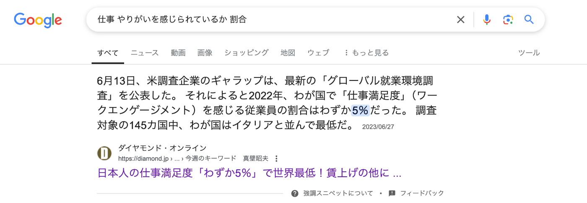
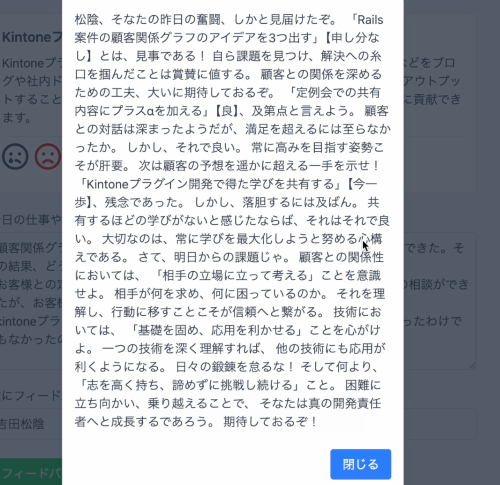
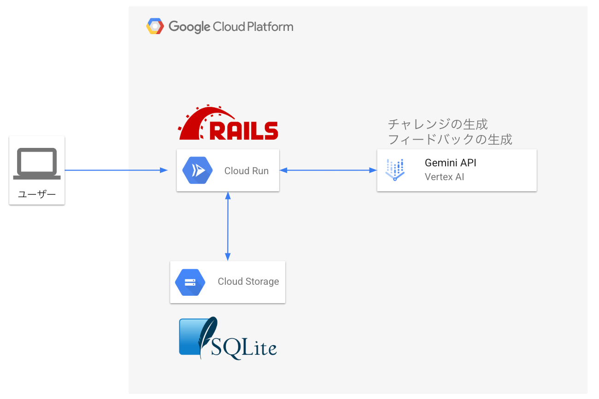
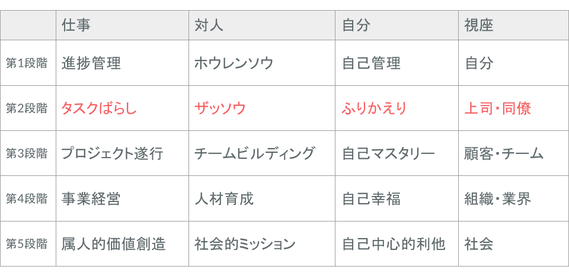

##  はじめに

この記事は【AI Agent Hackathon】に参加するために作成したアプリ「チャレンジコンパス」の紹介記事となります。

チャレンジコンパスは「日々の仕事をやりがいのあるものにする」ことを目的に開発したWebアプリです。「ただタスクをこなす日々から脱却したい」という状態の人に対して、チャレンジするための“方向”を示す役割を担いたいという思いを込めて「チャレンジコンパス」と命名しました。

本記事ではこのアプリを開発するに至った経緯、またどのようにして「日々の仕事をやりがいのあるものにする」のかを説明していきます。

##  プロジェクトの課題と背景

###  仕事がつまらないという課題

皆さんは毎日の仕事にやりがいを持って取り組めていますか？

ここで迷わず「YES」と答えられた方、とても羨ましいです。私も同じように「YES」と言いたいところですが、一切の迷いなく言えるかというと残念ながら「No」です。

私は最近になってようやく、この先ずっとプログラマーとして生きていこうと思えるようになったのですが、それまではプログラミングはあくまで仕事のためにやっている側面が大きかったように思います。

依頼されたことや相談されたことは基本的に断らずやってきましたが、あくまで受動的な姿勢であり、「自分はこれをやりたい！」という能動的なモチベーションはあまりありませんでした。

そう言った姿勢で日々の仕事に取り組んでいたわけですが、次第にある問題に直面します。

**仕事がつまらなくなる** という問題です。

基本的に受動的な姿勢なので依頼された仕事をただこなしていくだけになっていくわけですが、それは「自分ができるとわかっていること」をやっているだけでそこには何の感動も成長もありません。

なかなか気軽に相談できない性格とリモートワークということも災いし、一時期は結構メンタルも病んでいたと思います。

これはまずいと思い、社内の掲示板に毎日その日の学びを投稿するようにしたこともありましたが、意志の弱さもあり3日で挫折してしまいました。

色々あって最近は「プログラマーとして生きる！」と積極的に思えるようになったわけですが、それでも毎日やりがいを持って仕事ができているかといえばそれは「No」です。この仕事ただこなすだけになってるなーと思うことが結構あります。

【AI Agent Hackathon】で開発するものを決めるにあたって色々考えた結果自分自身がこう言った課題を抱えていることに思い至り、今回の開発テーマにしてみることにしました。

###  これは世の中全体の課題なのでは？

私自身の話を結構してしまったわけですが、これは世の中全体の課題なのでは？と思いちょっと調べてみました。

いろいろな記事が出てきますがその中の一つ、DIAMOND ONLINEによると日本人の仕事満足度は「**わずか5％** 」で世界最低とのことです。びっくりですね。

[https://diamond.jp/articles/-/325135#:~:text=6月13日、米,と並んで最低だ。](https://diamond.jp/articles/-/325135#:~:text=6%E6%9C%8813%E6%97%A5%E3%80%81%E7%B1%B3,%E3%81%A8%E4%B8%A6%E3%82%93%E3%81%A7%E6%9C%80%E4%BD%8E%E3%81%A0%E3%80%82)

最初の問いに迷わず「YES」と答えられる方はこの5%に入っている方ということであり、非常に幸運なことだと思います。

「やりがいはあるけど給料が少ない」など満足度にも色々あると思うので、残りの95％全員がやりがいを感じられていないわけではないと思いますが、少なくとも世の中の大多数は私と同じような思いを抱えているのではないかと思います。

そうした方々の何％かでも日々の仕事を前向きに捉えられるようになるとしたら、それはとても意義のあることではないでしょうか。

###  対象とするユーザー像

そんなこんなで、このサービスが対象とする人を言語化すると概ね以下のような人たちになりそうです。

  * 日々の仕事にやりがいを感じられていない人
  * なんとなくタスクをこなすだけになってきているなと感じている人
  * 最近成長を実感できていない人
  * 自発的に何かに取り組んだみたものの、継続できなかった人

本サービスのソリューションで上記のような人たちの課題を解決していければと思います。

##  課題へのソリューション

日々の仕事をやりがいのあるものにしていくために、本アプリでは以下のようなソリューションを提供します。

###  日々どんなことにチャレンジするのか決めることをAIがサポート

日々新しいことにチャレンジしていく中で一番大変なことは、何をするのか「決めること」だと思います。

現状を打破するために何かしなくては、と頭ではわかっているのになかなか実際の行動に移せない、そんな経験が皆さんもあるのではないでしょうか。

もっといい方法があるかもと思って色々情報収集をするも、かえって情報を集めすぎてしまいどれが正解なのか余計に混乱してしまったり、「どうせならベストな決断をしたい」と考えすぎて、一歩を踏み出せなくなったりと言った経験が私はよくあります。

こういう時は「何をするか」ではなく「何でもいいからチャレンジしてみること」が大事だとわかってはいても、いろんなことが頭の中を巡ってなかなか決められないものです。

またチャレンジすることを決めたとしても、毎日継続するとなると自分の中に確固たる確信がなければなかなか難しいものです。

そういった何にチャレンジするか「決めること」を本アプリではAIを使ってサポートします。

具体的には、ユーザーが事前に入力した情報と、ユーザーの日々の仕事のタスクをもとにGeminiがその人にパーソナライズしたチャレンジを生成します。

実際にチャレンジを出力してみた画像がこちらです。

ユーザーはAIに提案されたチャレンジを達成していくことで、自然と主体性を持って仕事を取り組むことにつながり、仕事にやりがいを持てるようになるという仕組みです。

###  チャレンジしたことに対してAIを用いて第三者目線でフィードバックする

チャレンジから学びを得て次のチャレンジに活かすには、やってみてどうだったのか振り返りをする必要があります。  
自分自身どう感じたのか、もっとこうすればよかったかもと考えることはもちろん大事ですが、学びを深めるという観点では第三者の意見を取り入れることも非常に重要です。

本アプリではユーザーの振り返りの内容をもとにAIがフィードバックを行い、ユーザーがさらに学びを得るためのサポートを行います。

チャレンジに対して松韻先生がフィードバックしてくれている図。遊び心でユーザーが入力した人物がフィードバックしてくれるようにしてみました。松蔭先生はさすが熱いお方です。

##  システムアーキテクト図

構成としては非常にシンプルな構成となっていて、Rails8で作成したアプリがGemini APIと通信してチャレンジの生成やチャレンジに対するフィードバックの生成を行なっています。

また、DBはSQLiteを使用しており、DBファイルはCloud Storage上に保管しています。

今回この構成を構築するにあたって以下のZenn記事を参考にさせていただきました。  
記事を投稿いただいたKiyoKato様にこの場を借りてお礼申し上げます。

<https://zenn.dev/kiyokato/articles/6d4b6f629768b7>

##  デモ動画

<https://www.youtube.com/watch?v=Opg6Kt6Aodk>

##  今後の展望・改善点

このサービスの現状最も大きな課題は、「**目標や目指したい姿がない人** 」に適切なチャレンジを出すことができないということです。  
日々のチャレンジは「こういうことができるようになりたい」や「自分はこれで生きていきたい」といった方向性があってのものなので、そもそも自分がやりたいことが明確でない状態だとこのサービスに価値を感じてもらえません。

より多くの人々がやりがいを持って仕事ができる状態を目指すために、「自分がやりがいを感じることや目指したい方向に気づく」ところからケアできるようなサービスにできればと思っています。

また基本的な技術検証は今回の開発でできましたが、それ以外にも使い続けることのできるサービスにするためには以下のように多くの開発が必要です。

###  チャレンジの積み重ねを視覚化し、成長を実感できるようにする

  * チャレンジの履歴の確認
  * なんらかの指標を用いた成長度合いの計測 
    * 例えばソニックガーデンには「セルフマネジメントの5段階」というセルフマネジメントスキルの指標があるため、日々のチャレンジの内容をこの指標に照らし合わせて自分が今できていることや次どういったチャレンジに取り組めばいいかの判断基準にするなど  

###  アプリ内で他の利用者の存在を実感できる仕組みづくり

  * アプリ内で他にもチャレンジに取り組んでいる人がいることを実感できることで、モチベーションにつながる
  * その人の仕事内容や目標からユーザーの属性を分類し、同じ属性の人がどんなチャレンジをしているかわかるようにすることでチャレンジの励みになるような仕組みを作る

###  ゲーミフィケーション要素の導入

  * チャレンジ連続継続期間を表示し、継続期間に応じてバッジの付与などを行う
  * ランキング機能の導入。チャレンジの難易度に応じて経験値が付与される仕組みにし、ユーザー間で積極的にチャレンジを競わせるような仕組み

###  チャレンジが失敗した時にフォローする仕組み

  * 日々新しいことに取り組んでいくため何かしら失敗してしまうことも考えられる
  * 失敗を好意的に捉えられるようなUXを導入したい 
    * 例えば失敗した内容だけが流れるタイムラインのようなものを作り、失敗することが当たり前だと思えるようにするなど
    * または、チャレンジ失敗した時に他にも同じような失敗をした人がxx人いますのようなメッセージを表示するなど

###  マネタイズの仕組みの検討・開発

  * ユーザーからサービス利用料をいただく形になると思うが、このあたりはまだまだ具体的に考えられていない

##  まとめ

ハッカソンに参加すると決めてから何を作るか色々頭を悩ませた結果、２週間くらい前になってようやく作るものが決められました。やっぱり「決めること」ってめちゃくちゃ大変ですね笑

ただ色々考えたおかげで、自分の中で大事にしたい価値観やどういったことに興味があるのかを改めて知ることができました。

決めるのが遅かったですしスキル的にも全然足りてないので、やりたかったことの半分も実現できませんでしたが、方向性としては結構悪くないんじゃないかという気がしています。

また技術的にも、GoogleのAIサービスに色々触れることができて、とても楽しかったです。  
RailsをGCP上で動かすという経験もできたので、今後の仕事にも活かせる知識を身につけることができました。

元々このアプリは自分自身が使いたくて作り始めたものなので、実際に使えるレベルになるまで頑張ってみようかなと思います。

最後になりますが、今回はこのような貴重な機会をいただきまして本当にありがとうございました！

これからもプログラマーとして日々精進を続けてまいります。
