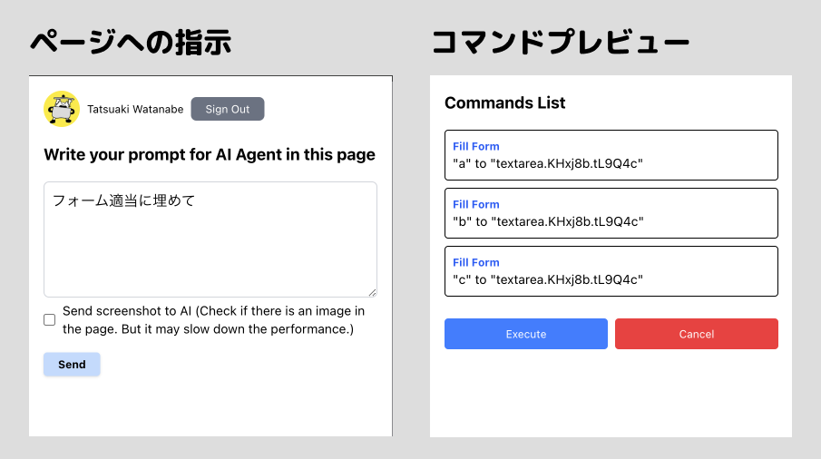
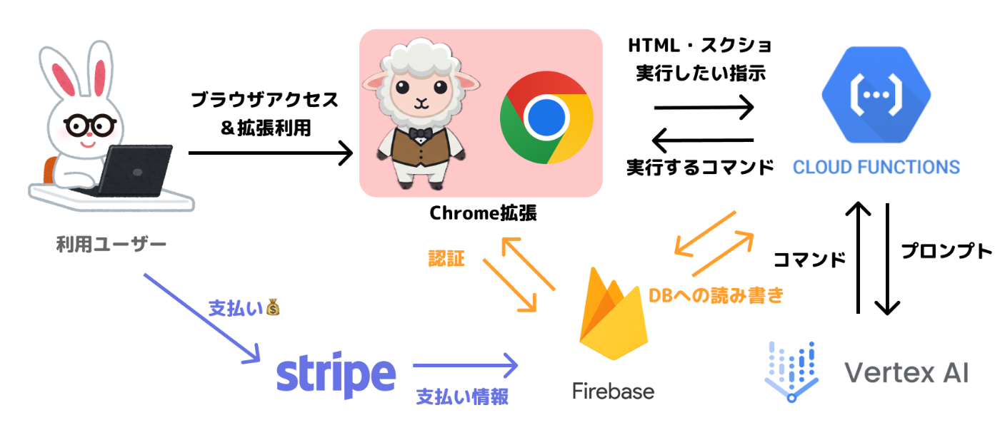

こんにちは [@nabettu](https://x.com/nabettu)です。  
最近は [NitoAI](https://www.nitoai.app/jp) や [TypeAI](https://www.typeai.net/applink) などのAIツールを作っています。

この度はZennでハッカソンが開かれるという事で参加してみました💪

という事でこの記事は[AI Agent Hackathon with Google Cloud](https://zenn.dev/hackathons/2024-google-cloud-japan-ai-hackathon)の応募記事です。わいわい！

#  課題：世に出ているAIエージェントは便利だけど、、、

今回はAIエージェントをテーマにしたハッカソンですが、みなさんAIエージェントと聞いて何が最初に頭に浮かんだでしょうか？

最近だと、[OpenAI社が発表したOperator](https://aismiley.co.jp/ai_news/what-is-operator/)や、[Claude社が発表したComputerUse](https://docs.anthropic.com/en/docs/build-with-claude/computer-use)、また[Browser Use](https://browser-use.com/)などなど、ブラウザやPC自体の自動操作型のAIエージェントがいくつかリリースされています。

自然言語でAIに「あれやっといて」と指示が出せるのは大変魅力的ですね。

ただ、このあたりのエージェント、 **そのまま動作させるの結構怖くないですか？**

というのも 自分のPCやブラウザの操作権限を渡す場合にはAIがどういった操作をするのか不透明な状態で勝手に変なこと色々やってしまったら、、、と考えると流石に**全ての権限を渡すってのは流石にリスキー** ですよね。

自PCでそのまま操作するよりも、操作できる権限が限られた環境を用意したくなります。そのためDockerなどの中で動作させたりしている方もいます。

しかしそういった**制限を設けた環境を用意するのが手間** だったり、用意したとしても**自分の情報でログインしていない状態でやれることはあんまりない** という課題があります。それなら普通のクローラーでいいんじゃないかとなってしまいがち。

そして結局ログインするための**IDとパスワードをAIに渡すような状態になってしまうと、結局セキュリティリスクがあります** 。と、堂々巡りしてしまいますね。

#  作ったもの：Chrome拡張でのブラウザAIエージェント

そこで私が今回作ったのは、**Chrome拡張で動作するブラウザAIエージェント** です。

  * エージェントが動作する安全な環境を用意するのが面倒
  * エージェント及びAIにログインのための情報を渡したくない
  * でもログインした状態でエージェントに操作を任せたい

という、既存のAIエージェントを利用する上での課題を解決するプロダクトです。

プロジェクトが対象とするユーザー像としてはPCブラウザで行うすべての動作を自動化したいと考えている方です。  
これにより**既存のRPAサービスでは解決できなかった領域の自動化なども可能になると考えています。**

##  解決策

すでにご利用のChromeブラウザでインストール後、利用したいページでChrome拡張のポップアップを開いて、**そのページで動作してほしいことを自然言語でAIエージェントに伝えます。**

すると、**AIが指示した通りにページの中でブラウザを操作し、伝えたことを自動で行ってくれます。**

また、**画像などに応じて動作をAIに判断させたい場合にはページのスクリーンショットを送ることでより正確な指示ができます。**

実行時には何を実行するのか事前に表示され、実際の動作を確認できます。

##  動作デモ

こちらが作ったBrowserAIAgentの動作デモ動画です。２つの動作を実際にさせてみました。

  1. Googleフォームで作られた退会フォームの自動入力
  2. Zennのトップページからの人気記事一覧のCSV形式でのダウンロード

<https://youtu.be/TqgY6fn50xs>

  1. フォームでは「適当に全部の入力欄を埋めて」という指示で、自動で退会フォームが入力されました。
  2. Zennの記事一覧をまとめたCSVがダウンロードできました（デモでは5秒ほどの動画ですが、実際には10秒くらい待ちました。）

##  プロダクト本番URL

###  Chrome拡張

!

拡張機能をストアに出しはしたんですが、ログインを入れたバージョンのChrome拡張の審査が通るまでは一旦こちらのzipをダウンロード→「パッケージ化されていない拡張機能を読み込む」からインストールしてください。

<https://drive.google.com/drive/folders/1Seph8ztq10as1vEW1xS745LUOgutPdr9>

###  Webサイト及び課金管理画面

<https://agent.nabettu.com/ja?ref=zenn>

#  技術解説

##  システム・アーキテクチャ

##  使用技術

  * Chrome拡張 
    * React.js
    * Vite
    * Firebase Auth, Firestore
  * AI接続API 
    * Cloud Functions
    * Firebase Auth,Firestore
    * Vertex AI Gemini
  * Web・課金部分 
    * Next.js(React.js)
    * TailwindCSS
    * Firebase Hosting,Auth,Firestore,Stripe Extension
    * v0
    * Stripe

##  実装ポイント

###  1\. セキュアなコマンド実行基盤の構築

Chrome拡張でAIにページを操作するJavaScriptをそのまま吐かせ、そのまま `eval` 関数で実行するという手法を最初は取ろうとしていましたが、**Chrome拡張で外部から取得したJavaScriptをそのまま実行することは基本的にセキュリティ的にできません。**

そもそもAIが悪意のあるコードを学習しておりそのまま出力してしまっていた場合に、そのまま実行してしまうのは問題です。

そこでこのChrome 拡張では【フォーム入力】や【ボタン押下】など、**特定の"コマンド"を内部実装し、そのコマンドをどのように操作するかをAIにFunctions Callingで出力させて利用しています。**

利用できるコマンドは今のところ以下になります。

  * フォーム入力
  * ボタン押下
  * スクロール
  * 要素のテキストリライト
  * タブを開く
  * 文字列ファイルダウンロード

このように、実行可能な**コマンドを厳密に定義し、実行前のバリデーションを行うことでAIによる意図しない操作やXSS攻撃などを防いでいます。**  
操作でなくページに関する質問はコメントという形で出力されます。

また、コマンド形式にすることにより、実際の操作のプレビューや、今後はコマンドの保存・特定の動作のスキップなども行えるようになります。

###  2\. 効率的なAI通信設計、スケーラブルなバックエンド設計

API部分では **Cloud Functionsを利用したサーバーレス設計により、スケーラブルな構成** となっています。内部のVertex AI Geminiとの通信では、Functions Callingを活用して構造化されたレスポンスを得ています。

しかしAPIがユーザーから無限に使えてしまうと、AIの利用料金がかかってしまうリスクがあります。そのため、Firebase Authを利用して、ユーザーの認証を行った上で、Firebase Firestoreにユーザーのログイン情報を保存しています。そして利用回数を記録し、一定以上の利用には課金が必要なビジネスモデルにしています。

また、AIへはページのHTMLと、必要に応じてページにスクリーンショットを送ることで、AIにコマンドを出力させています。HTMLもbodyの内容に絞るなど、多少軽量化して送信していますが、それでも入力トークン数が大きくなってしまいます。 **Gemini ならトークン数が多くても大丈夫なのは心強いです。**

###  3\. できるだけコードを書かずに効率化

バックエンドは基本的にFirebaseスタックを利用しています。これによりバックエンドの実装自体は最低限となっております。

またその中でもStripeでの課金実装を行う上でFirebaseとの連携を自動で行える [Firebase Extension の Stripe](https://extensions.dev/extensions/invertase/firestore-stripe-payments) の利用 により、**ノーコードで課金の実装が行えます。** 非常に便利なのでFirebaseをお使いの方はぜひ使ってみて下さい。

Chrome拡張・Webサイト側での管理画面・APIへの認証では3箇所ともFirebase Authを利用しています。それぞれで同じ認証基盤を了解できるため、簡単に実装が行えます。Firebase最高！

また、LPのデザインでは[v0](https://v0.dev/)や[Cursor Composer](https://docs.cursor.com/composer/overview)を利用して、実装コストを抑えています。

#  今後の展望

##  1\. 性能の改善

今回利用したのはGemini 2.0 Proでしたが、より賢いモデルが登場すれば、今後はより正確な動作が期待できます。

また、ページのHTMLを必要な部分のみ軽量化してから送信することで、トークン数を抑えることも可能です。

##  2\. セキュアかつ、入力UXの向上

入力が面倒なものとして「住所の自動入力」などには対応したいところです。現在もプロンプトに渡せば行えはします。

しかしAIに直接プロンプトとして個人情報を渡すのではなく、Chrome拡張側でAIが置換文字列とした出力した内容に応じて文字列を置換して入力するような形式であればクライアント側で完結するため安心です。

また、現状htmlのbody部分すべてを送っているため、そこに含まれている情報はAIにプロンプトとして送られてしまっています。そのあたりをマスクしてから送れるともっと安心ですね。

##  3\. 自動化プロセスと共有、バックグラウンドでの操作

このプロダクトの欠点として動作に時間がかかってしまう点があります。そのため **一度行ったコマンドを記録しておき、同じページでそれを呼び出すことができればAIの回答を待たずに動作を自動化できます。** 更にそれを利用した上でバックグラウンドでの操作に転換することも可能かもしれません。

また、それらの動作をチーム間で共有できるような仕組みを行えばより効率化ができます。

#  所感

ハッカソンのため本プロダクトはここ2週間ほどで開発しましたが、短い期間で

  * Chrome Web Storeへの公開審査
  * Stripeでの課金審査

までをふくめて開発を行うのはなかなか骨が折れました😂

Chrome拡張内で外部APIを叩く部分・現在のページを操作する部分などはChrome拡張で別々な権限で実行が必要な点や、Chrome拡張内でFirebaseのログインを行うためにはその辺りも追加の設定が必要です。

また、Stripe側もサイトに正しく情報を掲載しておかないと審査が降りません。

#  まとめ

今までのAIエージェントからはちょっとひねったアイディアで、課題を解決するプロダクトを開発してみました。

このプロダクトはまだまだ発展途上で、今後も機能を追加していく予定です。

ぜひこれを機に、ブラウザAIエージェントを使った自動化を試してみてください。

<https://drive.google.com/drive/folders/1Seph8ztq10as1vEW1xS745LUOgutPdr9>
