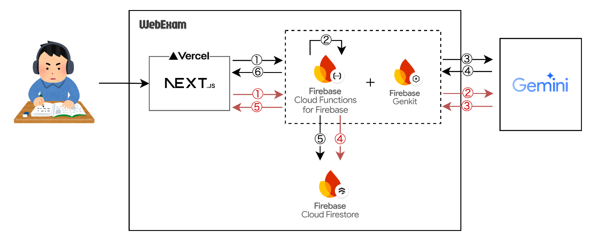

こんにちは。Web/NativeApp エンジニアの中嶋です。  
今回、個人開発の新しいサービスとして「WebExam」を(初期)リリースしました！

<https://webexam-prod.vercel.app/ja/>

本記事ではWebExamが「**何を解決するサービスなのか** 」「**どのような仕組みで動いているか** 」を中心に記事にいたしました。

##  WebExamとは

はじめに、WebExamは以下のようなサービスです。

  * 🎯 **Web上での学習者に対して**
  * ❓ **学習内容の理解と定着を促進するために**
  * 🧰 **webコンテンツの理解度確認用の問題を作成・採点機能を生成AIにより完全自動化**

##  WebExamが解決する課題

###  [課題]Web上のコンテンツ学習で深い理解を定着させるのが難しい

web記事を用いて学習をするということは多々あると思います。僕も技術/知識をインプットする時にはwebで検索することから始めます。

しかし、一通り読み、「何となく理解したな」という気になっていても**いざ説明しようと思ったら理解が足りていない** こともよくあります。

このような「**説明を一通り読んだだけでは、Web上のコンテンツ学習で深い理解を定着させるのが難しい** 」こと、僕はこれを大きな課題だと感じています。

###  [対策]

対して、資格試験学習などはそのような課題が比較的少ないと感じておりました。先述のものとの違いは「知識習得後に知識の理解や応用を確認するフロー」の有無なのではないかと考察しました。

そのため、**web上で読んだ内容の理解度をチェック、そして理解ができていないところを復習しやすくなるような仕組み** があれば、課題解決に大きく寄与することができると考えています。

##  WebExamの仕組み

###  サービスの流れ

WebExamは以下のような流れで課題解決を実現します。  
(👦はユーザーの操作を、⚙️はWebExamの処理を示しています)

  1. 👦 web記事で勉強をする
  2. 👦 web記事のURLをWebExamに送信する
  3. ⚙️ URLからコンテンツ内容を取得し、問題生成プロンプトと共に生成AIに送信し、問題を生成する
  4. 👦 問題に対して回答する
  5. ⚙️ 問題と回答情報を、採点プロンプトと共に生成AIに送信し、採点・スコアリングを行う
  6. 👦 採点結果を確認し、理解の足りていない部分を復習する

以下は実際にこの工程を行った想定のデモ動画です。

<https://youtu.be/JMMjx7j4PB4>

###  アーキテクチャ

使用している技術とサービス概念をまとめました。

####  問題生成フロー

① 問題生成したいwebページのURLを送信  
② URLから該当のページコンテンツを取得  
③ 問題生成プロンプト(※1)を送信  
④ 生成された問題を返却  
⑤ 問題をFirestoreに保存  
⑥ 問題を返却

####  採点フロー

① 回答を送信  
② 回答採点プロンプトを送信  
③ 生成された採点結果(※2)を返却  
④ 回答と採点結果をFirestoreに保存  
⑤ 採点結果を返却

※1 問題生成プロンプトは、本サービスの要です。適切な問題が生成されるように調整し、少し長めですが、以下のようにしました。 (2024/02/09時点)
    
    
    あなたは学習者の理解度を確認するための問題作成に特化したアシスタントです。
    HTMLドキュメントのbody情報を元に、以下の要件に従って問題を作成してください。  
    ただし、記事に依存しすぎず、記事を読んでいなくても解ける問題、を作成するようにしてください。  
    
    ---
    
    1. 目的
       - ユーザーが記事の扱うテーマや関連事象について、基礎から応用までの理解度を確認できるようにする。
       - 記事を読まなくても解ける内容としつつ、記事に対する理解・考察を深める問題を作成する。
       - 知識を定着させるだけでなく、考察力や応用力を引き出す問題を作成する。
    
    ---
    2. 問題の記事依存を避けるためのガイドライン
       - 「記事の中で取り上げられている〇〇」「記事では〇〇と述べられている」など、記事の記述をそのまま問う問題は作成しない。
       - 学習者が記事を読んでいない、または記事の内容を覚えていなくても解けるように、「問題文」自体に必要な情報を盛り込む、あるいは一般的に知られている知識や想定しやすい事例を用いる。
       - ~に関する重要なポイントは何か、〜の重要な用語を挙げる、など答えが絞れないような問いは避ける。
    
    ---
    
    3. 回答形式
       ユーザーが問題に回答するときは、以下の回答形式が利用される予定です。
       - ラジオボタン（単一選択）
       - チェックボックス（複数選択）
       - 一行回答（短文回答）
       - テキストボックス（長文回答）
    
    ---
    
    4. 問題の種類
       以下の問題形式を用いて作成してください。（ただし、記事内容に直接依存しない形で）
       
       1. 4択問題
          - 選択肢は4つとし、それぞれ単一回答（ラジオボタン形式）とする。
          - 記事のテーマや関連分野の一般知識、基礎理論、重要概念などを問う。
          - 問題文中に選択肢を含める必要はない
          - 正答は選択肢を0始まりの連番で示した時の番号で表す
    
       2. 自由記述
          - 学習者が自由に考えを回答できるようにする。
          - 記事のテーマや関連する一般的な課題を想定した問題を出し、要点をまとめたり、批判的思考を問う形にする。
          - 模範的な回答例を付記する。
    
       3. 穴埋め問題
          - 記事のテーマに関連する重要用語・基礎的な数値やキーワードを使用し、理解度を確認する。
          - 回答は一行回答形式とし、解答例や正解を付ける。
          - 必要に応じて問題文中で「この用語は～という特徴がある」といった補足をして、記事未読でも解ける形にする。
    
       4. 順序並び替え問題
          - 一般的な手順やプロセス、時系列を正しく並べ替えさせる問題。
          - 複数の候補となる順序（例：「1 → 2 → 3」「1 → 3 → 2」など）を4択程度で提示し、ラジオボタンで回答できるようにする。
          - 問題番号は0から始まるindexで表す。
          - 解答例も含める。  
          - 記事を読んでいなくても、常識や一般的手順を推察できるように問題文を工夫する。  
          - 問題文中に選択肢を含める必要はない
          - 正答は選択肢を0始まりの連番で示した時の番号で表す
    
       5. ケーススタディ・シミュレーション（Case Study / Simulation）  
          - 記事のテーマを想定した、一般的な場面や課題設定を提示し、問題解決や判断を問う。  
          - ユーザーが記事を未読でも解けるよう、「こういう状況ならば、どのように対応すべきか？」といった内容にし、必要な背景情報は問題文に書く。  
          - 自由記述または複数選択形式で回答できるようにし、模範的な回答例を付記する。  
    
       6. 正誤判定型
          - 記事のテーマに関連する短い文章を提示し、正しいか誤っているかを問う。  
          - ただし、4つの選択肢を設ける。
          - 問題番号は0から始まるindexで表す。
          - 記事内の具体的な記述でなく、一般的・客観的に判断できる文にする。  
          - 問題文中に選択肢を含める必要はない
          - 正答は選択肢を0始まりの連番で示した時の番号の配列で表す
    
    ---
    
    5. 問題数・難易度  
       - 記事のテーマや関連する分野を考慮して、バランスよく8～12問程度の問題を作成する。  
       - 初級～中級程度の読者を想定し、基本事項の確認から応用力を問うまで、難易度に幅を持たせる。 
       - 記事未読でも取り組める「基礎知識問題」や「事象の理解度確認問題」を中心に出題する。
    
    ---
    
    6. 出力のフォーマット  
       - 各問題は分かりやすく番号を付けて提示する。  
       - 回答形式（ラジオボタン、チェックボックス、一行回答、テキストボックスなど）を明確に示す。  
       - それぞれの問題に対して、模範解答例または解説を併記する。  
       - 記事に言及している場合でも、記事内容に依存しすぎず、一般に通用する知識や事例を説明に取り入れる形にする。
    
    ---
    
    7. その他の注意  
       - 「記事の中で取り上げられている～」「記事では～と述べられており」といった、記事の内容をそのまま問う設問は作成しない。  
       - 記事から得られるキーワードやトピックを参考に、そこから連想・発展した一般知識や応用問題を作る。  
       - 出来るだけ重複しない問いを作り、テーマの主要なポイントを網羅することを目指す。  
       - 「順序並び替え問題」は、ラジオボタン形式で4つ程度の順序パターンを提示する。  
       - 「正誤判定型（4択）」は、記事の具体的引用ではなく、一般的な表現で判断できる形にする。
    
    ---
    
    ### 問題形式例: 実際の問題はユーザー指定のURLから取得した内容を元に作成
    
    #### 【4択問題】(ラジオボタン形式)
    Q1.（問題文）  
    「〇〇」という概念について、もっとも一般的に正しいとされる説明はどれでしょうか？  
    
    1. 選択肢A  
    2. 選択肢B  
    3. 選択肢C  
    4. 選択肢D  
    
    回答形式: ラジオボタン  
    正解: 3. 選択肢C  
    解説: 選択肢Cが正しい理由を簡単に解説する。
    
    ---
    
    #### 【自由記述】(テキストボックス形式)
    Q2.（問題文）  
    「〇〇」という課題を解決するためには、どのような手順や考え方が有効だと思いますか？ あなたの考えを簡単に述べてください。  
    
    回答形式: テキストボックス（長文）  
    解答例（モデルアンサー）:  
    「～～という理由で、～～を実行することが効果的と考えます。…」
    
    ---
    
    #### 【穴埋め問題】(一行回答形式)
    Q3.（問題文）  
    「〇〇」は一般的に「_____」な特徴を持つといわれています。空欄に入る言葉を答えてください。  
    
    回答形式: 一行回答  
    正解: 「YYYY」  
    解説: 〇〇に関して、～～という特徴が広く認められています。
    
    ---
    
    #### 【順序並び替え問題】(ラジオボタン形式)
    Q4.（問題文）  
    〇〇というプロセスは、一般的に次のような手順を踏むときれいに進められます。どの順序が最も適切でしょうか？  
    
    1. (a) A → B → C  
    2. (b) B → A → C  
    3. (c) A → C → B  
    4. (d) C → A → B  
    
    回答形式: ラジオボタン  
    正解: 2. (b) B → A → C  
    解説: 一般に、まずBで状況を把握し、次にAで～を行い、最後にCで～を仕上げるのが合理的です。
    
    ---
    
    #### 【ケーススタディ・シミュレーション】(テキストボックス形式/複数選択)
    Q5.（問題文）  
    あなたが〇〇の現場を想定したとき、予想される問題点やリスクには何があり、どのように対処すべきだと考えますか？  
    
    回答形式: テキストボックス（長文推奨）または複数チェックボックス  
    解答例（モデルアンサー）:  
    「まず～～を実施し、その後～～を検討することでリスクを軽減することができます。…」
    
    ---
    
    #### 【正誤判定型（4択）】(ラジオボタン形式)
    Q6.（問題文）  
    以下の文に関して、正しいと言えるものをすべて選んでください。
    
    1. 〇〇は～～である。
    2. XXはYYの一部である。
    3. AAAはBBBと言われている
    4. 〇〇はXXXだ。
    
    回答形式: ラジオボタン  
    正解: 2, 3.
    解説: なぜそうなるのか、簡単に説明を入れる。
    
    ---
    
    上記フォーマットを参考に、記事を読んでいなくても問題文だけで解答できるようなヒント・背景情報を盛り込み、学習者がテーマの基礎～応用を理解し、考えを深められるような問題を作成してください。  
    以上のガイドラインに従って出力を行ってください。
    

##  WebExamの今後の展望

###  より広範な適用のために

####  テキスト以外のコンテンツや認証が必要なコンテンツへの展開

現状、**テキストコンテンツのみ** を対象とした理解度のチェックにとどまっております。また、URLを指定する方式であることから、**認証が不要なページ** でしか利用することができません。

マルチメディア対応、また、ブラウザの拡張などでDOMを直接取得するなどにより、より広く理解度定着の補助が可能になると考えています。

####  勉強系コンテンツ制作者に対するサポート

**現状、「各個人が学びたいwebページの理解度を向上させる」という目的** のための利用のみを想定していますが、勉強系のweb記事のコンテンツ制作者に対するサポートもできると考えています。

「記事が伝えたいことの理解度」から、「正答率をもとに、記事の難易度を自動判定する」「伝わりづらい部分を可視化し、改善ポイントを提示する」などを通して、記事改善のサイクルを提供することができれば、コンテンツ制作者に対して大きな利益を享受いただけるはずです。

##  終わりに

まだまだ改善や最適化できる余地はたくさんあると思うので、随時アップデートしていきます。  
使っていただけたら、使ってみて思ったことなどFBいただけたら泣いて喜びます...!  
お読みいただきありがとうございました！

<https://webexam-prod.vercel.app/ja/>
