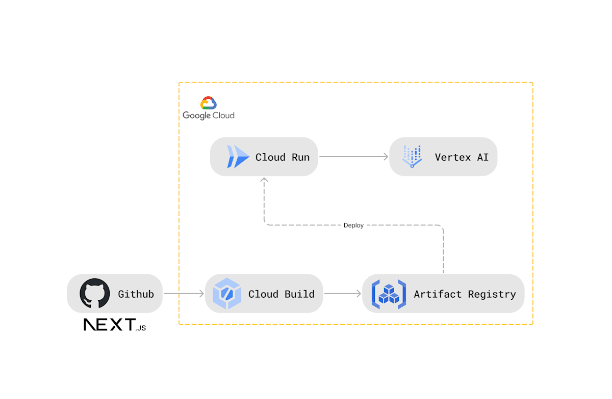

#  momen.ai

**あなたの「もめごと」を解決する、新時代のパーソナルコーチ**

日常の中で、ふとした瞬間に「なんでうまくいかないんだろう…」と感じたことはありませんか？ momen.ai は、そんなあなたのために生まれた、AI エージェントがそっと寄り添う自己行動変容ツールです。自分の内面を深く掘り下げ、問題の本質を明らかにすることで、次に進むべき一歩を確実にサポートします。今こそ、自分自身と向き合い、新たな可能性を切り拓くチャンスです。

##  サービス概要

momen.ai は、日常の小さな摩擦やコミュニケーションのズレを、あなた自身の成長のチャンスに変えるシンプルかつパワフルなツールです。  
例えば、家事の分担を巡るカップル間のもめごとが発生した場合、アプリに「うまく話し合えなかった」と記録すると、momen.ai の AI エージェントが「まずは相手の意見にじっくり耳を傾けると良いかもしれません」と、温かくも的確なアドバイスを返してくれます。  
この対話型の「壁打ち」体験が、あなたの自己内省を促し、具体的なアクションプランへと導くのです。さらに、ユーザーはその記録と対話の履歴をいつでも見返すことができ、日々の改善に繋げることが可能です。

本プロジェクトは、Google Cloud の **Cloud Run** と **Vertex AI** を基盤とし、**Artifact Registry** を用いたコンテナ管理アーキテクチャで構築されています。これにより、スケーラブルで安全なサーバーレス環境下で、最新の生成 AI 技術を柔軟に利用できるシステムが実現されています。

##  デモ動画

<https://youtu.be/cwTRrjgNmNM>

##  対象ユーザー

###  ターゲットユーザー

momen.ai は、特に次のような方々におすすめです。

  * **生活環境に密接なユーザー:**  
同棲中のカップルやシェアハウスに住む若者など、日常の小さな摩擦が積み重なり、関係性に悪影響を及ぼす前に、自分自身で内省を始めたい方。

  * **内省を重視するユーザー:**  
誰にも打ち明けられない悩みや、問題の本質を自分で掘り下げたい方。momen.ai は、プライバシーを守る安全な環境で、あなたの内面に向き合うサポートをします。

  * **具体的な行動変容を望むユーザー:**  
単なる記録に留まらず、次に何をすべきか明確な指針を求め、実際のアクションへと結びつけたい方。

###  ユーザーが直面する課題

現代社会では、以下のような悩みが共通して見受けられます。

  * **自己認識の不足:**  
日常の些細な摩擦が、実はどの行動に起因しているのかを客観的に把握するのは難しい。従来のツールでは、単なる出来事の記録に終始し、背景の原因分析が不足していました。

  * **効果的な改善策の欠如:**  
感情や出来事の記録はできても、具体的な行動変容に結びつくアクションプランが提示されず、ユーザーは次のステップに踏み出せないままです。

  * **プライバシーへの懸念:**  
自分の内面に関する情報を安心して管理できる環境が求められており、外部の専門家に相談することに抵抗を感じる方が多いです。

##  ソリューションと特徴

###  AI エージェントによる自己対話サポート

momen.ai の中核は、洗練された AI 対話システムにあります。ユーザーは、もめごとや感情の変動を記録し、AI エージェントとの対話を通じて、自己認識を深めることができます。

  * **原因分析:**  
「なぜこのもめごとが起きたのか？」という問いを投げかけ、ユーザー自身の行動や感情パターンを整理します。
  * **具体的なアクションプラン提示:**  
記録に基づいて、どのタイミングでどのような対話を進めるべきか、実践可能なステップを具体的に提示。これにより、次に取るべき具体的な一手が明確になります。

###  プライバシー重視の設計（現在未実装のため、今後の実装機能として予定しています。）

momen.ai は、最新の暗号化技術と厳格なアクセス制御により、ユーザーの内面情報や対話内容を完全に保護します。安心して自己内省に取り組むことができ、特に家庭内や密接な人間関係に起因するデリケートな悩みを抱える方に最適なツールです。

###  具体的な行動変容を促すプロセス

単なる記録ツールではなく、momen.ai はユーザーが実際に次の一歩を踏み出すためのガイドラインを提供します。もめごとの記録から、冷静な話し合いの準備、具体的な議論ポイントの整理といった実践的なアクションを促すフィードバックが自動生成され、ユーザーは自律的に問題解決に向かうことができます。

###  ライトなユースケースへの最適化

専門的なメンタルヘルスケアツールではなく、日常のもめごとやコミュニケーションのズレに焦点を当てたライトなユースケースを提供。軽快な対話体験の中で、ユーザーが気軽に内省し、自己改善のヒントを得ることができる設計となっています。

##  技術的な詳細

momen.ai は、最新の Web 技術とクラウドインフラを駆使して、優れたユーザー体験を提供するために構築されています。以下は、その主要な技術要素と実装上の工夫です。

###  アーキテクチャ図

###  アプリケーション層

  * **Next.js (App Router):**  
サーバーサイドレンダリングや静的サイト生成のメリットを活かし、最新のルーティング機能を実現。高速で直感的なユーザーインターフェースにより、操作性と SEO パフォーマンスを向上させています。

###  使用したライブラリ

  * **nanoid:**  
軽量で高速なユニーク ID 生成ライブラリ。各記録やセッションに一意の識別子を付与し、データ管理とトラッキングを効率化しています。
  * **react-calendar:**  
ユーザーが簡単に日付や時間を入力できるカレンダーコンポーネントを提供。直感的な操作で記録入力のハードルを下げています。
  * **iconify-react:**  
豊富なアイコンセットを利用し、視覚的に分かりやすく、魅力的な UI を実現。デザインの一貫性を保ちつつ、操作性も向上させています。

###  インフラ層

  * **Cloud Run:**  
コンテナ化されたアプリケーションをサーバーレス環境で動作させることで、スケーラブルかつコスト効率の高い運用を実現。急激なトラフィックの増加にも柔軟に対応可能です。
  * **Vertex AI:**  
生成 AI の中核として、構造化出力を自動生成。ユーザーごとにパーソナライズされたヒントやフィードバックを提供することで、対話体験をより高度なものにしています。
  * **Artifact Registry:**  
コンテナイメージの安全な管理と、CI/CD パイプラインの自動化を実現。これにより、継続的なデプロイメントとバージョン管理が容易になっています。

###  工夫した点

  * **サーバーレス環境の構築:**  
Cloud Run と Artifact Registry を組み合わせることで、従来のサーバー管理の煩雑さを排除し、スケーラブルで柔軟な運用体制を実現しました。
  * **生成 AI の出力固定化:**  
Vertex AI を用いて、ユーザーの記録に基づいた反応を返します。構造化された出力を採用することで、パーソナライズされたフィードバックと具体的なアクションプランを提供します。
  * **レスポンシブデザイン:**  
スマートフォンファーストのアプローチで、どのデバイスからでも快適に利用できる UI を実装。外出先でも瞬時に内省や記録が可能です。
  * **MVP としてのローカルストレージ利用:**  
初期段階では、ローカルストレージによるデータ保存を実装し、迅速な開発と低コストの運用を両立させました。
  * **スキーマ駆動設計:**  
初期のデータモデリングと API 設計においてスキーマ駆動のアプローチを採用。これにより、システム全体の拡張性と保守性が大幅に向上しています。

##  今後の展望

momen.ai は、今後さらにユーザー体験を豊かにするために進化を続けます。将来的な方向性として、以下の 2 点に注力していきます。

  * **相手ごとの記録機能の拡張:**  
これまで単一のもめごと記録として扱ってきた情報を、もめごとを起こした相手ごとに分けて記録できるようにします。なぜなら、相手によって対処方法やアプローチが異なるため、より精緻なフィードバックとパーソナライズされたアクションプランが求められると考えるからです。たとえば、家族、パートナー、職場の同僚といった異なる相手に応じたアドバイスが自動生成されることで、ユーザーはその場面に最適な解決策を素早く見出すことが可能になります。

  * **デバイス間でのシームレスな連携:**  
どのデバイスからでも同じもめごと記録や対話履歴にアクセスできる仕組みを強化します。これにより、スマートフォン、タブレット、デスクトップなど、利用シーンに合わせて手軽に内省できる環境を実現し、ユーザーがいつでもどこでもサービスを活用できるようにします。クラウド同期機能の強化により、デバイス間でのデータの一貫性とリアルタイムな更新を保証し、日常生活の中での気づきを逃さない仕組みを目指します。

##  まとめ

momen.ai は、最新のクラウドインフラと生成 AI 技術を駆使して、あなたの内省と具体的な行動変容を実現する革新的なツールです。Next.js による高速なフロントエンド、洗練されたライブラリの活用、Cloud Run と Vertex AI を基盤とした堅牢なサーバーレスアーキテクチャ、さらにはレスポンシブデザインと MVP 実装による低コスト運用が融合し、安心して利用できるプライバシー重視の環境を提供します。

さらに、将来的には相手ごとに記録を分ける機能や、デバイスを問わずシームレスに利用できる仕組みを導入することで、ユーザー体験をより一層向上させます。momen.ai の設計は、単なるプロトタイプを超え、実際の運用に耐えうる拡張性と信頼性を備えたプラットフォームとして、多くのユーザーに安心感と実効性を提供します。

さあ、あなたも momen.ai を使って、自分自身と真摯に向き合い、日常のもめごとを次なる成長のステップへと変えてみませんか？

##  チーム

Mino  
担当：企画・アプリ（メイン）・インフラ（サブ）

<https://minobun.github.io/>

Itaru  
担当：デザイン・インフラ（メイン）・アプリ（サブ）

<https://ota1022.github.io/>
