デモ動画  
<https://www.youtube.com/watch?v=JGx_V2XdMeE>

#  1\. 背景: いつでも買える「当たり前」がスーパーからなくなる

最近、スーパーの棚から突然米が消えたり、今まで普通に買えていたものがブームになった途端に買えなくなったりした経験、ありませんか？なぜこのようなことが起こるのでしょうか？  
例えば、今年話題になった「令和の米騒動」では、「不作」や「供給の不調」などのニュースを見て、「米が足りなくなるかもしれない！」と慌てて買いに走る人が増えたことが発端でした。その結果、通常の供給量では追いつかなくなり、スーパーの棚から米が消えてしまったのです。

こんなとき、なぜ米の供給量を増やすことができないのでしょうか？

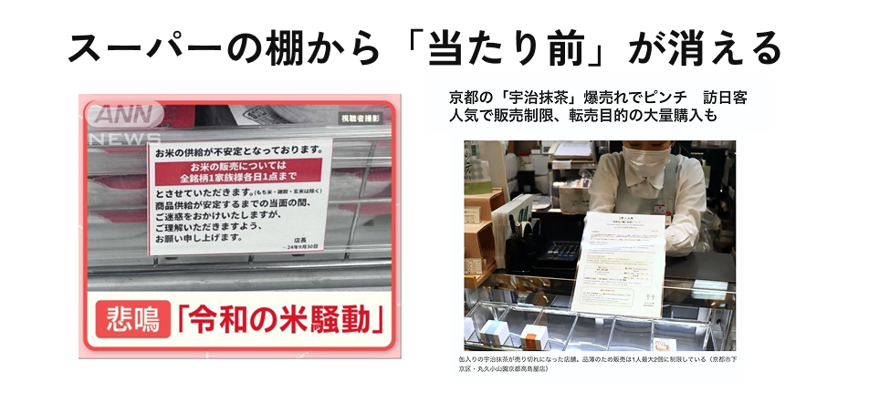

米の出荷は、備蓄している玄米を精米し、充填、保管、仕分け、輸送するといった長いプロセスに分かれています。需要の変化が大きすぎると、どこかしらのプロセスに負担がかかり、滞ってしまうのです。

たとえば、新しい飲食店では、食材が十分にあっても、注文、調理、配膳の流れがうまく回らず、料理がなかなか提供されないことがあります。それと同じようなことが、米の流通の裏側でも起きていたのです。

ものが買えなくなる原因のほとんどは、事前に立てた計画の予想を超える急な変化が発生したにもかかわらず、計画をすぐに見直せないことに起因します。計画の修正には調整も時間も必要で、直そうと頑張っている間も供給と需要のズレが拡大していってしまうのです。

商品が消費者の手元に届くまでには、多くの企業がモノやお金をやり取りしながら連携しています。そして、そのつながりは鎖のように長く続いています。このように、複数の企業が関わりながら、最終的に消費者へ商品を届ける仕組みを「サプライチェーン」と呼びます。

計画と現実にズレが生じたとき、迅速に計画を修正できれば、サプライチェーンは途切れることなく機能し続けます。しかし、計画の修正が間に合わず対応が遅れると、商品が消費者に届かなくなってしまいます。それはまるで、途中で切れてしまった鎖のような状態です。

物がすぐに買えるという「当たり前」は、このズレによって、あっという間に崩れてしまうのです。

この課題を解決するため、私たちはサプライチェーンの専門知識を持つメンバーとともに、計画を迅速に修正できるAIエージェントの開発プロジェクトを立ち上げました。

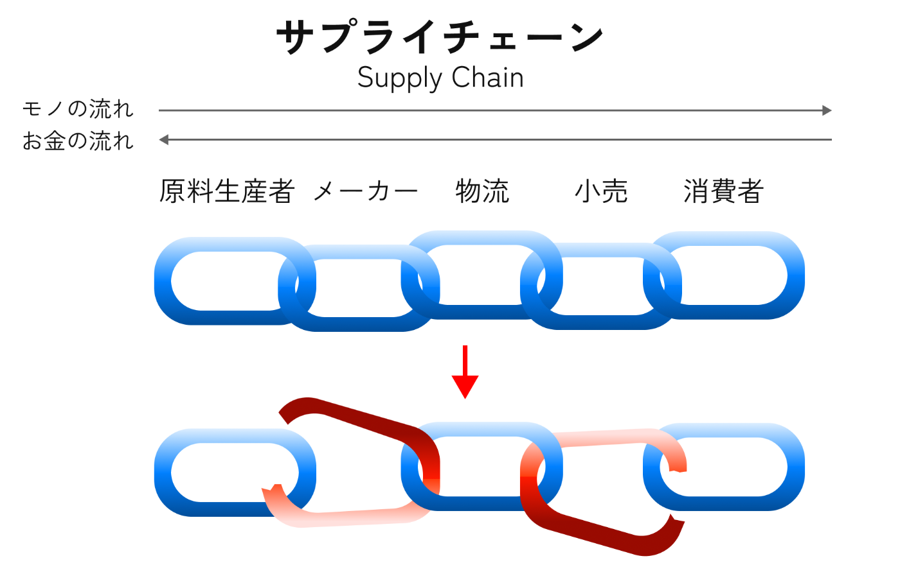

#  2\. 現状の課題: 「理想の計画」はズレる

不確実性の高い今の時代、計画通りに物事が進むことは稀で、多くの場合計画と現実はズレてしまいます。実際の現場ではどう捌いているのでしょうか？

サプライチェーンの業務は大きく分けると、「どのくらい売る」・「どれくらい生産する」を決める業務（計画系）と、実際に「生産」・「販売」する業務（実行系）に分かれています。  
計画系では、経営層が月・年単位で計画を立て、これを元に発注、生産、販売を行います。そのため計画をするたびに、現場側は都度準備をやり直さなくてはいけなくなるため、計画変更は、通常1ヶ月に1度程度で行われます。

計画業務は、理想的な条件で立てられるので、「Best Practice」とも呼ばれます。それに対し予想外の事態が発生し、それに対応する現場業務を「Best Effort」と呼びます。例えば、実行系が予想外の需要に対応して必要なトラックの数を多めに確保することなどがこれにあたり、実際の現場ではこのようにリソースを投下することで解決をしているのです。

本来はリソース投下の前に計画と現実を見比べて代替案を作るのがベストですが、現場でのやりとりやデータの修正には時間がかかり、計画の再修正が難しいためこれはあまり現場では行われていません。

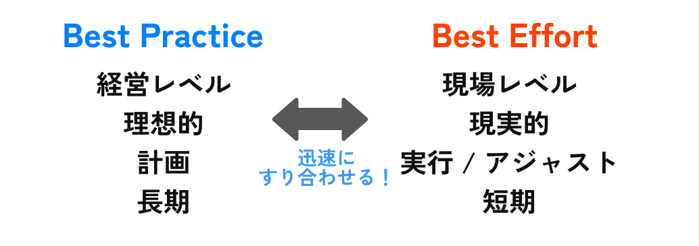

結果として、計画と現実のズレの影響は消費者の生活にまで及んでしまいます。いつも当たり前のように手に入る商品が手に入ることは、こうした計画と現実の綱引きの中で実現されているのです。  
こうしたズレを素早く補正できる仕組みの重要性は高いといえるでしょう。

#  3\. 目的: 想定外のズレを迅速に修正し、ピンチにもチャンスにも強い製造業を作る

自然災害の強大化や、SNSのバズによる需要の急変化など、これからの時代においては、サプライチェーンはより激しい現実の変化に晒されます。  
計画と現実がズレが生じた時に、その調整をより柔軟で高速にできれば、サプライチェーンはよりしなやかになり、そして製造業はもっと強くなります。  
例えば、災害で発生した損害を減らすだけでなく、SNSで商品がバズった際に急増した需要にも対応できるようになり、利益をしっかり得られるようになるんです。

計画系業務の「Best Practice」をサポートするためのツールは世の中にたくさんありますが、「Best Practice」と「Best Effort」をつないでサポートするツールはありませんでした。  
我々は、計画はズレるものだから、良い計画を立てるだけでなく、計画と現実がズレた時にも素早く修正できるツールが必要だと考えました。

これまではバラバラに突き進むしかなかった「Best Practice」と「Best Effort」を解消できるシステムを作ることが今回の目的です。

##  コラム: 日本のAI革新は製造業から

製造業へのAI導入に疑問を持たれる方もいるかもしれません。  
物理的なモノが行き交う製造業は、IT・サービス業と比べて、物理的な制約や長いリードタイムのため、AI導入の恩恵は小さいように思われます。  
一方で、これらの複雑な制約は逆説的に解決された時のインパクトの大きさにもなります。  
私たちは物理的な世界に住んでおり、私たちの生活を良くするためには、ものを作り出す製造業から革新を起こす必要があります。

加えて、日本は災害大国であり、災害によりインフラを含め破断が起きています。加えて少子高齢化の中では、サプライチェーンを支えられる人材が少なくなっており、まさに日本のサプライチェーンは危機にさらされていると言っても過言ではありません。  
今こそ、サプライチェーンの改革を始める時です。  
地震が起きてもすぐに復旧する鉄道のように、サプライチェーンも同じくらいすぐに復旧しして災害復興に一秒でも早く貢献できるようにあるべきです。少子高齢化で余裕がなくなってるからこそ、修正せず突っ走る「Best Practice」依存の世界から抜け出すべきだと私たちは間気ます。

#  4\. 機能: eCoino 止まらないサプライチェーン

私たちは、AIエージェントとの対話で計画を迅速に変更できるシステムeCoinoを提案します。

##  サービス機能要件 & 実装方針

実装方針：機能要件と実装方法は以下の通りです。

ID | 機能名 | 詳細 | 実装方法  
---|---|---|---  
1 | シナリオ管理 | 通常時、イベント発生時など、複数のシナリオを管理でき、詳細について参照できる機能 | BI  
2 | シナリオ比較 | 複数のシナリオがある場合に、双方のデータ比較と確認ができる機能 | BI  
3 | シナリオ対策 | イベント情報など特定のシナリオ向けに、対策方法を検討できる機能 | ファシリテーションAgent  
4 | マスタ自動生成 | 決定したシナリオに従い、関連するマスタデータを自動提案、反映確認できる機能 | マスタ生成LLM  
  
今回はこのうち、1~3を実装することとしました。

##  システムアーキテクチャ

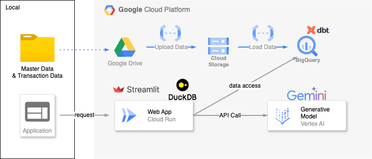

システムは上記のアーキテクチャで構成しました。

  * ユーザは、あらかじめ計画を立てるのに必要な情報をGoogleDriveにアップロードしておきます。
  * 格納された情報はCloudFunctionsやdbtをもちいて、Google Cloud Storage、BigQueryへと格納されます。
  * ApplicationはStreamlitとBQ上のデータをローカルでOLAP演算するためのDuckDBの二つで構成されています。
  * LLMなどのGenerativeModelへのアクセスは基本的にStreamlitを経由して実施されます。

BIのイメージ図

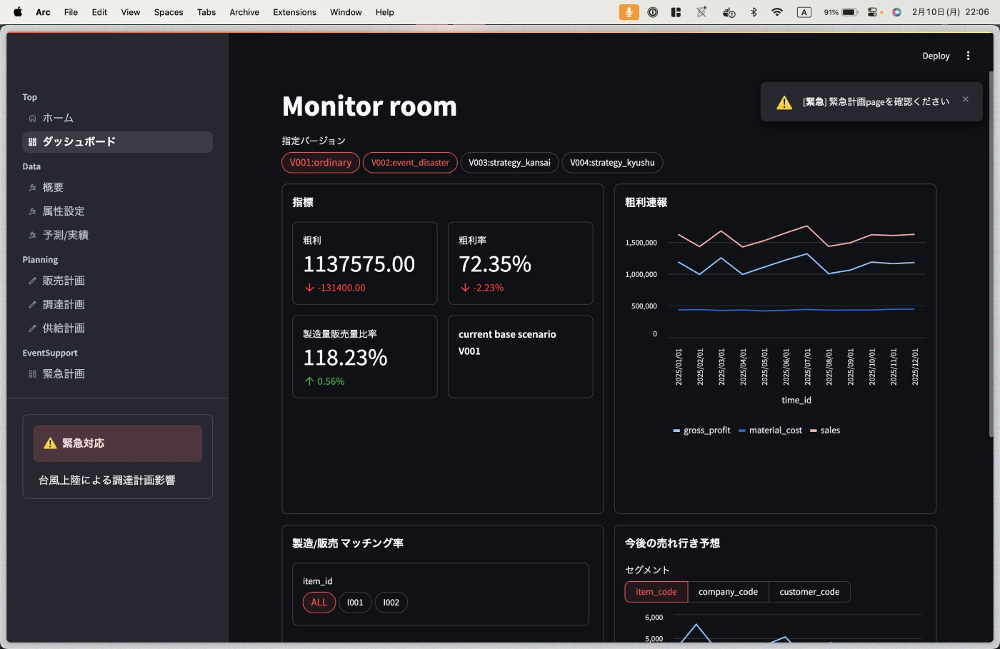  
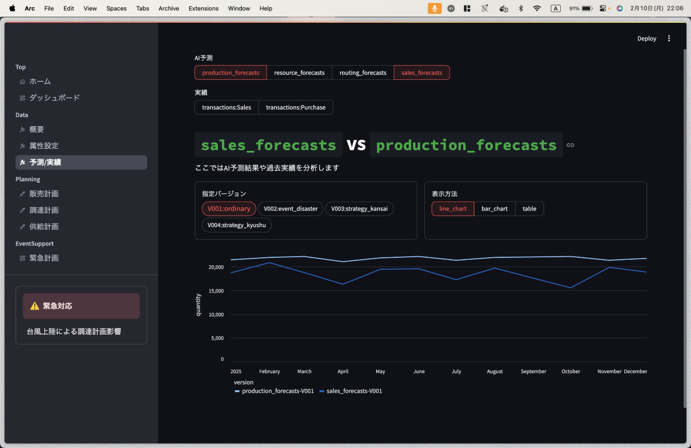

ファシリテーションのイメージ図

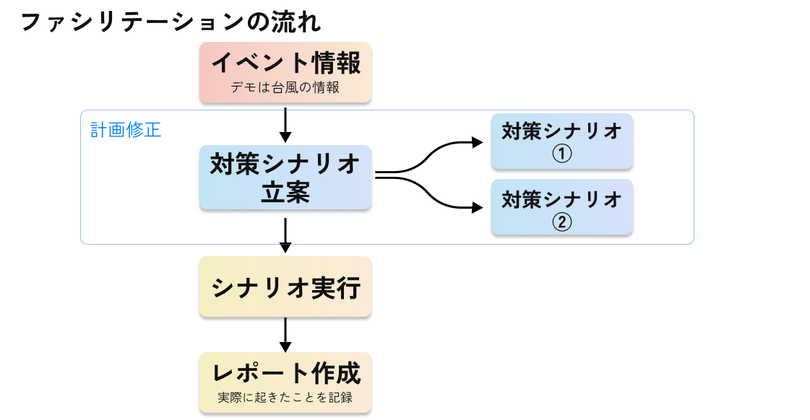  
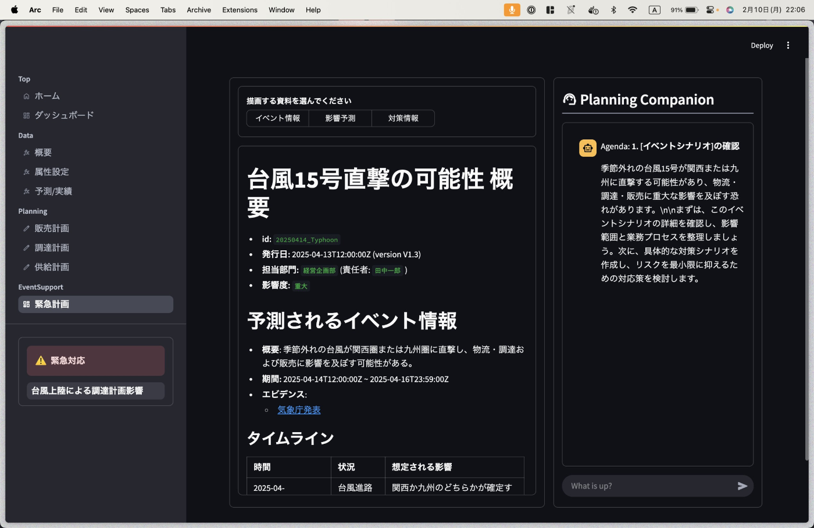  
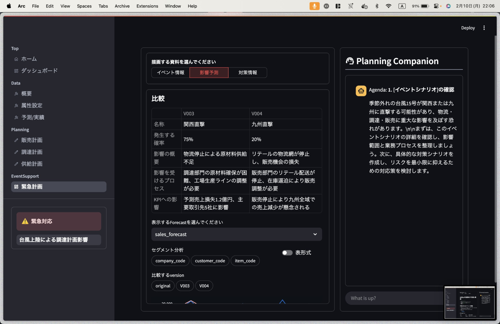  
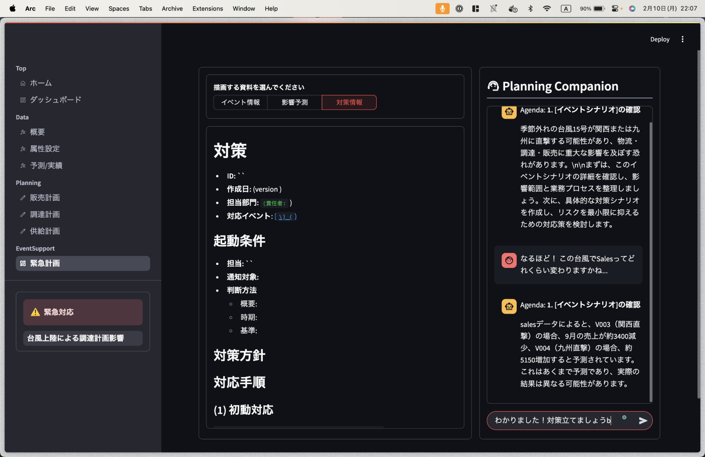

##  Human in the Loopの設計

今回最も難しかった部分は、LLMをもちいてMTGセッションを実施することでした。  
ハルシネーションはもちろんですが、どの程度まで人間がやるべきで、どの程度まではAIがやるべきであるかといった設計が難しかったのが大きな理由です。

そこで今回ヒントになったのが、Human in the Loopという考え方でした。  
サプライチェーンの業務を考えると今後しばらくはAIに任せるのが難しいだろうと思われる部分が、 人の意思決定(意思入れ)と呼ばれるものです。ただ一方で意思決定に必要な情報を集めて時短と余裕を目指したり、シミュレーションなどを通じて意思決定に理由や正当性を与えて心理的な負荷をさげる部分については計算機でも担当できる部分は多いはずです。

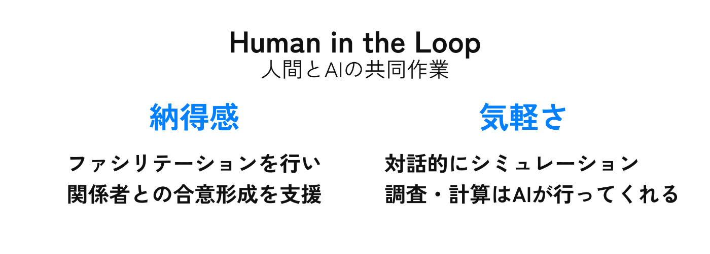

こうして、人の動きに気軽さと納得感を与えるために、AIやシミュレータを用いたシステムを作っていき、相補的なシステムを作ろうというのが今回目指そうとしていたものであり、そのためにファシリテーションAgentを作成しました。

##  ファシリテーションAgentの構成

ファシリテーションAgentは、複数のLLMからできているLLMで、内部で決定論的なアルゴリズムと非決定論的なアルゴリズムをFunctionCallingで呼び分けるという構造になっています。

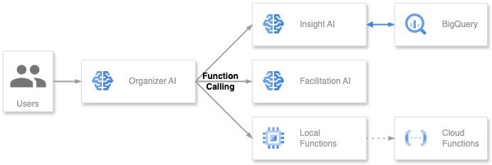

こうした構成にすることで、一つのシステムに対して様々な役割を与えることができました。

[InsightAI](https://github.com/takesei/namapn-council/blob/master/webcli/genai/models/txt2sql.py#L6-L17)や、[LocalFunctions](https://github.com/takesei/namapn-council/blob/master/webcli/genai/models/organizer.py#L9-L13)はそれぞれのソースコードを見てもらうとして、Facilitationの方法についてここでは簡単に述べようかと思います。

Facilitationは、以下のように分解して最終的なプロンプトを作成しました。

  * 最終的に作成したいレポートを想定する
  * レポート作成に必要な情報を取得するJinja2テンプレートを想定する
  * Jinja2テンプレートに投げるJSONを作成する

作成したテンプレートたち

[レポート例](https://github.com/takesei/namapn-council/blob/master/webcli/templates/sample_strategy.json), [jinja Template](https://github.com/takesei/namapn-council/blob/master/webcli/templates/strategy.md), [Json template](https://github.com/takesei/namapn-council/blob/master/webcli/templates/schema_strategy.json)

この時どの順番で入れるべきか、どの情報は自動で/手動で入るのか、といった情報を別途用意し、これも使用しました。

イベント支援情報

[workflow](https://github.com/takesei/namapn-council/blob/master/webcli/templates/workflow_strategy.md)

こうしたことで、ある程度の局所的な会話における自由度を持ちながら、大域的には対策の作成を行うという流れを作ることができました。

ゆくゆくは、グラウンディングなどをもちいて過去の対策シナリオ情報を参照しながら対策を組めるようになっていくと、知見を離散的にではなく連続的に補完ができるので、組織はより滑らかになっていくのではないかと考えています。

#  5\. 終わりに: eCoinoは計画とのズレに悩むすべての現場に

##  ユーザーテスト

今回のシステムをサプライチェーンの現場に詳しい社員のTさんに使用してもらいました。

「既存のツールでは、計画を立てるところまでを行ってくれる仕組みはない。計画を立ててくれた上で、マスタの情報まで設定できるのは良い」とのことで実用性を感じてもらいました。  
現場は忙しいことに加えて、判断に時間がかかるため、AIの側から計画を提案してくれ判断に集中できる点が良いとのことです。

今後の展開として、キャッチ取引先のニュースや、政治情勢の情報を、トリガーとして対応が検討できればに更によいという意見を頂きました。ネット上のデータやニュース情報のスクレイピングによって、より広範な事象をトリガーとできるように進化させていきたいと考えています。

##  止まらない計画修正を全ての現場に

eCoinoの強みは、人とAIエージェントの対話による納得感と気軽さにあります。  
製造業に限らず、想定外の事象により、人間は立ち止まってしまうことがあり、判断ができなくなる、責任を押し付けあう、そんな状況では計画の変更できずに損失は垂れ流しになってしまいます。  
しかし、eCoinoを使えば想定外に対して、止まることなくシミュレーションを行い、計画を修正し続けることができるでしょう。

また計画と現実とのズレを修正し続けるという点で考えれば、職場のOKR運用にも役に立つでしょう。ひょっとしたら、もっと身近なあなたの晩御飯の計画にも使えるかもしれません。スーパーへの道中で転んでも砂糖と塩を間違って買っても、買い忘れに気づいたも、食材を焦がしても、絶望せずにeCoinoと対話しながらリカバリーしましょう。

製造業から、あなたの晩御飯にまで。  
何があっても、eCoinoは「あたりまえの日常」をすぐに取り戻します！

##  メンバー

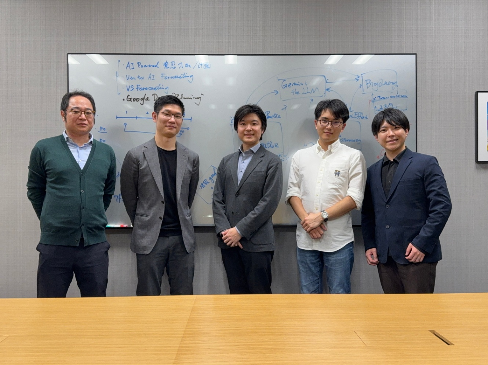

今回の企画・ユーザーヒアリングでお世話になった皆様に心より感謝申し上げます。
