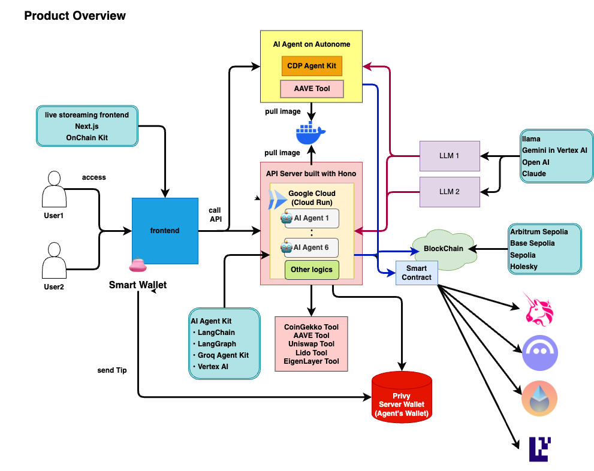
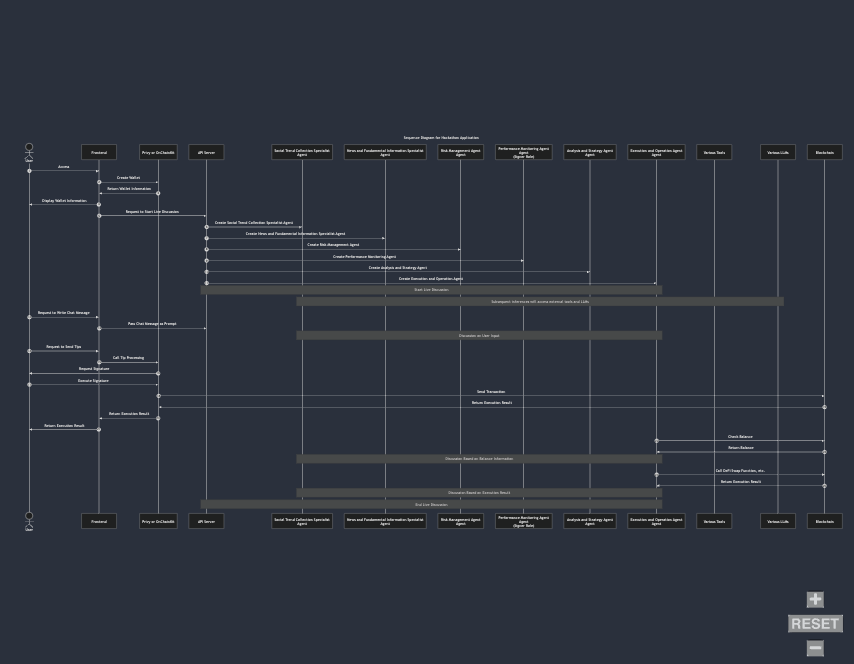

##  作ったもの

DeFi x AIの平滑化を目指して、ライブチャット型マルチAI Agentを開発しました。

  * ユーザーの操作は簡単なチャット入力のみ
  * 6つの役割を持つAIエージェントがリアルタイムで市場動向を分析し、投資戦略について議論。議論過程もシェア
  * AIエージェント自らがウォレットを持ち、ユーザーの代わりに取引を実行
  * ニコニコ動画のようなライブ感のあるUIで、初心者でも楽しみながらDeFi投資を体験

[App Demo](https://google-ai-agent-hackathon2024.vercel.app/)

!

[AI Agent Hackathon with Google Cloud](https://cloud.google.com/blog/ja/products/ai-machine-learning/lets-create-the-future-with-the-generative-ai-hackathon)の応募作品です。

##  背景

###  人間の限界を超え複雑化するDeFi

DeFiプロトコルは数千にも及び、それに伴う投資戦略は無数に存在します。  
さらに、「Dog Year of Dog Year」と言われるWeb3市場では日々新しいプロトコルが生まれています。  
そして、その変数となる市場環境 - 新しいトークン、経済状況、政治情勢 etc. - も含めると、指数関数的にエントロピーが増大しています。  
もはや、DeFi投資やクリプトトレードは人間の認知限界を超えつつあります。

実際、ベンチャーキャピタルのa16zの調査によると90%以上の個人投資家が適切なポートフォリオ管理ができていないとのこと。

**DeFiの複雑性が閾値を超過する中、「DeFiとAIの融合」 が注目を集めるようになったのは必然的な帰結** と言えるでしょう。

###  Web3とAI Agents

AI AgentsはWeb3独自の発展を遂げました。  
2024年後半、世界トップシェアのクリプトプロジェクトたちがこぞってAI Agentsを導入すると、瞬く間にクリプトシーンに浸透しました。

さらに、ここ1~2ヶ月の間に新たな話題になっているのが「**DeFAI** 」（Agentic DeFi）。  
AI Agentsの発展形であり、より高度にDeFiとAIの融合を実現しようとする概念です。

###  クリプトxAIの技術的な親和性

ブロックチェーン技術は自律型AIと極めて高い親和性を発揮します。

従来の金融システムと異なり、ブロックチェーンではAIに対する口座開設の制約が存在しません。  
AIが自らウォレットを開設し、資産を保有、投資や取引を自律的に行えます。  
つまり、 **AIが金融的に人間と対等なアイデンティーとしてプレイ可能なフィールドがブロックチェーン** です。

###  不確実性に適応するAI Agents

留意すべきは、従来のbotとAI Agentは本質的に異なることです。  
**botは「環境が一定である」ことを前提に、事前に定義された行動パターンに従って動作** します。  
一方、**AI Agentは環境の変化に応じてインプットを受け取り、設定された目標に基づいて情報を調整し、新しい情報を学習しながら柔軟に行動を変化させる** ことができます。  
この適応能力の違いは、変動の激しい暗号資産市場において特に重要な意味を持ちます。

##  取り組む課題

以上のような市場状況を踏まえて、私たちのチームが取り組む課題を紹介します。

###  Vision: 格差の再生産ではなく格差を解消するための金融AI

ChatGPT以後、AIは大衆化。  
Web3の世界でもAI活用が一般化しています。  
たとえばプログラミング分野ではAIによる支援ツールは既に不可欠な存在となり、シニアエンジニアと若手エンジニア（あるいはノンプログラマー）のスキルギャップは縮小しています。

しかし、**仮想通貨取引やDeFi投資の分野ではAIが既存の格差を拡大させる傾向** にあります。  
その主な理由は、DeFiでAIを効果的に活用するにはそもそも、DeFiやクリプトトレード、金融工学への高度な専門知識が求められるからです。

結果として以下のような条件が生まれています。

  * 優秀なトレーダーはAIを活用して投資効率を更に高める
  * 投資初心者はAIツールを使いこなせず、投資効率が改善されていない（むしろ、従来以上に不利な立場に）

つまり、**「DeFi x AI」の分野は「AIの恩恵が公平に分配されていない未成熟な市場」** である、と私たちのチームは捉えています。

###  ユーザー像

そこで、私たちは下記のようなビギナー層をターゲットに設定しました。

  * DeFiに興味はあるが、複雑な仕組みに躊躇している初心者
  * クリプトトレードにAIツールを活用したいが、技術的なハードルを感じている層
  * 時間的制約があり、効率的なポートフォリオ管理を求めているユーザー

私たちのヴィジョンは、**AIをDeFiの知識格差を拡大させる要因ではなく、その格差を埋めるツールとして提供する** ことです。  
高度なDeFi投資や取引を、誰もが簡単にアクセスできるものにすることを目指し、各種技術研究を進めました。  
（本ハッカソンへの参加動機がAI Agent技術へのキャッチアップでした）

###  対象課題の具体化

具体的には下記のような課題を解決対象として設定しました。

  1. **DeFiの学習コストの高さ**
  2. **Web3特有のUX** （取引操作のリスク、ウォレット管理の煩雑さ）
  3. **監視コスト** （市場動向の常時監視、複数のプロトコルやチェーンの管理）
  4. **AI AgentsのWeb3セキュリティ** （秘密鍵の安全な管理、クラッキングリスク、AIの意思決定の安全性）

###  課題へのソリューション

これらの課題に対し、私たちが提供するソリューションが下記です。

  1. **ライブチャット操作** : エンドユーザーに必要なのはチャット操作のみ
  2. **マルチエージェントによる意思決定** : 複数のAI Agentが協力して最適な投資戦略を議論することで精度を向上。及び、その過程も可視化
  3. **取引執行の自動化** : AI Agentsが自らウォレットを所有し、DeFi投資を実行
  4. **安全な秘密鍵管理** : PrivyのServer Walletsを活用し、セキュアに管理

##  サービス概要

Web3のトレンドを追跡することは、Web3についてある程度知識がある人々にとっても多大な時間と労力を必要とします。  
これらのトレンドを簡潔で分かりやすい形でまとめる作業はさらに大きな負担となります。  
最終的にAIエージェントを導入したとしても、プロンプトを考える際には人間の知識が必要です。  
単にAIエージェントを追加するだけでは、UI/UXの劇的な改善にはつながらないと考えています。  
この課題を解決するため、私たちが提案するアプローチが「AIエージェント間のインタラクティブな議論」と「ユーザー参加型のライブディスカッション」を備えたAIツールです。

下記のような特徴を持ちます。

  * **AIエージェントによる議論：**  
AIエージェントがリアルタイムでトレンドについて議論し、ユーザーに新しい視点と洞察を提供
  * **ユーザー参加：**  
ユーザーはチャットを通じて議論に参加でき、投げ銭を通じてAIエージェントの議論や行動に影響を与えることができる
  * **ライブ体験：**  
ニコニコ動画ライクな要素を取り入れ、ユーザーはリアルタイムのストリーミング環境で議論を楽しみ、効率的に情報を収集できる

###  システムアーキテクチャ

###  システムプロンプト

<https://github.com/mashharuki/AgenticEthereum2025/blob/main/pkgs/api/sample.http>

<https://github.com/mashharuki/AgenticEthereum2025/blob/main/pkgs/api/src/lib/agent/config.ts>

##  技術構成

カテゴリ | 使用技術  
---|---  
Frontend | TypeScript, Next.js, Tailwind CSS  
Backend | TypeScript, Cloud Run, Hono  
Hosting | Vercel  
Infra | CDK for Terraform  
LLM | OpenAI, Claude, llama, Gemini in Vertex AI  
Agent Kit | LangChain, LangGraph, Groq Agent Kit, Vertex AI  
Web3 Library | viem, wagmi, Coinbase AgentKit, Privy Server Wallet, Autonome  
DeFi Protocol | Uniswap, AAVE, Lido, EigenLayer  
  
##  技術解説: Web3編

####  AI Agentsのウォレット管理

AIエージェントのウォレット管理には、Privyのサーバーウォレットを採用しました。  
AIエージェントのサンプルコードの多くは秘密鍵を環境変数として埋め込んでいますが、セキュリティリスクがあります。  
そこで、AIエージェントが操作する鍵を安全かつ容易に管理するため、サーバーウォレットを導入しました。

AIエージェントがAAVEやUniswapなどのコントラクトと対話するために外部ツールを呼び出す際、トランザクションはサーバーウォレットによって生成されたウォレットインスタンスを使用して処理されます。

###  エンドユーザーのウォレットUX

ユーザーはSmartWallet機能を通じてシームレスにウォレットを作成できます。  
これにより、「Web3ウォレットの開設」という従来のWeb3におけるハードルの一つを取り除きました。  
Web3ウォレットのUXは特にビギナーの障壁となりやすい点です。

###  DeFiプロトコルとの連携

エンドユーザーがチャットで依頼をするとAI Agents同士が議論を行い、最終的に上記のDeFiプロトコルのどれかで取引を実行します。

  * Uniswapでトークンをスワップ
  * AAVEでトークンを貸付
  * Lidoでトークンをステーキング
  * LidoでステーキングしたstETHをEigenLayerでリステーキング

####  解説: 主なDeFi取引

一般的にDeFiの主な操作は下記４つです。

  * スワップ: 暗号資産の交換によって利益を得る。従来の仮想通貨取引所に相当
  * レンディング: 暗号資産を貸し付けることで利益を得る。従来の銀行に相当
  * ステーキング: 暗号資産を預けることによって利益を得る。レンディングとユーザーの操作感は似ているが、ブロックチェーン独自の技術的な仕様に基づくもの
  * リステーキング: 暗号資産を預けた証文を再投資することで利益を最大化する。信用創造の一種

本MVPではそれらの代表的なプロトコルである「Uniswap」「AAVE」「Lido」「EigenLayer」と連携しています。

###  Tips機能

AIエージェントに暗号通貨を投げ銭することで、議論や意思決定に影響を与えることができます。  
最初にクリプトスペースで話題になったAI Agentsが、投げ銭を受け取った後の自律的な行動でした。  
今回の応募作品でも試験的に実装しています。

##  技術解説: AI編

###  AI開発のためのクラウド技術活用

様々なDeFiプロトコルに対応したり、AI Modelの改善がしやすいように設計しました。  
ここではバックエンド実装の一部についてご紹介します。

####  CDP Agent Kit APIサーバー

サーバーはAutonomeでホストし、CDPエージェントキット用にカスタマイズしています。

標準機能に加えて、AAVEプロトコルとの連携をサポートする外部ツールを統合しました。

また、カスタマイズされたエージェントキットフレームワークをAutonomeで公開しています。

####  Cloud Run上のカスタムAPIサーバー

サーバーにはAPI開発のフレームワークとしてHonoを使用しています。  
AIエージェントのロジックはLangChain、LangGraph、VertexAIで実装しています。  
Web3に関する議論はGemini、Llama、OpenAI、Claudeなど、複数のLLMを使用しています。  
これらのモデルを使い分けることで精度を高めています。

###  マルチエージェントによる投資判断: 6つの役割を持つAIエージェント

AIエージェントは6つの異なる役割を与えています。

  * **ソーシャルトレンド収集スペシャリスト**
  * **ニュースと基本情報のスペシャリスト**
  * **リスク管理エージェント**
  * **パフォーマンスモニタリングエージェント**
  * **分析と戦略エージェント**
  * **実行と運用エージェント**

複数のAI Agentが協調して投資判断を行うことで、意思決定の精度を高め、従来型のトレーディングボットでは困難だった柔軟な判断と実行を実現します。

<https://youtu.be/Iz8RTY9Y5O4?si=pq2gJCd_UWutowEr>
