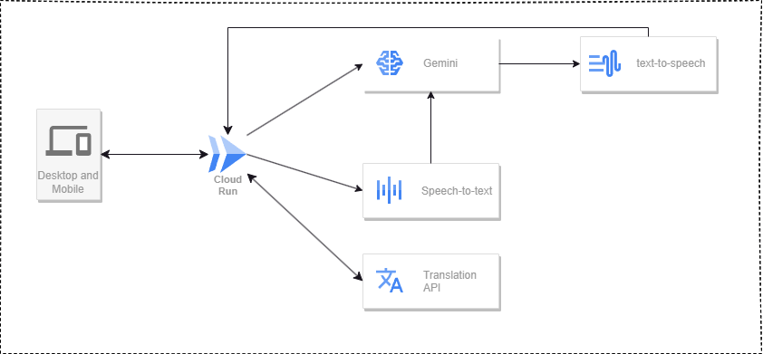

本記事は **AI Agent Hackathon with Google Cloud** に参加したときのものです。

##  **流行りのAI**

近年、AI技術はあらゆる分野で注目を浴び、その進化のスピードは留まるところを知りません。  
自然言語処理（NLP）や機械学習（ML）の分野では、膨大なデータをもとに高度なアルゴリズムが開発され、文章生成、翻訳、さらには試験の採点まで、その適用範囲は広がっています。  
たとえば、ChatGPTやその他の大規模言語モデルは、ユーザーの問いに即座に答えたり、文章の質を解析する能力を持つなど、従来のシステムでは考えられなかった柔軟性と精度を実現しています。

こうした背景から、教育分野においてもAIを活用した学習ツールが次々と登場し、従来の教室型学習や一方向の講義形式とは異なる、新たな学習体験が提供されるようになりました。  
特に、英語学習や資格試験対策においては、AIによる自動採点システムが学習者の弱点を素早く把握し、個々に合わせたフィードバックを行える点が高く評価されています。

##  **AI時代の英語学習の重要性**

グローバル化が進む現代社会では、英語は依然として国際共通語としての地位を確立しており、留学や海外就労、国際ビジネスなど、多様な場面で必要不可欠なスキルとなっています。  
特にIELTS（International English Language Testing System）は、世界各国の大学や企業で認知される試験であり、受験者にとってはキャリアや学業の扉を開く重要な試験と言えるでしょう。

しかしながら、従来の英語学習は、限られた時間とリソースの中で成果を上げることが難しく、特にライティングやスピーキングの採点においては、専門家のフィードバックを受けるための費用や時間の負担が大きいという課題がありました。  
そんな中、AIを活用した採点システムは、24時間いつでもどこでも利用可能であり、コストパフォーマンスに優れた学習ツールとして、現代の学習者にとって非常に魅力的な選択肢となっています。

また、デジタルネイティブ世代を中心に、スマートフォンやタブレットといったモバイルデバイスを活用した学習環境が浸透している現状では、AIを活用したオンラインツールは学習のスピードと質を劇的に向上させるポテンシャルを秘めています。  
こうした背景から、AI時代における英語学習の重要性は、従来の手法を大きく上回るメリットを提供するものとして、多くの教育関係者や受験者から支持を受けています

##  **英語学習のAIとの相性**

英語学習は、反復練習や定期的なフィードバックが効果を左右するプロセスです。  
AIは大量のデータを元に、学習者一人ひとりの文章や発音、語彙の使い方を詳細に解析することが可能です。  
たとえば、ライティングにおいては、文法の正確さや論理の展開、適切な語彙の選択といった要素を瞬時に評価し、従来の採点基準に基づいた客観的なスコアを算出することができます。

さらに、AIは学習者の過去のデータを学習し、個々の傾向や弱点を把握することで、パーソナライズされたフィードバックを提供することができます。  
これにより、短期間で効率的に学習成果を上げることが可能となります。また、音声認識技術と連携することで、スピーキングの発音評価やリスニングの理解度の測定など、英語の各スキルに対して総合的なサポートを行える点も大きな魅力です。

そのため、英語学習におけるAIとの相性は非常に良好であり、今後もさらなる技術革新によって、より細分化された学習支援や高度な採点機能が期待されます。  
実際に、多くの教育機関やオンライン学習プラットフォームがAI技術を取り入れ、学習効率の向上に成功している事例も増えてきました。

##  **ユーザー像と課題**

本アプリの主なターゲットユーザーは、IELTSスコアの向上を目指す留学希望者、海外就労を検討するビジネスパーソン、そして英語力全般を底上げしたいと考える学生など、多岐にわたります。  
彼らは、時間や場所に制約されず、効率的かつ効果的な学習方法を求めているのが特徴です。  
IELTSのリーディングやリスニングの教材はたくさんあると思うのですが、スピーキングに関しては教材で学ぶのが難しく、人がいないと中々練習することができません。  
また、学ぼうとしても何かしらのサービスを契約する必要があり、英語学習の中でも一番ハードルが高い分野だと考えています。  
忙しい日常の中で、個別指導を受ける機会が限られているユーザーにとって、いつでもどこでも利用できるオンライン採点システムは大きな助けとなります。

##  **本プロダクトによる解決の指針**

本プロダクトは、英会話の練習相手として機能するIELTS採点アプリです。  
ユーザーは、いつでもどこでも手軽に英語の対話練習に取り組むことができ、他者の目を気にせず自分のペースで学習できるため、恥ずかしさを感じることなく実践的なスキルを磨けます。  
音声認識と音声生成機能を駆使し、自然な会話の流れを再現するとともに、フィードバックを提供します。  
さらに、スマートフォンにUIを最適化しており、すぐに利用開始でき、効果的な英語力向上を実現します。  
このアプリは、実際の英会話シーンを想定した対話練習をサポートし、ユーザーが段階的に表現力を高めるための工夫が施されています。より実践的な英語習得が期待できます。

今回の取り組みは英会話に焦点を当てていますが、AI技術の応用により英単語、英文法、ヒアリング学習の効率化も十分に期待でき、多角的な英語学習支援アプリへと発展していくと考えています。

##  使い方

本アプリの使い方は以下になります

<https://ai-agent-hackathon-622192633273.us-central1.run.app/>

  1. スタートボタンを押すとAIから質問がきます
  2. 答えるときは右下の **Start Recording** のボタンをクリックしてください
  3. 話終わったら右下のボタンをクリックします
  4. そうすると自分の話した内容が表示され、しばらく待つとAIから再度話した内容についての質問が返ってきます 
     1. 内容が分からない場合は翻訳ボタンを教えてください
     2. もう一度聞きたい場合は再生ボタンを押してください
  5. 2の手順を踏んでAIと会話をします
  6. 7回会話をすると最後にスコアが表示されます

##  アーキテクチャ

Google Cloudはnode.jsのSDKを提供しているものが多いため、UIとnode.jsの親和性が高いNext.jsを使用します。

  * Next.js 
    * React
    * TypeScript
    * shadcn/ui
  * Google Cloud Platform 
    * Cloud Run 
      * Next.jsをHostingするために使用
    * text-to-speech 
      * AIの文章を発声させることに使用
    * Translation API 
      * ユーザーの補助として英文を翻訳するために使用
    * Generative AI (Gemini) 
      * 英会話の基幹を生成するのに使用

ユーザーの発声を音声認識でテキストにして、それをGeminiに送信します。Geminiから会話テキストを受取りそれをtext-to-speechで音声に変換して再生させます。これを繰り返すことで英会話を成立させることが可能です。

また、英会話のデータはUIとして表示して、翻訳機能などのユーザーをサポートする機能を追加しました。

##  実装コード

プロダクトコードはGitHubに公開しています。

<https://github.com/nozomi-iida/ai-agent-hackathon>

##  今後の改善点

###  採点の精度を上げる

まだまだ採点の精度がバラバラだったり、正確でないと感じる場合があります。  
学習モデルを使ったり、IELTSの公式採点基準に沿った最適な採点ロジックを組むことで、よりこのアプリが有益なものになると考えています。

###  発音も採点基準に入れる

今は音声データから採点することができず、ユーザーがしゃべった内容をテキストにしてそこから採点をしています。  
音声データから採点する機能ができたら、発音や、話し方の抑揚なども採点基準にいれることでより採点の基準を高めることができるとともに、より実践てきなアプリになると考えています。

###  レスポンスを早くする

現在はAIがユーザーの発話を解析し、適切なレスポンスを生成するのに10〜20秒程度の時間がかかっています。  
この待ち時間を短縮することができればより会話に近い練習ができると考えています。

###  自分の話した内容を聴けるようにする

自分の発音を客観的に聞き直すことができると改善点を把握することができ、スピーキングの能力が上がるのではないか？とアプリを開発していて思いました。  
現在はユーザーは自分の話した内容をテキストでしか確認することができないので、音声データとして再生できるようにすることで、ユーザーが自分の発音のクセや、改善点に気づくことができるのではないかと考えています。

##  デモ動

<https://youtu.be/HEy-jO5wWIc>

こちらのアプリは[knob](https://github.com/nbr41to)さんと一緒に作らせていただきました！  
一緒に参加していだきありがとうございました 😄
