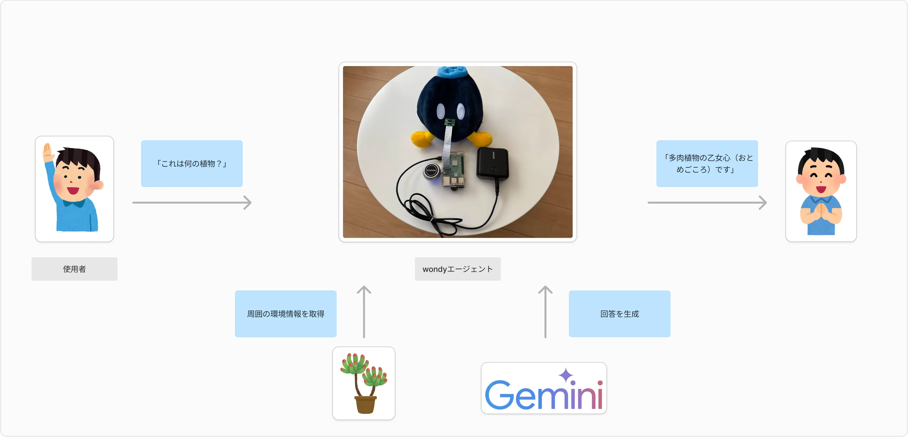
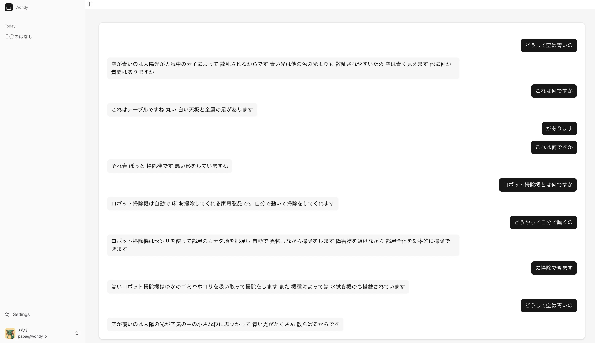
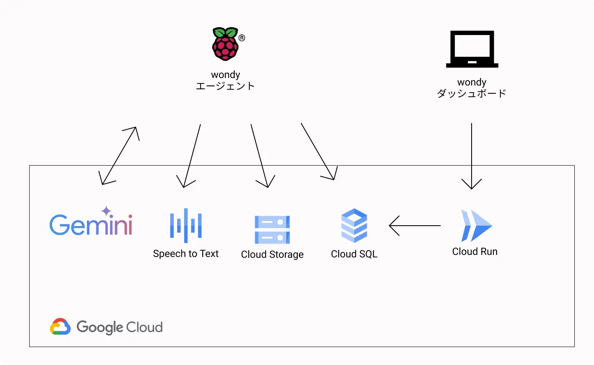
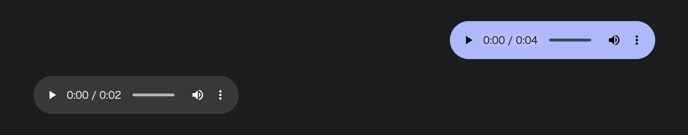

!

本記事は[AI Agent Hackathon with Google Cloud](https://zenn.dev/hackathons/2024-google-cloud-japan-ai-hackathon)に提出したプロジェクトの記事です。

#  プロジェクト概要

子供の疑問に答える AI エージェント「wondy」を開発しました。

##  課題と対象ユーザー

私たちのプロジェクトが対象とするユーザーは、好奇心旺盛な子供とその親です。特に、子供が日常生活の中で「これなに？」と感じた疑問を、すぐに解消できる環境を求める家庭に焦点を当てています。

さまざまなことに興味を持つ子供の好奇心の芽を摘まないために、親は子供の質問を受けるとまずスマートフォンを使ってインターネット検索し、関連情報を探すのが一般的です。その検索結果をもとに、親自身の知識を組み合わせて子供に分かりやすいように口頭で説明します。場合によっては、子供向けの参考書籍や映像コンテンツを紹介することで、より具体的な理解を促すでしょう。

これらの対応策には以下のような課題が存在すると考えています。

  * 子供の疑問に対して、親が時間的に余裕がなく答えられない場合や、知識が足りずに答えられない場合がある
  * 興味を持った瞬間を逃すと、子供の関心が他のことに移りやすく、深い学びにつながらない
  * 触覚や実体験を通じた学習が必要な場合があり、Web 検索などデジタルツールだけでは不十分なケースがある

#  ソリューション

これらの課題に対するソリューションとして開発した「wondy」は、大きく 2 つのコンポーネントから構成されています。

###  wondy エージェント

主に子供が利用するのを想定し、音声やカメラ映像を通じて質問に回答します。遊び道具として持ち運べるように電源はモバイルバッテリーから供給しています。

  
_wondy エージェントの利用イメージ_

###  wondy ダッシュボード

親が利用するのを想定したインターフェースで、子供の質問や wondy エージェントの回答履歴を確認できます。

  
_wondy ダッシュボード_

##  ソリューションが提供する価値

###  子供の疑問に応える直感的なインターフェース

  * 子供が「これなに？」と話しかけるだけで動作
  * マイク・カメラ・スピーカーを搭載し、音声・映像の両方から情報を取得

###  インタラクティブな学習体験

  * 疑問に対してリアルタイムに回答を生成し、関連する追加情報も提供
  * 子供がさらに深堀りした質問をした際も柔軟に対応

###  子供が日頃から興味を持っていることの理解

  * 親は質問履歴をダッシュボードで確認し、子供の興味関心を理解できます
  * 子供の成長に合わせて、エージェントの回答内容をカスタマイズ

これらのソリューションにより、子供の好奇心を育むと同時に、親子のコミュニケーションを促進し、子供の成長をサポートします。

#  デモンストレーション

<https://youtu.be/O7NccfAdkB4>

#  システム構成

wondy のバックエンドは Google Cloud 上に構築しています。

  
_システムアーキテクチャ図_

##  wondy エージェント

本体は、Raspberry Pi 3 Model B+にカメラ・マイク・スピーカーを搭載したものを使用しています。Python で実装されたアプリケーションが、以下の API と通信しています。

###  Gemini Multimodal Live API

WebSocket 通信してカメラやマイクで取得した情報をリアルタイムに送信し、回答を音声データとして取得してスピーカーから出力します。

この API は元々割り込みの制御をしており、回答中にユーザーの音声入力が検出されるとモデルの出力はいつでも中断できるのですが、今回のハードウェア構成だとエコーが発生するためこの機能は利用していません。詳細は後述します。

###  Speech-to-Text API

ユーザーの入力音声と、エージェントの回答音声をテキストに変換するために使用します。wondy ダッシュボードで会話履歴を確認する際に、音声データ履歴が表示されるよりもテキストの方がわかりやすいため、この変換処理を行っています。

  
_音声の会話履歴だと毎回再生が必要で体験が悪い_

###  Cloud Storage API

ユーザーの入力音声と、エージェントの回答音声の生データを保存しています。Multimodal Live API の[公式リファレンス](https://cloud.google.com/vertex-ai/generative-ai/docs/multimodal-live-api)で言語は英語のみ対応とあるので、日本語の音声は若干カタコトになることがあります。そうなると Speech-to-Text の結果も若干おかしな回答になるので、生データを保存しておいて後から確認できるようにしています。（ダッシュボードからの再生は未対応です）

##  wondy ダッシュボード

Next.js で実装した Web アプリケーションを Cloud Run にホスティングしています。

操作しやすいデザイン性と開発スピードを両立するために、スタイリングには shadcn/ui を 、API は Next.js の API ルートに REST のエンドポイントを実装したシンプルな構成になっています。

#  実装とデザイン

本プロジェクトの開発にあたって、wondy エージェントを「隣にいる相棒」のように親しみやすく、直感的に使える存在とすることを目指しました。以下に、実装およびデザインの際に特に意識したポイントと、直面した技術的な課題について説明します。

##  エコーキャンセルの課題

ユーザーが自然な会話体験を享受できるよう、従来のウェイクワード（起動語）は設定せず、いつでも話しかけられるデザインを採用しました。

その結果、エージェントが取得する音声がユーザーの声なのか、エージェント自身が発話した声なのかを判別する必要が生じ、エコーキャンセルという技術的課題に直面しました。

当初は、Raspberry Pi の OS に採用されている PulseAudio の echo cancellation モジュールを利用してエコーキャンセルを試みましたが、十分な効果が得られなかったため、今回はエコーキャンセル機能を使わない運用としました。その代わり、エージェントが発話中はユーザーが新たに話しかけることを制限し、エージェントの発話が完了するまで待機する方式を採用しました。これにより、ユーザーはエージェントの発話終了後であれば質問を行えるようになりました。

エコーキャンセル機能については、今後さらなる検証を進め、より自然な双方向コミュニケーションの実現を目指します。

##  ローカル LLM の活用

今回のシステムは、Google Cloud のサービス利用を要件としているため、基本的にはインターネット接続環境下での運用を前提としています。しかし、外出時などインターネット接続が不安定な環境下においても、ユーザーが途切れることなく質問を行えるよう、将来的にはローカル LLM を活用して回答を生成する仕組みの導入を検討しています。

#  想定されるリスク

wondy を家庭に導入するにあたり、想定されるリスクについてもまとめました。

##  AI エージェントへの過度な依存による自己解決能力の低下

確かに、子供がすべての疑問を AI エージェントに頼ることで、自ら調べたり考える機会が減るリスクは存在します。しかし、wondy ダッシュボードには、エージェントとの会話履歴が記録される仕組みがあり、これを通じて親が子供の質問内容と回答を確認できるため、必要に応じた補足説明が可能です。そのため、AI 依存による自己解決能力の低下リスクは、家庭内での適切なフォローアップにより十分に管理されると考えています。

##  AI に任せることによる親子のコミュニケーション減少

AI エージェントが自動的に回答するため、親子の直接対話が減少する懸念がありますが、こちらも wondy ダッシュボードの会話履歴から親は子供の質問や回答を把握し、適切なタイミングで対話を補完することができるため、親子間のコミュニケーションの機会はむしろ増加すると判断しています。

##  コンテンツの適切性と情報の正確性のリスク

AI が生成する回答が誤情報や不適切な表現を含む可能性は否定できませんが、wondy では、保存された会話ログをもとに出力内容の傾向をモニタリングし、必要に応じてユーザーからのフィードバックを収集することが可能です。これにより、誤った情報や偏りのリスクは継続的に低減され、システム全体の価値がリスクを上回ると考えています。

#  チーム

大学の同期 4 人が集まってできた技術系グループ Active Club（通称アクティ部）です。  
<https://www.activeclub.jp>

#  追伸

作品提出後、Gemini API の[利用規約](https://ai.google.dev/gemini-api/terms?hl=ja)において、利用可能な対象が 18 歳以上に限定されていることに判明いたしました。なお、今回はハッカソン用プロトタイプの作成にあたり、Google の API 利用要件に基づいて開発を進めましたが、実運用段階では規約遵守と安全性を確保するため、ローカル LLM の活用を検討しております。
