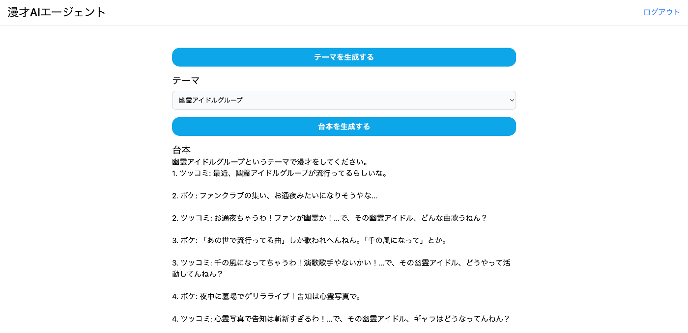

#  プロジェクトの概要

本プロジェクトは、Vertex AI、Cloud Functions、Gemini、Firebase を活用した マルチエージェント漫才生成システム です。M-1グランプリの出場者データを活用し、AIが漫才スクリプトを自動生成することで、お笑い芸人やコンテンツクリエーターの創作支援を実現します。

#  技術スタック

##  フロントエンド

  * Next.js
  * TypeScript
  * Firebase (FireAuth)

##  バックエンド

  * Cloud Functions
  * Firebase (Firestore)
  * Python

##  AI/ML

  * Vertex AI
  * Gemini
  * LangGraph
  * Langchain

#  ユーザー像と課題

##  対象ユーザー

本システムは以下のようなユーザーを対象としています：

###  お笑い芸人

  * 新しいネタを作る時間を短縮したい
  * 客観的な評価を得たい
  * 既存のネタの改善点を見つけたい

###  脚本家・ライター

  * お笑い要素のあるストーリーのアイデアを得たい
  * キャラクター間の掛け合いの参考にしたい
  * コメディの新しい切り口を探したい

###  動画クリエイター

  * AIを活用した新しいコンテンツを作りたい
  * 面白い台本を効率的に作成したい
  * オリジナリティのある企画を立てたい

##  既存の課題

  1. **ネタ作成の時間的コスト**

     * アイデア出しから完成まで多大な時間が必要
     * 試行錯誤の過程が非効率
     * 締切に追われる中での創作が困難
  2. **客観的評価の難しさ**

     * ネタの面白さを数値化できない
     * 第三者からの適切なフィードバックが得にくい
     * 改善ポイントの特定が困難
  3. **創作の行き詰まり**

     * 既存の発想から抜け出せない
     * 新しい切り口が見つけにくい
     * 独自のスタイルに固執しがち

#  システムの特徴と工夫点

##  1\. 実在する芸人データベースの活用

###  データ収集システム

  * M-1グランプリの出場者データをスクレイピングで自動収集
  * BeautifulSoupを使用したWebクローリング
  * 敗者復活戦や決勝進出者の情報を優先的に収集

###  データ構造の最適化

  * Firestoreのコレクション設計 
    * Comedians: 芸人の基本情報
    * Judges: 審査員の基本情報
    * Scripts: 生成された漫才スクリプト
    * Evaluations: 審査結果

##  2\. マルチエージェントアプローチ

###  エージェント構成

  1. **ボケエージェント**

     * 独自のキャラクター性を持つ
     * コンテキストを考慮した発言生成
     * 実在する芸人のスタイルを参考
  2. **ツッコミエージェント**

     * ボケに対する適切な反応
     * 会話の流れを制御
     * テンポ感の調整
  3. **審査員エージェント**

     * 複数の評価基準での採点
     * 具体的なフィードバック提供
     * 改善提案の生成

###  エージェント間の連携
    
    
        for i in range(5):
        
        boke = boke_agent(theme, context, boke_info)
        boke_text = extract_text_from_response(boke)
        print(f"ボケ: {boke_text}\n")
        context += f"\n{i + 2}. ボケ: {boke_text}"
    
        tsukkomi = tsukkomi_agent(theme, context, tsukkomi_info)
        tsukkomi_text = extract_text_from_response(tsukkomi)
        print(f"ツッコミ: {tsukkomi_text}\n")
        context += f"\n{i + 2}. ツッコミ: {tsukkomi_text}"
    
    context += "\nツッコミ: もうええわ。ありがとうございました。"
    

生成した漫才スクリプト（context）を後述する審査パートに渡します。
    
    
    updated_script = asyncio.run(judgement(context))
    response_data = {"scripts": updated_script}
    

##  3\. 高度な品質管理システム

###  評価基準

  * ボケの独創性
  * ツッコミの的確さ
  * 会話のテンポ
  * 文脈の一貫性
  * 観客受けの予測

###  フィードバックループ

  1. スクリプト生成
  2. 審査員による評価
  3. 改善点の特定
  4. スクリプトの修正
  5. 再評価

#  処理フロー詳細

##  1\. テーマ生成フェーズ

###  テーマ生成の工夫

  * 時事ネタの活用
  * 一般的な話題のユニークな切り口
  * 芸人の得意分野との関連付け

###  実装例
    
    
    def generate_themes():
        model = GenerativeModel("gemini-pro")
        safety_settings = [
            SafetySetting("HARASSMENT", "BLOCK_MEDIUM_AND_ABOVE"),
            SafetySetting("HATE_SPEECH", "BLOCK_MEDIUM_AND_ABOVE"),
        ]
        
        response = model.generate_content(
            "現代的で面白い漫才のテーマを5つ提案してください",
            safety_settings=safety_settings
        )
        return response.text
    

##  2\. スクリプト生成フェーズ

###  会話生成の特徴

  * 文脈を考慮した自然な展開
  * テンポ感のある掛け合い
  * 芸人の個性を反映
  * ボケエージェントとツッコミエージェントで役割分担

###  実装例

####  ボケエージェント
    
    
    def boke_agent(theme, context, geinin_info):
        """ボケエージェントが文脈と芸人情報を踏まえてボケを生成"""
        boke_prompt = f"""
    
        ## お題
        {theme}
    
        ## 芸人情報
        {geinin_info}
    
        ## 会話の流れ
        {context}
    
        あなたは漫才コンビのボケ担当です。
        以下のルールに必ず従って発言を行ってください：
    
        ・contextの一番最後の文章がツッコミです。そのフリ（ツッコミ）を受けてユーモアのあるボケを短く生成してください。
        ・長い説明は禁止。発言は長くとも2文まででまとめ、短くインパクトのある表現を心がけること。
        ・芸人情報と会話の流れを参考に回答を生成してください。
        ・生成したボケの文章だけを出力してください。
        """
    

####  ツッコミエージェント
    
    
    def tsukkomi_agent(theme, context, geinin_info):
        """ツッコミエージェントが文脈と芸人情報を踏まえてツッコミを生成"""
        tsukkomi_prompt = f"""
        ## お題
        {theme}
    
        ## 芸人情報
        {geinin_info}
    
        ## 会話の流れ
        {context}
    
        あなたは漫才コンビのツッコミ担当です。
        以下のルールに従って発言を行ってください：
    
        ・会話の流れを踏まえて面白くツッコミを行い、その後に次のボケがしやすいフリを発言してください。
        ・ツッコミとフリはそれぞれ1文ずつで、短く簡潔にまとめてください。
        ・芸人情報と会話の流れを参考にしてください。
        ・生成したツッコミの文章以外を出力するのは禁止です。
        """
    

##  3\. 評価・改善フェーズ

###  評価システムの特徴

  * 数値評価とテキストフィードバック
  * 具体的な改善提案
  * 芸人の特徴を考慮した評価
  * 審査員エージェントの評価と漫才エージェントの再生成のループ

####  審査員エージェント
    
    
    judge_prompt = ChatPromptTemplate.from_messages(
        [
            (
                "system",
                "あなたは、お笑いコンテストの審査員です。"
                "与えられた漫才スクリプトに対して、評価コメントを作成してください。"
                "漫才のテーマは変えてはいけません。"
                "次の評価基準を踏まえて回答を生成してください。\n\n{criteria}"
                "漫才のスクリプトは次の通りです。"
                "{manzai_script}",
            ),
            MessagesPlaceholder(variable_name="criteria"),
        ]
    )
    

審査員はFireStoreに格納された審査員情報を利用して審査をします。

####  漫才師エージェント
    
    
    reflection_prompt = ChatPromptTemplate.from_messages(
        [
            (
                "system",
                "あなたは漫才師のネタ作成担当です。与えらた評価コメントを踏まえてネタを作成しなおします。"
                "漫才のテーマは変えてはいけません。"
                "元のネタは次の通りです。\n\n{manzai_script}"
                "評価コメントは次の通りです。\n\n{judge_comment}"
            ),
            MessagesPlaceholder(variable_name="messages"),
        ]
    )
    

以下のように審査員エージェントの評価と漫才エージェントの再生成を繰り返します。
    
    
    #graphを構築
    builder = StateGraph(State)
    builder.add_node("generate", generation_node)
    builder.add_node("judge", judge_node)
    builder.add_node("reflect", reflection_node)
    # **ノードの接続**
    builder.add_edge(START, "generate")  # 最初に生成
    builder.add_edge("generate", "judge")  # 生成後に審査
    builder.add_edge("judge", "reflect")   # 審査後にリフレクション
    
    MAX_ITERATIONS = 3  # 最大ループ回数
    
    def should_continue(state: State):
        if state["iteration"] >= MAX_ITERATIONS:
            return END  
        return "generate" 
    
    builder.add_conditional_edges("reflect", should_continue)
    

judge（審査員）とreflect（漫才師）の関係を表したフロー図です。  

#  システムアーキテクチャ

#  今後の展望

##  1\. 音声合成との連携

  * 芸人の声質を模倣
  * 感情表現の実装
  * リアルタイム音声生成

##  2\. アニメーション統合

  * バーチャルキャラクター
  * 表情や動きの自動生成
  * インタラクティブ演出

##  3\. 学習モデルの改善

  * より自然な会話生成
  * パーソナライズ機能
  * リアルタイムフィードバック

#  デモ動画

<https://youtu.be/ibvDSM2KL34>

#  フィードバック

本プロジェクトの改善のため、以下の点についてご意見をお待ちしています：

  * 生成されたスクリプトの品質
  * 使用感や操作性
  * 新機能のリクエスト

ご意見・ご質問は、Issues または Pull Requests にてお願いいたします。
