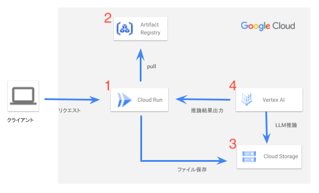

##  要旨

サラリーマンにとって、会議は避けて通れません。筆者も入社直後、カレンダーに登録されている膨大な会議に圧倒されました。そして参加するうち、惰性で出席するだけになってしまいました。

しかし、**何となく会議に参加するだけではもったいない** です。効果的な発言ができるようになるために、会議を振り返り次回の行動を模索する。それがコミュニケーションスキルの成長につながリます。

そこで、新入社員が日々の会議を振り返り、知見を得るWebアプリ・・・**議知録** を提案します。  
議知録の特徴は以下3点です。

  * 会議の内容だけでなく、発言者の「個性」に注目している。
  * 会議全体をAIに分析してもらい、個々人の発言のメリットとデメリットを出力する。
  * 分析をもとに、ユーザが次回からどのような行動をとるべきなのか提案する。

録画や議事録の作成は多くの新入社員が行う仕事です。会議の記録を紐解き、貢献できるヒントを見出す。これを目的としてWebアプリを開発しました。

※本稿は[AI Agent Hackathon with Google Cloud](https://zenn.dev/hackathons/2024-google-cloud-japan-ai-hackathon)の成果物です。

##  対象ユーザと課題

###  背景

  * **変化と不透明の時代**
    * 現代のビジネス環境は、技術革新や市場変動のスピードが速く、将来の予測は困難です。こうした環境下では、さまざまなアイデアを自由に交わす文化が企業の競争力に寄与します。
  * **新たな視点をもたらす新入社員**
    * 新入社員は、固定観念にとらわれない視点を提供できるポテンシャルがあります。しかし、入社直後は「どこまで意見を出してよいのか」という暗黙の了解が明確でなく、意見の発信に戸惑いが生じがちです。

###  新入社員の課題

  * **心理的安全性の不足**
    * 「新人なのに生意気だと思われるかも」「失敗したら評価が下がるかも」という不安が根強いため、発言自体が慎重になりがちです。
    * 結果として、積極的な発言が難しく、会議が形だけのやりとりで終わってしまいます。
  * **内省する機会の不足**
    * 会議が終わった直後に別の業務が始まり、じっくりと「自分がどう話せていたか」を振り返る時間がありません。さらに具体的なアドバイスを得られる機会も少ないです。
    * 結果として、「あの時もう少しこう言えばよかった」といった自分の発言を次に活かすための方向性がつかめず、ただ会議に同じように参加し続けているだけになってしまいます。

###  課題の放置によって起こり得る組織への影響

  * **会議の生産性の低下**

    * 新鮮な発想や多様なアイデアが埋もれ、個々の成長機会とモチベーションを損なう可能性があります。結果として、会議の質そのものが向上せず、生産性にも悪影響を及ぼしかねません。
  * **支配的な会議が増えるリスク**

    * 一部の人だけが発言を主導する雰囲気が続くと、多様な視点が十分に反映されないまま意思決定が行われるようになります。結果として、組織が新しいアイデアを取り込む柔軟性を失い、長期的な成長にも支障を来す恐れがあります。

##  課題に対するソリューション：議知録（gichiroku）

まずデモ動画をご覧ください。

<https://youtu.be/YDEYZMVI0r4>

議知録の使用手順は以下の通りです。

  * フィードバックを聞きたい人（以下ユーザ）の名前を入力する。
  * 分析したい会議の録音（mp3ファイル形式）をアップロードする。
  * アップロードボタンを押下する。

以上の手順を実施した後、下記1-6のように分析結果を出力します。

  1. 参加者の「個性」を「挑戦者」、「分析者」、「実行者」、「協力者」に分類。
  2. 会議全体でバランスが取れているかどうか評価。
  3. 会議におけるユーザの「個性」の分析。
  4. 具体的な発言内容のメリットとデメリットの分析。
  5. それぞれの役割における改善提案の提示。
  6. ユーザに対する具体的なフィードバックの提示。

以上の分析結果は下記のプロセスを順繰りにプロンプトで指示することで実現しています。

  * 会議全体の個性の分析。
  * 発言内容のメリット・デメリットを分析。
  * 個性に対する改善提案とユーザに対する改善提案を提示。

上記のプロセスについて次項で説明します。

##  ソリューションの特徴

###  会議全体の個性の分析

議知録は、会議の発言者全員の個性を分析し、会議全体のバランスを評価することで、会議の改善余地を洗い出します。  
Murphy(2018)[1]は会議に大きな影響を及ぼす個性を以下の四つにまとめています。

  * 挑戦者 
    * メリット：斬新なアイデアでチームの思考を広げる。
    * デメリット：他者の計画やアイデアを覆し混乱を招く。
  * 分析者 
    * メリット：優れた専門知識で課題解決に貢献する。
    * デメリット：自分の専門から外れると興味を失い議論を狭める。
  * 実行者 
    * メリット：優れた段取りと計画でプロジェクトを推進する。
    * デメリット：実現性に固執してしまい発想を阻害する。
  * 協力者 
    * メリット：チーム内の関係性を修復し調和を保つ。
    * デメリット：合意形成に注力するあまり意思決定を遅らせる。

議知録では、録音した会議の音声を分析することで、誰がどの個性を担っているのか、そして会議の中で不足している個性について明らかにします。実際に以下のように出力があります。

> ###  2\. 全体のバランス評価
> 
> 会議全体として、挑戦者の役割を果たす参加者が不足している可能性があります。革新的なアイデアや斬新な視点を導入し、議論をより活性化させるためには、挑戦者の積極的な参加が不可欠です。
> 
> ###  3\. ⚫︎⚫︎の役割特定
> 
> ⚫︎⚫︎は分析者のタイプに分類されます。彼の発言は問題の本質に迫ろうとする意識が強く、課題の根本原因を客観的に把握しようとする傾向が見られます。

上記の⚫︎⚫︎はユーザの固有名詞です。ユーザは以上の出力を通して、会議における自己の立ち位置を理解し、本来補われるべきだった会議の役割を知ります。

###  発言内容のメリット・デメリットの分析

さらに議知録では、実際の発言内容を引用し、メリットとデメリットを出力します。例えば以下のように出力があります。

>   * **⚫︎⚫︎の発言:** 「まず 根本的なところを確認できたのは良かったかなと思っております」  
>  * メリット: 問題解決に向けた具体的な方向性を示唆し、議論を前進させる効果がある。  
>  * デメリット: 根本的な確認にこだわりすぎると、柔軟な発想や革新的なアイデアが生まれにくくなる可能性がある。
> 

以上の出力によって、発言の影響を理解するようユーザに促します。

###  4つの個性に対する改善提案とユーザに対する改善提案の提示

最後に、4つの個性に対する改善提案とユーザに対する改善提案を提示します。

ユーザに対する改善提案の出力例は以下の通りです。

> ###  ⚫︎⚫︎へのフィードバック
> 
> ⚫︎⚫︎は分析者としての強みを生かしつつ、以下の点を意識することで、さらにチームに貢献できるでしょう。
> 
>   * チームメンバーとの積極的なコミュニケーション: 他のメンバーの意見や感情を理解し、共感することで、より建設的な議論を促すことができます。
>   * 視野を広げるための学習: 専門分野外の知識を習得することで、問題解決の幅を広げることができます。
>   * 行動目標の設定: チームに与えられた役割に固執せず、状況に応じて柔軟に課題に取り組む姿勢を持つことが重要です。
> 

改善提案の出力によって、ユーザは次回以降の会議で貢献する方法を模索する機会が得られます。

###  システム構成図

議知録はサーバーレス構成のWebアプリとして開発しました。システム構成図を以下に示します。  

今回使用したプロダクトについて説明します。

  1. Cloud Run 
     * 議知録はCloud Runにデプロイしています。ユーザがWebアプリ上でmp3ファイルをアップロードすると、Webアプリは3のCloud Storageにmp3ファイルを格納します。そのあと、4のVertex AIがCloud Storageに保存したmp3ファイルを分析します。
  2. Artifact Registry 
     * 1のCloud Runにデプロイするためのイメージを格納しています。バージョン管理ツールから、イメージをpushし、Cloud Runにデプロイしています。
  3. Cloud Storage 
     * 1のCloud RunにデプロイしたWebアプリから、ユーザがアップロードしたmp3ファイルを格納します。
  4. Vertex AI 
     * 3のCloud Storageに格納したmp3ファイルを分析し、出力結果を議知録に出力します。

##  まとめ

本稿では[AI Agent Hackathon with Google Cloud](https://zenn.dev/hackathons/2024-google-cloud-japan-ai-hackathon)で開発したWebアプリである議知録について説明しました。

先行きが不透明な時代において、オープンに意見を交わし合う風土は企業の競争力に寄与します。本プロジェクトでは、発言を躊躇しがちな新入社員に注目し、会議のフィードバックを提供することで、効果的な参加を促進できないかという課題を定義しました。

上述した課題のソリューションが、会議における振り返りを支援する議知録です。このWebアプリでは、録音した会議の発言を分析し、会議全体における発言者の個性のバランスを評価し、ユーザへフィードバックを行います。

議知録は、一連のアウトプットを通して、新入社員に振り返りの機会を提供します。このWebアプリにより、新入社員は毎回の会議を振り返り、次回の会議に向けて新しいアクションを実践できます。これによってコミュニケーションスキルを洗練させられるのです。議知録は日々のミーティングを継続的な学習に変換します。

脚注

  1. [Murphy, M.(2018, January 28). _How To Manage The Four Strong Personalities You See In Meetings_.（2025年2月9日閲覧）  
](https://www.forbes.com/sites/markmurphy/2018/01/28/how-to-manage-the-four-strong-personalities-you-see-in-meetings/) ↩︎

