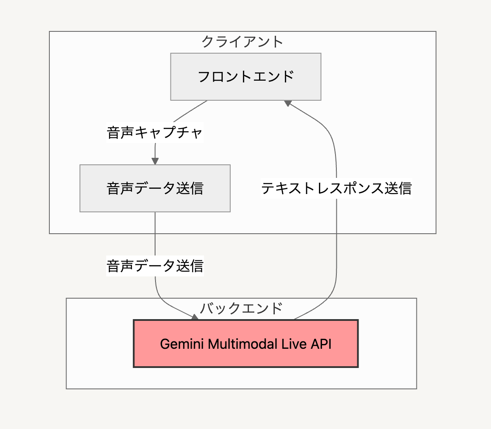

デモURL：<https://louddin.cloudfree.jp/Sasayaki/>

##  i. プロジェクトが対象とするユーザー像と課題、課題へのソリューションと特徴

##  対象ユーザー像

ビジネス用語やマーケティング用語、エンジニアリング用語に慣れていない方

##  課題

会議の参加者は、以下のような課題を抱えています。

  * **会議の内容の理解** : 会議の内容を完全に理解することが難しい場合があります。特に、専門用語や複雑な概念が頻繁に使用される場合、理解が追いつかないことがあります。
  * **議事録作成の負担** : 会議の議事録作成は、時間と労力がかかる作業です。特に、長時間の会議や参加者の多い会議では、議事録作成の負担が大きくなります。
  * **多言語の壁** : 外国語の会議に参加する場合、言語の壁が理解を妨げることがあります。リアルタイムでの翻訳が必要となる場合があります。
  * **情報過多** : 会議中に多くの情報が飛び交い、重要な情報を見落としてしまうことがあります。
  * **用語の理解** : 会議中に新しいビジネス用語やマーケティング用語が出てきた際に、すぐに意味を理解できないことがあります。

##  ソリューション

SasayakiAIは、これらの課題を解決するために、以下のソリューションを提供します。

  * **リアルタイム議事録作成** : 会議の内容をリアルタイムでテキスト化し、議事録作成の負担を軽減します。
  * **用語解説** : 会議中に使用されたビジネス用語やマーケティング用語を自動的に検出し、解説を提供します。
  * **多言語翻訳** : 会議の内容をリアルタイムで多言語に翻訳し、言語の壁を取り除きます。
  * **重要情報の抽出** : 会議の内容から重要な情報を抽出し、参加者に提示します。
  * **音声入力** : 音声入力に対応しており、ハンズフリーで操作できます。

##  特徴

SasayakiAIは、以下の特徴を備えています。

  * **リアルタイム性** : 会議の内容をリアルタイムで処理し、結果を即座に提供します。
  * **多言語対応** : 複数の言語に対応しており、グローバルな会議でも利用できます。
  * **使いやすさ** : シンプルで直感的なインターフェースを備えており、誰でも簡単に利用できます。
  * **軽量** : Vanilla JavaScriptで実装されており、軽量で高速に動作します。
  * **音声認識** : 音声認識には、GoogleのGemini 2.0 Flash Multimodal Live APIを使用しています。
  * **テーマ** : ダークモードとライトモードを切り替えることができます。

##  アーキテクチャ

プロジェクトのディレクトリ構造は以下の通りです。
    
    
    ├── js/
    │   ├── audio/ # Audio processing and management
    │   ├── config/ # Configuration files
    │   ├── core/ # Core functionality (WebSocket, worklets)
    │   ├── tools/ # Function calling implementations
    │   ├── utils/ # Utility functions
    │   ├── video/ # Video and screen sharing
    │   └── main.js # Application entry point
    ├── css/ # Styling
    └── index.html # Main HTML file
    

###  ii. システムアーキテクチャ図の画像

###  iii. デモ動画

<https://youtu.be/zjViARulHCY>

##  まとめ
