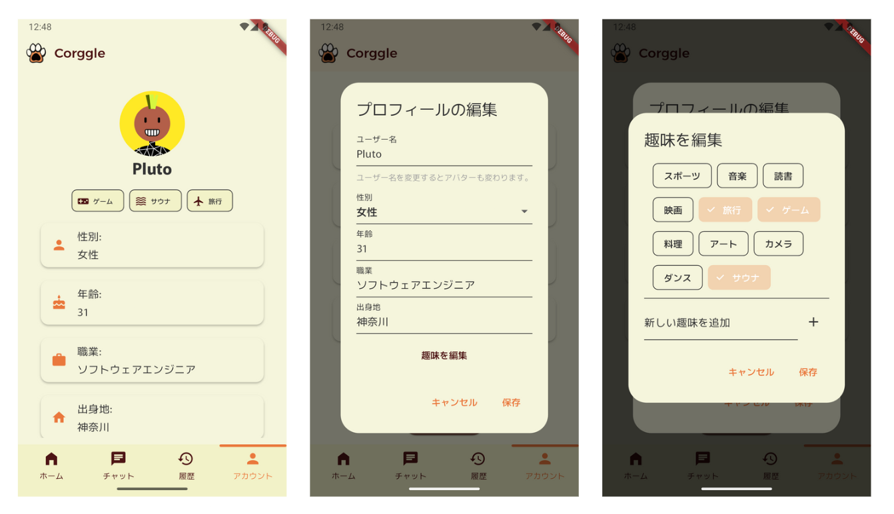
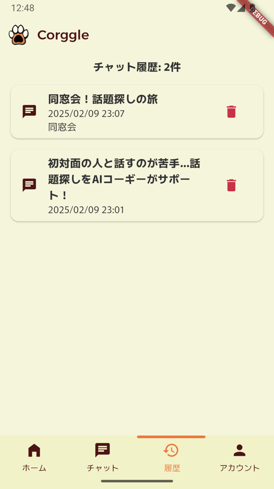
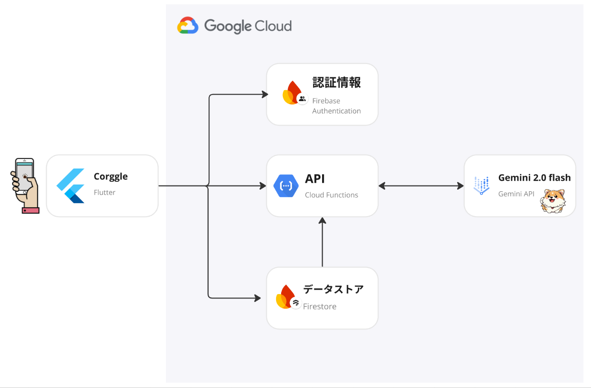
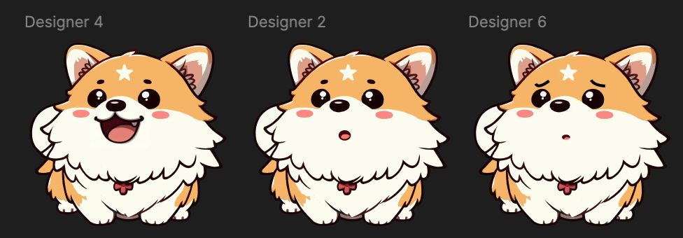

本記事は[AI Agent Hackathon with Google Cloud](https://zenn.dev/hackathons/2024-google-cloud-japan-ai-hackathon)に提出したプロダクト概要です。

##  はじめに

誰かとの会話で「話が続かない」「話すことがない」「気まずい」と感じたことはありませんか。学生や社会人になると、初対面の人との会話の機会が増えていきます。そのため、コミュニケーションスキルの向上は私たちにとって重要な課題となっています。特に、デジタル時代に育ったZ世代は、オンラインでのコミュニケーションには長けているものの、対面での会話に苦手意識を持つ人が増えているのが現状です。

この課題に取り組むため、私たちは会話を円滑にするためのソリューションを開発しました。AIの力を活用し、誰もが自信を持って対面コミュニケーションを行えるよう支援します。

##  プロダクト名

Corggle（こーぐる）

##  対象ユーザー

Corggleは、「今この場面でどんな話題を話せばいいだろう」と悩むすべての人のためのAIエージェントです。主な対象はZ世代の社会人や学生ですが、シンプルで分かりやすいUIにより、どの年代の方でもご利用いただけます。

##  課題

近年、リモートワークやリモート学習の普及により、Z世代の対面コミュニケーションの機会は著しく減少しました。この変化により、ソーシャルスキルや言語能力の低下が問題となっています。

  * カナダの調査によると、リモート環境で育ったZ世代の**50%以上がソーシャルスキルの後退** を実感し、**25%以上が言語能力の低下** を報告しています。  
引用：[https://forbesjapan.com/articles/detail/71730）](https://forbesjapan.com/articles/detail/71730%EF%BC%89)
  * Z世代は、幼少期からデジタル技術と密接に関わり、SNSを主要なコミュニケーションツールとして活用してきた「ソーシャルネイティブ」です。彼らは効率性を重視し、無駄のないコミュニケーションを好む傾向があります。そのため、対面での会話では状況や役割に応じた適切な話題選びに苦心し、同じ話題の継続に不自然さを感じることがあります。  
引用：<https://www.dodadsj.com/content/0329_generation-z/?utm_source=chatgpt.com>

こうした背景から、Z世代の多くは対面での雑談や会話の話題に困難を感じ、円滑なコミュニケーションを取ることに課題を抱えています。

##  ソリューションと特徴

Corggleは、AIを活用してその場に適した話題を提供し、スムーズな会話をサポートします。

  * 初めてのデート、会社の懇親会、同窓会など、一般的な場面があらかじめ用意されており、それぞれの状況に最適な話題を見つけられるよう、AIが適切な質問でサポートします。
  * 設定済みの場面に加えて、ユーザーが自由に場面を設定することもできます。
  * 愛らしく陽気なコーギーが、ユーザーのパートナーとして質問やアドバイスを提供します。親しみやすいキャラクターデザインと直感的な操作性により、誰でも気軽に使えるアプリケーションになっています。

###  ChatGPTとの違い

ChatGPTが汎用的な会話AIであるのに対し、Corggleは対面コミュニケーションに特化したAIエージェントです。場面や状況に応じた最適な話題提供、Z世代特有のコミュニケーション課題への対応、そしてキャラクターを通じた親しみやすいインターフェースが特徴です。また、会話の目的や深さに応じて話題を調整できる機能は、ChatGPTにはない独自の強みです。

##  機能概要

###  🌈 プロフィールを入力する

ユーザーは基本情報（年齢、職業、趣味など）をプロフィールに登録できます。これにより、AIがユーザーの特性に合わせて最適な話題を提案できるようになります。また、ユーザー名からランダムに生成されるアイコンには、遊び心のある仕掛けを取り入れています。  

###  ⚙️ プリセットの話題から会話をはじめる

Corggleには、初対面の挨拶や会社の歓迎会など、一般的なシーンに対応したプリセットの話題が用意されています。ユーザーは状況に応じて適切なプリセットを選択し、AIが会話の展開をガイドします。各プリセットには、その場面に相応しい話題の深さや方向性が設定されており、自然な会話の流れを維持することができます。

###  ❓ フリートークから会話をはじめる

プリセットだけでなく、ユーザーが自由に場面や状況を設定できる「フリートーク」機能も用意しています。例えば、「上司との1on1」や「友人の結婚式」など、具体的なシチュエーションを入力することで、AIがその状況に適した話題を提案します。この機能により、より柔軟で個別化された会話サポートを実現しています。

###  ⏰ 履歴から会話をはじめる

過去の会話履歴を簡単に振り返り、その話題から新しい会話を始めることができます。前回の会話の続きから自然に対話を広げたり、過去に盛り上がった話題を再度取り上げたりすることが可能です。また、AIが会話内容に応じて適切なタイトルを付けてくれるため、履歴の内容が一目で分かります。  

##  システムアーキテクチャ

今回のスタックは以下のとおりです。

###  Frontend

  * Flutter

###  Backend

  * Cloud Functions
  * Firebase Authentication
  * Firestore
  * Gemini API in Vertex AI（2.0 flash）  

##  UI/UXのこだわりポイント

###  1\. 愛らしいキャラクター「こぎ美」による親しみやすいデザイン🐶

Corggleは単なるAIエージェントではなく、ユーザーの「会話パートナー」としての役割を果たします。親しみやすく表情豊かなコーギーのキャラクターが、ユーザーにフレンドリーな印象を与え、心理的なハードルを下げます。アイコンやイラストを効果的に活用し、まるで「会話を楽しむ相棒」のような体験を生み出しています！  

###  2\. 直感的でミニマルなインターフェース 🎨

「話題を探す」を最短ステップで実現するため、シンプルかつ直感的なUIを設計しました。ホーム画面からワンタップでプリセットの話題やフリートークを開始できるため、初めてのユーザーでも迷うことなく使えます。

##  AIモデルのこだわり

###  1\. キャラクター設定へのこだわり

・キャラクター性の一貫性：システムインストラクション、クラス名、初期メッセージ、プロンプトなど、あらゆる要素で「こぎ美」というキャラクターを統一的に表現しています。

・独自の個性表現：「だわん」「だわん！」という特徴的な語尾や、絵文字・顔文字を効果的に活用し、単なるチャットボットを超えた、愛らしい犬のキャラクターを演出しています。

###  2\. 会話品質へのこだわり

・親しみやすい対話：プロンプトで「フレンドリーで親しみやすい会話」を指示し、ユーザーとの良好なコミュニケーションを実現しています。Gemini-2.0-flash-1.0（Google Gen AI SDK）の採用により、Gemini-1.5系以上の自然な対話が可能になりました。

・効率的なコミュニケーション：「簡潔でわかりやすい会話」「短めの応答」を重視し、ユーザーにとって理解しやすい対話を実現しています。

・最新情報の活用：Google Search Toolによるグラウンディングを実装し、時事ネタや最新の話題を取り入れることで会話に新鮮さを加えています。こぎ美は最新のイベント情報なども提供でき、AIエージェントとしての価値を高めています。

・会話の継続性：会話が停滞した際には、回答候補機能で新たな話題を提案し、自然な対話の流れを維持する工夫を施しています。

##  デモ動画

<https://youtu.be/7M00O0Wqo4M>

##  今後の改善案

###  🧠 1. コミュニケーション向上に関する資料を利用したAIのチューニング

コミュニケーション心理学や会話分析の研究データを活用し、AIモデルのチューニングを行います。これにより、より自然で効果的な会話の提案が可能になります。特に、「アクティブリスニング」や「共感的コミュニケーション」などの要素を強化し、より深い対話を促進することを目指します。

###  👤 2. パーソナライズ

過去の会話履歴を分析し、より自然な対話の流れを生み出します。

ユーザーの興味や会話スタイルに基づいて、AIがより個人に合わせた提案を行うことができます。また、ユーザーの性格や価値観を考慮することで、より共感を得やすい話題を提供し、自然な対話を促進します。
