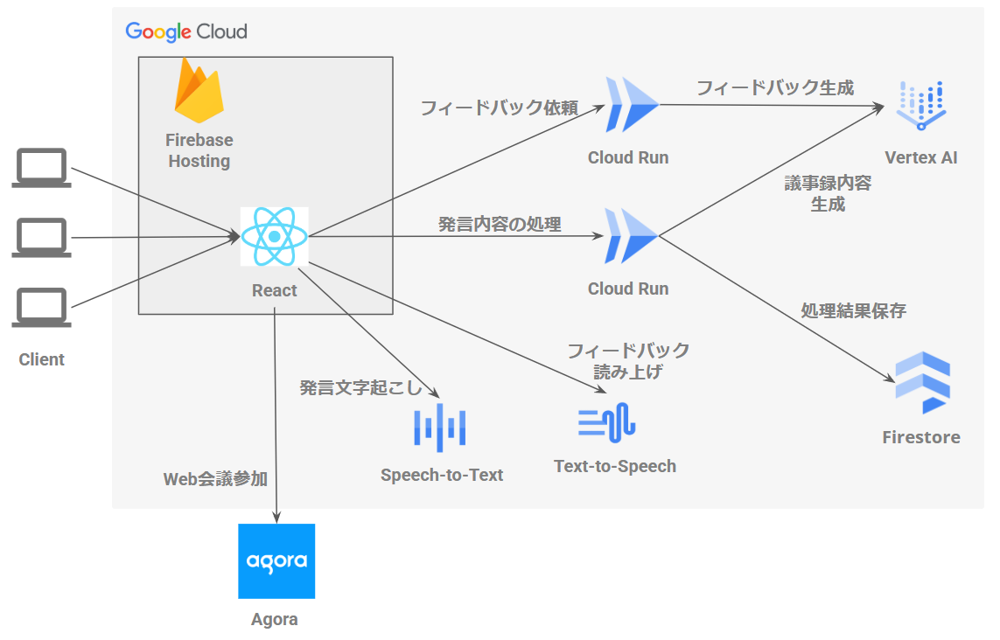
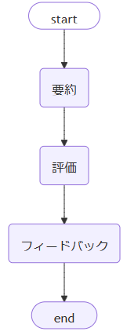

##  はじめに

会議はビジネスに欠かせない重要な場ですが、「**会議が長引く** 」「**議事録作成が負担** 」「**決定事項が曖昧** 」といった課題に悩まされることも多いのが現実です。

そこで私たちは、**「会議進行 & 議事録作成」を自動化する次世代のAIエージェント**「**AiMee** 」を開発しました！  
本記事では、その機能やシステム構成を詳しくご紹介します！

##  👥プロジェクトが対象とするユーザ像と課題

###  想定ユーザ

**「会議をもっと効果的・効率的にしたい」と考えるすべてのビジネスパーソン**

###  抱えている主な課題

  1. **会議の時間管理が難しく、予定がズレ込む**
     * 「つい話が脱線して、気づいたら 30 分オーバー…」といったことが頻発
  2. **議事録作成に時間と労力がかかる**
     * 音声を文字起こしし、要点をまとめるだけでも膨大な手間
     * 後から読み返すと何が重要か分からない
  3. **意思決定が曖昧なまま終了してしまう**
     * ファシリテーター不在または経験不足により、議論が収拾しきれない
     * 発言のバランスが偏り、重要なアイデアが埋もれがち

##  🚀課題へのソリューションと特徴

上記の課題を解決するために開発されたのが **「AiMee」** です。  
LLM 技術を活用し、以下の特徴的な機能を提供します。

###  1\. AIエージェントによるファシリテーター機能

  * 事前に設定した会議の アジェンダ・ゴール に基づき、話題の切り替えや議論の方向性を**自動提案**
  * 参加者の発言内容をリアルタイム解析し、**「次のステップは〇〇について話し合いましょう」** などのナビゲーションを実行
  * 脱線を検知すると、**「本題に戻りましょう」** と促し、時間ロスを最小化

###  2\. リアルタイム議事録作成 機能

  * **音声入力** と **自然言語処理** を組み合わせ、発言を自動的にテキスト化
  * キーワードや文脈を把握して、**「アジェンダ」「決定事項」「アクションプラン」** などに即時分類
  * 会議中に画面表示されるため、常に全員が **同じ情報を共有** できる

これらの機能により、**ファシリテーターの負担を大幅に軽減** しつつ、**意見を引き出す力** や **合意形成のスピード** を高め、最終的には **会議そのものの質を劇的に向上** させることを目指しています！

##  🎥 デモ動画

実際に **AIエージェント** が会議を進行・議事録作成する様子をご覧ください！  
<https://www.youtube.com/watch?v=twN3AQA1Va4>

##  🛠️システムアーキテクチャ

###  使用技術

  1. **クライアントアプリケーション (React + Firebase Hosting)**

     * フロントエンドは **React** で作成され、**Firebase Hosting** によって提供
     * 直感的なUIで、シームレスな会議体験を提供
  2. **Web会議 (Agora)**

     * 会議音声・映像のリアルタイム配信に **Agora** を採用
     * 主催者が会議チャネルを作成し、参加者がそこへ接続する形でリモート会議を実施
  3. **バックエンドアプリケーション (Cloud Run)**

     * **Flask** で実装したサーバサイドロジックを **Cloud Run** 上で実行
     * 音声認識結果や会議情報を受け取り、後述の **AI エージェント** （Vertex AI）へ分析リクエストを行う
     * 処理結果を **Firestore** に保存し、クライアントとリアルタイムでデータを共有
  4. **AIエージェント (Vertex AI Geminiモデル)**

     * 会議内容の要約・評価・フィードバックなどを行う **LLM (Geminiモデル)**
     * プロンプトやスキーマ定義を厳密に設定することで、安定した出力を実現
  5. **リアルタイムデータベース (Firestore)**

     * 会議データや分析結果を保存し、**Websocket 通信** でクライアントと同期
     * 参加者全員が、リアルタイム更新される議事録やフィードバックを同時に共有可能
  6. **音声認識 (GCP Speech-to-Text)**

     * ユーザの発言を、**GCP Speech-to-Text** で文字起こし
     * 議事録作成やフィードバック分析のためのテキストデータを即時生成
  7. **音声合成 (Text-to-Speech)**

     * AIエージェントが生成したフィードバックを 音声合成 (Text to Speech) により発話
     * 参加者へ**自然な音声でアナウンス** し、会議進行をスムーズにサポート

##  🤖エージェントの説明

本システムでは、目的別に5つのエージェントが動いています。各エージェントの詳細については、以降で説明します。

###  エージェントの共通処理

エージェント共通での工夫点は、**プロンプトの入出力IFの厳密化** 、**LLM間での処理分担** です。  
プロンプトの入出力IFが曖昧な場合、余分な説明文や英文が出力され、LLMの出力が不安定になることがありました。  
そこで、入出力のIFを指示文に加え、Function CallingやResponse Schemeを用いて日本語名のIF定義で厳密に定義することで、**LLMの入出力を安定** させました。

IF定義 サンプル
    
    
    EVALUATION_RESPONSE_SCHEMA = {
        "type": "object",
        "properties": {
            "参加者の関与度": {
                "type": "string",
                "description": "参加者の関与度に関する評価"
            },
            "議論の具体性": {
                "type": "string",
                "description": "議論の具体性に関する評価"
            },
            "議論の方向性": {
                "type": "string",
                "description": "議論の方向性に関する評価"
            }
        },
        "required": ["参加者の関与度", "議論の具体性", "議論の方向性"]
    }
    

また、LLMに与える指示が多くなると、一部の指示が守られなくなる恐れがありました。そこで、  
エージェントの処理を分解し、シンプルな指示を全うする**LLM同士を協働** させることにしました。

###  1\. 議事録エージェント

このエージェントは、会議での発言内容を**自動的に記録・整理し、リアルタイムに参加者へ共有** する役割を担います。主な特徴は以下のとおりです。

  * **議事録の完了判定**  
ユーザ発言が追加されるたびに、自動で議事録に反映。参加者が画面をリロードしなくても最新の情報を確認できるよう、Firestore等と連携してリアルタイムに同期します。
  * **アジェンダ進捗や決定事項・アクションプランの管理**  
会議の流れに沿って、どのアジェンダが完了したのか、どのような決定が出たのかを適切に整理し、必要に応じて要点だけを抽出して表示します。

###  2\. フィードバック要否判定エージェント

このエージェントは、ユーザの発言状況と会議のアジェンダをもとに、**会議の目的を達成できるかどうかを判定** します。  
会議の目的が達成できないと判断した場合は、参加者に対し、後述するフィードバックエージェントへ助言を求めるよう勧告します。

LLMに与えるシステムプロンプトは、以下の通りです。

システムプロンプト
    
    
    あなたは会議のファシリテータとして、会議の進行状況を監視し、介入が必要かどうかを判断します。
    与えられた入力を踏まえた上で、介入の必要性を判断してください。ただし、介入は最小限としたいため、参加者のスタンスが不明なうちは介入しないでください。
    介入の判断基準：
    
    1. 参加者だけでは解決が難しい状況にあるか
       - 参加者が自力で軌道修正を試みたが失敗している
       - 参加者に軌道修正を試みる兆しがない
       - 意見の対立が深まる一方で、収束の兆しがない
    
    2. 時間管理の観点
       - 予定時間の半分以上を同じ議題で費やしている
       - 残り時間に対して未討議の議題が多すぎる
    
    入力：
    - 目的：会議の目的
    - アジェンダ：会議のアジェンダ
    - 参加者：会議の参加者
    - 発言履歴：会議の発言履歴
    

###  3\. フィードバック

会議の状況をもとに、**会議の目的が達成しやすくなるような発言を生成** します。  
エージェントは、要約、評価、フィードバックの3つのLLMを順に実行し、バケツリレーのように、前のLLMの出力を次のLLMの入力に与えます。

**ワークフロー**  

各エージェントのシステムプロンプトは以下の通りです。

3.1 要約エージェント
    
    
    あなたは進行途中の会議の状況を簡潔に要約する専門のAIです。
    与えられた入力を踏まえた上で、会議の状況を要約してください
    
    要約のポイント：
    1. 議論された主要なトピック
    2. 参加者から出された重要な意見
    3. 決定事項や合意点
    4. 未解決の課題
    5. 会議は進行途中であるため、必ずしもすべてのアジェンダを網羅しているとは限らない
    6. AIの発言内容は除外する
    
    入力：
    - 目的：会議の目的
    - アジェンダ：会議のアジェンダ
    - 参加者：会議の参加者
    - 発言履歴：会議の発言履歴
    

3.2 評価エージェント
    
    
    あなたは会議の進行状況を評価する専門のAIです。
    以下の観点から会議の状況を評価してください：
    
    1. 議論の具体性
       - 抽象的な発言が多くないか
       - 具体的な提案や例示があるか
       - 参加者間で認識の共有ができているか
    
    2. 議論の方向性
       - 議論が脱線していないか
       - 建設的な雰囲気が保たれているか
    
    入力：
    - 目的：会議の目的
    - アジェンダ：会議のアジェンダ
    - 参加者：会議の参加者
    - 発言履歴：会議の発言履歴
    

3.3 フィードバックエージェント
    
    
    あなたは会議のファシリテータAIです。
    以下の評価結果に基づいて、適切な介入を行ってください：
    
    1. 議論の具体性が低い場合
       - 参加者間で認識の違いがあれば、わかりやすい説明を提案する
       - 抽象的な発言には、具体例を提案する
    
    2. 議論の方向性がずれている場合
       - 議論を目的に沿った方向に戻す
       - 次のステップを提案する
    
    入力：
    - 目的：会議の目的
    - アジェンダ：会議のアジェンダ
    - 参加者：会議の参加者
    - 発言履歴：会議の発言履歴
    - 評価結果：会議の評価結果
    
    出力のルール：
    - 評価結果に基づいて、優先度の高い課題から扱う
    - 長い話は不快になるので、日本文で3文以内にする
    - 提案の後は、発言者に対して意図と合っているか確認をとる
    

##  🎯まとめ：AiMeeの導入メリット

  * 会議進行 & 議事録作成を AIエージェント に任せ、参加者は**本質的な議論に集中**
  * 進行の偏りをなくし、多様な意見を引き出すことで**イノベーションを促進**
  * 会議終了直後から正確な議事録を共有でき、**アクションへの移行がスピーディー**

会議は本来、**意思決定や新しいアイデア創出** のための場です。**AiMee** を導入すれば、書記役や進行役の手間を大幅に削減し、**より戦略的・クリエイティブな議論** を実現できます！

* * *

以上、会議の生産性を向上させる**次世代のAIエージェント** 「**AiMee** 」の紹介でした！
