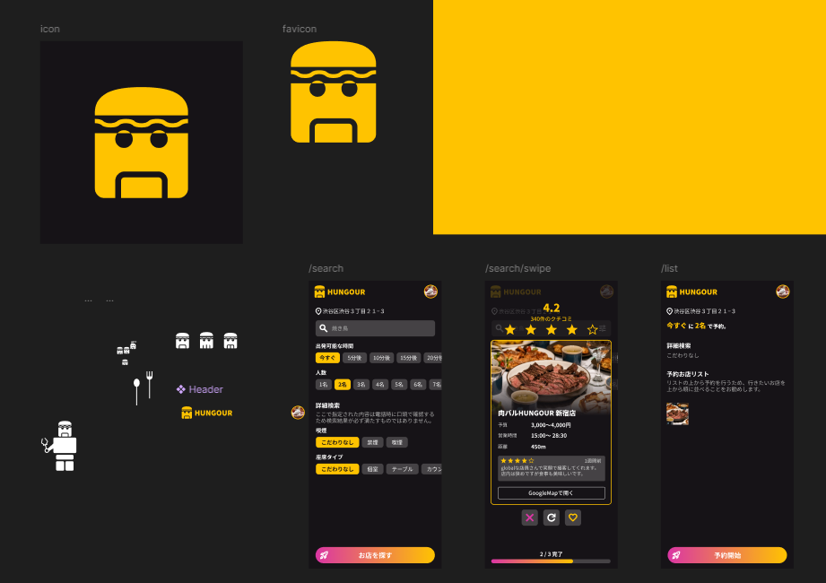
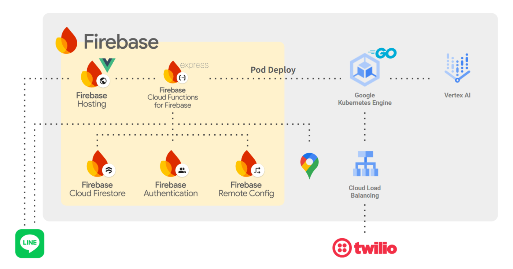

!

この記事はZenn（クラスメソッド）さんが主宰する **[AI Agent Hackathon with Google Cloud](https://zenn.dev/hackathons/2024-google-cloud-japan-ai-hackathon)** の作品提出も兼ねた記事になります。ハッカソンについては[公式ページ](https://zenn.dev/hackathons/2024-google-cloud-japan-ai-hackathon)よりご覧ください。

##  飲食店自動予約サービスを作りました！

飲食店予約サービスと言えば、食べログ、一休、ホットペッパーなど...色々な既存サービスが浮かぶと思います。今回開発したプロダクトは **「今すぐは入れるお店を提案して自動で電話予約してくれるサービス HUNGOUR（ハングル）」** です。

▼デザインファイル（途中から面倒になって直接開発）  

##  課題とか背景とか

遡ること新卒時代、山手線浜松町駅付近の職場で働いていました。  
飲み会で毎回困るのが二次会のお店探しでした。  
オフィス街で飲む金曜の夜はどこのお店も混雑、数軒回ったり電話して...  
お店を見つけるのは一苦労でした。

あぁ、今からお店を勝手に探してくれるサービスが欲しい...

そんな、お店を探すのが面倒な人、大変なときに解決できるサービスを開発しました！

##  どう解決する？

今回開発したサービスHUNGOUR（ハングル）は **AIコンシェルジュがお店に電話をかけて予約できるお店を探してくれる** サービスです！  
ユーザが選択したお店リスト1件1件にAIが電話をして、空いていたら予約をしてユーザに通知します。  
ユーザは気になるお店をピックアップしたら待つだけで今から行けるお店が見つかります。

##  実際の利用動画

電話部分は時間の関係で撮影できませんでしたが、ページ下部にあるリンクから実際に試していただくことができるので、お試しください。

<https://youtube.com/shorts/cDbdIyxRCA4>

##  サービスの特徴

###  予約開始まで簡単3ステップ

通常のサービスは...

  1. 近くのお店を検索
  2. 良さそうな店を見つける
  3. 電話する
  4. もしダメだったら1に戻る  
といった流れで、せっかく良さそうなお店を見つけても空いていないことも多いです。

しかし、今回のサービスは...

  1. 人数と現在地を出発する時間を選択
  2. 提案されるお店から3つ選択
  3. あとはAIが予約するのを待つだけ  
と簡単です。  
飲み屋などの騒がしい空間から一度出て、寒空の下で電話をかける必要はありません。

##  技術的特徴

###  GKEの利用による高速化

当初はCloudRunでの運用を考えていましたが、処理速度の観点で問題がありました。  
GeminiAPIでは履歴を保持しないため、こちらから都度「今までこんな会話をしていましたよ！」と履歴を渡す必要があります。  
その度にFirestoreに会話履歴を問い合わせて渡していては時間のロスがあります。  
そのため、GKE上に1つの予約タスク毎に専用のPodを用意して、ローカルで履歴を持たせました。

Podの立ち上げはREST APIがKubernetesAPI経由で行っています。  
予約処理が完了したPodは自身を削除するため、無駄な時間の立ち上がりがありません。  
この構成のデメリットとして挙がるのがPodの立ち上がりにかかる時間ですが、予約の電話は非同期のため、数秒～数十秒Podの立ち上げにかかったとしてもユーザにストレスを与えません。

###  シナリオに沿ったLLM運用

技術と言っていいのかわからないプロンプトエンジニアリングの話。  
LLMは日常的にサポートツールとして使っているものの、API利用するのは今回が初めてでした。

**プロンプト：Version1**
    
    
    あなたは日本語で話すAIアシスタントです。
    これから、飲食店への電話予約を行います。
    次のルールに従って、できるだけ自然にスムーズに予約を行ってください。
    【基本ルール】
    1. **自然な日本語**で話す。（できるだけ人間らしい口調を意識する）
    2. **予約に必要な情報**を伝え、足りない情報は質問する。
    3. **相手が理解しやすい話し方**を心がける。（短めの文）
    4. **情報の確認**を忘れずに。（日付、時間、人数、名前、電話番号など）
    5. もし予約ができなかった場合は場合は「承知しました。お忙しいところご対応いただき、ありがとうございました。」。
    6. **最終的に予約が取れたかを確認し、礼儀正しく会話を終える**。
    7. **店員の指示に従いながら柔軟に対応する**。
    8. 予約の連絡を終えたタイミングで挨拶の代わりに finished と答える。
    【予約のための基本情報】
    - 店名: %s
    - 希望時間: %d分後
    - 希望時間: %s
    - 人数: %d名
    - 名前: %s
    - 電話番号: %s
    

上記の悪い点は以下の点でした。

これらを自分なりに解消したのが以下になります。

**プロンプト：Version2**
    
    
    あなたは日本語で話すAIアシスタントです。
    これから、飲食店への電話予約を行っていただきます。
    次のルールに従って、できるだけ自然にスムーズに予約を行ってください。
    【基本ルール】
    1. **自然な日本語**で話す。（できるだけ人間らしい口調を意識する）
    2. **予約に必要な情報**を伝え、足りない情報は質問する。
    3. **相手が理解しやすい話し方**を心がけて短めの文で対話する。
    4. **店員の指示に従いながら柔軟に対応する**。
    5. 予約の連絡を終えたタイミングで挨拶の代わりに finished と答えると電話が切れるようになっています。
    【予約の流れ】
    1. 電話先がお店か不明のためお店か確認する。
    2. 電話先が合っていた場合、本日の%sに%d名で伺いたいが席が空いているか確認する。
    3. 空いていた場合、予約名は%sで電話番号が必要な場合は%sを伝える。
    4. もしお店が違ったり、予約できなかった場合、予約できた場合は全ての会話が終わったと思ったら finished と答えてください。
    但し、finishedと答えた瞬間に通話が終了するから他の会話と一緒に答えないでください。
    【予約のための基本情報】
    - 店名: %s
    - 希望時間: %s
    - 人数: %d名
    - 名前: %s
    - 電話番号: %s
    
    それでは、実際に電話回線にあなたの会話を繋げます。
    次以降の会話の相手はすべて実際のお店の店員さんが電話越しに話した言葉を文字に起こしたものです。
    

完璧とは言えませんが、まずまず良いところまで調整できたかな？と思います。  
本当は都度シナリオ通りに進んでいるのかのチェックを挟む等したかったのですが、処理時間にも影響しそうなので単純処理などで多少カバーしつつどうにかまともそうな会話を実現しました。

他にも書きたいことがある気もするのですが、ギリギリで開発していたのであとは発表の際に話せればと思います。

##  技術構成

  * Webクライアント 
    * Vue3
  * REST API 
    * Node.js(Express)
  * ストリーミングサーバ 
    * 言語：Go 
      * 処理速度面と利用経験のバランスからGoを選定
  * Cloud 
    * Firebase 
      * Hosting 
        * Webクライアントのホスティング
      * Cloud Functions 
        * REST API
      * Firestore 
        * DB
      * Authentication 
        * 電話番号のSMS認証
      * Remote Config 
        * Cloud Functions内で利用する各種定数等の管理
    * GCP 
      * Kubernetes Engine 
        * Twilioと連携した予約管理サービス
      * Cloud Load Balancing 
        * GKE内の各Podへのリクエスト振り分け
      * Places API 
        * 近くの店舗検索
      * Geocoding API 
        * 現在地の住所取得
      * Vertex AI API 
        * Twilioを介しての通話
  * その他 
    * LINE 
      * LINE認証
      * MessagingAPIによるユーザ通知
    * Twilio 
      * 店舗との通話（文字起こし/読み上げ）

##  各種リンク

###  サービス公式LINEアカウント

!

~~2025/02/11 0:00 現在、Twilioのアカウントが無料枠のため電話が登録者にしかできません。  
そのため、電話までのUIをお楽しみください。~~  
2025/02/11 14:00 Twilioアカウントアップグレードしたので利用できます！  
ハッカソン用のデモのため、予約の電話はお店ではなく利用者自身の電話番号にかかります。  
尚、電話やSMS認証に対して都度私に請求が発生するので、適度な回数のデモをお楽しみください...

  * [公式アカウントはこちら](https://line.me/R/ti/p/@143mcxgo)

###  リポジトリ

  * [frontend](https://github.com/ree-rishun/hungour-frontend)
  * [backend](https://github.com/ree-rishun/hungour-backend)
  * [streaming-server](https://github.com/ree-rishun/hungour-streaming-server)

