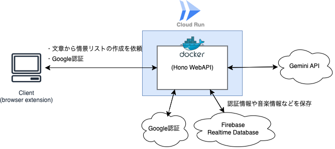

※ この記事は「AI Agent Hackathon with Google Cloud」のエントリー用に作成された記事です。

##  はじめに

「映画のように、小説を楽しむ」

新体験──BGMooとは？

小説を読むことは、多くの人にとって没入感のある体験です。しかし、小説には音や映像がないため、読者自身が想像力を働かせて世界を構築する必要があります。では、もし小説のシーンにぴったりのBGMが流れたらどうなるでしょうか？

そんな新しい読書体験を提供するのが「BGMoo」です。BGMooは、読んでいる文章やWeb小説の情景、キャラクターの心情に合わせて適切なBGMを自動で流すアプリです。本記事では、この革新的なプロジェクトについて詳しくご紹介します。

##  BGMooが解決する課題とその特徴

###  課題：小説の没入感をさらに高めるには？

小説は映画とは異なり、映像や音楽がないため、読者の想像力によって世界観が形成されます。しかし、

  * 視覚情報が少ないため、想像力で補完する必要がある
  * 読者の経験や知識によって想像する内容が異なる
  * BGMがあれば、より没入感を高められるのではないか？

といった課題があります。特に、音楽があることで、登場人物の感情やシーンの雰囲気がより明確になり、読書体験を向上させることができるのではないでしょうか。

###  ソリューション：BGMoo

BGMooは、「BGM」+「moovie」+「book」の要素を組み合わせた新しい読書体験を提供するアプリです。

  * 読んでいる文章やWeb小説に合わせて、適切なBGMを自動で再生
  * 小説の世界観や登場人物の心情に沿ったBGM選曲
  * 読者の想像力を刺激し、より深い没入感を実現

これにより、まるで映画のように小説の世界に入り込むことができます。

###  BGMooのターゲットユーザー

BGMooは以下のような方々に向けたアプリです。

  * 全く新しい読書体験を感じたい人
  * 読書体験をもっと豊かにしたい人
  * 小説好きな人
  * Web小説をよく読む人

特に、Web小説をスマホやタブレットで読む人にとって、BGMと共に楽しめる読書はこれまでにない魅力的な体験となるでしょう。

##  システムアーキテクチャ

BGMooのシステムは、以下のような構成になっています。

##  デモ

<https://youtu.be/Hk9pWVIu2hQ>

##  今後の展望

BGMooはまだ発展途上のプロジェクトですが、今後以下のような機能追加を検討しています。

  * **読者同士でBGMを共有できる機能を追加**
    * おすすめのBGMを共有し、コミュニティを形成
  * **収集した音楽と文章のデータを活用**
    * ユーザから収集したBGMと文章をもとにさらなる体験の向上を目指す
  * **オンライン上で設定を保存**
    * ユーザの設定をfirebaseなどで管理することで別の端末でも設定を使用できるようにする
  * **音楽自体も設定できるようにする**
    * 現在はあらかじめユーザが設定した音楽の中からGeminiで最適なものを選択していますが、ゆくゆくは自動で音楽を検索して設定するようにしたい

これにより、より多くの読者に愛されるアプリへと成長していきます。

##  まとめ

BGMooは、「映画のように、小説を楽しむ」ための革新的なアプリです。テキスト解析とBGM選定の技術を活用し、より没入感のある読書体験を提供します。

小説を読むことが好きな方、新しい読書体験を求めている方は、ぜひBGMooを試してみてください！

* * *

##  おまけ

BGMooの開発にあたって、苦労した点・工夫した点などを**かなりざっくりと** 書きます。  
技術的な内容が多いです。

###  苦労した点1: 技術選定

BGMooは [wxt](https://wxt.dev/) というブラウザ拡張を作成するためのフレームワークを用いて作成しています。  
その他の使用技術は以下に挙げます。

  * React + Typescript
  * Docker
  * hono + npm
  * Google Cloud Run
  * firebase

当初はブラウザ拡張かWebアプリケーションのどちらかで実装しようかと思っていましたが、慣れていたことや利用する際の利便性（インストール不要な点）などを考慮してNext.jsでWebアプリケーションとして作成しようと考えました。

実装方法としては、

  1. ユーザにURLを入力してもらう
  2. 入力されたURLをiframeに表示する
  3. 表示されたifameのページの要素に対してハイライト（※デモ動画参照）を行い、その要所の内容を取得する
  4. 取得された文章を解析して音楽リストを作成する

のように考えていました。  
ですが、**CSP（コンテンツセキュリティポリシー)の制約により、iframe内の要素の取得ができなかった** ため別の方法としてブラウザ拡張で作成することになりました。

* * *

###  苦労した点2: Bunがhttp2へ対応をしていなかった(2025/2/5時点)

当初のWebAPIの開発に使用していた技術はhono + bunでした。  
作成にあたって、ゆくゆくはfirebaseでデータの管理を行おうと考えていたため、Google認証を用いたログイン機能を実装しようと考えていたため実装をしていましたが、そこで問題が発生しました。

どうやら2025/2/5時点でbunではhttp2のサポートがされておらず、http2を使用したgoogle認証ができないようでした。

そのため、パッケージマネージャをnpmに変更して実装をし直しました。  
npmを選択したのは一番歴史が古く信頼性があり、今回のようなことがまた別の問題で発生して切り替えなければいけない可能性が低いと考えたためです。

###  苦労した点3: ブラウザ拡張の作成

そもそもブラウザ拡張を作成するのが初めてだったため、作成には苦労をしました。

例えばbackend.tsなどのバックグラウンドに書いた処理のデバッグ時にconsole.log()を実行してもブラウザのコンソール上には表示されません。  
これはバックグラウンドスクリプトがWebページとは異なるコンテキストで実行されるためです。

他には、今いるページのURLを取得する処理を書く際に、Webアプリケーションならwindow.location.hrefを使用して取得することが多く、
    
    
      useEffect(() => {
        console.log("now url: ", window.location.href);
      }, [window.location.href]);
    

上記のように書くことで、ロケーションに変更があった際のURLを取得できており、大抵は期待した通りの動作をしていたのですが、ブラウザ拡張だと最初の１回目のアクセスだけ発火します。

そこでbackground側に以下のように書いて、sendMessageでcontent側へ送信。受け取ったメッセージを処理するといった流れで現在のtabのURLを監視して取得することができました。
    
    
    chrome.tabs.onUpdated.addListener((tabId, changeInfo, tab) => {
        if (changeInfo.status === 'complete') {
          chrome.tabs.sendMessage(tabId, { url: tab.url }, (response) => {
            if (chrome.runtime.lastError) {
              console.error(chrome.runtime.lastError);
            } else {
              console.log('コンテンツスクリプトからの応答:', response);
            }
          });
        }
      });
    

###  工夫した点1: デザイン

個人的な事情なのですが、デザインは苦手分野です。。  
これまでも色々考えてごちゃごちゃになってしまうことが多かったので、とりあえず１つだけを意識して実装しました。それが「コンセプトに合ったデザインにする」ということです。

  * コンセプトに合ったデザインにする

今回のコンセプトは「映画のように、小説を楽しむ」です。拡張機能のサイドバーを背表紙に、パネルをページのように見えるようにしました。  
色はColor Huntで選択しました。

これだけでもいい感じになってくれてるとうれしいな。。

###  開発を終えて

「ブラウザ拡張を作成する」という自分の中では新しい試みでしたが、なんとか形になるように完成させることができてよかったです。  
また、今回の拡張機能はフレームワークとしてReactを選択しましたが、Webアプリやブラウザ拡張、Tauri2でのモバイルアプリ開発などやReactを使用してできることはまだまだたくさんあるため、今後もいろいろなものを開発していきたいです。
