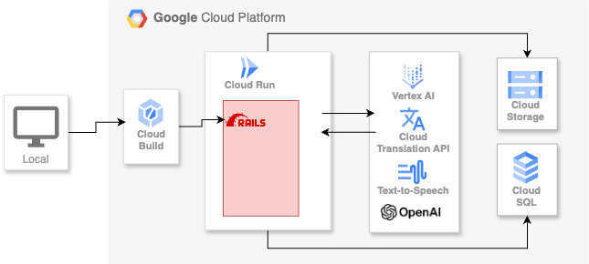

こちらの記事は[AI Agent Hackathon with Google Cloud](https://zenn.dev/hackathons/2024-google-cloud-japan-ai-hackathon) の応募記事です。

テーマが「生成AI」ということで、今回は自分が音声で聞きたい記事をポッドキャスト化するアプリを、GCPのAIを使用したAPIをふんだんに使って作ってみました。

##  プロジェクトの概要と背景

###  開発背景

社会人になると日々の忙しい生活の中で、情報収集にかける時間を確保することが難しくなっています。朝の通勤中やランチタイムなどの隙間時間に情報を得るために工夫している人々が多く、音声コンテンツの需要が増しています。加えて、パソコンやスマートフォンを使って長文の記事を読むことにストレスを感じる方も少なくありません。

そこで、私たちは「記事をポッドキャスト化するアプリ」を開発しました。このアプリの目的は、ビジネスパーソンをはじめとした忙しいユーザーが、音声で記事を手軽に聴くことができるようにすることです。記事を読むための時間を確保できない方々に、音声で記事を聴くことで情報を効率よく収集できるようにします。また、音声だけでなく、視覚的にもわかりやすいチャット形式で記事の内容を確認できるようにしています。

###  ユーザー像と課題・ソリューション

私たちのアプリのターゲットユーザーは、主にビジネスパーソンです。特に、忙しくて長時間の記事を読むことができない、あるいは読みたくても集中できないという課題を持った人々です。これらのユーザーにとって、音声で記事を聴けることは大きな利便性を提供します。例えば、通勤中にスマートフォンで音声を再生しながら、移動時間を有効活用できるようになります。

記事を読んでみたいと思っても、長文の記事に取り組む気力が湧かない、文字を読むのが面倒だという方々も多いです。そんなユーザーに対して、私たちのアプリは記事の音声化を行い、音声を聞きながら情報を得られる体験を提供します。このように、時間のない方や文章を読むのが億劫な方々にとって、ポッドキャスト形式で提供される記事は、非常に魅力的なソリューションとなります。また、英語の記事に対して日本語に変換した上で音声化することも可能です。これにより、英語の記事を日本語で理解し、音声として聴くことができるため、言語の壁を感じることなく、情報を取得することができます。

##  アプリの動作について

<https://www.youtube.com/watch?v=YhIn44_QOMo>

###  ログインして、自分のポッドキャストを管理

アプリにログインすることで、ユーザーは自分が作成したポッドキャストを一覧で確認できます。Googleログインを使用することで、面倒な登録作業を省略し、スムーズにアプリの利用を開始できます。  
ログイン後、ポッドキャストの作成画面にアクセスできるようになります。ポッドキャストを作成したら、自分専用のポッドキャストライブラリを構築できます。

###  記事を入力してポッドキャスト化

ポッドキャスト作成画面では、2つの入力方法を選ぶことができます。一つは、URLを入力して、そのリンク先の記事を音声化する方法。もう一つは、記事の内容をテキストとして入力して、それを音声に変換する方法です。  
URLを入力すると、指定した記事が自動的にポッドキャスト化され、音声ファイルが生成されます。また、テキストを直接入力することで、ユーザー自身が作成した内容を音声にすることも可能です。記事がポッドキャストとして作成されると、サムネイル画像が自動で生成されます。

###  ポッドキャストの再生とチャットUI

作成されたポッドキャストを再生すると、音声に合わせて、関連するテキストがチャット形式で画面に表示されます。このチャットUIは、ユーザーが音声とテキストを同時に確認できるように設計されています。音声を聞きながら、テキストが流れていくので、聞き逃した内容もすぐに確認することができます。  
会話形式で構成された記事では、インタビュー風に質問と回答が織り交ぜられるため、リスナーはより自然に内容を理解することができます。  
再生位置でチャットUIが表示・非表示されるので、以前聞いていた会話の内容に移動したい場合に、移動しやすいようなUIになっています。

##  アーキテクチャの説明

私たちのアプリは、GCP（Google Cloud Platform）の各種サービスを活用して構築されています。以下に、システムのアーキテクチャについて説明します。

###  GCPのCloud BuildとCloud Run

アプリのビルドは、Cloud Buildを使用して行っています。Cloud Buildは、Google Cloud上でコードをビルドし、必要なコンテナを生成するサービスです。これにより、効率的なCI/CD（継続的インテグレーション・継続的デリバリー）が可能となり、スムーズにアプリの更新を行うことができます。  
また、アプリのデプロイには、Cloud Runを使用しています。Cloud Runは、コンテナ化されたアプリケーションをスケーラブルにデプロイできるサービスです。これにより、アプリがトラフィックに応じて自動でスケールし、快適なユーザー体験を提供します。

アプリケーション自体はRuby on Railsで動作しております。

###  Cloud SQL

データベースには、Google CloudのCloud SQLを使用しています。Cloud SQLは、リレーショナルデータベースサービスであり、ユーザー情報やポッドキャストのデータを安全かつ効率的に管理するために利用しています。

###  Gemini API

記事の生成には、Gemini APIを使用しています。Gemini APIを使うことで、記事の内容をインタビュー形式に変換し、さらにその内容をポッドキャスト風にすることができます。これにより、ユーザーが聴きやすい、インタラクティブな形式で記事を提供することができます。

###  Cloud Text-to-Speech

音声ファイルの生成には、Cloud Text-to-Speechを使用しています。このサービスを利用することで、テキストから高品質な音声を生成することができます。日本語に対応した音声を生成するため、音声を自然に聴かせることが可能です。

###  Translation AI

外国語の記事に対応するために、Translation AIを利用して英語の記事を日本語に翻訳し、それをポッドキャストとして音声化する機能を提供しています。この翻訳機能を使うことで、ユーザーは言語の壁を越えて、さまざまな言語の記事を聴くことができます。

###  OpenAi Image generation

ポッドキャストにサムネイルを追加するために使用しています。会話のテキストから画像を作成することで最適なサムネイルを生成しています。

##  工夫した点

ポッドキャスト化する際に、音声ファイルを会話のターン毎に作成し、それらを結合することで、途切れのないスムーズな音声体験を提供しています。音声ファイルの最初と終わりにBGMを流すことで、よりポッドキャスト感が出る音声体験になるようにもしました。  
音声だけではなく、チャット形式でテキストを表示することで、リスナーが記事の内容を視覚的にも理解しやすくしています。  
さらに、英語の記事も日本語のポッドキャストとして再生できるようにしたことで、グローバルなコンテンツにも対応できるようになりました。  
ポッドキャストのタイトルのみだと、一覧化した時にそれぞれの差が分かりづらく、一度聞いたポッドキャストを探す時に探しづらいと考え、タイトルや内容から適切なサムネイルを生成するようにしました。

今回のプロジェクトを通じて、忙しいビジネスパーソンが効率よく情報を得られるようなサービスを提供できたのではないかと考えています。

##  まとめ

今回初めてGemini API・Cloud Text-to-Speech・Translation AIを組み合わせて使ってみましたが、開発を始める前の想定よりそれぞれの機能のクオリティが高く、想像していたよりポッドキャストらしいポッドキャストができたと思っています。  
今後も自分たちで使い続けることで、プロンプトなど改善できる点を改善していき、より実用的なポッドキャスト生成アプリにしていければと考えてます。

##  今後の展開

今後は、音声のナチュラルさをさらに向上させるために、GCPのText-to-Speechのカジュアルな音声タイプを活用したいと思ってます。なめらかさに欠ける表現（おー、うー、うーん、むー、、、）をサポートするとのことなので、ポッドキャストに導入できれば、より人間らしいポッドキャストをお届けできると夢を膨らませています。  
また、複数の話者による会話を生成するAPIの音声タイプを使うことができれば、さらにスムーズな会話形式でのポッドキャストが実現できると考えています。（残念ながら2025年2月現在では日本語の音声タイプは提供されておりません。）

[複数の話者による会話を生成する | Cloud Text-to-Speech API | Google Cloud](https://cloud.google.com/text-to-speech/docs/create-dialogue-with-multispeakers?hl=ja)  
[音声の種類 | Cloud Text-to-Speech API | Google Cloud](https://cloud.google.com/text-to-speech/docs/voice-types?hl=ja#casual_voices_preview)

どちらも試験運用版やプレビュー版なので、今後のリリースを期待しております！
