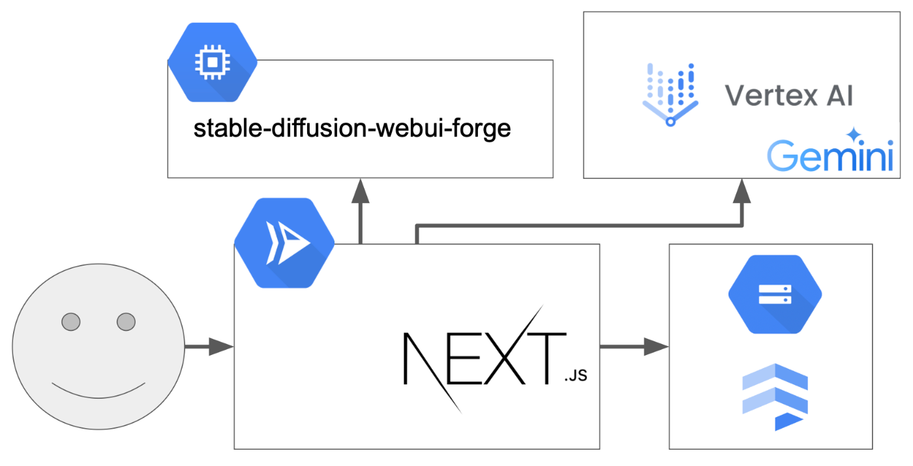

##  TLDR

物語の壁打ち、コマ割り、作画まで、マンガ創作の全プロセスで一貫してエージェントがお手伝いをしてくれるエディタをOSSで公開しました（まだ初期プロトタイプの段階で、コードも汚いです）。

デモ動画  
<https://youtu.be/mT9ot6VAoWk>

10分で作った漫画  

リポジトリ  
<https://github.com/fjm2u/yorozu>

漫画創作では、多くの要素（例：物語構成、コマ割り、作画）を考慮する必要があり、創作は容易ではありません。素人が「漫画でこのテーマを表現したい」という欲求を満たすまでには膨大な練習が必要で、ほとんどの場合は挫折します。また、プロにとっても漫画創作は決して「手頃」でなく、ひどく精神力・体力を使うものです。

そこで漫画創作プロセス全体（物語構成、コマ割り、作画）でユーザがLLMエージェントと対話しながら創作活動を進めることができる漫画エディタを開発しています。本エディタは、素人にとっては表現欲求の充足を、プロにとっては創作のサポートを提供します。

なお、キャラの統一性といった高度な画像生成機能に関しては、現在実装中で、もうすぐ実装できます（たぶん）。

##  漫画創作における課題

漫画創作は、複数の専門性が求められる総合格闘技的です。具体的には以下のような要素が必要とされます。

###  ストーリーテリング

物語の構造化、キャラクター設定、展開の組み立て、伏線の配置など、小説と同等以上の物語構築能力が求められます。単なるプロットの羅列ではなく、視覚的な表現と組み合わせることで、より効果的な演出を考える必要があります。

###  コマ割りとページ構成

漫画特有の表現技法として、コマ割りの設計があります。これは単なる区切りではなく、時間の流れや緩急、感情の起伏を表現する重要な要素です。適切なコマ配置によって、読者の視線を誘導し、効果的な演出を実現することが可能になります。

###  作画技術

キャラクターや背景の描写力は、漫画の質を大きく左右します。解剖学的な正確さ、パース（遠近法）の理解、効果的なトーンワークなど、技術的な要素が多岐にわたります。

###  漫画創作はサブカルの総合格闘技

上記の要素は、それぞれが独立して存在するのではなく、相互に影響し合います。例えば、ドラマチックな展開を表現するためには、適切なコマ割りと作画技術の両方が必要です。このような複雑な要素の組み合わせは、初心者にとって大きな障壁となっています。

またプロの漫画家であっても、これらの要素を全て高いレベルで維持し続けることは容易ではありません。締切に追われる中で、常に質の高い作品を生み出すことへのプレッシャーは計り知れません。

##  エージェントネイティブなマンガ創作エディタ

これらの課題に対する解決策として、私は対話型のAIアシスタントを搭載した漫画創作エディタを開発しています。

開発で最も意識している点は、「ユーザとの**共同作業ができるエージェント** であること」です。これは、LLMは「ユーザの創作をサポートする」役割であると考えるためです。

最初から最後まで閉じているエージェントのシステムは柔軟性に欠けるどころか、ユーザの表現欲求を満たせません。

漫画創作エディタという性質上、（LLMの出力結果や画像生成の品質よりも、）ユーザの表現欲求をいかに満足するかを第一に考えています。

###  インタラクティブなストーリー構築

LLMエージェントとの対話を通じて、ストーリーの構築をサポートします。プロットの整合性チェックや、キャラクター設定の深堀り、展開のアイデア出しなど、作者の創造性を引き出すための対話が可能です。Geminiは長いコンテキストが入力可能ですが、その特徴を利用して漫画全体を通して一貫性のあるストーリー展開と回答を実現します。

###  コマ割りアシスタント

物語の展開に合わせた効果的なコマ割りを提案します。感情の起伏や時間の流れを視覚的に表現するための最適なレイアウトを、AIが提示します。作者はこれらの提案を参考に、より効果的な演出を検討することができます。エージェントとチャットを行うことで、修正が可能です。

###  AI支援による作画プロセス

Stable Diffusionを活用した画像生成機能により、ラフ案やイメージの具現化をサポートします。完全な自動化ではなく、作者の意図を反映しながら、作画の補助として機能します。

##  実際に想定するユースケース

###  創作の手軽さによって、表現の選択肢に「マンガ」を

「今日こんなことあった」といった、日常のちょっとしたエピソードも、従来の漫画制作ツールでは敷居が高かったため、気軽に漫画として形にするのは難しいものでした。

しかし、本エディタでは直感的な操作とAIによるサポート機能により、誰でも簡単にアイデアを漫画というフォーマットに落とし込むことができます。ふと思い出したエピソードを入力するだけで、AIエージェントがストーリーの流れやキャラクターの表情、コマ割りの提案まで行い、あっという間に「今日の出来事」が魅力的な漫画に変わります。

本ソフトウェアによって、従来の「文章」や「写真」といった形式だけでは伝えきれなかった感情やニュアンスを、視覚的なストーリーテリングとして共有できるようになります。ユーザは自身の体験や感情を、より生き生きとした形で表現できるため、日常の些細な瞬間が特別なストーリーに昇華されるのです。

###  秒で生成できるから、アイディア出しに使える

漫画の構想段階では、プロットやキャラクター設定、コマ割りといった多岐にわたる要素を一度に考える必要があります。

そこで、本エディタの強みは、わずか数秒で各パートのアイディアを生成できる点にあります。ユーザが「こんなシーンがあったら面白いんじゃないか」と思いついた瞬間、エージェントに簡単なキーワードや状況を伝えるだけで、プロットの大枠やキャラクターの性格、さらには視覚的なレイアウトの候補を即座に提示してくれます。

たとえば、作家が新しい漫画のテーマとして「未来都市の孤独なヒーロー」を思いついた場合、エージェントはそのアイディアに基づいて、複数のシーン構成やキャラクターの背景設定、さらにはエモーショナルなコマ割りのパターンを自動生成します。

これにより、通常のブレインストーミングでは時間がかかる初期のアイディア出しのプロセスが大幅に効率化され、クリエイターはより多くのアイディアを短時間で試すことができ、最適な構成を見極めやすくなります。

さらに、生成されたアイディアを元に、ユーザ自身が詳細を加筆・修正していくことで、より独創的で完成度の高い作品に仕上げることが可能となります。

##  工夫した点

本システムは、従来の漫画制作ツールの枠を超えた独自の工夫が随所に施されています。

まず、LLMエージェントとの対話を軸に、物語構成、キャラクター設定、コマ割りといった各制作プロセスをシームレスに連携させ、ユーザの意図やアイディアを即時に反映できる柔軟なシステム設計を実現しました。

さらに、Geminiの長大なコンテキスト処理能力を活かすことで、複数シーンにわたる一貫性のあるストーリー展開をサポートし、ユーザが思い描く物語を途切れることなく具現化できる点は、従来のツールにはなかった革新的な試みです。

加えて、Stable Diffusionを活用した画像生成機能は、ユーザのあいまいなイメージを高精度なラフ画へと変換し、具体的なビジュアル表現を提供します。これにより、プロだけでなく初心者にも扱いやすい直感的な編集環境を実現します。

さらに、インフラ面でGoogle Cloudを全面的に活用することにより、サービスとしてのスケーラビリティを実現しています。

##  今後の展望

本システムはまだ初期の段階で、多くの改善すべき箇所があります。  
今後フォーカスする部分としては、以下です。

  * より高度な画像生成 
    * 統一されたキャラクターは、まだ実装できていないです
  * UI/UXの向上 
    * コマの選択などがイマイチです
  * コラボレーション機能
  * バージョン管理の実装
  * コードの品質改善・パフォーマンス向上

本エディタはオープンソースです！PRを受け付けています。  
<https://github.com/fjm2u/yorozu>

プロ・アマ問わず幅広い層に支持される、漫画創作の新たなスタンダードを目指して継続的なアップデートを計画してます。

まず、画像生成の精度向上に向け、Stable Diffusionの最新技術を取り入れ、より繊細で多様なビジュアル表現を実現するとともに、ユーザが細かいパラメータを（意識せずに）調整できる機能の実装を検討中です。

また、バージョン管理システムの導入により、作品の編集履歴を詳細に追跡可能とし、変更履歴の管理や以前の状態への容易なロールバックを実現することで、安心して編集作業に集中できる仕組みを整備します。

さらには、コードの品質改善やパフォーマンス向上にも注力し、開発者コミュニティからのフィードバックを積極的に取り入れることで、システム全体の安定性と拡張性を高め、ユーザが長期にわたって安心して利用できるサービスへと成長させていきます。

##  おわりに

漫画創作は、これからも人間の創造性が中心となる芸術表現です。本システムは、その創造性をより効果的に引き出し、表現するための「道具」として機能することを目指しています。

技術の進歩によって、創作の形は常に変化していきます。しかし最も重要なのは、作者の想いや伝えたいメッセージです。私のシステムが、その想いをより効果的に表現するための支援ツールとして、漫画文化の持続的な発展に貢献できれば幸いです。

漫画創作の新しい可能性を、探求していきます。応援よろしくお願いします。

##  Appendix：システムアーキテクチャ

本システムは、すべてGoogle Cloud上でホスティングされており、外部のAPIは一切使っていません。

###  エディタ

  * Next.jsを採用し、モダンで高速なユーザーインターフェースを実現
  * Gemini駆動でのLLMエージェント
  * Cloud Run上でホスティングすることで、スケーラブルな運用を可能に
  * リアルタイムな編集環境の提供

###  画像生成バックエンド

  * Stable Diffusion WebUI ForgeをCompute Engine上でAPI化
  * Compute EngineのGPUを利用
  * リバースプロキシとしてNginxを利用
  * 画像生成リクエストの効率的な処理と管理
  * スケーラブルな処理能力の確保

###  データストレージ

  * FirestoreによるNoSQLデータベースの活用
  * Cloud Storageを用いた大容量データの効率的な管理
  * リアルタイムなデータ同期と永続化

