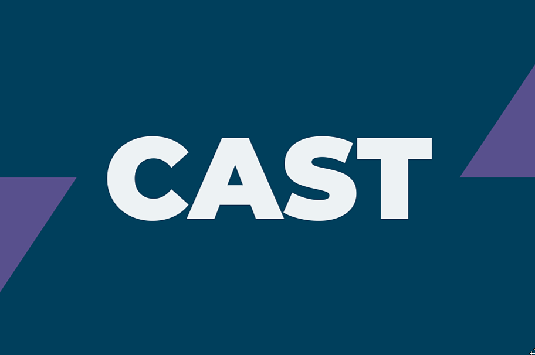
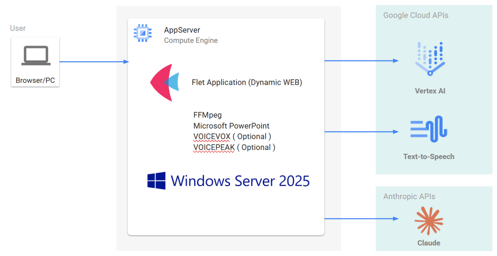

##  1\. 『CAST』プロジェクトの目標・要件

###  ▻ 目標

**PDF資料から研修用教材動画を、手軽に制作できるツール** の開発を目指しました。

> CAST PDF to Video!

<https://youtu.be/By43KWI5GSE>

###  ▻ 定性的要件

本プロジェクトでは「業務レベルの研修用動画」として、以下のような動画を想定しています。

  * **研修のゴールとされる知識が、内容として含まれること**  
動画だけで研修が完結するわけではなく、ディスカッションや実習なども含まれることがありますが、メインは動画およびテキスト、というケースを想定しています。
  * **修正が容易で、最低数年程度の改訂に耐えられる制作フローであること**  
研修内容が数年程度で陳腐化しないように、内容を適宜改訂することが必要になると想定しています。
  * **視聴中の研修生にあたえる睡眠促進効果が高すぎないこと**  
分かりにくい・聞き取りにくい説明、起伏のない話ほど眠くなるものはありません。研修すなわち業務の一貫とはいえ、他人の時間を費やしてもらうのなら、最低7割くらいは興味をもって聴いてもらえるようにすべきです。

###  ▻ 定量的要件

このような研修用動画を、既存の資料30ページに対して1人日以下で、制作できるようにします。

##  2\. 『CAST』の想定ユーザー像

###  ターゲットユーザー

**企業内研修の講師** や**アシスタント** を、ターゲットユーザーとします。  
企業内でこういった業務を行う従業員（＝ターゲットユーザー）は、多くの場合、他の通常業務との兼務で、研修の準備や教材制作をしています。

###  ユーザーの抱えるイシュー

我々は実務的な様々な理由から**動画による個別学習の仕組み** は有用であり、**動画教材の需要は高い** と考えています。  
しかし、動画編集のスキルはもちろん、ナレーションをするスキルもナレーターを雇う予算もありません。幸運が重なって動画教材を完成できたとしても、将来の改訂に対応していったり、制作した動画を誰かに引き継いだりするのは困難です。

##  3\. 課題と解決策

###  『CAST』で解決したい課題

> ###  テキスト教材から動画教材を制作するのにコストがかかりすぎる

「スライドを作って、カメラの前でしゃべるだけ」なら、最初にあげた定量要件にかなり近づくことができるかもしれません。

しかし、定性要件を満たすことはできないでしょう。資料をみながら内容を口頭で説明し、それを録画する、というのは実際のところ簡単ではありません。説明しながら、話が脱線したり、資料を修正したくなったりします。言い間違えたり、言い淀んだり、余計なことを言ってしまったりします。なんとか録画を終えたら、上記を編集で整える必要があります。

動画や音声の編集というのは、非常に時間がかかる作業です。  
使用する素材の再生時間の数倍はかかります。

スライドができている状態から、1時間の動画を作るのに、収録に1～2時間、編集に5時間、合計6～7時間くらいかかる、ということです。

* * *

この課題について、LLMで解決できるのではないか？ と私たちは考え、実際に試しましたが、さらに以下の課題があることがわかりました。

> ###  🤔 課題1: まとまった量のテキスト資料を一気に処理できない

モダンな商用LLM では、100kトークン以上のコンテキストウィンドウを持っています。そこで、一気に大量のテキストをプロンプトして、いい感じの出力を得ようと試してみたところ、取り扱うトークン量が多くなればなるほど、一貫して指示に従うのが難しくなったり、あらかじめ指示したフォーマットに従うのに失敗したりする確率があがり、期待する結果をほとんど得られませんでした。

制作フローに組み込み可能な精度が得られたのは、ほどほどの入力から、ほどほどの出力を得ようとした場合に限られました。

> ###  🤔 課題2: 修正の自由度が低い

一気にすべてを生成させようとすると、修正が利きません。  
また、段階的に生成させながら、都度都度、ユーザーからの修正指示を受け入れられるようにする方法は、開発コストがかかりすぎるため諦めました。  
最終的な動画の映像表現力の幅を広くしようとすると、エージェントが使用するツールも、その出力結果を人間が確認・修正指示するＵＩも、開発するのが非常に煩雑になるからです。

> ###  🤔 課題3: 単調な説明は睡眠導入剤

説明の文章をLLMが作っている場合、一本調子になりがちで、見ていると眠くなります。  
スライドに書かれていることをそのまま読み上げさせるのは、開発が楽ですが、睡眠促進効果が高くなってしまいます。

* * *

『CAST』では、これらの課題の解決を、以下の方法で試みています。

###  ✅ 解決策1: LLM自身に、いい感じに分割してもらってから処理させる

> **ボリュームのあるテキストを、どこで分割させるのか？**

埋め込み検索を伴うRAGシステムの開発などでよく取り上げられるこの問題ですが、これは、人類が人類のために発明したテクニック「**目次** 」で解決することができました。  
『CAST』では、目次をLLMに読ませて、長い資料を数十ページ単位に分割させています。
    
    
    [分割処理のプロンプト（抜粋）]
    
    Please read through the table of contents of this book.  
    Then, provide the name of each chapter along with the page number where the chapter begins.
    
    **Notes:**
    - If both Chapters and sub-Chapters are present, please provide the page number for the Chapter.  
    - Treat Appendix (付録) as a Chapter.  
    - Do not treat Index (索引) as a Chapter.
    

###  ✅ 解決策2: 修正はPowerPointで行えば楽

> **ユーザが手軽に修正できるようにするには？**

『CAST』では、動画生成の前に、スライド向けのデータを生成させ、これをPowerPointに機械的に流し込んでいます。こうすることでLLMによる生成 → ユーザによる微修正というスムーズな作業フローを実現しました。
    
    
    [スライド内容生成処理のプロンプト（抜粋）]
    
    あなたは、教育用のスライド資料を作成するプレゼンテーションデザイナーです。  
    以下の指示に厳密に従い、台本<original_script>と参考資料<document>の内容を忠実に反映したスライド構造を、  
    指定のXMLフォーマットで生成してください.
    
    1. 役割と基本方針  
    - プレゼンターとしての役割  
    - 台本と参考資料の内容を十分に理解し、  
    正確かつ詳細な情報に基づいてスライドのタイトル、ポイント、サブポイント、及びプレゼンテーションスクリプトを作成する。  
    - 台本<original_script>は原文の順序と内容をそのまま保持し、不要な変更を加えないこと.
    
    - デザイナーとしての役割  
    - 台本の自然な切れ目を基に、スライドを適切に分割し、全体の流れに一貫性を持たせる.  
    - 参考資料<document>を参考に、視覚的に理解しやすいスライド（タイトル、ポイント、サブポイント）を工夫する.
    
    2. 出力フォーマット
    
    出力は以下のXML形式で生成してください.  
    余計な文章、注釈、マークダウン記号は一切含めず、下記のタグ構造に正確に従うこと.  
    ...
    

###  ✅ 解決策3: 会話形式の解説音声をつけることで、視聴者の興味を維持する

> **眠気対策には何が有効？**

CASTでは、音声部分を、複数（教師役と生徒役）の登場人物による会話形式の解説として生成することにしました。こうすることによって、コンテンツに緩急が生まれ、単調さを薄れさせることができます。
    
    
    [解説部分の生成プロンプト（抜粋）]
    
    あなたは、教育番組の台本作成において専門知識と高い表現力を要求される作家です。  
    以下の詳細な指示に厳密に従い、<docucment>を基に<current_topic>の観点で台本を作成してください。
    
    1. 役割と行動基準:
    
    - 教師役 {CHARACTER_NAME_RIGHT}  
    - 専門家としての立場: ドキュメントの内容に精通しており、正確かつ詳細な知識をもとに解説する。  
    - 説明責任: 学習者が理解しやすいよう、専門用語や概念を分かりやすく説明する。  
    - 感情表現: 基本的に落ち着いた振る舞いをしますが、ときに情熱や喜び、厳しさを表現し、学習意欲を喚起する。  
    - 生徒役 {CHARACTER_NAME_LEFT}  
    - 積極的な学習者: 疑問を持ったり、理解を深めるために質問を投げかけるなど、積極的に学習に参加する。  
    - リアクション: {CHARACTER_NAME_RIGHT}の説明に対して、共感や驚き、興味深さを表現する。  
    - 理解度の確認: 自分の理解度を確認するために、要点をまとめたり、再確認する発言を行う。
    
    2. 出力フォーマット:
    
    出力は必ず以下の形式で、余計な文章や説明を含まずに生成してください.
    

####  さらに：感情による抑揚をつける

また、『CAST』はGoogle Text to Speech以外の複数の音声合成エンジンに対応しており、VoicePeakなどの感情表現を伴う音声合成エンジンも含まれます。脚本の中で、演出としての感情表現を簡単に指示できるようになっていることが特徴です。
    
    
    [脚本の例]
    
    HAL: ええ。例えば、技術文書の要約タスクを考えてみましょう。10ページの技術文書を一度に処理するのではなく、2～3ページずつに分けて処理し、その結果を統合する方が、はるかに高品質な結果が得られます。  
    KITT: なぜ、分けた方が良いんですか？  
    HAL: これは、モデルが各セクションの内容を深く理解し、重要なポイントを確実に捉えることができるためです。  
    KITT(FUN+LOUD): なるほど！  
    HAL: ビジネス現場での実装を考える際は、この「適度な範囲」を意識したシステム設計が不可欠です。大規模なドキュメント処理システムを構築する場合、文書を適切なサイズに分割し、段階的に処理していく仕組みを組み込むことで、高い精度と効率性を両立させることができます。  
    KITT(HAPPY): 一見遠回りに見えるかもしれませんが、最終的な品質と信頼性を考えると、それが一番確実な方法なんですね。  
    HAL(HAPPY+LOUD): その通りです！
    

> ※ 括弧内は人間が加筆した演出指示。HAPPY, FUNなどはVOICEPEAKなどの一部の音声合成エンジンを使った場合に、声色が変化し、LOUD, FASTなどはCASTが対応する全ての合成エンジンで利用可能。

> ※ 現バージョンではLLM生成の脚本に感情表現指示は含まれません。ユーザが発表者ノートに(感情マーク)を付ける必要があります。

##  4\. 動画生成フロー（概念）

『CAST』の動画生成フローを簡単に説明します。

**Step** | **入力** | **処理** | **出力**  
---|---|---|---  
**1\. PDFアップロード** | \- ユーザの手元の PDF ファイル | \- ファイルをコピーするだけ | \- CAST システム内の PDF ファイル（original）  
**2\. 分解** | \- PDF ファイル（original）  
\- 目次範囲などのメタ情報（手動入力） | \- メタ情報にしたがって original から目次部分を抽出  
\- 目次を LLM で読み込んで、各チャプタのページ範囲を取得  
\- 上記にしたがって original をチャプタごとの PDF に分割 | \- チャプタごとの PDF ファイル  
**3\. チャプタ選択** | \- チャプタ一覧から選んだチャプタ番号 | \- 特になし | \- 後続処理のためにチャプタの PDF をロード  
**4\. 文字起こし** | \- チャプタの PDF | \- LLM で PDF 内容を文字起こしする  
（速度より精度を優先して敢えて順次処理） | \- チャプタの抽出テキスト  
**5\. 要約** | \- チャプタの抽出テキスト | \- LLM で要約（本質的情報の整理）  
（速度より精度を優先して敢えて順次処理） | \- チャプタの要約結果  
**6\. スライド作成** | \- チャプタの要約結果 | \- LLM でスライド内容を生成（速度より精度を優先して敢えて順次処理）  
・スライドの内容  
・各ページの脚本  
\- 上記を pptx ファイル化  
（テンプレートとして与えた PPTX ファイルを使用。脚本は「発表者ノート」として保存） | \- チャプタの pptx ファイル  
（ユーザがダウンロード後、確認・修正し再アップロードする想定）  
**7\. 動画変換** | \- チャプタの pptx ファイル  
\- あるいは上記を人間が修正したもの | \- 登場人物画像や吹き出し画像、字幕文字列などをスライド画像に編集  
（PPTX 修正と動画変換結果を行き来するため、速度を優先し細かく並列処理）  
\- 台詞ごとに音声合成（PPTX の1ページ目の発表者ノートに記載された単語の読み方を反映、CAST の辞書機能）  
\- 画像と音声を合成して動画化 | \- チャプタの mp4 ファイル  
  
##  5\. システム構成

  * **Browser/PC**
    * PCブラウザを想定しています。
    * PowerPointがインストールされていれば、動画生成前に、生成されたpptxを修正することができます。
  * **App Server**
    * Google Cloud `Compute Engine`インスタンスにデプロイしています。
    * OSは`Windows Server 2025 Datacenter`を使用しています。（ツールの都合上、実行環境にPowerPointが必須なのでWindowsを採用）
    * `FFMpeg`で動画・音声ファイルを操作しています。
    * `Microsoft PowerPoint`でスライド画像抽出をしています。
    * オプショナルな音声生成エンジンとして、サーバーにインストールした`VOICEVOX`、`VOICEPEAK`を使用することも可能です。
  * **Google Cloud APIs**
    * **Vertex AI**
      * `Gemini 2.0 Flash`, `Gemini 2.0 Pro exp` を各所で使用しています。
    * **Text-to-Speech**
      * デフォルトの音声合成エンジンとして使用しています。
  * **Anthropic APIs**
    * **Claude**
      * 要約処理（Step.5）で使用しています。

##  6\. 結果（使用レポート）

本項では、『CAST』に入力PDFとして「[ThinkPython 2nd Edition, Version 2.4.0](https://greenteapress.com/thinkpython2/html/index.html)」を与え、実際に動画を生成した結果について記述します。

  * **Step.1 PDF選択**
    * アップロード成功。特筆事項なし。
  * **Step.2 分解**
    * 目次ページ範囲等を手動で入力。 
      * （PDFのページ番号の持ち方はあまり直観的ではないので、手動で正しく入力しきるのは結構難しい。このあたりも自動化する方法を模索したい。）
  * **Step.3 チャプタ選択**
    * Chapter 2 (「Variables, expressions and statements」がテーマ。PDFで8ページ分) を選択。
  * **Step.4 書き起こし**
    * 書き起こしは113秒で完了。
  * **Step.5 要約**
    * トピック抽出を5秒で、要約を178秒で完了。
  * **Step.6 パワポ作成**
    * PPTX生成は240秒で完了。
    * 生成されたPPTXスライドは30ページ。
    * スライドと脚本を確認しながら修正する作業は、スライド13ページで20分かかった。 
      * 大文字、小文字は音声にすると分からないので、適宜口頭で説明するときのような注釈を追加。プログラミングが題材だとこのあたりが結構煩雑になる。今後の課題として、口頭で伝わりやすい文章を生成するプロンプトは検討したいと感じた。
      * 図や画像のほうが効率的に伝えられるような内容の場合であっても、すべて文章で説明するため、PPTX修正時に内容によっては図表を作成する必要がある。
  * **Step.7 動画変換**
    * スライドと脚本を修正したら、いったん動画に変換して聞いてみる。 
      * 30ページ分の変換に1分19秒かかった（開発環境のため、デモ用に構築したGCE環境では、これの数倍かかる可能性があります）
      * 変換された動画は、スライド30ページ分で38分。
    * 動画を聴きながら音声合成を確認 
      * 記号（括弧、バッククォートなど）の読み方は、音声合成エンジン固有の癖があり、PPTX修正前に音声合成エンジンを確定しておく必要があると感じた。使用する音声合成エンジンの癖に慣れてくれば、動画変換の前に、CASTの辞書機能や、PowerPoint上での検索・置換機能を活用して、まとめて対応できる。
      * 動画の確認時、1.4倍速で聞きながら気になった個所をメモしていき、後でまとめてPowerPointで修正した。聴くのはスライド10ページで10分。その後の再修正が5分程度。

* * *

###  結果の総括

  * **評価**
    * 期待を上回る丁寧な解説が生成された。
    * 制作フローの所要時間  
PDF30ページあたり7時間程度で動画教材制作できそうである。  
元資料の性質や内容にもよるのでケースによってはこれを超過することはある。しかし、今後の機能追加や改善で十分に対応していくことは可能と言ってよさそう。
  * **今後の課題**
    * 目次範囲の自動取得。先頭から1ページずつ順にLLMに読ませて決定する方法を試したい。
    * フロー全体にかかる時間の大部分を、ユーザによる確認・修正が占めるため、修正内容を記録して改善に活かしていきたい。 
      * 口頭で伝わりやすい文章の生成を促すプロンプト調整。
      * 図表をPPTXに埋め込む（markdown-table, Mermaidなどから画像を生成して貼り付けるなど）ツールの開発と、それを前提とした文章生成のためのプロンプト調整

_表1. タスクごとの所要時間_

タスク | 計測結果 | PDF 30 p換算  
---|---|---  
書き起こし | 113 s / PDF 8 p | 7.1 m  
トピック抽出と要約 | 117 s / PDF 8 p | 7.3 m  
PPTX生成 | 240 s / PDF 8 p | 15 m  
PPTX確認 | 1200 s / Slide 13 p≒ 2769 s / PDF 8 p | 173 m  
動画変換 | 79 s / PDF 8 p | 4.9 m  
音声合成の確認 | 600 s / Slide 10 p≒ 1800 s / PDF 8p | 112 m  
音声合成の修正と再確認 | 300 s / Slide 13 p ≒ 690 s / PDF 8 p | 43 m  
再々修正（見込み） | 900 s / PDF 8 p | 56 m  
計 |  | 6.9 h  
  
* * *

> **☆ DEVELOPERS ☆**
> 
>   * nambaaapt @sen_pt
>   * tokoi @tokoi
> 

以上となります。お読みいただきありがとうございました！
