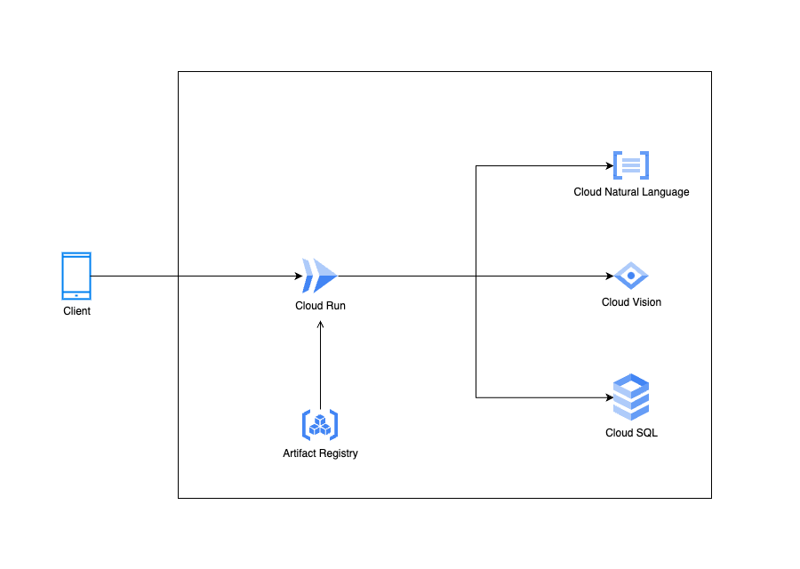

本記事では、Zennのオンラインハッカソン（AI Agent Hackathon with Google Cloud）にて私たちが開発した食品添加物解析アプリについて、その背景、課題、そしてソリューションをご紹介します。

#  プロジェクト概要

現代社会では、健康志向の高まりとともに、食品の安全性に対する関心が急速に高まっています。  
特に、食品添加物に関する不安や疑問を抱える人々は少なくありません。  
そこで本アプリが目指すのは、スマートフォンのカメラで食品の成分表を撮影するだけで、AIが瞬時に解析し、含まれる食品添加物をリストアップし解説するサービスです。  
消費者が食品の成分をより簡単に理解し、健康的な選択ができるよう支援します。

AIの画像認識技術と自然言語処理（NLP）を活用し、成分表のテキストを解析、食品添加物に関するデータベースと照合してわかりやすい説明を提供します。  
従来の手作業での検索や専門的な知識が必要だった成分の確認を自動化・簡略化することで、ユーザーの負担を軽減します。

##  ターゲットとなるユーザー像と課題

###  ターゲットユーザー

  * **健康を意識する一般消費者** （特に子育て世代、アレルギー・食事制限のある方、オーガニック志向の方）
  * **食品業界関係者** （品質管理、食品メーカー、飲食店など）
  * **医療・栄養の専門家** （栄養士、医師、健康コーチなど）

###  ユーザーの課題

  1. **成分表の理解が難しい**

     * 小さな文字で書かれており、専門的なカタカナや英語の添加物名が多いため、一般の消費者にはわかりにくい。
  2. **食品添加物の安全性が不明**

     * 「この添加物は安全？」と疑問に思っても、すぐに正確な情報にアクセスできない。
  3. **情報検索に時間がかかる**

     * 気になる成分を手作業で調べるのは手間がかかり、買い物中に即座に判断するのが難しい。

###  課題の詳細

食品添加物は各国で法律に基づき使用が許可されており、日本においては以下のように分類されています。

  * **指定添加物** ：476品目[1]
  * **既存添加物** ：357品目[2]  
その他に天然香料基原物質や一般飲食物添加物を含めると、合計で約1500‐1600種類が使用されています。[3][4]

これらの中には身体に害を及ぼす可能性が指摘されているものもありますが、商品のパッケージに明確な注意喚起が記載されることはありません。  
食品表示法に基づき物質名のみが記載されているため、以下のような問題に直面します。

  1. **不明な物質名への不安**  
専門知識がないと成分名から安全性を判断するのは困難。
  2. **調査の手間**  
各成分を一つずつ検索して調べるのは時間と労力がかかる。

これにより、多くの消費者は添加物について十分な情報を得ることができず、結果として不安を抱えたまま商品を購入してしまう状況が続いています。

###  課題へのソリューション

####  **1\. AIを活用した画像解析と自動認識**

  * スマホのカメラで成分表を撮影すると、**画像認識技術** でテキストを抽出し、**AIが解析** 。食品添加物の種類を自動で識別します。
  * 手入力不要で、**一瞬で成分情報が表示** されるため、手間を大幅に削減。

####  **2\. 食品添加物データベースとの連携**

  * **専門機関のデータ**[^5]をもとに、食品添加物の**用途（保存料・甘味料など）や説明、安全性、健康リスク、他国での使用可否** などをわかりやすく解説。
  * 「**安全性の評価** 」「**注意が必要な添加物** 」など、視覚的に理解しやすい表示で、初心者でも直感的に判断可能。

#  システム アーキテクチャ図

#  デモ動画

<https://youtube.com/shorts/Oaj5SlXZ-FU?feature=share>

#  今後の展望

本アプリは今回のハッカソンをきっかけに開発がスタートしましたが、将来的には以下のような拡張をしていきたい。

####  **1\. ユーザーに合わせたパーソナライズ機能**

  * **アレルギー・食事制限の設定** ができ、特定の添加物を避けたい人にカスタマイズされた情報を提供。
  * **履歴管理・比較機能** により、過去に解析した食品と比較しながらより良い選択が可能。

####  **２\. 食品以外の製品解析**

  * **化粧品や医薬品** など、他の分野への応用。

####  **3\. リアルタイム解析による即時フィードバック**

  * 買い物中や食事の際に、スマホをかざすだけで**数秒以内に結果を表示** 。
  * これにより、その場での**食品選びのストレスを軽減** できるようにする

#  参考

脚注

  1. <https://www.ffcr.or.jp/tenka/list/post-11.html> ↩︎

  2. <https://www.ffcr.or.jp/tenka/list/post-12.html> ↩︎

  3. <https://www.ffcr.or.jp/tenka/list/post-13.html> ↩︎

  4. <https://www.ffcr.or.jp/tenka/list/post-14.html>  
<https://www.mhlw.go.jp/stf/seisakunitsuite/bunya/kenkou_iryou/shokuhin/syokuten/index.html> ↩︎

