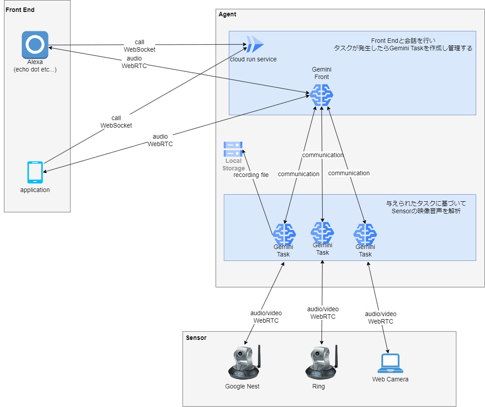
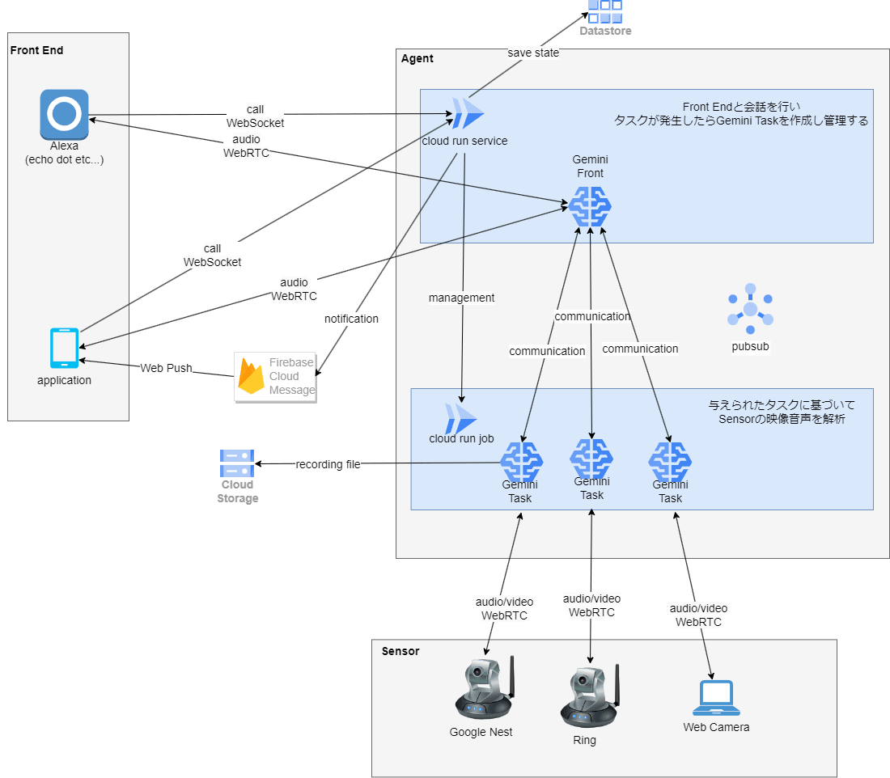

この記事はAI Agent Hackathon with Google Cloud の応募記事です。

#  はじめに

**WatchBot** は、人間の言葉による簡単な指示で必要な映像・音声を監視し、自動的に異常を検知・録画してくれるシステムです。

音声アシスタントやスマートフォンなどを通じて、自然言語で人間に話しかけるように「○○を監視して」と依頼するだけで、スマートホームカメラやセンサーと連携し、さまざまな監視タスクを自動実行します。

#  プロジェクトが対象とするユーザー像と課題

##  ユーザー像

  * **共働きの家庭や一人暮らしの方**
    * ガスコンロの火がつけっぱなしになっていないか不安、インターホンが鳴っても気づけないなどの悩みがある。
  * **小さな子どものいる家庭**
    * 目を離した隙に子どもが危険な行動をしていないか、スマホを使いすぎていないかを見守りたい。
  * **オフィスや工場の管理者**
    * 複数台の計器や設備を常にチェックしきれない。
  * **介護・医療現場**
    * 介護施設で利用者が転倒したり、一定時間動きがなかった場合に即時通知したい。スタッフ不足を補完する見守りが必要。

##  ユーザーが抱える課題

  * **監視の手間・人手不足**
    * 複数箇所の常時監視は現実的でなく、人的リソースに限界がある。
  * **監視ツールが分散している**
    * 各デバイスごとに操作や設定が必要で、システム全体としての一元管理が困難。
  * **自然言語での柔軟な指示ができない**
    * 「○分間だけ監視」や「異常時に通知」など、細かな条件設定が直感的に行えない。
  * **プライバシーとコストの両立**
    * 監視映像を長時間クラウドに保存するのは不安やコストがかかるため、必要なときだけ記録したい。

#  WatchBot の特徴

  * **自然言語でのタスク依頼** : 専門知識がなくても、日常会話のように監視タスクを依頼できます。 
    * 例 コンロを30分見張って、吹きこぼれを検知したら知らせて
  * **多様なデバイスとの連携** : Alexaやスマホを使って指示を出し、スマートホームカメラや使わなくなったスマホをセンサーとして活用できます。さらに、センサーのカメラやマイクを使うことで、APIのないアナログ機器（計器や家電）ともシステムを統合できます。
  * **リアルタイムな異常検知とプライバシー保護** : 監視中に異常が発生すると即座に通知し、必要なタイミングでのみ録画を行うことで、無用なデータ保存を防ぎます。
  * **柔軟なシステム進化** : 現在の監視ニーズに応えるだけでなく、今後新たなデバイスやシナリオにも対応可能な設計となっており、環境や用途の変化に合わせた拡張が期待されます。

#  デモ動画

##  デモの流れ

  1. Alexa 経由で Gemini と会話
  2. Ring のカメラでスマホを触っているか監視してもらう
  3. Nest のカメラでスマホの画面を温度計に見立てて温度を監視してもらう 
     * 検知したシーンが録画されていることを確認

#  システムアーキテクチャ

##  主なコンポーネント

  1. **FrontEnd**
     * Alexa やスマートフォンなど、このサービスをコントロールするためのコンポーネント
     * WebRTC に対応したマイク・カメラを持つスマホや PC も利用可能
  2. **Agent**
     * **Gemini Front**
       * Gemini Multimodal Live API を使い、FrontEnd と音声による会話を行う
       * 会話からタスクが発生した際に Gemini Task を作成・管理
     * **Gemini Task**
       * Sensor から映像と音声を受け取る
       * 与えられたタスクを Multimodal Live API の映像音声認識によって解決する
  3. **Sensor**
     * Google Nest や Ring などのスマートホームカメラ
     * WebRTC に対応したカメラ（スマホや PC のカメラなど）も利用可能

##  システムアーキテクチャ図

下図は WatchBot の大まかなシステム構成イメージです。

###  システムの大まかな流れ

##  理想のシステムアーキテクチャ図

時間が足りず間に合いませんでしたが、当初は下図のようなシステムを構築することを目指していました。

###  差分のポイント

  1. **Cloud Run Service と Cloud Run Job に分割**
     * Cloud Run Service のセッション最大時間は 1 時間の制限があるため、長時間の監視タスクは Cloud Run Job（最大 7 日）で実行
     * Cloud Run Job は外部からのアクセス用インターフェース（HTTP など）がないため、Service と Job は Cloud Pub/Sub を介して連携
  2. **状態の永続化**
     * Datastore にセッションの状態を保存し、Cloud Run のセッションが終了してもユーザーが引き続き利用可能にする
  3. **クラウドストレージへの保存**
     * 録画したデータをクラウドストレージに保存し、利便性を向上させる
  4. **Push 通知**
     * タスクの実行結果を常に音声で受け取れるとは限らないため、スマホに Push 通知で結果を送れるようにする

#  実装のポイント

##  システムプロンプト

システムプロンプトは大きく 2 種類に分かれ、それぞれの役割に応じた関数呼び出しでタスク管理やデバイス操作、映像・音の解析を行うよう設計されています。

  * **フロント系プロンプト**
    * デバイス操作やタスク管理を担当
    * デバイスのリスト更新、タスク実行・中止、進捗確認などを関数呼び出しで明示的に指示
  * **マルチモーダルプロンプト**
    * 映像や音の解析に特化し、解析結果の報告やタスクの終了条件の管理、時間管理機能を持たせることで、途中経過とタスク完了を明確に区別

これらの設計により、システムは柔軟かつ安全に各種タスクを効率的に処理できるよう工夫されています。

実際のプロンプトについては[こちら](https://github.com/shinyoshiaki/watch-bot/blob/4e2a973c99fadf56581587bb2305e7ad41429fe8/packages/core/src/prompt.ts#L31)を参照してください。

##  メディア通信のプロトコルを統一（WebRTC）

近年の多くのスマートホームデバイスはメディア通信に WebRTC を採用しています。

低遅延かつ安定した通信プロトコルとして WebRTC を統一的に利用することで、品質向上と実装コスト削減の両立を図っています。

##  Cloud Run と WebRTC の組み合わせ

Cloud Run 上で WebRTC を使うには、ひと手間が必要です。今回は Node.js 用の WebRTC ライブラリが Cloud Run 上で動作するように改良を行いました。

<https://github.com/shinyoshiaki/werift-webrtc/pull/439>

また、Cloud Run のデフォルト状態だと TURN サーバが別途必要になりますが、以下のように設定すると、TURN サーバなしでクライアントと Cloud Run との P2P 接続が可能になります。

  * VPC を作成
  * VPC に対して Cloud NAT を設定
  * Cloud Run にアウトバウンドトラフィック用の VPC を設定
  * すべてのトラフィックを VPC に直接送信するように設定

さらに、Cloud Run Service の場合、**リクエスト時間を課金対象とする設定** をしていると、リクエスト中でないとインスタンスが正常動作しません。

WebRTC 通信はリクエストとみなされないため、クライアントは WebRTC とは別に WebSocket で常時接続を行う必要があります。

##  Gemini と WebRTC

  * 主要なLLMのうち、リアルタイムかつマルチモーダルなAPIを提供しているのはGoogle Geminiのみなので、今回のユースケースにGeminiはとても合っています。
  * Gemini の Multimodal Live API 自体は WebRTC に対応していないため、Gemini Task 内部で WebRTC で受信した音声・映像を Gemini 向けの形式に変換し、WebSocket で送信して解析しています。
  * 将来的に Gemini が OpenAI のように直接 WebRTC 対応することで、さらにシンプルな構成になる可能性があります。

#  運用維持コスト

##  運用コスト

デプロイ作業は Cloud Run を使っているため、Docker イメージとリビジョンの更新だけで完了します。GitHub と連携すれば完全自動化も可能です。

スケーリングまわりも Cloud Run に任せているので、基本的には追加の作業がほとんどありません。

##  ランニングコスト

  * **Cloud Run の実行コスト** : 利用した分だけの課金形態のため、ユーザーがいない時のコストを抑えられます。PoC レベルの利用なら無料枠でまかなえる可能性も高いです。
  * **Storage / Datastore / Firebase Cloud Messaging のコスト** : いずれも原則従量課金で、録画データはイベント発生時のみ数秒程度を保存する設計のため、大きく膨らむリスクが小さい点もメリットです。

#  今後の機能拡張

  * **AI マルチモーダル分析の進化**
    * Gemini の機能拡充に伴い、より複雑な状況認識や多様な音声・映像解析が可能に。現時点では人の声中心の認識で、インターホン音などの環境音が正確に判別されないが、今後のアップデートで精度向上が期待される。
  * **予測モデルの強化**
    * 映像・音声・センサーデータを学習し、異常の前兆を検知してアラートを出すなど、予測的な監視を強化。例えば「夜間の人数増加パターンから不審行動が起こりそう」などを自然言語で説明し、担当者の対応を促す高度なサポートが期待できる。
  * **制御の領域へ**
    * スマートホーム基盤との連動をさらに強化し、ドアの自動ロックや空調制御なども含め、一気通貫でデバイス制御を行えるように。
  * **ドローン、ロボットとの連携**
    * 自然言語インターフェースを通じてドローンなどに巡回指示を出し、あらゆる場所を自動監視可能に。

#  まとめ

**WatchBot** は、自然言語による監視タスク指示と映像・音声解析を組み合わせたプラットフォームです。

家庭やオフィスでの簡易モニタリングはもちろん、防犯・医療・災害対応・産業オートメーションなど幅広い領域での活用が期待されます。

今後もさらなる機能拡張や最適化を図り、進化を続けていきたいです。

#  付録

  * **ソースコード（GitHub）**[WatchBot リポジトリ](https://github.com/shinyoshiaki/watch-bot)

