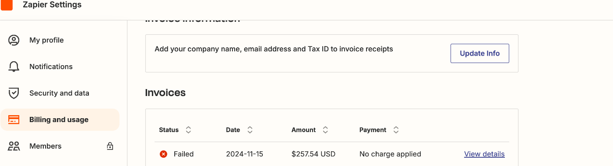
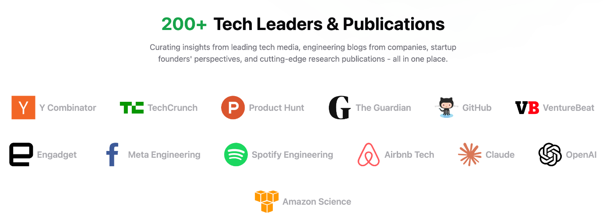
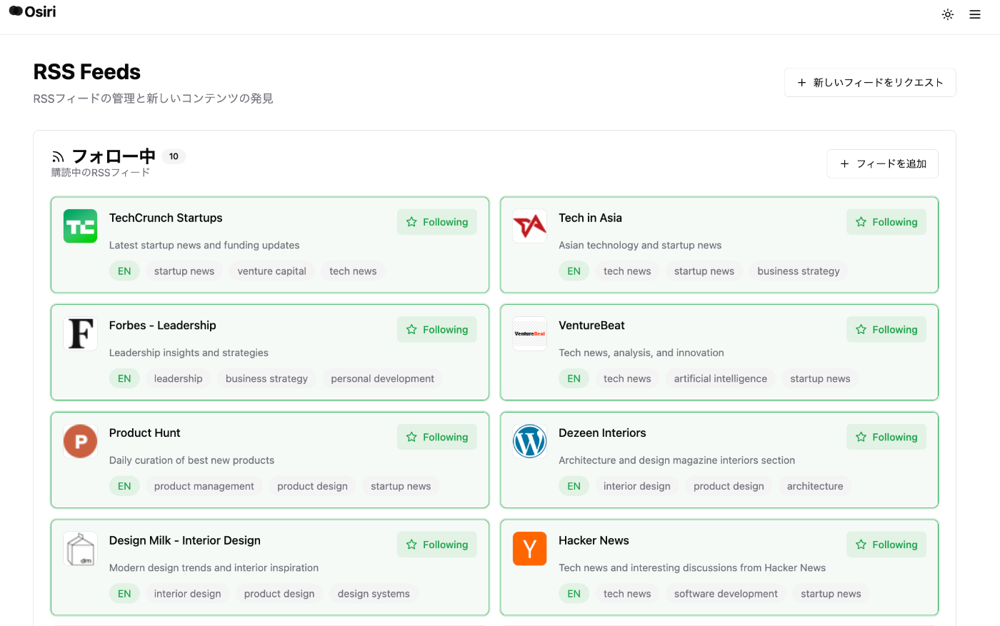
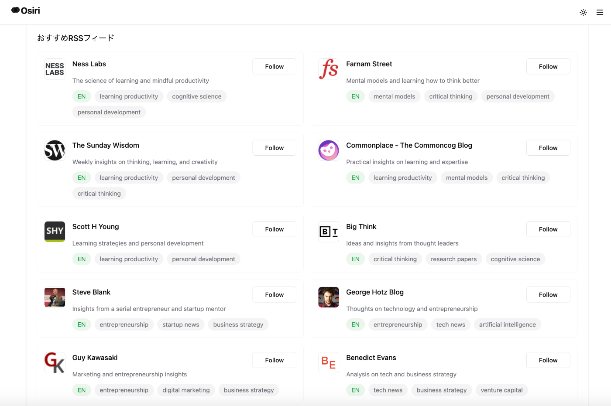
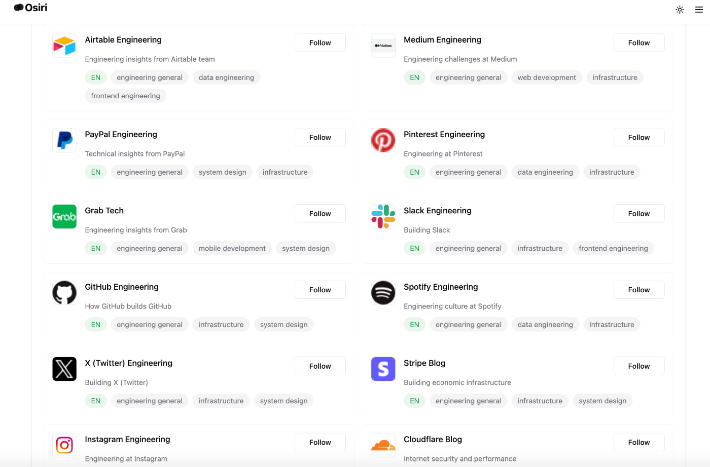
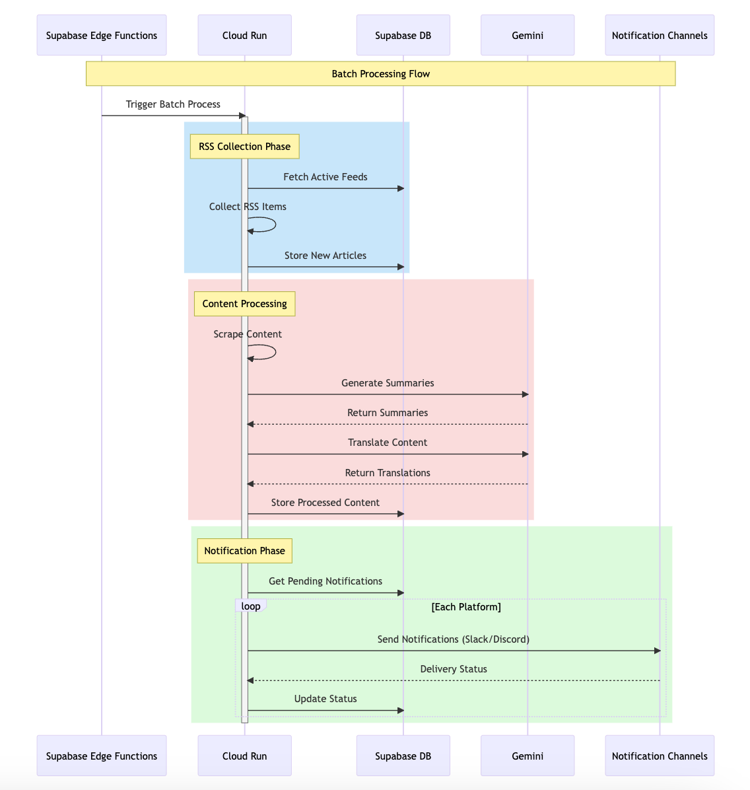

本記事は、Zennの[AI Agent Hackathon with Google Cloud](https://zenn.dev/hackathons/2024-google-cloud-japan-ai-hackathon)において、プロダクトのハッカソン提出用の記事となります。

みなさん、USのスタートアップ界隈でどんなプロダクトが今リアルタイムで流行っているか、知りたくないですか？そんな時に便利で効率的にサクッと知れる、そんなプロダクトを作ったので紹介させてください。

#  はじめに

今回ハッカソンにて、[Osiri - Global AI summarized news reader](https://o-siri.com/)というプロダクトを開発しました。

2025年2月10日現在まだクローズドの状態です。実際に利用できるα版を招待制にて提供しておりますので、ご利用されたい方は [@0xShin0221](https://x.com/0xShin0221_jp) 下記にてお願いします。

<https://youtu.be/OJcK3l1bubc>

##  プロジェクト概要

Osiriは、海外のニュースを自動で収集し、AIで要約・翻訳して配信するグローバル対応のニュースリーダーサービスです。  
"Knowledge should have no borders" というビジョンのもと、言語の壁を超えて、世界中のスタートアップ・テック業界の動向を効率的にキャッチアップできるサービスです。

特徴：

  * AIによる多言語自動要約・翻訳（11言語対応）
  * Slack/Discordでの自動配信
  * カテゴリ別フィード管理（Startup、Tech、VC/Investment等）

ユーザーは興味のある分野とRSSフィードを選択し、好みの配信プラットフォームで、母国語で翻訳されたニュースをストレスなく受け取ることができます。

##  開発の背景・動機

本プロジェクトは、私自身が直面していた「海外の最新情報を効率的にもっと収集したい」という課題から始まりました。

当初、この課題に対してLayerXの松本さんが公開されていた[「今日から始めるChatGPT+Zapierで雑パーソナライズ情報収集」](https://tech.layerx.co.jp/entry/2024/03/12/182848?s=09&utm_source=pocket_shared)記事を参考に、Zapierを使用したワークフローを構築していました。

ただ、Zapierの利用料金が日本円にして3万円超えてしまい、思ったより高額になってしまったので、自身で開発することにしました。  

このワークフローで日々ワクワクするようなプロダクトや、ハックが知れていたので「Zapierたけぇー!」「お財布に平和を届けるぞー!」というモチベーションでこのハッカソン駆け抜けました。

##  ユーザーとソリューション

###  ユーザー像

英語ネイティブな方の場合は、特に現地メディアや界隈のブログを読むことで解決しますが、本プロダクトでの最初のユーザー対象は非ネイティブユーザーとなります。  
(一応、日本語→英語、中国語→英語の今回の逆パターンのUXも考慮して設計しております 現在11ヶ国語対応)

初期の現在のバージョンでは、主に下記のようなUXに絞った情報ソースを選定しています。

  1. スタートアップ創業者・経営者  
市場動向、競合の動き、新興技術のリアルタイム把握

  2. 投資家・VC  
有望スタートアップ、資金調達情報、マーケットシグナル

  3. エンジニア・デザイナー・PM  
プロダクトイノベーション、デザイントレンド、成功事例(Growth)

情報ソースとしては、企業アカウントやメディア、個人ブログなどがあります。  

  
  

#  技術構成

###  1\. フロントエンド

  * **フレームワーク:** Vite + React
  * **コンポーネント:** Radix UI
  * **スタイリング:** Tailwind CSS
  * **多言語対応:** react-i18n
  * **状態管理:** Zustand,Hooks

###  2\. バックエンド

  * **Supabase**
    * Edge Functions
    * Slack/Discord Integration
    * Email (Resend API連携)
    * Webhook処理
  * **Google Cloud Run**
    * Cron/非同期関連の重め処理 
      * RSS収集
      * AI要約処理
      * 多言語翻訳

###  3\. インフラその他

####  CI/CD

  * GitHub Actions
  * GCP Cloud Build

####  セキュリティ/認証

  * GCP Secret Manager
  * Supabase Auth/Vault

####  決済

  * **Stripe**
    * サブスクリプション管理
    * 従量課金処理

####  分析

  * Amplitude

##  配信通知ワークフロー

  1. 定期実行トリガー  
Supabase Edge Functionsから定期的にCloud Runのバッチ処理を起動

  2. RSSフィード収集フェーズ  
RSSフィードを取得  
各フィードから最新の記事を収集

  3. コンテンツ処理フェーズ  
保存した記事の本文をスクレイピング  
Gemini APIを使用して記事の要約をユーザーの対象言語で生成

  4. 通知配信フェーズ  
ユーザーが連携しているプラットフォームの対象チャンネルの記事を収集  
各プラットフォーム（Slack/Discord）の制限を考慮しながら通知を送信

#  今後の展望

「グローバルで使われるプロダクトを作りたい。」そして、プロダクト開発において「モメンタムを失わずプロダクトアウトなコードモンキー(いわゆるProduct-Led Growth的な)でいたい。」という思いから以下のことをミニマムでやっていければと考えてます。

###  グローバルにα版リリース

当初から非英語ネイティブ層向けのスタートアップに関心があるユーザー向け(初期ユーザー)に設計/実装してきました。今回のハッカソンを後に各言語圏のユーザーが活動するプラットフォームへリリース作業を行なっていきます。アプリケーションはすでに多言語対応(i18n)を実装済みです。

###  動画・テキストコンテンツの自動AIマーケティングツールの作成

収集したコンテンツのデータを元に、Short動画やテキスト系SNSへの自動投稿ツールを作成予定です。

###  ニュースソースのパーソナライズ化、またインタラクティブ化

現在はRSSフィードの翻訳・要約が主な機能ですが、「ユーザーは自分の関心領域にフィルタリングされた情報を求めている」という仮説に基づき、以下の発展を計画しています。

####  パーソナライズ化

現状ニュースソースのRSSをフォローすることが情報を得るトリガーとなっていますが、それ自体は上述仮説に対してのマストではないためAgent的なワークフローでこのUXをなめらかにできるのではと考えてます。例えば、[RSSHub](https://docs.rsshub.app/)などを使えばAPI的に自身が好きな情報をソースとして扱えるのでこの辺りとプログラマティックに連携できないか考えています。

#  最後に

このプロジェクトを通して、一番強く実感したのは生成AIを活用した開発の驚異的な開発スピードです。一開発者として、こういったAIの力を借りながらプロダクトを作れる時代に立ち会えていることを、とてもワクワクしながら感じています。

最後に、このようなハッカソンの機会を提供していただいたZenn/Google Cloud Japanの皆さん、そして参考にさせていただいたLayerXの松本さんの記事に感謝申し上げます。

追伸： 3月より新たな挑戦をスタートする予定です。特に生成AI関連の開発に携わっていきたいと考えていますので、もしこの記事を読んで「一緒に何か面白いことができそう！」と思っていただけた方がいらっしゃいましたら、気軽にご連絡いただけますと幸いです。
