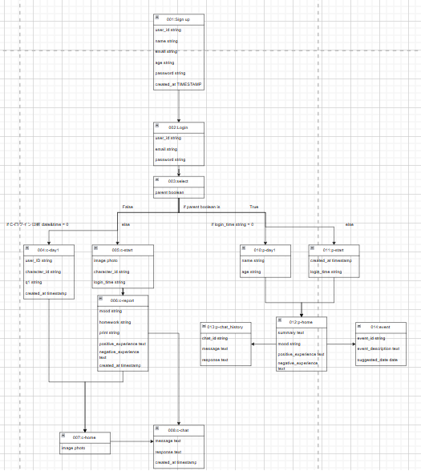

今日もただいま

やってくる反抗期と親の悩み

今まで両手に抱えきりだった子どもが自分の手から離れ、外の世界を知る時間が増えてきたのにもずいぶん慣れたころ、急に口答えや無視をされることが増えるなど、子どもに対する接し方に困ったり驚いたり不安になっている保護者の方も少なくないのではないでしょうか。  
それは小学生に訪れる「中間反抗期」と呼ばれるもので、小学校入学から卒業するまでに経験する成長の一環です。小学校に入学すると周囲の環境は今までと大きく変わります。友人関係が広がり、クラス内で社会性を学びながら自立心も育っていきます。そのため、親や教師が過度に干渉しすぎるとしつこく感じ、余計にコミュニケーションが難しくなってしまうこともあります。親としては、子どもの自主性を尊重しつつ、成長を見守る距離感を大切にすることが求められます。  
そこで、この中間反抗期における親子の関係をサポートし、親の不安を軽減するためのアプリを開発しました。

アプリ開発のきっかけ  
このアプリを開発したきっかけは、チームメンバーの「教育に関する課題を現代のAI技術で解決できないか？」という言葉から始まりました。学ぶということの大事さは自分たちもよく知っています。けれど「もう少し学校から先生からこういう対応を受けたかった。教わりたかった。親には感謝しているけども周りと比べて自分はもっとよりよい道があったのではないか」などとたらればを考えることも多くあると思いませんか。塾のアルバイトを経験した方や教育現場の話を聞くだけでも教育というテーマについてむずかしさを痛感します。どうすればその環境を少しでも好転させられないかと私たちは考えました。  
小学生の子を持つ親は子どもの生活を把握したいが、干渉しすぎると反抗期真っ盛りで嫌がられてしまう。コミュニケーションをとるのも一苦労だと感じてきた。また自分が仕事で家にいない間、子どもがどう過ごしているかが透明になりちゃんと家に帰ってこられたのか心配だ。学校でも宿題を忘れたり、必要な持ち物を準備しなかったりなどといった問題は起きていないだろうか。こうした問題をテクノロジーの力で解決し、親子の関係をより良いものにできるのではないだろうか。そのような様々な思いから、このアプリを作成しようと至りました。  
また、チーム内には小学生の妹を持つメンバーもおり、反抗期の子どもと親の関係についての理解もより深めることができ、今回の開発に生かせたのではないかと感じます。

アプリの対象ユーザーと解決する課題

今小学生の子どもを持つ保護者の方にとって以下の項目が思い当たる方はいませんか？

・子どもがもらってきたプリントを出さなかったりイベントの話をしなかったり、また翌日に必要であった持ち物を深夜や朝に言われて焦って準備する  
・宿題を尋ねても何があったか覚えていないという、やりなさいと言ってもやらない  
・親が不在の間にどんな行動をしているか全くわからない  
・最近の様子や調子もわからず親子の会話が減ってしまい、どのようなことを話したらよいかなど関係が希薄になってしまっている  
・家で宿題を手伝う人がいないため、学習のサポートが周りよりも不足してしまう  
・子どもの状況を把握する手段がないため、親として不安に感じる

このアプリの主な対象は、  
・小学校高学年の生徒  
・仕事で家にいない母親  
です。  
具体的には、東京都内の公立小学校に通う共働き家庭の一人っ子（男の子）を想定しています。学校から帰宅すると、親に言われて渋々連絡帳を出し、すぐに外へ遊びに行くような日常を送っている子どもたち。反抗期に入っており、親とのコミュニケーションが減りがちで、習い事もあり忙しいスケジュールをこなしている家庭です。

メインターゲットではないにしてもこのようなことを考えたことのある保護者の方は多いのではないでしょうか？このような問題を解決するために、AIを活用したサポート機能を備えたアプリを開発しました。

AIを活用したアプリの機能  
このアプリは、大きく子ども用と保護者用の2つのモードで構成されています。  
それぞれのユーザーに適した機能を提供し、親子のコミュニケーションを補助するようになっています。

子ども用のアプリ

機能として、まず毎日のルーティンとしての「ただいまモード」、利用日数に応じて成長していく「キャラクターと一緒モード」などがあります。

ただいまモード  
ただいまモードでできることは

  1. 「ただいまボタン」  
o 帰宅したらアプリを開き、「ただいまボタン」を押すことで、1日の振り返りをスタート。  
o かわいい自分だけのキャラクターが出迎えてくれ、利用日数も教えてくれるため達成感を感じられます
  2. 1日の振り返り機能  
o 「今日はどんな1日だった？」という質問に対し、今の気分を「たのしかった！」、「ふつう」、「あんまり」、「よくなかった」の4択形式で感覚的に選択することができます。  
o またその時に一言メモを書くことで、子ども自身が簡単に日記をつけられるようになっています。後から見返すこともでき自身の成長を感じることができる仕組みとなっています。
  3. 宿題・プリント管理  
o 宿題とプリントの有無を入力。「あり」、「なし」のボタンで選択することができ、帰ってきてすぐのまだ記憶が新しいうちに入力しておくことで忘れを防ぐことができます  
o 必要に応じて詳細を記録し、これらの情報は保護者と共有されるため保護者の方からも声をかけてあげることができるようになっています
  4. 予定の確認  
o 「この後の予定は？」という質問に、あらかじめ設定していた選択肢から回答。塾に通っている子や習い事が複数ある子にも事前にそれぞれの設定ができるため選択しやすいようカスタマイズできます。

などなど子どもが今日の1日を振り返り、記録を付けることができるモードになっています。自信で入力してもらうことによって、もう自分で予定をつけられるんだ、と責任感をもってもらうことができます。

キャラクターと一緒モード  
上記の1日のルーティンをこなした後、自分だけの成長するキャラクターを育てるモードがキャラクター育成モードです。  
キャラクターは経過日数で成長し、違う姿へと変化します。長く続ければ続けるほど新しい姿を見せてくれ、今までの姿ももちろん確認することができます。  
さらに自分のキャラクターとお話ができるAIチャットもあります。キャラクターが日々の学校の悩みや宿題のヒントを教えてくれ、いつでも子どもと寄り添って支えてくれます。保護者が手伝えないときのサポート役としても活躍してくれ、人に言いたくない時期に相談事ができる友人のような存在になってくれます。

保護者用のアプリ  
保護者の方が利用するアプリは主に子供の様子を確認することができ、イベント情報を見ることができます。

  1. ホーム  
o ホームからは経過日数や放課後の予定、今日「ただいまボタン」が押された時間と前日のボタンが押された時間とを比較してみることができるなど必要な情報を簡単に確認することができるようになっています。
  2. 今日の記録  
o 子ども用のアプリの方で入力された「今日の気分」、「ひとこと」、「宿題とプリントの有無」、「予定」を確認することができます。  
o タブの切り替えで前日や他の日も見ることができます。
  3. チャット履歴  
o 子どもがキャラクターとお話した内容が見られるようになっています。最近の悩み事や様子の確認ができます。
  4. イベント情報の提供  
o 地域を絞って近隣で開催される子ども向けイベント情報を提供しています。  
o 子どもの興味ある事柄や性格に即して休日の予定決めに使用することができます。

保護者用のアプリでは子どもの普段の行動を可視化し、必要なときに適切なフォローができるようになります。

環境  
今回アプリを作成するに伴って以下の環境を用いて開発しました。  
• AIチャット機能: Gemini API in Vertex AI  
• 通知機能: Cloud Run  
• 開発環境: Visual Studio Code, Firebase  
• バックエンド: Ruby on Rails, Docker  
• デザイン:Figma

開発の工夫  
長く続けてもらうことでより有用性のあるアプリなため、いろいろな問題点に対する工夫を行いました。

• 子どもが情報を入力しない  
o 入力の手間を少しでも省くために子どもへの質問は選択形式でぽちぽちと回答できるようにボタン式を採用し、さらに「質問形式」で情報を引き出すように設計。  
o 日記をつけることや書き込むことが好きな子のためや文字に残る達成感を感じてもらうために自由記入欄も多く設け、いつでも見返せるような構造にしました。  
• アプリを使わなくなる  
o どうしても飽きてしまいがちなアプリ利用を防ぐために、キャラクター育成や気軽な友人と会話ができるといった要素を強化し、使うたびに楽しい体験を提供できるようにした。  
• 親が情報を取りすぎて過干渉になる  
o 「アラート」を最小限にし、「必要な情報をピンポイントで提示」する工夫。

・親と子供でUIを変更  
最初に利用登録をした後、保護者と子供で選択をするところから保護者用と子ども用でどちらのアプリかを一目でわかるようにデザインを分けてあります。保護者用は使いやすいようシックなデザインを用い、子ども用は明るくポップなデザインになっています

開発プロセス  
今回の目的に沿ったアプリを作るまでにFigmaを用いてアイデアをいくつも出し合い、それらの要素をブラッシュアップしていく中で今の形が出来上がりました。ターゲットである小学生とその保護者、それらの行動を絞り行動特性を考えアプリの設計や要素を考えました。  
子どもを対象とするにはまず進んで使ってもらわないといけない、面倒くささや手間を省き子どもにとってどんなメリットがあるかを考えることに一番時間を割きました

今後の展望

今回作成したアプリからさらに機能を追加し、使いやすく手に取ってもらいやすくなるように今後の展望を考えました。  
• 対話サポート  
o 「宿題の質問」や「タスクの順番」を提案する機能を追加予定。  
• 持ち物提案  
o 天気やイベント情報をもとに持ち物リストを自動作成。  
収益化ポイント  
• プレミアム機能の提供  
o 基本機能は無料、有料版では「キャラクター育成」「カスタマイズ可能な通知」「詳細レポート」を解放。  
o 月額500～800円を想定。  
• 独自の教育コンテンツ販売  
o AI教材や学習支援コンテンツを提供。  
• ブランドコラボや広告モデル  
o 子ども向け文房具メーカーや教育サービスとの提携。  
このアプリは、親子の関係を支えながら、子どもの成長を促すツールとして進化し続けます。

  
システムアーキテクチャ図の画像

[https://youtu.be/LgbYsXjGB_0](https://youtube.com/shorts/XaEmXfH6Weg?feature=share)  
デモ動画のURL
