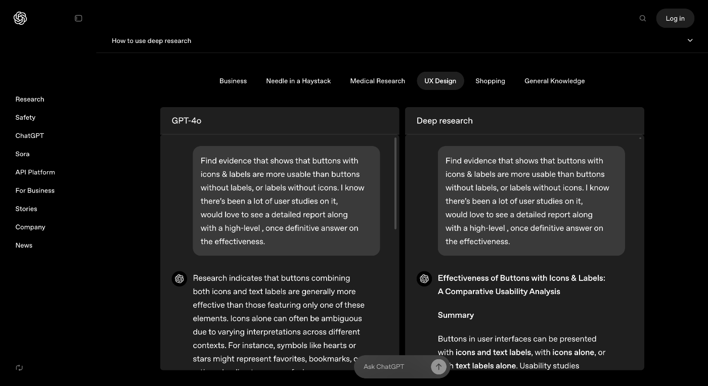
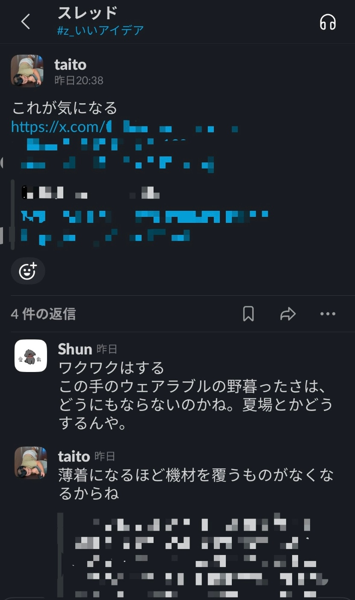
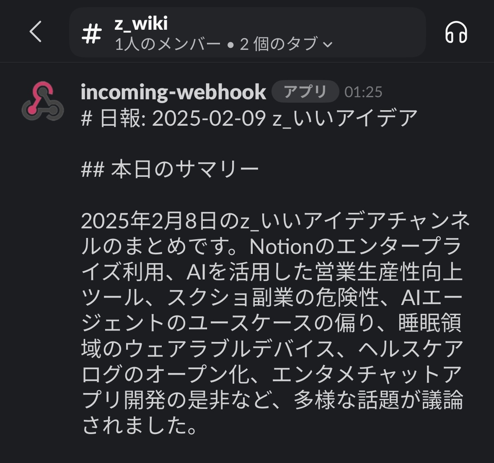
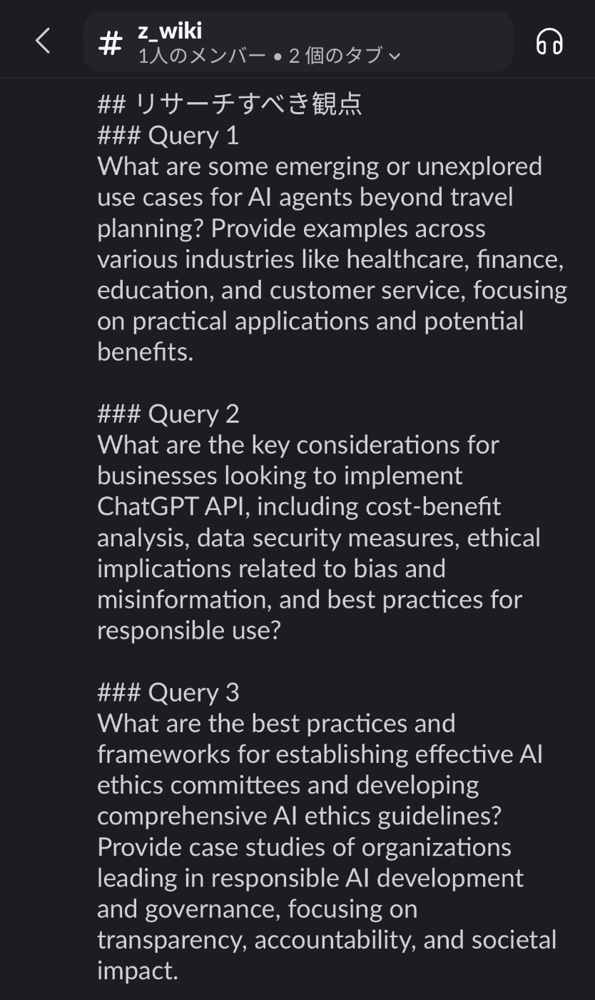
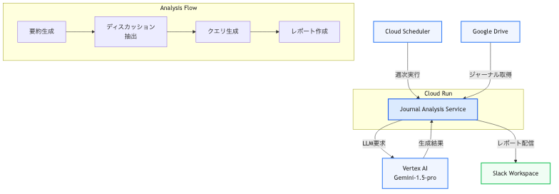
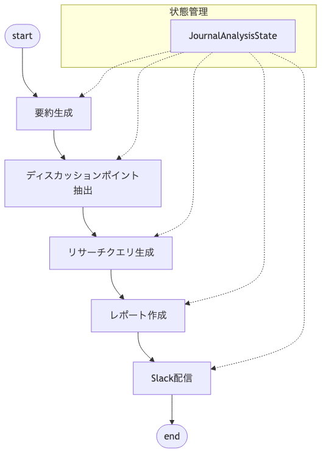

!

この記事は Zenn 主催の AI Agent Hackathon with Google Cloud への応募記事です。

##  🎥 1分でわかるコンセプト

<https://www.youtube.com/watch?v=qObBLjV5mok>

##  🙁 気になること、放ったらかしにしていませんか？

  * 「DeepResearchで調査が自動化できるって。副業のチャンスはないかな？」
  * 「DeepSeekが学習コスト1/10で高パフォーマンス... 自社のAI導入にも影響あるかも？」

みなさんは普段、仕事や友人との雑談の中で「これ気になるな」と思ったのに、忘れちゃった……なんて経験はありませんか？

いまや、**AI に聞けば大抵のことは調べられる時代** になりました。

とはいえ、ふと疑問が浮かんだときに、その場で言語化できるかというと、実際は難しいですよね。。

##  💭 “調べたいクエリ”が思いつかない問題

AI検索は、漠然としたクエリでは、「そうじゃないんだけどなー」と感じるケースが多い。

OpenAIのWebサイトで掲載されているクエリを見てみましょう。

[Introducing deep research](https://openai.com/index/introducing-deep-research/)  

    
    
    日本語訳：
    アイコンとラベルのあるボタンは、ラベルのないボタンやアイコンのないラベルよりも使いやすいという証拠を見つけてください。これについては多くのユーザー調査が行われていますが、有効性に関する高レベルの、一度決定的な答えとともに詳細なレポートを見たいです。
    

🤔 このクエリの特徴:

  * 具体的な比較対象が明確
  * 求める情報の種類が特定されている
  * 期待する出力形式を指定

AIの力を引き出すには、こうした**良いクエリ** が重要。しかし、即座に思いつくのは簡単ではありません。

###  🔍 ログを活かせば“自然な疑問”が見つかる！

そこで着目したのが、**ふだん使っているチャットに蓄積されるログ** 。そうしたログを**自動でまとめ、後になってから「コレ調べたい」を取り出せる仕組み** を考えました。

##  🌱 良いクエリを育てる仕組み

「ワークフロー」と「エージェント」を組み合わせて、**日常的に“クエリ”を蓄積→定期的に“計画・推論”を実行し、ユーザーに新しい気づきをもたらす** ように設計しました。

  1. **Daily Summarizer（ワークフロー）**

     * 毎日決まった時間にチャットログを収集
     * LLMで構造化〜Markdown形式で整形、スッと見返せる形に
     * チャットに自動投稿
  2. **Weekly Insight Agent（エージェント）**

     * 1週間分の「Daily Summarizer」を読み込み
     * “もっと深堀りしたら面白いかも！”を見つけ、勝手にクエリを作成

##  📱 こんなふうに使う

1週間の流れを描いてみると、こんな感じです。

  * **Day 1（普通にチャット）**  
みんなが雑談して終わり。大事なヒントが生まれたかもしれないし、そうでもないかもしれない。  

  * **Day 2（1日目のログを要約・投稿）**  
要約レポートが Slack のチャンネルに投稿される。  
「あ、昨日○○について盛り上がってたよね〜」と思い出す。  

  * ………
  * **Day 7（エージェントが介入）**  
1週間分の要約をまとめて分析。  
「このクエリで深掘りしてみたら？」と、提案が届く（英語なのは意図的です）。  

ポイントは、**ユーザーは完全に何もしない** という点です。ログは勝手に溜まり、振り返りレポートが定期的に飛んでくる。さらに週単位で「**深堀りすべきテーマとクエリ** 」を教えてくれる。

**意欲があるときにだけ、エージェントの提案を受け止めればいい** という仕組みで、無理なく継続しやすい、**アンビエントなエージェント** を意識してみました。

##  ⚙️ 技術的なポイント

###  Daily Summarizer（ワークフロー）

構造化されたログをGoogle Driveに保存し、他のエージェントが参照しやすい形式にします。この詳細は、別の記事で紹介したいと思います。

###  Weekly Insight Agent（エージェント）

LangGraph と Gemini API in Vertex AIを使って構築。デプロイ先はCloud Runを想定しています。

####  システムアーキテクチャ

####  グラフ構造

####  実行イメージ

##### 実際のチャット履歴
    
    
    ・Shun: この記事、どう思います？レッドオーシャンすぎ？
    「Googleマップで稼ぐ、リモートで「月収15万円」を達成できる副業3選」：https://forbesjapan.com/articles/detail/76972
    ・Ryusuke：種まき。すぐには稼げないけど、やらないよりマシ。
    ・Taito：それで稼げるようになるのは1年後だよね。しんどい。
    以降、チャットが続く……… 
    

↓

##### AIが抽出したディスカッションポイント
    
    
    Googleマップを活用したSEOコンサルタントの副業は、紹介された内容の信憑性やウェブサイト構築の手間を考慮すると、収益性や実現可能性について慎重な評価が必要である
    

↓

##### 提案されたクエリ
    
    
    What is the earning potential and feasibility of a Google Maps SEO consultant side hustle?  Consider factors like market saturation, client acquisition costs, time commitment for website building and SEO, and average consulting fees. Provide data or case studies to support the findings.
    
    日本語訳：
    GoogleマップのSEOコンサルタントとしての副業における収益の可能性と実現可能性はどの程度ですか？市場の飽和度、顧客獲得コスト、ウェブサイト構築とSEOにかかる時間的コミットメント、平均的なコンサルティング料金などの要因を考慮してください。調査結果を裏付けるデータまたはケーススタディを提供してください。
    

この提案を受けて、Deep Researchで調べてもいいし、「ほーん」で終わるのも自由です。

####  工夫点

情報量の多いログから、**「良いクエリ」を安定して生成させる** ことを重視しました。  
そのために、以下3点を工夫しています。

  1. **段階的な要約フロー**

     * 最初に大まかな要約や議論の抽出を行い、次のステップでより詳細なクエリを生成するという“段階的なプロセス”を取り入れた。
  2. **Prompt設計の最適化**

     * DeepResearchのクエリ例を見本にして、**求められる形式** や **エビデンス明確化** などLLMに理解させ、ブレの少ないクエリを安定して生成できるよう工夫した。
  3. **英語でのクエリ生成 & 構造化**

     * クエリを英語にして、国内外の幅広いリソースを参照しやすくし、情報の粒度や文献数を増やす効果を狙った。

    
    
    # クエリ作成ノードのプロンプト
    あなたは、ディスカッションポイントから効果的なリサーチクエリを生成するエキスパートです。
    以下の点に注意して、各ディスカッションポイントに対応するリサーチクエリを生成してください：
    
    【クエリ生成の方針】
    1. クエリの特徴
       - 英語で記述（より広範な情報収集のため）
       - 約300文字以内
       - 具体的で明確な問いかけ
       - 事実やエビデンスを求める形式
    
    2. 含めるべき要素
       - 具体的な調査対象
       - 求める情報の種類（例：事例、統計、研究結果）
       - 比較や評価の基準
       - 時間的な範囲（必要な場合）
    
    3. 出力形式
       - queries: リサーチクエリのリスト
       - 各クエリは以下の要素を含む
         - discussion_point: 元となったディスカッションポイント
         - research_query: 生成されたリサーチクエリ（英語）
    
    【出力例】
    {{
        "queries": [
            {{
                "discussion_point": "アイコンとラベルを組み合わせたボタンのUX設計について、具体的なユーザビリティ調査の必要性が指摘された",
                "research_query": "Find evidence that shows whether buttons with icons & labels are more usable than buttons without labels, or labels without icons. Include recent user studies, detailed reports, and definitive answers on effectiveness. Focus on mobile and web applications from the last 5 years."
            }}
        ]
    }}
    
    上記の形式で、提供されたディスカッションポイントからリサーチクエリを生成してください。
    

##  🙌 使ってみた感想

Deep Researchリリース後に、ハッカソン参加したため、試用期間が短く、充分な量の雑談ログは溜まっていません。ただ、数日分を動かしてみただけでも、「あ〜こんな話してたなあ！」と気づきを得る場面がありました。

###  「これは良いかも！」のポイント

  * **小さな疑問を再発見**  
レポートには「こんなトピックが話題だった」が含まれていて、**その時には気になっていたのに忘れかけていたこと** を呼び戻してくれる効果があります。嬉しい。
  * **複数の話題が連鎖すると面白い**  
話題の繋がりを AI が見つけて提案してくれます。普段なら埋もれてしまう繋がりを、AIが教えてくれるのは面白い体験だと思います。

###  もし長期利用すれば…

今回、ハッカソンとしては地味に映るのは間違いありませんが、実用性と将来性は、期待できると思ってます。

  * **再利用可能な独自ログを蓄積可能**  
チャンネルの出来事をまとめるレベルであれば、Slack AIなどを使った方が効率的でしょう。しかし、数ヶ月、数年分のログ（自身の興味関心データ）を独自に貯めることで、「普段の口癖」や「価値観」を学習し、将来的にAIクローンといった技術のインプットに使えるかもしれません。
  * **アンビエントで長時間思考との相性◎**  
今後、ローカルで動くLLMが普及されれば、日中に溜まったログを、夜間にエージェントが**長時間かけて情報収集** を行い、翌朝には充実したアウトプットが出来上がってる、というようなシステムが作れるかもしれません。

##  👍 最後に

今回、ハッカソンに参加するにあたり、初めて記事を書きました。システム構想は、Claudeと一緒に考えて、Cursorでコードが自動生成されました。**非エンジニアでもアイデアを形にできる、素晴らしい世の中になりましたね。**

本アイデアは、まさにSlackで同僚とワイワイ話しながら、ふと思いついたものです。流動的なチャットの中には、人間だから生み出せる、光るアイデアがあると思ってます。それを**AIが理解しやすい構造に変換して、良いクエリに育ててもらって、あとは実行まで任せるような仕組み** ができれば、最高ですね！（あ、もう人間いらないや）

!

**本アイデアのセキュリティに関する注意点**  
チャットログをLLMで分析するため、データに機密情報や個人情報が含まれる可能性がある場合は、以下の点などを注意してください。

  * 対象ログの機密性の確認
  * 所属組織のセキュリティポリシーの確認

