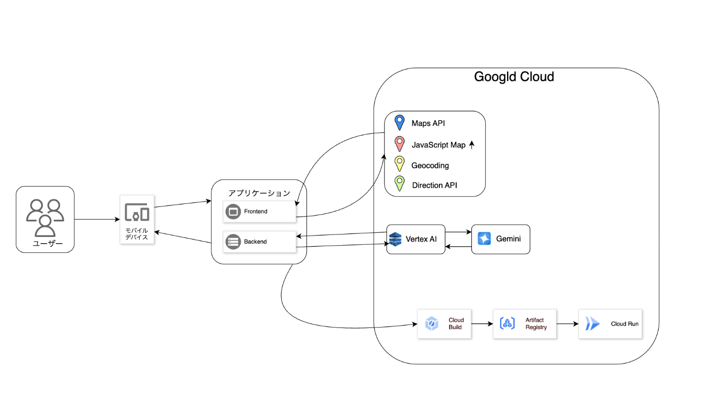

#  GoogleMapAPIとGeminiを駆使して、ランニング愛好者の負担を軽減するルート生成システム

##  使用する技術

  * React
  * Node.js
  * VertexAi
  * Gemini
  * Google Map API
  * geocoding API
  * Cloud Run

##  はじめに

日々のランニングを楽しむ中で、ランニングコースの設定に悩むという経験をしたことがある人は多いのではないでしょうか。ランニングをするにしても毎回同じコースを走っていてなんだか新鮮味に欠けるということもあると思います。何を隠そう自分自身がこの経験をひしひしと感じています。  
私のプロジェクトは、そんなランナーの「走る前の面倒なルート設定」という課題に着目し、ユーザーが出発地、目的地、希望距離を設定するだけで最適なランニングルートを自動生成するアプリを開発しました。

このアプリは、ユーザーがランニングルート設定作業から解放され、走ることに集中できる環境を提供します。フロントエンドはReactを採用し、GoogleMapAPIやDirectionAPIなどを用いてリアルタイムにルートを表示。バックエンドはNode.jsとVertex API経由でGeminiを活用し、入力された情報から緯度・経度を算出、最適なルートを生成します。また、ユーザー情報やルートデータの管理にはクラウド上でのデプロイにはCloud Run、Cloud Buildを活用することで、スケーラブルで信頼性の高いサービスを実現しました。

本記事では、プロジェクトの背景、対象ユーザー、解決すべき課題、採用技術、システムアーキテクチャ、そして実際のデモ動画を通して、その魅力と将来性を詳しくご紹介いたします。

##  プロジェクト概要：対象ユーザーと課題、ソリューションと特徴

###  1\. 対象ユーザーと直面する課題

対象ユーザー像：  
アクティブなランナー： 日常的にランニングを楽しむ層  
長距離ランナー： 一定の距離を走る際、ルート設定に苦労しているユーザー  
いつも同じコースを走っていてマンネリ化しているランナー： 手動で設定する従来の方法では、いつも同じコースになりがちな点に不満を持つユーザー

課題：  
手動でのルート設定の手間： 短距離では問題なくても、長距離になると最適な走行ルートの設計が面倒であり、時間と労力がかかる。  
新しいルートの探索不足： 既存の地図アプリでは、ユーザー自身の嗜好に合わせたルート提案がなされず、走行体験が単調になりがち。

私調べではありますが、現在東京マラソンに向けて一緒にランニングの練習をしている同僚にも聞いたところ同じ悩みを抱えていました。  
「コース設定が面倒だから結局皇居の周りを走ることになってしまっている。」とのことでした。

###  2\. ソリューションと特徴

私のアプリは、これらの課題に対して以下のソリューションを提供します。

####  自動生成によるルート設計：

ユーザーが出発地、目的地、走行距離を入力するだけで、バックエンドでGeminiを活用し、最適なルートを自動生成。

####  地図連携：

フロントエンドでは、ReactとGoogleMapAPI、Geocoding API、Maps JavaScript、Direction APIを連携させ、生成したルートをGoogle Mapのアプリで使用可能に。  
効率的なバックエンド処理：  
Node.jsを利用し、Vertex APIを通してGeminiを呼び出す仕組みにより、生成したルート情報を即座に返却。

####  スケーラブルなクラウド環境：

Cloud Runを用いたデプロイにより、ユーザー数の増加にも柔軟に対応。Cloud BuildとCloud Runを利用し、継続的なデプロイメントと運用を実現。  
このように、私のプロダクトは「設定の手間を解消する」ために、ユーザー体験を向上させるための各種技術と連携することで、従来のランニングルート設定の課題を解決します。

##  詳細なプロダクト解説と技術的実装

###  1\. フロントエンドの設計

Reactをベースにしたフロントエンドは、ユーザーに直感的で使いやすいインターフェースを提供します。

####  GoogleMapAPIの活用：

地図上にルートをリアルタイムで表示。  
Geocoding APIとMaps JavaScript：  
ユーザーが入力した地名を正確な緯度・経度に変換し、ルート作成の情報として活用。  
当初は、入力した地名をそのままプロンプトとしてに代入していましたが、Geminiが都心の有名な場所であれば正確に示すことができたものの  
少し郊外のほうや何度も繰り返しリクエストしていくと誤差が生まれてしまうという問題があったため、Geocodingを使って正確な位置を取得しています。

####  DirectionAPIの利用：

自動生成されたルート情報をもとに、実際の走行ルートを地図上に描画。

###  2\. バックエンドでVertexAIと連携

Node.jsを用いたバックエンドは、フロントエンドからのリクエストを受け付け、Vertex API経由でGeminiへの問い合わせを行います。

####  Geminiによるルート生成：

1.ユーザーが入力した地名、住所の情報は、GeocodingAPIを使用し緯度・経度を算出。  
2.その情報を用いてランニングルートの出発地、中継地、目的地の緯度・経度を出力するプロンプトをポストします。  
3.レスポンスはJsonファイル受け取り、出発地、中継地、目的地の緯度と経度を受け取りマップ上にルートを表示します。

ランニングルート作成には、調べた中では、ダイクストラ法やA*探索アルゴリズムなどの複雑なものを応用して作らなければならないのでは？ということになり、自分的には難易度がかなり高いと感じていました。しかし今回生成ＡＩを使うことで何とかランニングルート作成を簡略化できないかというところで今回の内容を思いつきました。  
ＬＬＭの進化によって、複雑な処理でもある程度なら簡単に代替できました。

####  以下が今回のプロンプト
    
    
    Generate a running course with an exact distance of ${distance} km that meets these strict requirements:
    
    ### Instructions:
    1. **Start & Destination:**  
       - The course starts at "${originStr}" (latitude,longitude) and ends at "${destinationStr}" (latitude,longitude).
    
    2. **Exact Distance (STRICTLY ENFORCED):**  
       - The total running course **must be exactly ${distance} km**.  
       - **No approximations. No rounding.**  
       - The distance constraint **must be strictly followed**.
    
    3. **Looping Course (if applicable):**  
       - If the start and destination are the same, design a **circular route**.  
       - Ensure smooth transitions without unnecessary detours.
    
    4. **Unique Paths:**  
       - Each path segment **must be unique**—**no backtracking allowed**.
    
    5. **Waypoint Constraints:**  
       - The **first waypoint** must be the start, and the **last waypoint** must be the destination.  
    
    
    6. **Route Layout & Logical Flow:**  
       - Arrange waypoints **logically and smoothly** to create a **cohesive running course**.  
       - **Strictly adhere to the exact distance constraint**—do **not** exceed or fall short.  
       - Prioritize efficiency and smooth turns to maintain a good running flow.
    
    🚨 **Reminder:**  
    - The total running course **MUST** be **EXACTLY** ${distance} km.  
    - **No approximations. No rounding.**  
    - **Strict compliance is mandatory.**
    
      ### Output Format
      Return a **valid JSON object** in the following structure:
      json
      {
        "waypoints": [
          {
            "name": "Location Name",
            "latitude": 35.0000,
            "longitude": 139.0000
          },
          ...
        ]
      }
      Important Notes:
        Do not include any extra text before or after the JSON output.
        Ensure that the output is valid JSON.
    
    

####  Vertex APIの役割：

Geminiとの連携を円滑に行い、リクエストとレスポンスのやり取りを高速化するためのブリッジとして機能。

####  クラウドでのデプロイ：

Cloud Runを利用し、スケーラブルな環境で常時安定したサービス提供を実現。  
システムアーキテクチャの紹介

下記の図は、本プロダクトの全体システムアーキテクチャを示したものです。

###  【図1：システムアーキテクチャ図】

####  アーキテクチャのポイント

ユーザーインターフェース（Reactフロントエンド）  
ユーザーがアプリにアクセスすると、直感的な操作で目的のルート設定が可能。GoogleMapAPIなどを利用して、リアルタイムに地図情報を表示し、ユーザーの入力情報を視覚的に確認できます。

####  バックエンド処理（Node.jsサーバー）

ユーザーからのリクエストはバックエンドに送信され、Vertex APIを介してGeminiが呼び出されます。Geminiは入力された地名から最適なランニングルートを生成。

####  クラウドデプロイ環境

Cloud Run上で稼働することで、高い可用性とスケーラビリティを実現。

##  デモ動画のご紹介

本プロジェクトの機能と操作性をより直感的にご理解いただくため、デモ動画をご用意しております。

<https://youtu.be/2Axx9LlF5Bw>

##  成果と今後の展望

###  現在の成果

本プロジェクトは、ランニングルートの自動生成という具体的なユーザー課題に対して、実用的なソリューションを提供することに成功しました。

####  ユーザー体験の向上：

従来の手動設定に比べ、直感的な操作でルートが自動生成されるため、ランナーが本来の走る楽しみを取り戻すことが可能になります。  
技術的な信頼性：  
ReactとNode.js、さらにはGoogleMapAPIおよびVertex APIとGeminiを組み合わせたシステムは、迅速かつ正確なルート生成を実現。  
クラウドによる運用効率：  
Cloud Runをはじめとするクラウド技術により、サービスのスケーラビリティと安定性が向上しています。

###  今後の展望

今後、さらなるユーザー満足度の向上と市場拡大を目指し、以下の点を改善・拡充できると考えています。

####  パーソナライズ機能の強化：

ユーザーの過去の走行履歴や好みに応じたルート最適化機能を追加し、より個別化された体験を提供する。

####  ユーザーコミュニティとの連携：

ルートの評価機能やコメント機能を通じて、ユーザー同士が情報を共有し合えるプラットフォームの構築。

####  ローカルショップとの連携：

生成したルートの近辺の飲食店やショップなどと連携することにより、ランニングを通して地域交流を促すことが出来る。

####  さらなる技術連携：

このような取り組みにより、ランニングルート自動生成アプリは単なるルート設定ツールに留まらず、ユーザーの日常のトレーニングを支えることが期待されます。

##  まとめ

本プロジェクトは、「ランニング前の面倒なルート設定」という具体的な課題に対して、Reactをフロントエンド、Node.jsをバックエンドとし、GoogleMapAPIやVertex APIを介してGeminiのAI技術を活用することで、解決策を実現しました。

このアプリを作成する中で、Geminiのモデルによってうまく作成できるものと、少しリクエストとは異なるものになってしまったりと、AIならではの自由度の高さに少し戸惑いました。  
アプリの性質上、より詳細なルート検索をするにはより高性能なLLMが必要になるという何とも他責なものになってしまいましたが、現在のAIの発展速度を考慮すると  
どんどん出来ることが増えてきて面白いなとも感じています。AIの発展がすさまじい昨今で、AIの進化と比例して成長していくアプリケーションという意味では  
新しいアプリの可能性があるのではないか？とも少し思いました。

システムアーキテクチャ図や実際のデモ動画を通じ、プロダクトの具体的な動作とその優位性をご確認いただけるとともに、今後の機能拡張やパートナーシップを通じて、さらなるユーザー体験の向上を目指します。

今回初めて1からWebアプリケーションを作ってみたのですが、なかなか思い通りにいかず、1つの機能しか実装できなかったのですが、もし何かフィードバック、意見等いただけますと大変光栄です。  
何卒よろしくお願いいたします。
