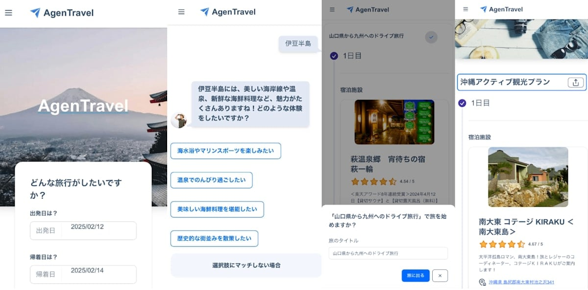
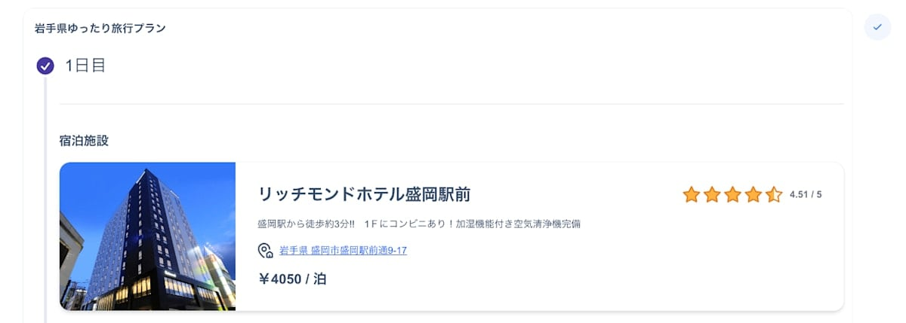
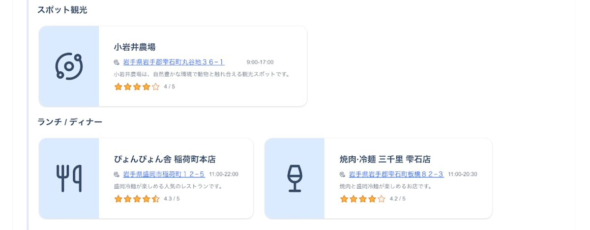
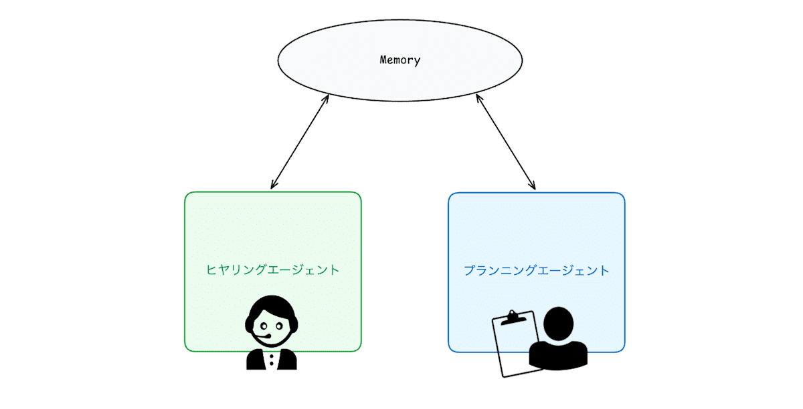
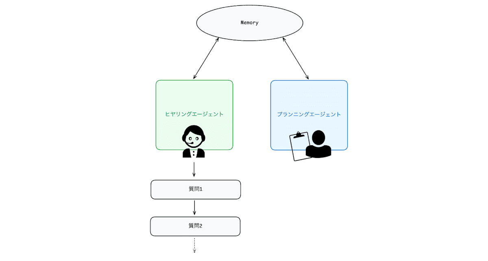
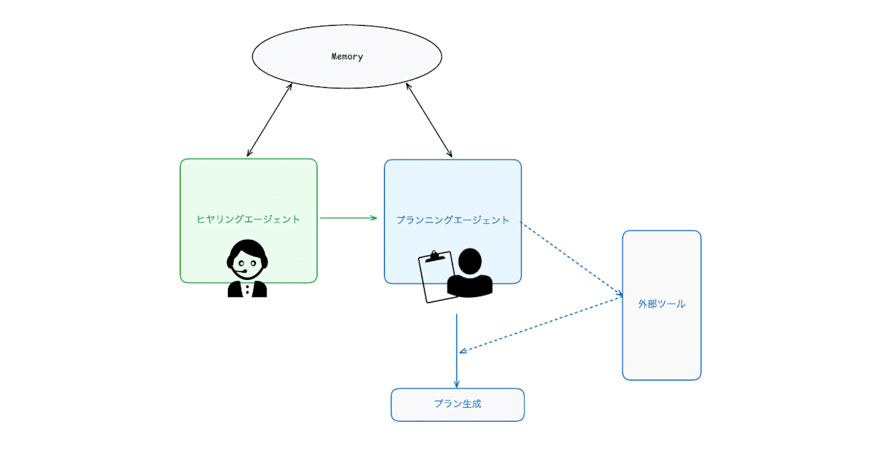
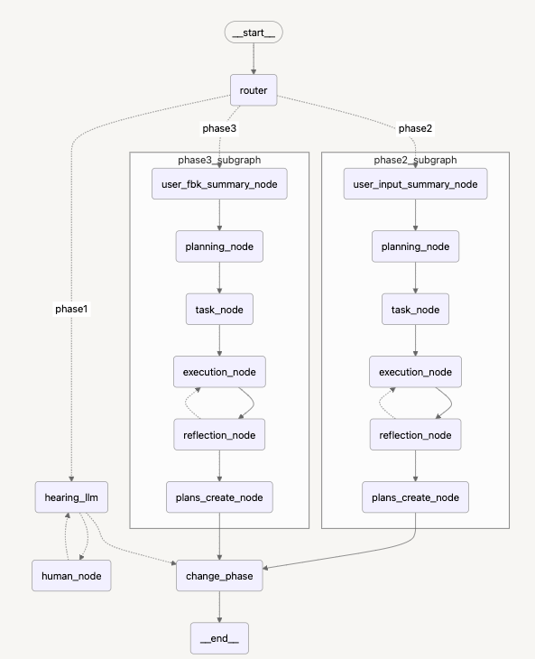
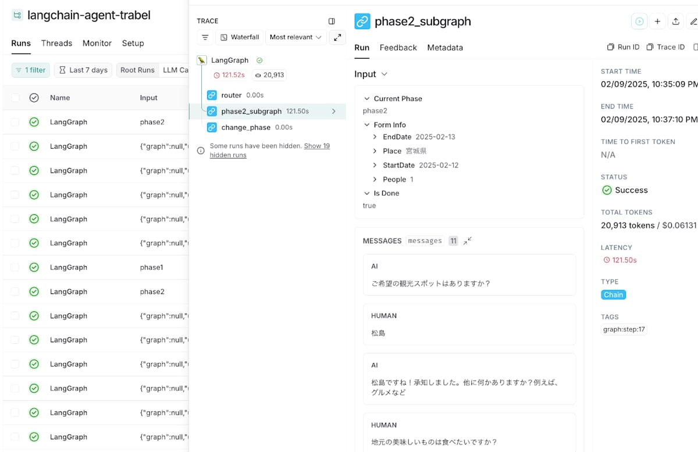
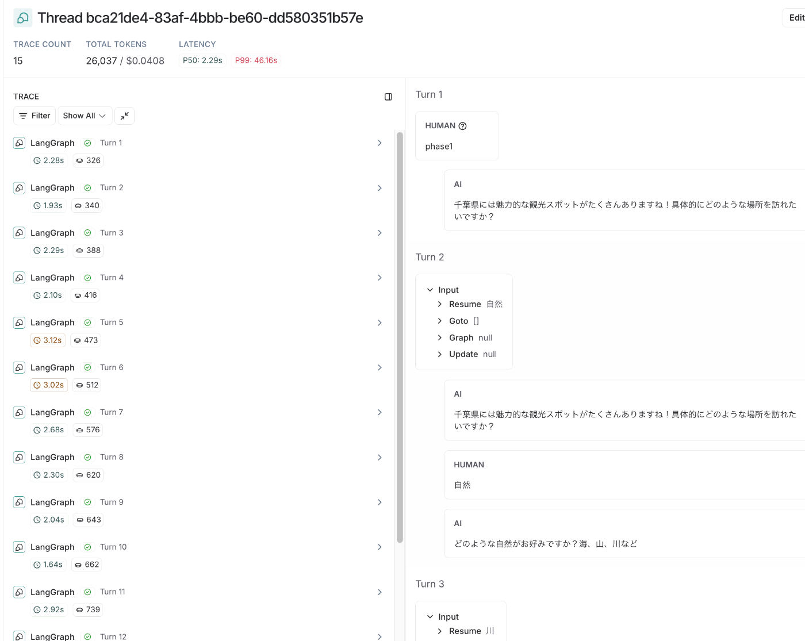

この記事はAI Agent Hackathon with Google Cloudに提出する作品です。

<https://zenn.dev/hackathons/2024-google-cloud-japan-ai-hackathon>

#  ⭐️ サービスについて

私たちのチームは【**AIエージェント** 】によって【**旅行** 】の可能性を広げ新たな体験を作ることを目指し、【**AgenTravel** 】というアプリを開発しました。

とにかくデモ動画を見ていただきましょう！

<https://www.youtube.com/watch?v=q66MUxkX7hI>

**SP版UI**

世の中にはさまざまな旅行を計画するアプリがあります。しかし、AIエージェントが旅行を計画することでAIが「**自律的** 」に「**個別最適化** 」されたプランを考えることが可能になります。

##  対象のユーザ像

対象のユーザは「**ふらっと1人旅をしたい日本人** 」です。

プロダクト開発において、幅広いユーザを対象にすることも大切ですが、**まずはターゲットセグメントを明確に絞り、それぞれのニーズや課題に対して大きなインパクトを提供する** ことが生成AIプロダクト成功の鍵だと考えています。

###  一人旅にフォーカスした理由

コロナ以後日本で1人旅の需要は拡大しています。[euromonitor](https://www.euromonitor.com/)の調査によると日本人の5人に1人が1人旅を経験しており、その割合は世界第一位です。こうした背景から、まずは需要の高い一人旅の市場にフォーカスし、ユーザのニーズに応えるサービスを目指します。

参考：[世界一の「一人旅」国、日本。コロナ禍で一人旅への見方が大きく変化（2024年）](https://bit.ly/4jOI8W2)

##  課題と対策

そんな需要が拡大している1人旅ですが、**実際に旅行に行くまでに大きく3つのハードル** があります。

  1. 行きたい都道府県を探し、目的を決める
  2. 空いている宿を探す
  3. 当日のプランを決める

###  行きたい都道府県を探し、目的を決める

1つ目は「**目的を決める** 」ことです。1人旅を計画する際に場所と目的がすでに決まっているケースは少ないでしょう。ふらっと1人旅をしたいユーザは「**なんとなく楽しそうな場所に行ってゆっくりしたい** 」など目的が不明確です。

!

**そこで、エージェントのヒヤリングによってユーザの潜在的な関心を引き出して整理します**

ここでのこだわりは**ユーザに入力をさせない** ことです。多くのAIツールはテキスト入力をベースにしていますが、今回のような**潜在的な関心を引き出すケース** においては相性がよくありません。

そのため、エージェントが提案した**複数の選択肢を選ぶだけでユーザが潜在的に持っていた興味や関心を引き出す** UXを意識しました。

###  空いている宿を探す

2つ目は「**空いている宿を探す** 」ことです。1人旅の計画において宿を探すことは非常に苦労します。

!

**そこで、エージェントがヒヤリング内容を元におすすめの"空いている"宿を提案します**

さらに**宿の予約リンクを配置してラクに予約まで行う** ことができます。

###  当日のプランを決める

最後は「**当日のプランを決める** 」ことです。多くのWebサイトに掲載されているおすすめスポットは幅広く観光客にとって楽しめる内容が多い一方、**個別最適化されているわけではありません。**

!

**そこで、エージェントが過去の旅行履歴なども踏まえてユーザの趣味嗜好をもとに、最適なプランを構築します**

エージェントは過去の**旅行履歴だけでなく、ヒヤリング内容やユーザの細かい特徴を記憶** しています。そのため、AgenTravelを使えば使うほどユーザにとって最適なプランの生成が行える基盤が整っています。

#  ⚙️ 実装とアーキテクチャ設計

これまでサービスの概要とその特徴を説明しました。次にその実装の詳細とアーキテクチャ設計を解説します。

!

**私たちはチームでAIエージェントを明確に言語化し、いかにサービスに組み込むかを徹底的に考えました。**

##  チームにおけるAIエージェントの定義

まずはAIエージェントとは何かを言語化します。

AIエージェントは「**個性** 」「**記憶** 」「**計画** 」「**行動** 」の4つの特徴を持ちます。

<https://arxiv.org/abs/2308.11432>

  * 個性 
    * エージェントはそれぞれ**固有の役割** や**専門性** を持って設計されています。
  * 記憶 
    * エージェントは**長期的な記憶領域** を持ち、過去の**経験を蓄積・活用** します。
  * 計画 
    * エージェントは最終目標を達成するために、**目標をサブタスクに分解** し、**実行順序や優先順位を決定** します。
  * 行動 
    * エージェントは外部環境との相互作用を通じて、**計画に基づいた具体的なアクションを実行** します。

##  4つの要素をどのように組み込んだか

###  個性

AgenTravelには2つのエージェントが存在します。

1つ目は「ヒヤリングエージェント」です。このエージェントは**ユーザの潜在的な旅行の目的を引き出して最適なプランを構築するためのヒヤリングを実施** します。

2つ目は「プランニングエージェント」です。このエージェントは**ヒヤリングエージェントによって整理された情報をもとに最適な旅行のプランを構築** します。

###  記憶

それぞれの**エージェントは長期記憶（Memory）を共有** しており、このMemoryからユーザの過去の情報を取得し、その前提の上でアクションを行います。

###  計画

ヒヤリングエージェントは**最終目標（ユーザの潜在的な旅行の関心を引き出すこと）のために、必要なヒヤリング項目を自律的に計画して実行** します。

###  行動

プランニングエージェントはヒヤリングの内容をもとに旅行のプランを構築します。しかし、LLMだけでは「どの宿が空いているか」「どのスポットが最適か」はわかりません。

そこでGoogleのPlaces APIと楽天トラベルAPIを組み合わせて**エージェントが外部の情報を取得できる** ようにしました。

今回の開発では実装できませんでしたが、プランの生成だけでなく、**エージェントがユーザの同意をもとに予約の完了までを実行してくれる機能の拡張** も見据えています。

##  アーキテクチャ構成

次にアーキテクチャの構成を解説します。

###  共通

「Web App」と「LLM App」の2つのリポジトリを管理しており、それぞれでデプロイを行なっています。認証には**Firebase Auth** を採用し、**Googleアカウントを用いたログイン** を行いました。DBには**Firestore** を採用しています。

<https://firebase.google.com/?hl=ja>

###  Web App

Web Appでは最速でMVPを達成するためにNext.jsを採用しました。また、**AIエージェントとステートマシンは相性がいい** と感じXStateで状態管理を行なっています。

<https://xstate.js.org/>

**AIエージェントは複数の状態を持ち、その状態によって実行されるアクションが変わります** 。これをLLM App側で制御しますが、Web App側（フロントエンド）でも同様に管理することで堅牢に実装することができます。

!

フェーズは全部で3段階ありますが**全て同じエンドポイントでbodyに渡すphaseの値によって処理を振り分け** ています。また、**LLM AppのAPIはステートレス** でありWeb Appから**過去のContextを毎回含めてリクエストする** ことによってエージェントは次の処理を実行することができます。

各フェーズで表示させるUIはXStateのContextに含まれるphaseの値を見て制御しています。これによって**フェーズごとに表示させるUIのパターンを容易にテストすることが可能** になります。

また、ステートマシンを利用することでphase1の次に遷移する状態はphase2のみであるといった、**状態遷移の制限を明確に定義することが可能** となります。

そして常にXStateの**Global Contextにエージェントからのレスポンスをpushし、LocalStorageに保存することによってリロードをした場合でも実行途中の段階から再開することができます。**

  
_phase1の場合_

###  LLM App （エージェントの構成）

**全体的なポイント**

!

フェーズという概念の導入により、**各フェーズに応じた処理を切り替え、AIエージェントの動きを実現** している

**Phase1： ヒアリング： Human-in-the-loopの実装**

ユーザーの潜在的な関心を引き出すために、**ヒアリングエージェントとしてGoogleのGeminiを採用** しました。その理由は、ユーザーに違和感や不快感を与えず、**自然で人間らしい対話ができる** こと、さらに、**日本語のニュアンスや表現を豊かに再現できる** 点で、Geminiが他のモデルより優れていると判断したためです。

**Phase2・Phase3： プラン構築・再構築**

ヒアリング結果を活かし、**プランニングするフェーズでもGoogleのGeminiを採用** しました。**発想を広げ、多様な視点から可能性を探るのに適している** と考えます。そして、**最終的なプランの構築にはOpenAIのGPTを採用** しました。**GPTは情報の正確な整理や論理的なまとめに優れている** と考えており、JSON形式などの構造化データとして出力する際の信頼性も高いためです。

!

**このように、Geminiでアイデアを広げ、GPTで確実にまとめることで、偏りを抑えつつ精度の高い旅行プランを実現しています。**

###  **LLM運用の可視化と評価基盤**

LLMのログ管理と評価、今後の運用を見据えたデータセット作成のために**LangSmith** を採用しました。これにより、AIエージェントの動作を可視化し、効果的な改善サイクルを実現しています。

**プラン生成をモニタリング**

**スレッド単位でモニタリング**

###  外部連携

!

今回はホテルと観光地の検索を実施するため、それぞれ**楽天トラベル空室検索API** と**Google Places API** を採用しました。

楽天トラベル空室検索APIは、楽天トラベルの空室検索を行うために利用します。ポイントとしては、**地域を絞り込むにあたり「楽天トラベル側の地域の仕分け粒度」に準拠する必要** がありました。

地域粒度は largeClass (国), middleClass(都道府県), smallClass(市), detailClass(区など) の4つに分かれます。今回はこの粒度をユーザーに強制させたくなかったため、あくまで**ヒアリングを通したユーザー希望の粒度感を維持** しました。

そのため、APIリクエスト実行のために**より詳細な地域コードが必要な場合は内部的に下位クラスを取得して実行** しています。

<https://webservice.rakuten.co.jp/documentation/vacant-hotel-search>

次に観光地情報の検索に使ったGoogle Places APIについてです。このAPIを利用することで**Google検索と同様のテキスト検索が可能** になります。

実行結果には口コミ数やユーザーレビューも含んだ状態で取得できます。ここでの工夫点としては、**口コミ数とレビュー点数の両方を加味して、より質が高いと思われる情報をLLMに提供できるようなロジックを追加** したところです。

<https://developers.google.com/maps/documentation/places/web-service/overview?hl=ja>

**Agentの振る舞いの質を高める上でどのような情報をLLMに提供するかはとても重要な要素** になります。API選定や取得結果の精錬は一見本質とは関係ないような気もしますが、Agent構築においてはこだわるべきポイントだと考えられます。
