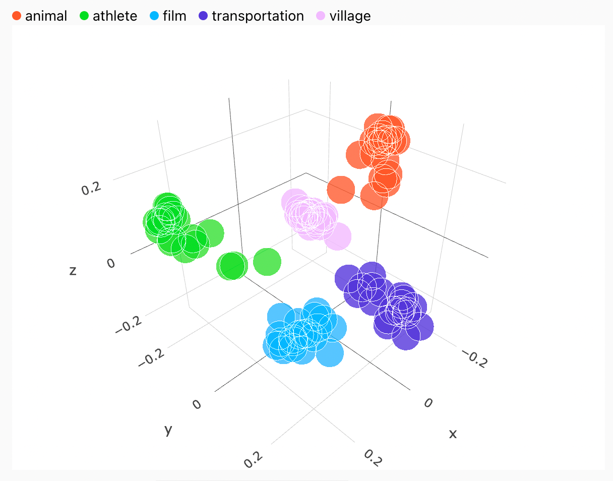
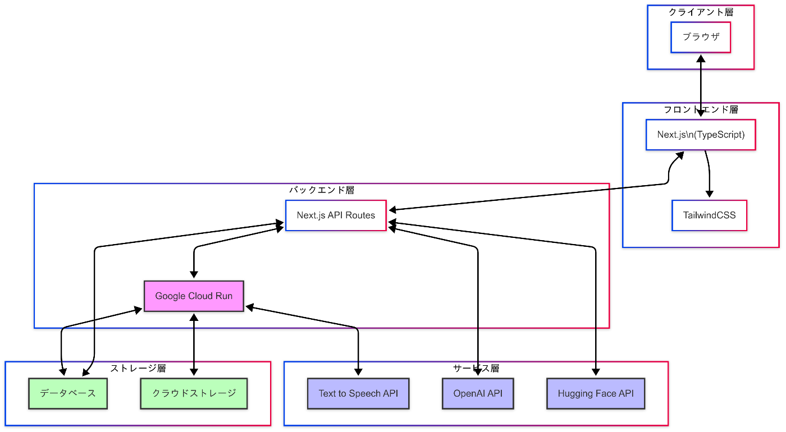

#  プロジェクトが対象とするユーザー像と課題、課題へのソリューションと特徴

##  1\. プロジェクトの背景と概要

Wikiだるまは、AIエージェントを活用した新しいタイプの情報管理ツールです。企業や組織内では、日々膨大な量の情報が蓄積されています。これらの情報を効率的に管理し、必要な時に素早く取り出せる仕組みが欠かせません。しかし、従来の社内ウィキやドキュメント管理ツールでは、情報が分散していたり、検索機能が不十分であったりするため、社員は必要な情報を迅速に取得することができず、業務が滞ることがしばしば発生します。

Wikiだるまは、これらの課題を解決するために開発されました。シンプルで直感的なUIを提供し、Notionライクなエディタ機能で情報を管理でき、AIによる自然言語処理で必要な情報を即座に引き出すことができます。さらに、音声アップロードにも対応しており、議事録やメモの音声ファイルを取り込んで、後から確認・整理することができる機能も搭載しています。これにより、情報の入力から検索、活用までをシームレスに行うことが可能になります。

##  2\. 対象とするユーザー像と具体的な活用シーン

Wikiだるまは以下のような業務改善効果を目指して開発を進めています。

  * 分散した情報の一元管理による検索時間の短縮
  * AIエージェントによる新入社員の業務サポート強化
  * 過去の議事録や資料の即時検索による会議準備の効率化
  * 部門間のナレッジ共有促進
  * ドキュメント管理における人的工数の削減

システムの導入は段階的に行うことができ、初期の投資を抑えながら、徐々に機能を拡張していくことが可能です。具体的な効果測定については、今後のβ版リリースとパイロット導入を通じて検証していく予定です。

###  (1) 経営者・マネジメント層をサポートされる方

経営者やCxO（最高経営責任者など）は、日々多くの意思決定を行い、迅速に情報を収集する必要があります。しかし、企業の情報が複数の場所に分散していたり、どこにどの情報があるのかを把握することが難しいため、効率的に必要な情報を取り出すことができません。特に、過去の議事録や重要な決定事項のエビデンスを探すのに多くの時間を費やしてしまうのが大きな課題となっています。

Wikiだるまは、以下の機能でこれらの課題を解決します：

  * すべての情報を一元管理し、AIエージェントによって自然言語での質問に即座に回答を提供
  * 過去の会議の議事録やプロジェクトのメモを瞬時に検索し、関連する情報を抽出
  * 音声入力対応により、音声ファイルを投稿するだけで、行ごとにエンベディングを実施
  * 時間の取れないトップ層の代わりに、相談に乗って的確な回答を提供できるAIの育成機能

_**エンベディング概念図**_  
  
[出典](https://openai.com/index/introducing-text-and-code-embeddings/)

これらの機能により、経営者は時間をかけずに必要な情報にアクセスでき、より迅速で的確な意思決定を行うことが可能になります。

###  (2) 新入社員・未経験者

新入社員にとって、企業内で必要な情報を効率的に吸収することは大きな課題です。特に、マニュアルや業務フロー、社内規定などが複数の場所に分散している場合、必要な情報を探すだけでも時間がかかり、学習効率が低下してしまいます。また、質問するにも、忙しい先輩社員に対して遠慮があったり、すぐに答えてもらえないことも多々あります。

Wikiだるまは、以下の方法でこれらの課題を解決します：

  * ユーザーが疑問に思ったことをAIエージェントに質問するだけで、瞬時に最も関連性の高い回答を提供
  * 社内の膨大な情報を簡単に把握し、学習の負担を大幅に軽減
  * 音声入力対応により、手を使わずに音声で質問が可能
  * 同僚や上司に頼ることなく、必要な情報をすぐに入手可能

特に、転職が当たり前となっている昨今において、企業特有のコンテキストを素早くキャッチアップする機能は不可欠です。Wikiだるまは、この過程を効率的にサポートし、新入社員の早期戦力化を促進します。

###  (3) 中堅社員・チームリーダー

中堅社員やチームリーダーは、日々の業務をこなしながら部下のサポートも行う必要があります。業務に関する質問が多いため、効率的に情報を引き出し、共有する方法を確立することが求められます。また、プロジェクト管理や報告書作成など、多岐にわたる業務をこなす必要があり、情報の整理と活用が重要になります。

Wikiだるまは、以下の機能でこれらの課題に対応します：

  * 情報を「ブロック単位」でエンベディングし、ベクトル化することで、高精度な情報検索を実現
  * AIが質問に対して即座に関連性を計算し、最適な情報を提供
  * 過去のプロジェクトメモや規定を迅速に確認可能
  * 部下の質問に対する即時の回答支援

これらの機能により、チームリーダーの業務効率が向上し、より質の高いチームマネジメントが可能になります。

##  3\. 現在の課題とその解決方法

###  (1) 情報の断片化とアクセスの難しさ

企業内で情報が断片的に保存されている場合、その情報を探し出すのに多くの時間が必要です。従来のウィキやドキュメント管理ツールでは、必要な情報を検索する手間が生じ、効率的に活用することが困難でした。

Wikiだるまによる解決策：

  * 情報の一元管理システムの構築
  * 自然言語による質問システムの実装
  * AIによる関連情報の即時提供
  * 文脈を理解した適切な回答の生成
  * 情報量の増加に応じたAIの精度向上

特に、歴史のある企業ほど情報が散漫している可能性が高く、ドキュメント情報のみで効率的に集約できるシステムは、これまでにない革新的なソリューションとなります。

###  (2) 知識の維持と活用の課題

企業内で蓄積された知識を効果的に活用することは容易ではありません。特に情報が古くなったり、見つけにくくなったりすると、その価値が失われてしまう可能性があります。また、社員間での情報共有が円滑に行われないことで、時間的なロスが生じることも少なくありません。

Wikiだるまによる解決策：

  * ブロック単位でのエンベディングによる効率的な情報管理
  * 関連性計算に基づく高精度な情報検索
  * 企業内知識の一元化と最新状態の維持
  * 情報量の増加に応じたAI精度の向上
  * リアルタイムでの情報更新と共有機能

##  4\. プロジェクトの特徴と技術的背景

###  システム構成と技術スタック

Wikiだるまは、最新のクラウドネイティブアーキテクチャを採用し、以下のような技術スタックで構築されています：

####  フロントエンド/サーバーサイド

  * Next.jsによるフルスタックアプリケーション開発
  * TypeScriptによる型安全な開発
  * TailwindCSSによる効率的なスタイリング
  * Next.js APIルートによるサーバーサイド機能の実装

####  バックエンドサービス

  * Google Cloud Runによるサーバーレスコンテナ実行環境
  * Text to Speech APIによる音声変換機能
  * Next.js APIルートを活用したサーバーレスバックエンド
  * データベースとの連携による堅牢なデータ管理

####  AI/ML基盤

  * OpenAI APIとの連携
  * Hugging Face APIとの連携
  * マルチモーダル学習による音声・テキスト統合処理

####  インフラストラクチャ

  * Google Cloud Platformによるクラウドインフラ
  * Cloud Runによるコンテナ実行基盤
  * CloudFlareによるグローバルCDN配信
  * セキュアなクラウドストレージ

#  システム アーキテクチャ図

###  (1) 先進的なエンベディング技術とベクトル化

Wikiだるまは、情報を「ブロック単位」でエンベディングし、ベクトル化することにより、高度な関連性の計算を実現します。この技術により：

  * キーワード検索に依存しない、文脈に基づいた情報提供
  * 高精度な回答生成システム
  * 効率的な情報の整理と検索
  * スケーラブルな情報管理基盤

###  (2) ローカライズされたAI活用

従来のChatGPTなどの一般的なAIと異なり、Wikiだるまは企業特有の情報に特化した「ローカル情報のChatGPT」として機能します：

  * 企業固有の規定や過去の議事録の学習
  * 業務マニュアルに基づいた回答生成
  * カスタマイズ可能な応答システム
  * セキュアな情報管理基盤

###  (3) 将来の拡張機能

今後の展開として、以下の機能追加を予定しています：

####  漫画カルチャーを活用したカスタマイズ機能

  * 自由なキャラクター選択によるAIチャットボットのカスタマイズ
  * 全国のご当地キャラクター・ゆるキャラのAIエージェント化
  * シンプルな埋め込みコードによるチャットボット呼び出し
  * クリエイターへの収益還元システムの構築

####  予約管理システムの実装

  * GoogleカレンダーなどとのAPI連携
  * AIによる最適な会議時間の提案
  * ワンクリックでの予約確定機能
  * スケジュール調整の自動化

###  (4) グローバル展開戦略とセキュリティ対策

####  グローバル展開

Wikiだるまは、日本国内に限らず、世界中で利用可能な新しいタイプのエンベディング・ドキュメントシステムとして展開します：

  * 多言語対応による国際展開（日本語、英語、中国語、韓国語、その他主要言語）
  * 各地域の文化に適応したカスタマイズ機能
  * グローバルな情報共有基盤の構築
  * 国際的なナレッジマネジメントの実現
  * 24時間365日のグローバルサポート体制
  * 音声ファイル取込時間の短縮化

####  セキュリティ対策

企業の重要な情報を扱うシステムとして、以下のような高度なセキュリティ対策を実装しています：

##### アクセス制御

  * Role-Based Access Control (RBAC)による細かな権限管理
  * 多要素認証によるセキュアなログイン
  * シングルサインオン（SSO）対応
  * IPアドレスによるアクセス制限

##### データ保護

  * AES-256による全データの暗号化
  * エンドツーエンドの暗号化通信
  * 定期的なバックアップと災害復旧対策
  * データの地理的冗長化

##### コンプライアンス対応

  * GDPR準拠のデータ管理
  * SOC2 Type II認証取得
  * ISO 27001認証取得
  * PCI DSS準拠

これらの対策により、企業の機密情報を安全に管理しながら、効率的な情報共有を実現します。  
Wikiだるまは、日本国内に限らず、世界中で利用可能な新しいタイプのエンベディング・ドキュメントシステムとして展開します：

  * 多言語対応による国際展開
  * 各地域の文化に適応したカスタマイズ
  * グローバルな情報共有基盤の構築
  * 国際的なナレッジマネジメントの実現

これにより、企業の国際展開やグローバルチームの協業をさらに促進し、世界規模での業務効率化を実現します。さらには、Javascriptの１ラインコードによって、あらゆるWebページにWikiだるまで育成したチャットボット導入を可能にし、雪だるま式にビジネスを発展させます。

#  デモ動画

<https://youtu.be/OKfL22Nj-3w>
