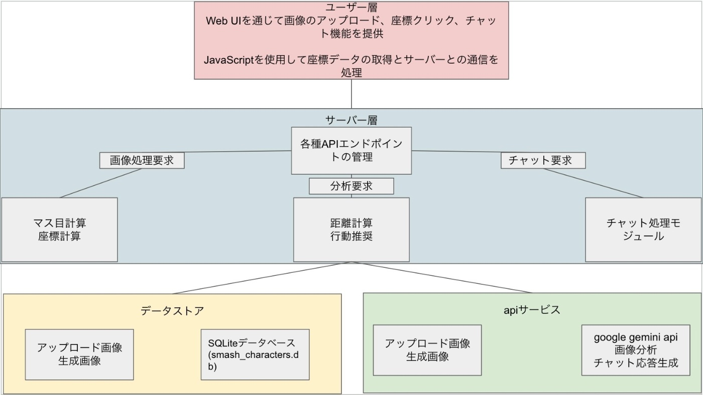
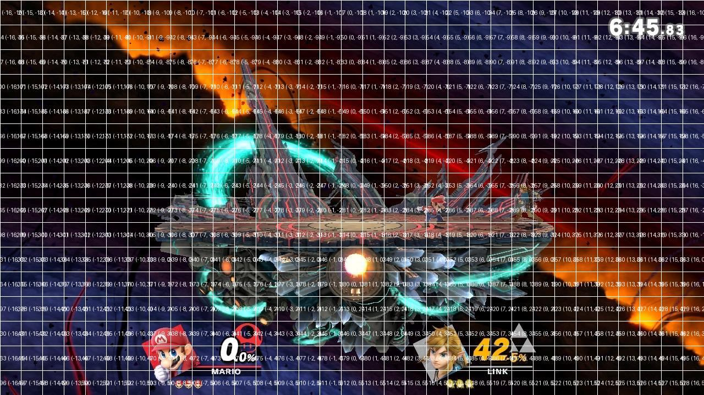
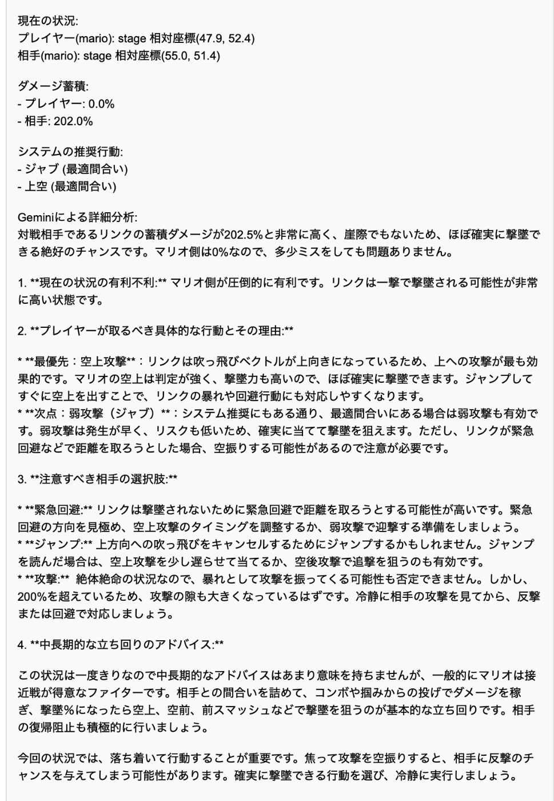

youtube:<https://youtu.be/V89e8IKk7L8>  
作品URL:<https://smash-analyzer-dtbx5ymvvq-an.a.run.app/>

#  はじめに

「大乱闘スマッシュブラザーズ SPECIAL」（以下、スマブラSP）は、eスポーツとして世界的な人気を誇るゲームタイトルです。しかし、その奥深い戦略性と高度な操作技術の要求から、多くのプレイヤーが上達に苦心しているのが現状です。また、このゲームに限られた話ではなくゲームを上達したい人は多くいる。本記事では、AIを活用したゲームプレイ支援システムの開発について、その詳細について記述する。

#  第1章：スマブラSPの特徴と現状の課題

##  1.1 ゲームの特徴

###  1.1.1 キャラクターの多様性

スマブラSPには87体のファイターが登場し、各キャラクターが独自の特性を持っています。例えば、マリオは全体的にバランスの取れた性能を持つ基本的なキャラクターであり、初心者のプレイヤーも多く扱うキャラクターである。一方、リンクは飛び道具(遠距離攻撃)を活用した長距離戦を得意とするなど、キャラクターごとに最適な戦略が大きく異なります。

###  1.1.2 戦略的深度

戦略性は以下の要素から構成されています：

  1. 状況判断能力  
・相手との距離を把握する  
・お互いの％（ダメージ）状況  
・ステージ上での自分と敵の位置関係  
・ステージに復帰する際の駆け引き

  2. 技の選択  
・各技の特性  
・リスクとリターンの判断  
・コンボルート(技を連続で繋げること)

  3. 心理戦  
・相手の癖を把握する  
・駆け引きの重要性  
・相手の動きを予測し対応する

###  1.1.3 操作技術の要求

操作技術は以下の要素で構成されています：

基本操作  
・移動の最適化  
・ジャンプの使い分け(ジャンプは小ジャンプと大ジャンプの2種類がある)  
・シールドの活用  
・空中回避のタイミング

###  1.1.4 距離管理の重要性

距離管理は以下の観点から極めて重要であり技術を上達させる上で必須となります。

  1. 攻撃範囲の理解  
・ 各技の射程距離  
・ 判定の持続時間  
・ 当たり判定の形状

  2. 最適距離の維持  
・キャラクター特性に応じた距離  
・相手の技を避ける距離  
・攻撃チャンスを作る距離

  3. 移動による距離調整  
・ダッシュの活用  
・歩きの使用  
・バックステップ  
・空中移動

##  1.2 現状の課題

###  1.2.1 指導者不足の問題

現在のスマブラSPにおける指導者不足は、以下の点で深刻な問題となっています：

  1. オンラインコンテンツの限界  
・ 一方向的な情報提供であるため個々のプレイヤーの悪い部分がわからない  
・ 質問への即時対応不可

  2. 対面指導の困難さ  
・時間的制約  
・コスト面での問題(初心者はコストをかけてまで上達しようと思わない)

  3. 技術評価の主観性  
・客観的な評価基準の不在  
・数値化された指標の不足  
・進捗管理の困難さ

###  1.2.2 練習方法の課題

効率的な練習方法が確立されていない現状には、以下のような問題があります：

  1. 体系化された練習メニューの不在  
・段階的な学習順序の欠如  
・優先順位付けの困難さ  
・練習時間の非効率な使用

  2. フィードバックループが困難  
・改善点の特定することができない  
・進捗の可視化が難しい  
・初心者のモチベーション維持の難しさ

  3. 個人差への対応  
・習熟度に応じた調整の困難さ  
・個人の特性に合わせた最適化

#  第2章：システム開発の概要

##  2.1 開発目的

本システムは以下の3つの主要な目的を持って開発されました：

###  2.1.1 位置関係の数値化

キャラクター間の位置関係を数値化し、以下の要項を実装しました：

  1. 距離の定量的評価  
・マス目単位での距離測定(マス目というのはトレーニングモードのマス目の大きさ)  
・相対位置の座標化

  2. 最適距離の判定  
・キャラクターの特性に基づき評価  
・技の射程との関連付け  
・敵の攻撃可能な範囲の特定

  3. 位置取りの分析  
・有利不利の判定  
・ステージ位置の評価

###  2.1.2 射程範囲の可視化

技の射程範囲を可視化することで、以下の理解を促進します：

  1. 攻撃判定の理解  
・判定の大きさ

  2. 有効範囲の把握  
・最適な使用距離  
・相手の技との比較

  3. リスク管理  
・反確範囲の特定  
・安全な距離の把握

###  2.1.3 AI支援の実装

Gemini AIを活用して以下の項目をアドバイスできるようにした：

  1. 状況分析  
・位置関係の評価  
・有利不利の判定

  2. 技選択の提案  
・最適な技の推奨  
・コンボの提案  
・対応策の提示

  3. 学習支援  
・練習メニューの提案  
・改善点の指摘  
・進捗管理の支援

##  2.2 システム構成

###  2.2.1 データベース設計

以下の7つの項目をデータベースに登録した：

  1. キャラクター基本情報  
・基礎ステータス(体重・x軸方向の大きさ・y軸方向の大きさ)

  2. B技情報  
・射程距離(x軸方向のマス目・y軸方向のマス目)  
・ダメージ値  
・発生フレーム  
・武器判定かどうか  
・飛び道具かどうか

  3. 強・弱攻撃情報  
・射程距離(x軸方向のマス目・y軸方向のマス目)  
・ダメージ値  
・発生フレーム  
・武器判定かどうか  
・飛び道具かどうか

  4. スマッシュ攻撃情報  
・射程距離(x軸方向のマス目・y軸方向のマス目)  
・ダメージ値  
・発生フレーム  
・武器判定かどうか  
・飛び道具かどうか

  5. 空中技情報  
・射程距離(x軸方向のマス目・y軸方向のマス目)  
・ダメージ値  
・発生フレーム  
・武器判定かどうか  
・飛び道具かどうか

  6. ダッシュ技情報  
・射程距離(x軸方向のマス目・y軸方向のマス目)  
・ダメージ値  
・発生フレーム

  7. つかみ技情報  
・射程距離(x軸方向のマス目・y軸方向のマス目)  
・ダメージ値  
・発生フレーム

###  2.2.2 画像処理システム

  1. グリッドシステム(入力した画像にトレーニングモードと同じ大きさのマス目を追加する)  
・33×16のマス目分割  
・座標系の確立

  2. 位置特定機能  
・キャラクター位置の検出  
・相対位置の計算  
・移動量の測定

###  2.2.3 AI分析エンジン

  1. 判断システム  
・技の選択アルゴリズム  
・リスク評価

  2. 出力生成  
・アドバイス生成  
・視覚的フィードバック  
・学習ガイダンス

これらの内容について第3章で詳しく解説する。

#  第3章：システムの詳細実装

##  3.1 データベース実装

###  3.1.1 テーブル設計の詳細

各テーブルは以下の情報を含んでいる：

  1. キャラクター基本情報  
・ キャラクターID  
・名前  
・サイズ（x軸方向の大きさ/y軸方向の大きさ）  
・重量

  2. 技情報共通項目  
・技ID  
・キャラクターID  
・技種類  
・射程範囲（x軸方向の大きさ/y軸方向の大きさ）  
・ダメージ  
・発生フレーム  
・追加効果(武器判定/飛び道具判定)

###  3.1.2 データ収集と登録

データ収集は以下のプロセスで行われます:

  1. 下記のサイトで技の範囲を特定  
<https://ultimate-hitboxes.com/>
  2. トレーニングモードで範囲がマス目いくつ分なのかを計測
  3. フレーム数に関しては、トレーニングモードに搭載されているコマ送り機能を用いた

##  3.2 画像処理実装

###  3.2.1 グリッドシステム

グリッドシステムは以下の機能を搭載しました：

  1. 基本グリッド  
・マス目の生成  
・座標系の設定

  2. ラベリング  
・マス目番号の付与  
・座標値の表示

###  3.2.2 キャラクター位置検出

位置検出は以下の手順で行われます：

  1. 入力処理  
・クリック位置の取得(最初にマリオの位置を画像からクリックし、次にリンクの位置を画像内でク リックする)  
・マス目変換  
・座標記録

  2. 位置計算  
・相対位置の算出  
・距離の計算  
・方向の特定

##  3.3 AI実装

###  3.3.1 Gemini AIの活用

Gemini AIで以下の項目の内容を実装した：

  1. 入力処理  
・状況データの受信  
・パラメータの解析  
・コンテキスト理解

  2. 分析処理  
・技の優先度計算  
・リスク評価

  3. 出力生成  
・有利不利状況の提示  
・プレイヤーが取るべき具体的な行動とその理由  
・注意すべき相手の選択肢  
・中長期的な立ち回りのアドバイス

実際に出力されたものが以下のものになる。  

#  第4章：実践的な活用事例

##  4.1 初心者向け活用

###  4.1.1 基礎学習支援

初心者の方に向けて以下のような活用事例が期待することができる：

  1. 基本動作の習得  
・移動の最適化  
・どの技をの使用すればいいか  
・防御の方法

  2. 概念理解の促進  
・ゲームシステムの説明  
・技の特性理解  
・戦略の基礎

##  4.2 中級者・上級者向け活用

###  4.2.1 高度な戦略分析

中級者・上級者の方に向けて以下のような活用事例が期待することができる：

  1. 詳細なデータ分析  
・フレームデータの活用  
・確定反撃の把握  
・リスク計算

  2. マッチアップ研究  
・有利不利の分析  
・対策の立案

#  第5章：今後の展望と課題

##  5.1 システムの拡張性

###  5.1.1 機能拡張

今後追加予定の機能：

  1. リアルタイム分析  
・試合中の即時アドバイス(もしくは、画像ではなく映像での分析)  
・パターン認識(相手の癖を見抜くことは勝利に大きく近づくため)

  2. カスタマイズ機能  
・個人設定の保存  
・トレーニングメニューの作成  
・目標設定の管理

###  5.1.2 対応範囲の拡大

システムの対応範囲拡大：

  1. キャラクター追加  
・全キャラクターへの対応  
・データの継続的更新

  2. ステージ対応  
・各ステージへの対応(小戦場・戦場・その他...)  
・ステージ固有の戦略

##  5.2 技術的課題

###  5.2.1 性能向上

必要な性能改善：

  1. 処理速度の最適化  
・アルゴリズムの改善  
・並列処理の導入

  2. 精度向上  
・判定の正確性向上  
・エラー率の低減  
・予測精度の向上

  3. リソース管理  
・メモリ使用の最適化  
・CPU負荷の軽減  
・ストレージの効率化

#  第6章：結論

##  6.1 研究成果

###  6.1.1 技術的成果

達成された技術的成果：

  1. システム構築  
・基本機能の実装  
・データベースの確立  
・AI機能の統合

  2. 性能実現  
・正確な判定  
・安定した動作

##  6.2 今後の展開

###  6.2.1 短期的な目標

直近の開発目標：

  1. 機能の充実  
・未実装機能の追加  
・既存機能の改善

  2. コミュニティ拡大  
・ユーザーの増加  
・実際に使用してもらいフィードバックを収集

###  6.2.2 長期的なビジョン

将来的な展望：

  1. プラットフォーム化  
・総合的な学習環境  
・コミュニティハブ  
・競技支援システム

  2. 技術革新  
・新技術の導入  
・独自機能の開発  
・先進的な分析手法

  3. グローバル展開  
・多言語対応  
・国際大会対応  
・世界規模の普及

#  おわりに

本研究で開発したシステムは、スマブラSPのプレイヤー支援という具体的な目的に向けて、様々な技術を統合し、実践的な解決策を提供することに成功しました。特に、距離管理の可視化とAIによる技選択の支援という核心的な機能は、プレイヤーの技術向上を効果的に支援する新しいアプローチとなると考えます。

今後は、さらなる機能の拡張と精度の向上を目指すとともに、実際のプレイヤーからのフィードバックを積極的に取り入れ、より実用的なシステムとして発展させていく予定です。また、このシステムで得られた知見を活かし、他のゲームタイトルやeスポーツ分野への応用も検討していきたいと考えています。
