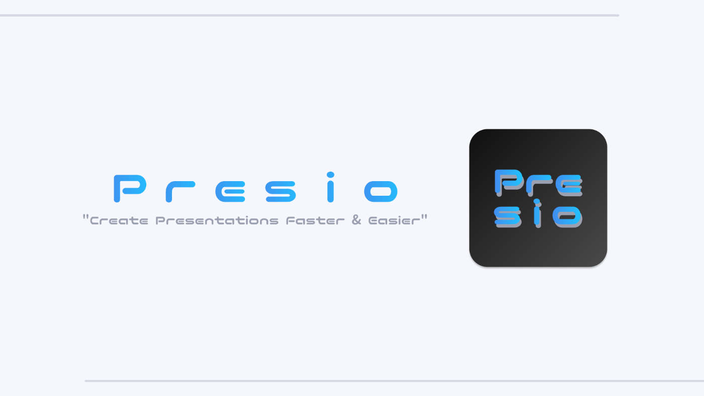
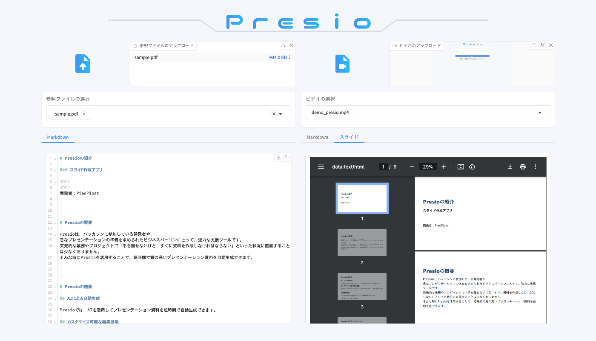
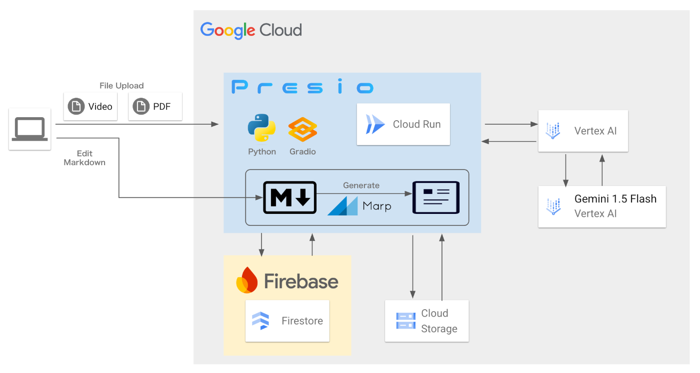

#  I.『Presio』の概要

Presioは、ハッカソンに参加している開発者や、急なプレゼンテーションの準備を求められたビジネスパーソンにとって、強力な支援ツールです。  
突発的な業務やプロジェクトで「手を離せないけど、すぐに資料を作成しなければならない」といった状況に直面することは少なくありません。  
そんな時にPresioを活用することで、短時間で質の高いプレゼンテーション資料を自動生成できます。

##  Presioの対象ユーザーと解決する課題

Presioがターゲットとするユーザーは、以下のような状況に直面する人々です。

  * ハッカソン参加者 
    * 短期間で開発したプロダクトを効果的に伝えるプレゼン資料が必要。
    * コーディングやデバッグに集中したいため、資料作成に時間を割けない。
  * ビジネスパーソン・営業担当者 
    * 突然の会議やクライアント向けプレゼンが発生し、急いで資料を作る必要がある。
    * 過去の資料を活用しつつ、新たな内容を迅速に盛り込みたい。
  * スタートアップ創業者・プロジェクトリーダー 
    * 投資家向けのピッチ資料や社内向けの説明資料を素早く作成したい。
    * チームメンバーと共同で資料を作成・編集し、効率よく情報を整理したい。

##  課題へのソリューションとPresioの特徴

Presioは、AI技術を活用することで、上記の課題を解決します。

###  AIによる自動生成

Presioでは、AIを活用してプレゼンテーション資料を短時間で自動生成できます。

  * テーマの解析と内容の要約 
    * ユーザーが入力したテーマやアップロードしたデータをAIが分析し、最適なプレゼン資料を作成。
    * キーワード抽出技術を活用し、プレゼンの主旨に沿った適切な情報を自動で整理。
  * スライドデザインの最適化 
    * AIが資料の構成を考慮し、適切なスライドレイアウトを選定。
    * 文字の配置や画像の比率を考慮し、視認性の高いデザインを適用。
    * 適切なタイトルやキャッチコピーを自動生成し、効果的なプレゼンをサポート。

###  カスタマイズ可能な編集機能

Presioでは、AIが作成したスライドをユーザーが自由に編集し、細かな調整が可能です。

  * スライドのテキスト編集 
    * 生成されたスライドの文章を編集し、より詳細な説明を追加可能。
    * 文章の要約や補足情報の挿入が容易にできるUIを提供。
  * デザインのカスタマイズ 
    * フォントやカラーの調整機能を搭載し、ブランドカラーや好みに応じたデザインに変更可能。
    * レイアウトの変更や、スライドの順番を簡単に調整可能。
    * プレゼン形式（シンプル / 詳細 / インフォグラフィックなど）の切り替えが可能。

###  共同編集機能

チームでの資料作成を円滑にするために、共同編集機能を提供します。

  * チームメンバーとの作業 
    * ログイン時に作成したIDとパスワードを共有することで複数人がスライドを編集することを可能にします。
    * 編集されたスライドの情報はクラウド上に保存され、それを呼び出すことで複数のプラットフォームからアクセス可能です。
  * コメント機能 
    * MarkDownを基本にした資料作成ツールなのでその機能に則ったコメントアウト機能が実装できます 。

###  プレゼンテーションの保存

Presioでは、作成したプレゼン資料の情報をクラウド上に保存し、必要なときにすぐに利用できます。

  * プレゼンテーション資料へのコンバート 
    * PresioではMarkDownで記述されたプレゼンテーション資料をリアルタイムでプレゼン資料としてプレビュー化します。
    * 最終的に使用するプレゼンテーション資料を出力することも可能です。   
このようにPresioは、AIを活用した自動生成・編集機能・共同作業のサポートにより、プレゼン資料の作成時間を大幅に削減します。   
短時間で質の高い資料を用意する必要がある場面で、ぜひご活用ください！

#  II.『Presio』のシステムアーキテクチャ

Presioは下記のアーキテクチャをベースに次の流れで処理を行っています。  
1.ユーザーがPresioのフロントエンドにアクセス。  
2.ユーザーがログインIDとパスワードを設定し、Presioコンソールにログイン。   
3.入力されたログインIDとパスワードをもとに、Firebase上にユーザー情報を登録。   
4.プレゼン資料のテーマとなるファイルをユーザーがアップロード。   
5.プレゼン資料の対象となる動画をユーザーがアップロード。   
6.アップロードされたファイルはFirebase Cloud Storageに格納。   
7.格納されたファイルを基に、GenAIを活用してプレゼンテーション資料を生成。   
8.生成されたプレゼン資料はMarkDown形式で出力され、Firebase Firestoreに保存。   
9.Firestoreに保存されたMarkDown形式のプレゼン資料をフロントエンドに出力。   
10.ユーザーがフロントエンドから編集を行うと、その内容は随時Firestoreに更新。   
11.プレゼンテーション資料は、「Marp」ツールを使用してスライド形式に変換。   

これらのアーキテクチャはすべてDocker上でコンテナ管理されており、各コンポーネントが独立した環境で動作します。  
また、CI/CDパイプラインを導入しており、アップデートや新機能の追加時には自動デプロイが実行されるため、常に最新の状態を維持できます。

#  III.『Presio』のデモ

<https://www.youtube.com/watch?v=ADSl7_9S71Y>

#  IV.『Presio』の今後について

Presioは、より多くのユーザーにとって使いやすく、効率的なプレゼンテーション作成ツールとなることを目指し、さらなる機能拡張と利便性向上に取り組んでいます。  
今後、以下の開発を計画しています。

##  プレゼンデザインの自動最適化

  * AIによるデザイン調整機能を強化し、プレゼンの内容に最適なスライドデザインを自動生成。
  * スライドごとに適切なフォントや配色、レイアウトを自動調整し、視覚的に統一感のある資料を作成。
  * ユーザーが希望するデザインテーマ（シンプル、ビジネス向け、カジュアル、ハイテクなど）を指定できるカスタマイズオプションを提供。
  * データ可視化にも対応し、グラフやインフォグラフィックの自動生成機能を拡充。
  * プレゼンの目的に応じたスタイルの自動提案（例：説得力を重視するなら「ストーリー形式」、データ重視なら「グラフ中心」など）。

##  多言語対応

  * 英語や中国語をはじめとする多言語対応を強化し、グローバルなビジネスシーンでも活用できる環境を整備。
  * 自動翻訳機能を組み込み、日本語のプレゼン資料を瞬時に他言語へ変換し、海外クライアント向けのプレゼンにも対応可能に。
  * 言語ごとの表現の違いを考慮した自然な翻訳を実現するために、機械翻訳とAIによる文章の校正機能を組み合わせたシステムを開発。
  * スライドの内容だけでなく、ナレーションの多言語化も視野に入れ、プレゼン音声の自動翻訳機能の開発を検討。

##  より高度な共同編集機能

  * チームでのプレゼン資料作成をさらにスムーズにするため、アクセス権限の詳細設定を可能に。 
    * 管理者権限：スライドのロック・編集範囲の制限。
    * 編集者権限：特定のスライドのみ編集可能にする設定。
    * 閲覧専用権限：変更不可だが、コメントやフィードバックは可能。
  * 音声入力やAIアシスタントによるサポート機能を追加し、テキスト入力の手間を削減。
  * 「スライドの変更履歴管理」機能を強化し、いつ誰がどの部分を編集したかを可視化。
  * チームメンバー同士でリアルタイムにコメントをやり取りできる機能を拡充し、フィードバックの効率を向上。

##  API連携の強化

  * 他のプロジェクト管理ツール（Notion、Trello、Slack など）とのシームレスな統合を実現し、ワークフローを最適化。 
    * 例：Trelloのタスクとプレゼン資料を自動リンク、Slackで編集通知をリアルタイム送信。
  * 既存のプレゼン作成ツール（Google スライド、PowerPoint）との互換性を高め、インポート・エクスポート機能を充実。
  * ユーザーが日常的に使用するツールとの連携により、プレゼン作成の効率を最大限に高める。
  * 外部データベースやクラウドストレージ（Google Drive、Dropbox）との自動同期機能を実装し、常に最新のプレゼン資料を管理可能に。

Presioは、これらの機能を順次追加し、幅広いユーザーにとってより使いやすく、革新的なプレゼンテーション作成プラットフォームを目指します。

#  V.おまけ-開発時の苦労ごと

Presioの開発において、以下の点で特に苦労しました。

##  フロントエンドのデザインの作成

  * 使いやすさとデザイン性を両立させるため、UI/UX設計に試行錯誤。
  * 直感的な操作性を実現しながらも、プロフェッショナルなプレゼン資料を作成できるような洗練されたデザインを採用。
  * デザインフレームワーク（Material UI、Tailwind CSS、Chakra UIなど）を比較検討し、独自でUIを作成

##  Gemini AIへのデータ入力

  * AIが意図した形でプレゼン資料を生成するために、データの前処理やプロンプトの設計に多くの試行錯誤を重ねた。
  * ユーザーが入力するテキストから、最適なスライド構成を導き出すために、要約アルゴリズムの調整を実施。
  * 出力結果が一貫性を持つようにするため、AIの出力ルールを細かく設定し、品質の安定化を図った。

##  スライド作成のプロンプト精度向上

  * AIが生成するプレゼン資料の品質を向上させるため、適切なプロンプトの設計が重要だった。
  * 生成されるスライドのタイトルやコンテンツの一貫性を確保するために、AIの出力パターンを分析し、調整。
  * さまざまな業種・用途に適用できる柔軟なプロンプトを設計するため、テストケースを増やし、幅広いニーズに対応できるように改善。
  * 新しい技術の学習と適用
  * Marp（Markdownでスライドを作成するツール）を活用し、テキストベースのスライド作成との融合を検討。
  * Generative AIの技術を活用するにあたり、LLMの特性を理解し、適切なデータフィードを行うことが課題となった。
  * チーム内で技術的な知見を共有し、スムーズな開発を進めるために、ナレッジ共有の仕組みを導入。
  * フロントエンドとバックエンドのシームレスな連携を実現するために、APIの最適化を検討。

#  VI.最後に

本記事を最後までご覧いただきありがとうございました。   
今回は「[AI Agent Hackathon with Google Cloud](https://zenn.dev/hackathons/2024-google-cloud-japan-ai-hackathon)」に参加して作成した作品についての紹介と開発時のあれやこれやをお話ししてきました。  
最近の生成AIをうまく作品に組み込む難しさを学ぶとともに、「ユーザーが求めるもの」と「生成AIが提供するもの」のギャップをいかにして発見して埋められる作品を作るのかが鍵だと思いました。  
今後も開発を続けていければと思っていますので、ぜひ少しても応援していただける方はいいねお願いします！

この作品の開発協力者  
[RyogaCloud](https://x.com/ryoga_cloud)  
[Shikuma Teruaki](https://x.com/ShikumaTeruaki)
