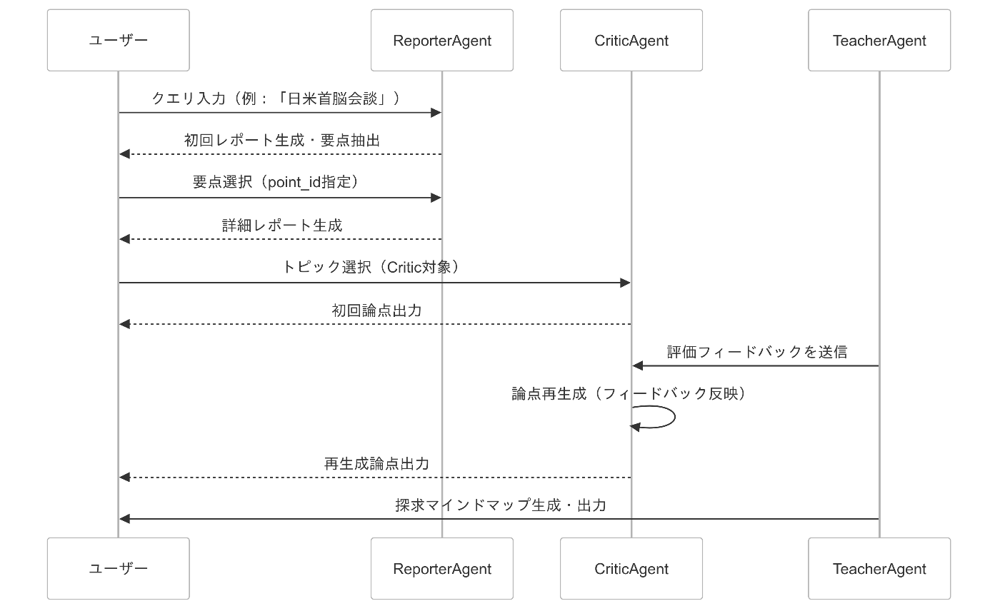

本プロジェクトでは、AIエージェントが報告者、論点担当、教員として連携し、国際ニュースの背後にある**歴史的背景** や**重要な論点** を探究する教室を構築した。安全保障リスクの高まりがよりいっそう懸念される現代において、国際ニュースを探究することは、一般人にとっても一定の意義がある。

そして何よりも、情報過多による誤情報の拡散が懸念される現代において、多角的な視点からの探究は必須である。懐かしの、**教室** というフレームワークを通して、1対1のChatBotとの対話のような直線的な学びからの脱却を図った。

* * *

#  対象ユーザーとその課題

本プロジェクトは、国際ニュースや国際政治、歴史的背景に関心を持つ一般ユーザー、学生などを主な対象としている。

現代では、情報の氾濫と誤情報の拡散により、従来のニュース記事や単一の視点に依存した情報提供だけでは、ニュースの真意や背景を十分に理解することが難しくなっている。

ユーザーは、仮に多角的な視点からニュースを読み解き、深い洞察を得ようとしても、膨大な情報を整理し、関連する論点や対立する視点を統合する仕組みが不足しているという課題を抱えていると考える。

#  課題へのソリューション

本プロジェクトは、複数のAIエージェントが連携するシステムを通じて、以下の方法でこれらの課題に対処する。

  * **多角的な情報収集と解析**  
報告者エージェントは、ウェブ検索やリトリーバル機能を用いて初回レポートと詳細レポートを自動生成し、さまざまな情報源から収集したデータをもとに、ニュースの背景や論点を多面的に分析する。

  * **明確な論点抽出**  
論点担当エージェントは、ユーザーが選択した要点に基づき、疑問形で答えられる論点を3点生成します。各論点の詳細説明には、対立する二つの異なる視点を必ず含めることで、議論の余地がある明確な論点が提供される。

  * **効率的な状態管理と連携**  
出力形式をJSONに固定し、各エージェント間のstateの受け渡しを容易にしている。初回レポート、詳細レポート、論点抽出、フィードバックなどの各プロセスで生成されたノードは、一意のIDで管理され、再帰的に結合されるため、全体の情報を体系的に整理・保存できる。

#  システム アーキテクチャ概要

各エージェントは以下の役割を持つ。

  * **教員（Teacher）エージェント**(今回は未実装)

    * _役割_ : 
      * RSSフィードから最新の国際ニュースを提示する。
      * ユーザーがニュースから初期トピックを選択・送信できるようフォームを提供する。
      * Criticが出力した論点に対して評価・フィードバックを行う。
      * 最終的に、各プロセスで生成されたノード（初期トピック、要点、論点、フィードバックなど）を結びつけ、探究マインドマップとして出力する。
  * **報告者（Reporter）エージェント**

    * _役割_ : 
      * ユーザーから受け取った初期トピックに基づき、ウェブ検索（retriever機能）を使って情報収集を行う。
      * 初回のレポートとして要点（タイトル、詳細説明、参照元からなる）を3つ生成する。
      * ユーザーが選択した要点について、さらに詳細なレポートを生成する。
      * 詳細レポートも初回レポートと構造は同じで、要点を3つ生成する。
      * Criticから受け取った論点のタイトル・詳細説明・Yes/Noに応じて、言説をサポートする具体的事例を調査する。
  * **論点担当（Critic）エージェント**

    * _役割_ : 
      * ユーザーが選んだ要点をもとに、3つの論点（タイトル、詳細説明）を生成する。
      * 各論点は、「〜か」といった疑問形を持ち、Yes/Noで答えられる形式になっている。
      * ユーザーが選択した論点のタイトルと詳細説明、Yes/Noを報告者に渡す。

#  デモ動画

<https://youtu.be/oFDxVobVs78?si=z9OrflYkIJtLAdYX>

#  データ構造

以下のコードは、各エージェント（教員、報告者、論点担当）の役割に合わせた状態管理用の `State` モデルおよび補助データ構造を定義しています。
    
    
    from datetime import datetime
    from typing import Optional, List
    from pydantic import BaseModel, Field
    
    # ------------------------------
    # 補助データ構造
    # ------------------------------
    
    class PointSelection(BaseModel):
        """
        ユーザーがレポート内の要点を選択する際の情報を保持するモデル
        """
        report_id: str                              # 対象レポートのID
        point_id: str                               # 選択された要点のID
        title: Optional[str] = None                 # 選択された要点のタイトル（任意）
        content: Optional[str] = None               # 選択された要点の詳細内容（任意）
        selected_at: str = Field(
            default_factory=lambda: datetime.now().strftime("%Y%m%d_%H%M%S"),
            description="選択日時"
        )
    
    class CriticPoint(BaseModel):
        """
        論点担当エージェントが生成する各論点を表すモデル
        （記事では「各論点はタイトルと対立する2ケースを含む」とあるが、
         ここでは title と content でシンプルに表現しています）
        """
        title: str
        content: str
    
    class CriticContent(BaseModel):
        """
        論点担当エージェントによって生成された論点群を保持するモデル
        """
        critic_points: List[CriticPoint] = Field(default_factory=list)
    
    # ------------------------------
    # 状態管理用モデル（State）
    # ------------------------------
    
    class State(BaseModel):
        """
        システム内で状態管理に用いられる主要なデータ構造です。
        各エージェント（報告者、論点担当、教員）の処理結果やユーザー選択、
        セッション管理用のスレッドID、Yes/No 事例調査の有無などが含まれます。
        """
        query: str = Field(..., description="ユーザーからの初期トピック")
        current_role: str = Field(
            default="",
            description="現在の処理役割（例： 'reporter', 'select_point', 'explore_report', 'select_topic', 'critic'）"
        )
        reporter_content: str = Field(
            default="",
            description="報告者エージェントが生成した初回レポート内容"
        )
        report_id: str = Field(
            default="",
            description="生成されたレポートのID"
        )
        point_selection_for_critic: Optional[PointSelection] = Field(
            default=None,
            description="ユーザーが選んだ要点（論点担当エージェントの対象）"
        )
        explored_content: Optional[str] = Field(
            default=None,
            description="選択された要点に対して生成された詳細レポートの内容"
        )
        user_selection_of_critic: Optional[PointSelection] = Field(
            default=None,
            description="ユーザーが最終選択したトピック（論点担当エージェントに対する最終選択）"
        )
        critic_content: CriticContent = Field(
            default_factory=CriticContent,
            description="論点担当エージェントが生成した論点（各論点はタイトルと内容を含む）"
        )
        thread_id: str = Field(
            default="",
            description="スレッドID（セッション管理用）"
        )
        is_yes_case: bool = Field(
            default=False,
            description="Yes の事例を調査するかどうか（True: Yes事例調査、False: No事例調査）"
        )
    

#  使用したツール

  * **Tavily Search**  
→ ニュースや関連情報の検索・取得。

  * **Langchain**  
→ エージェント間の連携やプロンプトチェーンの構築。

  * **Cloud Run**  
→ サーバーレス環境でのアプリケーション実行・スケーリング。

  * **Vertex AI Gemini API**  
→ 言語モデルとして利用。

#  こだわった点

本プロジェクトでは、以下の点に特にこだわった：

  * **簡潔な出力の実現**  
プロンプトを調整し、出力が簡潔になるよう工夫した。

  * **固定出力形式によるノード間連携の効率化**  
出力形式をJSONに固定することで、各ノード間のstateの受け渡しを容易にした。

  * **論点抽出担当の出力品質向上**  
論点抽出担当エージェントでは、明確な論点を疑問形で生成し、詳細説明には必ず対立する2つの異なる視点を含めるよう設計した。  
例として、以下のCRITIQUE_TEMPLATEを記載する：
        
        CRITIQUE_TEMPLATE = (
            "あなたは国際政治演習に参加している生徒で、批判的視点からの論点を抽出する専門家です。\n"
            "以下の要点について、論点を3つ抽出してください。\n"
            "【フォーマット】\n"
            "{format_instructions}\n"
            "\n"
            "【要点】:\n"
            "タイトル: {title}\n"
            "内容: {content}\n"
            "\n"
            "注意:\n"
            "- JSON以外の文字列は出力しない\n"
            "- 配列名は critic_points\n"
            "- 各オブジェクトは title(論点) と content(内容) を含む\n"
            "- すべてのtitleは「〜か？」のようなYes/Noで答えられる疑問形にする\n"
            "- contentは、「一方では、〜と考えられるが、他方では、〜と考えられる」のように\n"
            "  対立する2つの異なる視点を含める\n"
            "- contentは100字以内で簡潔に記述する\n"
            "- 3つの論点同士が互いに重複しないよう、必ず異なる視点から切り込む\n"
        )
        

#  拡張性と将来展望

  * **議論の場の設置**  
Criticエージェントが提示した論点ごとに、チャット形式の議論スペースを自動生成。ユーザーがリアルタイムおよび非同期で意見交換でき、フィードバックが即座に反映されるようにしたい。

  * **ノードの再起的結合とデータベース保存**  
初回レポート、詳細レポート、論点抽出、フィードバックなど各プロセスで生成される成果物は、一意のIDを介して再帰的に結合され、グラフデータベース等に保存。これにより、どの段階からでも探究を再開でき、全体の履歴を追跡可能にしたい。

  * **探究マインドマップの出力と関心トピックの整理**  
各ノードの情報を統合し、インタラクティブな探究マインドマップを生成。さらに、論文データベースAPIなどと連携して、各トピックに対する先行文献や学術的背景を可視化したい。マップ上の任意の地点から新たな探究を開始できるようにもしたい。

  * **他ユーザーとの協働と介入**  
公開された、または招待制の探究マインドマップに他ユーザーがアクセス可能。ユーザー同士で意見交換や介入が行え、共同で探究を進めることで、多角的な視点からの分析を促進したい。

