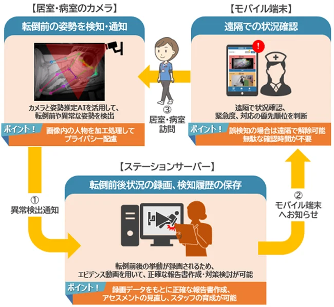
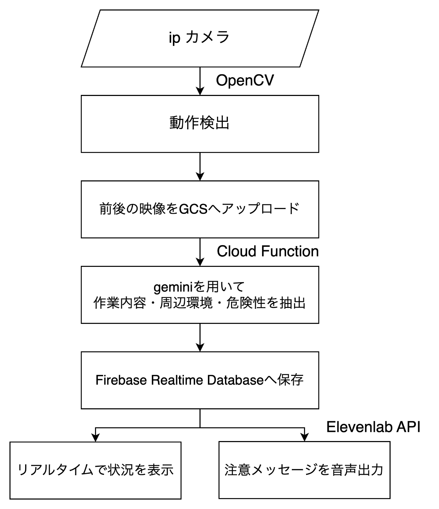

##  要約

  * 生成AIを用いた見守りエージェントの開発
  * カメラ動画からGeminiを用いて作業内容・周辺環境・危険性を抽出
  * [Elevenlabs API](https://elevenlabs.io/?pscd=try.elevenlabs.io&ps_partner_key=N2RlODlkYjNlYjc2&ps_xid=SIQ8zWs9iKeuEp&gsxid=SIQ8zWs9iKeuEp&gspk=N2RlODlkYjNlYjc2)を用いて、孫の声での注意を行うことで、言うことを聞かないおじいちゃんにも対応

##  はじめに

はじめまして！今回は、最新技術を使った新しい見守りエージェントをご紹介します。Geminiのマルチモーダルシステムを活用して開発したこのサービスでは、生成AIがカメラ映像から利用者の行動や危険性を自動的に検知し、素早く注意喚起を行います。

開発の過程で「単純な警告だけでは効果が低い」という貴重なフィードバックをいただき、より使いやすいシステムを目指して改良を重ねています。その一環として、Eleven Labs APIを活用し、孫や親戚の声を模した合成音声での声かけ機能を実装予定です。「おじいちゃん、そこ危ないよ」「気をつけてね」といった、温かみのある声かけで注意を促します。

このような工夫により、既存の見守りカメラが抱える「人による確認が必要」「注意喚起が効果的でない」という二つの課題を解決し、より安心で使いやすいサービスを実現していきます。

##  仕様

  * iPカメラから画像を取得します。使用していないスマートフォン（iPhone）をipCamなどのアプリで見守りカメラとして活用できます。
  * 画面左側にリアルタイムの映像を表示し、右側にGeminiが解析した作業環境や危険性を表示します。
  * そしてElevenLabs APIを用いて音声による注意喚起を行います。

段ボールを運んでいることとコードに注意が必要な点を検知することができています。

##  プロジェクトが対象とするユーザー像と課題

###  ユーザー像

  * 高齢の家族と離れて暮らす息子娘
  * 介護施設の職員

###  課題

  * 課題１：介護人材の不足 
    * 厚生労働省によると、介護職員の必要数は2025年で約243万人、2040年で約280万人とされています。2019年の職員数は約211万人であり、現状維持で推移すると、2025年には約32万人、2040年には約69万人が不足する見込みです。  
（参照元：[厚生労働省「 別紙1 第8期介護保険事業計画に基づく介護職員の必要数について」](https://www.mhlw.go.jp/content/12004000/000804129.pdf)）
  * 課題２：既存の見守りカメラでは人による確認が必要 
    * 既存の見守りカメラは単に遠隔での映像確認のみが可能なため、家族による確認が必要です。これは手間がかかり、かつ重要な場面を見逃してしまう危険性があります。
  * 課題３：おじいちゃんが言うことを聞いてくれない！ 
    * 高齢者の労働や日常生活では、無理な動作や危険な状況に気づかず、事故や怪我を引き起こすリスクがあります。しかし、周囲が注意を促しても「大丈夫」と言って従わないケースが多いのが現状です。
    * これは実際に農作業を行っている企業から課題としてフィードバックを受けました。

##  課題のソリューション

  * 課題１：介護人材の不足 
    * Geminiが人の代わりにカメラ映像を解析し、作業内容・周辺環境・危険性を自動的に検知することで、介護者の確認作業の負担を軽減します。
  * 課題２：既存のカメラでは人の確認が必要 
    * AIが自動的に状況を判断し、リアルタイムで危険を検知。カメラ映像から姿勢や転倒などの状態を把握し、周囲の環境（配線、散らかった室内など）の危険性も認識して事故を予防します。
  * 課題３：おじいちゃんが言うことを聞いてくれない 
    * Elevenlabs APIを使用して、孫や親族の声を模した合成音声で注意を呼びかけることで、より親しみやすく、警告を受け入れやすくします。

##  見守りシステムの先行事例

今回の見守りシステムの開発背景には、既存のAI見守りサービスの広がりと、そのニーズの高まりがあります。

介護施設向けの「[まもあい](https://prtimes.jp/main/html/rd/p/000000079.000024483.html)」は、AIによる画像認識技術を活用して入居者の行動を検知し、スタッフの業務効率化を実現しています。また、[保育所での導入事例](https://www3.nhk.or.jp/news/html/20240502/k10014438251000.html)からは、AIによる見守りシステムが人手不足の解消と安全性向上の両面で効果を発揮していることが分かります。

このように、介護・保育分野でのAI見守りシステムの需要は着実に拡大しています。私たちのシステムは、生成AIを用いてより柔軟な対応を可能とし、Elevenlabsによる合成音声を組み合わせることで、より使いやすく、効果的な見守りを実現します。

  
参考：[まもあい](https://prtimes.jp/main/html/rd/p/000000079.000024483.html)

##  システムアーキテクチャ

まずIPカメラから映像を取得します。今回はipCamというアプリ（[app store](https://apps.apple.com/jp/app/ipcam-mobile-ip-camera/id440270152)）を使用しました。映像をMJPG形式で取得し、OpenCVを用いて動作検出を行います。動作を検出すると前後の映像をクリップし、GCSへアップロードします。

次にCloud Functionを用いて、GCSへのアップロードをトリガーとしてGeminiによる解析を実行します。Geminiによる解析では、作業内容・周辺環境・危険性を抽出します。Geminiによる解析の詳細は次項に示します。

抽出したデータはFirebase Realtime Databaseに保存します。そして状況をリアルタイムで表示し、ElevenLabsのAPIを用いて注意メッセージを音声出力します。

システム全体の構成は以下のフローチャートに示します。

##  Geminiによる解析の詳細

Geminiによる解析では、Google Cloud Storageに追加された動画から作業内容・周辺環境・危険性を抽出し、それらを考慮した一言の注意メッセージを出力します。

当初は画像を用いた解析を検討していましたが、ドキュメントを確認したところ、Geminiが動画にも対応しており、画像から動画への移行が容易であることが分かりました。そのため、本システムでは動画による解析を採用することにしました。

以下にそれぞれのプロンプトを示します。一貫性のある出力を実現するため、危険性の判断には「作業内容・周辺環境」の出力を、メッセージ生成には「危険性」の出力をそれぞれ入力として使用しています。

作業内容・周辺環境
    
    
            あなたは、映像から作業内容およびその周辺環境を抽出することに特化したエージェントです。
            与えられた映像に基づき、写っている活動や作業、そしてその環境について以下の各項目に沿って、簡潔かつ明確に説明してください。
    
            【出力形式】
    
            作業内容： 映像内で実施されている具体的な作業や活動を記述してください。
            場所： 映像から推測される場所や環境（屋内、屋外、特定の施設など）を記述してください。
            天候： 屋外の場合、映像から読み取れる天候（例：晴れ、曇り、雨など）を記述してください。
    

危険性
    
    
            あなたは、映像から抽出された作業内容や環境情報に基づき、作業中に潜在する危険性を評価・抽出することに特化したエージェントです。
            以下の「作業内容・環境」情報（{work_content}）に基づいて、この状況下で作業を行う場合に考えられる具体的な危険を、以下の項目に沿って、簡潔かつ明確に説明してください。
    
            【出力形式】
    
            潜在危険： 映像の作業内容や環境から推測される、具体的な危険要因やリスク（例：転倒、機械的事故、感電、滑りやすい床、悪天候による視界不良など）を記述してください。
            理由： それぞれの危険が発生する可能性の背景や理由を、簡潔に説明してください。
    

メッセージ
    
    
            あなたは、抽出された危険性情報に基づき、優しい口調でこの状況下で気をつけるべきことを一言で提案するエージェントです。
            以下の「危険性」情報（{danger_content}）を踏まえて、シンプルかつ親しみやすい一言で安全対策を提案してください。
    

##  デモ動画

<https://youtu.be/uMUHC3wZNFE>

##  今後の展望

###  見守りカメラに加えてウェアラブルデバイスからの心拍情報を取り込む

  * ウェアラブルデバイスによって対象の心拍数、体温、血圧などの生体情報を取得することで、見守りシステムに心拍などの生体情報を組み込む。
  * 外部環境の問題だけでなく、体温や心拍などの内的な状態もモニタリングすることで、事故防止と健康管理の両面から見守りの質を向上させていきます。
  * AIエージェントが作業状況を判断した際に、自律的に心拍情報へアクセスし、適切なタイミングで休憩を促すシステムを目指します。

###  作業ログをとり、自動的にレポートを作成する

  * 作業認識・行動認識機能を活用して、起床、食事、薬の服用などを記録します。日々の生活ログをレポートとして作成し、薬の服用忘れや生活リズムの乱れを対象本人とその近親者に報告します。

##  まとめ

新しい見守りシステムとして、人の目の代わりに生成AIが見守る社会が来ると確信しています。

##  感想

###  Tki256

生成AIエージェントを使って何か作りたい気持ちはあったところに今回のハッカソンを見つけて挑戦してみました。cloud関係に触れたことがほとんどないため、ドキュメントを読みながら試行錯誤でしたが、Firebase, Cloud Runなど新しいものを学べていい経験となりました。ありがとうございました。

また今回の開発は主にwindsurfを用いました。他のAIエディターと同様にプロンプトに沿って自動的にプロジェクトを作成してくれることに加えてnextjsやelevenlabsのドキュメントがデフォルトで入っており参照できることが便利でした。今後もAIツールを効率的に活用し、課題を解決するためのアイデアを形にしていきたいと思います。

###  騎馬武者

生成AIに関しては素人で、設計からコーディングも担当ではなく、主にアイデア出し、記事作成、デモ動画編集を担当していました。実際に完成したシステムを見てみると、「あったらおもしろいな」と思って提案したものが形となって出来上がっていたことに驚きました。私自身がプログラミングを行って何かをつくったわけではありませんが、アイデアを膨らませることで世の中の課題を解決する何かへの取っ掛かりをつくるという経験は非常に面白く感じました。機会があれば自身でも生成AIに手を出してみたいと思います。
