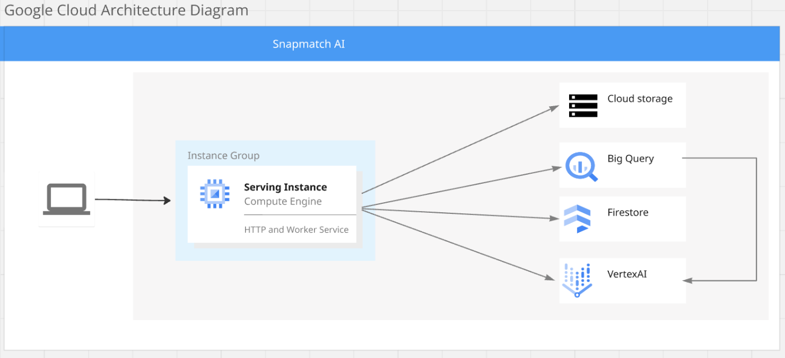

Eコマースプラットフォームにおける大きな課題は、構造化されていないデータ、特に商品画像の管理です。画像とそれに対応する商品説明を整理・照合することは、カタログの規模が拡大するにつれて、時間と手間がかかり、エラーも発生しやすくなります。 Snapmatch AIは、このプロセスを簡素化します。

Snapmatch AIは、ユーザーが画像をアップロードすると、AIを使用してコンテンツに基づいて自動的にグループ化します。次に、これらの画像を商品リストに照合します。画像と商品データ両方に対してフルテキスト検索をサポートしているため、ユーザーは特定の商品でも一般的なクエリでも、必要なものを効率的に見つけることができます。

さらに、Snapmatch AIは画像類似性検索を提供し、商品カタログ内の重複を削減します。これにより、重複した商品や画像を特定し、在庫を合理化し、顧客体験を向上させることができます。

これらのプロセスを自動化することで、Snapmatch AIは時間、正確性、拡張性を提供し、Eコマース企業がカタログを効率的に整理および検索できるようにします。

###  アーキテクチャの概要

Snapmatch AIはGoogle Cloudを使用して構築されており、スケーラビリティと効率を確保するためにさまざまなサービスを活用しています。

  * **Google Compute Engine (GCE)** – HTTPサーバーとワーカーサービスは両方とも同じGCEインスタンス上に存在します。これは、物事をシンプルかつ費用対効果の高いものにするために選択しました。サーバーはGoで構築されており、HTTPリクエストの処理に軽量で非常に高速です。ワーカーサービスは、Vertex AIバッチジョブを監視し、バックグラウンドタスク（画像のマッチングやグループ化など）を管理し、同じインスタンス上のアプリと並行して実行されます。これにより、さまざまなサービスのスケーリングの複雑さを最小限に抑え、複数のクラウドインスタンスの管理のオーバーヘッドを削減できます。
  * **Google Cloud Storage (GCS)** – GCSは、画像の保存とバッチジョブファイルに使用されます。ここでは2つのバケットを使用します。 
    1. **画像用バケット** – 信頼性が高く、費用対効果が高く、BigQueryおよびVertex AIとシームレスに統合されるため、大量の商品画像の保存に最適です。
    2. **バッチジョブの定義/結果用バケット** – メタデータとモデルの結果をこのバケットに保存して、すべてをきちんと整理し、将来の処理のためにアクセスできるようにします。
  * **BigQuery** – BigQueryはデータ処理のバックボーンです。BigLakeテーブルを使用して画像バケットに直接接続し、画像データと製品情報を1か所で簡単に管理できるようにします。BigQueryは、画像に対してベクトルベースの検索を実行する場所でもあり、AI搭載の埋め込みを使用して製品の説明を関連する画像にすばやく一致させることができます。高速で自動的にスケーリングされるため、増大するデータのニーズに最適です。
  * **Firestore** – Firestoreは、製品データ、構成設定、および製品の説明のテキスト埋め込みを保存します。リアルタイムで同期するため、製品が追加または更新されると、すぐに検索できるようになります。
  * **Vertex AI APIs** – これらはSnapmatch AIを強化するコアAIツールです。Vertex AIは、画像用のマルチモーダル埋め込みと、製品の説明用のベクトル埋め込みを生成する役割を担っています。モデル自体をトレーニングする必要なく、画像検索や自動画像マッチングなどの重労働をすべて処理します。

###  本番環境向けアーキテクチャの潜在的な変更

現在のアーキテクチャはプロトタイプには最適ですが、本番環境向けにはいくつかの改善が必要です。ワーカーサービスをHTTPサーバーから分離し、Cloud Run Jobsを使用してバッチジョブを監視すると、パフォーマンスが向上し、HTTPサーバーへの負荷が軽減される可能性があります。さらに、画像をGCSにアップロードし、後でベクトルを作成することを検討できます。これにより、アップロード時の応答が速くなります。これは、イベントドリブンアーキテクチャとイベントデバウンサーを使用して実現でき、ユーザーエクスペリエンスを遅らせることなく、画像の処理が非同期的に行われるようにします。

###  特徴

<https://youtu.be/UQPslRDRV-U>

####  🔹 画像処理

ユーザーが画像をアップロードすると、すぐにGoogle Cloud Storage（GCS）に保存され、BigQueryでベクトルベースの検索のためにインデックスが作成されます。この統合により、Vertex AIのマルチモーダル埋め込みモデルが活用され、画像が高品質の多次元ベクトルに変換されます。これらの埋め込みにより、Snapmatch AIは次のような強力なAI主導の検索機能を提供できます。

  * **テキストベースの画像検索** – ユーザーは自然言語で画像を説明でき、システムはその説明に基づいて最も関連性の高い画像を返します。
  * **柔軟な類似性検索** – システムは、類似性しきい値に基づいて、正確な画像の一致または関連する画像のより広いグループを見つけることができ、非常に近い一致からより広い提案まで、さまざまな結果を可能にします。
  * **高速でスケーラブルなインデックス作成** – 新しい画像はインデックスが作成され、アップロード後ほぼすぐに検索可能になるため、プロセスはシームレスで効率的です。

####  📊 データ処理

現在、Snapmatch AIは製品情報（具体的には名前と説明の列）を含むCSVファイルを受け入れて、製品情報をアップロードします。アップロードされると、このデータはFirestoreに保存されます。検索機能を強化するために、Vertex AIのtext-embedding-004モデルを使用して、各製品の名前と説明のベクトル埋め込みを生成します。このアプローチにより、Snapmatch AIは次のことが可能になります。

  * ユーザーがフレーズや質問を入力して、正確なキーワードの一致だけでなく、関連する製品の結果を受け取ることができる、よりインテリジェントな自然言語検索を有効にします。
  * 製品の説明の背後にあるコンテキストを理解することにより、検索結果の精度を向上させます。
  * 手動による介入なしに、新しい製品データを自動的に処理し、検索インデックスを最新の状態に保ちます。

####  🔗 データマッチング

画像を手動で製品データに割り当てるのは面倒な作業ですが、Snapmatch AIはこのプロセスを自動化して時間を節約し、精度を確保します。画像のマッチングプロセスは、次の2つのステップで実行されます。

  1. Vertex AIは、テキスト埋め込みを活用して、各製品のコンテキストが豊富な検索クエリを生成するバッチジョブをトリガーします。
  2. バッチジョブが完了すると、ワーカーサービスはベクトル検索を使用して、製品に最も関連性の高い画像を見つけて割り当てます。この自動マッチングプロセスにより、人的エラーが減少し、製品と画像のペアリングが正確で一貫性のあるものになります。また、企業は手動管理のオーバーヘッドなしにカタログを拡張できます。

####  🏷️ 画像グループ化

製品画像をカテゴリに整理すると、ユーザーエクスペリエンスと検索可能性が向上します。Snapmatch AIを使用すると、ユーザーはカテゴリを手動で定義するか、Gemini AIを使用して画像コンテンツに基づいてカテゴリを自動的に提案できます。カテゴリが設定されると、Vertex AIバッチジョブがそれに応じて画像を並べ替えます。

この機能は、ユーザーが「エレクトロニクス」や「衣料品」などのカテゴリで画像をグループ化することで、閲覧やフィルタリングを大幅に改善できる、大規模で多様な製品カタログを持つマーケットプレイスまたはプラットフォームに特に役立ちます。また、アップロード時に新しい画像をすばやく整理するための強力なツールでもあります。

####  🔍 類似性検索

この機能は、インタラクティブなチャットベースの検索機能によって強化されており、ユーザーは動的な会話を通じて画像検索を絞り込み、絞り込むことができます。仕組みは次のとおりです。

  1. システムは、2つのカスタム関数（画像を検索するための関数と、関連する画像を選択するための関数）を使用してチャットセッションを開始します。
  2. システムは、ベクトル検索を使用して検索クエリを生成し、クエリに最も近い画像を識別します。
  3. ベクトル検索の結果はチャットセッションに送信され、AIが結果を確認し、ユーザーに最適な一致を選択します。この反復的なAI支援プロセスにより、関連性の高い画像のみが検出されて返されます。

この機能は、視覚的な類似性に基づいて可能な限り最高の一致を動的に提供することにより、全体的な検索エクスペリエンスを向上させ、正確な一致だけでなくコンテンツに関連する画像を簡単に見つけることができます。

この機能にChat APIを利用すると、手順全体でコンテキストを維持し、機能を拡張できる可能性があります。

###  試してみよう

[SnapmatchAI](http://34.84.155.104/)はこちらでお試しいただけます。  
1時間有効な簡易セッションIDが追加されており、1セッションあたり約1時間、同じデータセットでSnapmatchAIをご利用いただけます。アップロード制限もございますのでご注意ください。 時間経過後、新しいセッションが発行されます。 バッチジョブには現在約4〜5分かかります。

###  コード

SnapmatchAIのコードは[GitHub](https://github.com/trapajim/snapmatch-ai)でご覧いただけます。リポジトリは柔軟性とスケーラビリティを提供するように構造化されており、各フォルダーはシステムのアーキテクチャで明確な目的を果たします。

snapmatchaiフォルダーには、Snapmatch AIシステムに固有のカスタムタイプとインターフェイスが格納されています。これらのタイプとインターフェイスは、画像メタデータ、製品の詳細、または依存性コンテナーとして機能するAppContextなど、アプリケーション全体で使用されるさまざまなコンポーネントと構造を定義します。目標は、システムのこれらの部分をモジュール式で拡張可能に保ち、プロジェクトへの簡単な更新または追加を可能にすることです。

Snapmatch AIのコア設計上の選択肢の1つは、外部ライブラリの周りにファサードを使用することです。たとえば、Snapmatch AIのGenAIサービスは、Googleのaiplatformライブラリ（リンク）およびgenaiライブラリ（リンク）の周りのファサードとして構築されています。このアプローチは、GoogleのAIサービスとの統合を簡素化し、基礎となるライブラリの変更からシステムを保護するのに役立ちます。ファサードを使用することを好むのは、広範なコード変更を必要とせずに依存関係を更新できるため、システムが長期的には保守可能で適応性のある状態を維持できるためです。

servicesフォルダーは、Snapmatch AIのコアロジックのほとんどが存在する場所です。これには、バッチジョブの開始、画像のアップロードとインデックス作成、AIモデルとの対話による画像埋め込みの生成と検索操作の実行などの機能が含まれます。

さらに、プロジェクトにはスムーズな統合を保証するために外部サービスをラップする他のいくつかのフォルダーが含まれています。たとえば、datastoreフォルダーには、FirestoreやBigQueryなどのサービスのファサードが含まれています。これらのラッパーは、これらのシステムと直接対話する複雑さを抽象化し、製品データの保存と取得を容易にするだけでなく、画像やテキストに対してベクトルベースの検索を実行することも容易にします。同様に、GoogleのStorageライブラリを活用して、Google Cloud Storageでの製品画像の効率的な保存と取得を処理するファイルアップロードクライアントがあります。

このモジュール式の構造により、Snapmatch AIは柔軟で保守可能になり、ワーカーgoroutineを独自のサービスに分離したり、コア機能を中断することなく、より高度な画像処理技術を実装したりするなど、システムのニーズの進化に合わせて簡単に拡張および適応できます。また、より大量の画像処理、検索パフォーマンスの向上、または新しいAIモデルや外部サービスとの統合など、特定のコンポーネントを個別にスケーリングすることも容易になります。

###  結論

Snapmatch AIは、画像のソート、マッチング、整理という面倒なタスクを自動化することにより、Eコマースプラットフォームでの製品画像とデータの管理を大幅に容易にします。AIが画像のインデックス作成とカテゴリ化を処理することで、企業は手作業に何時間も費やすことなく、カタログをクリーンで検索可能な状態に保つことができます。

Snapmatch AIは現在、Eコマースプラットフォームと直接統合されていませんが、将来的には、製品リストとの同期や製品カタログの自動更新など、さまざまなシステムに簡単に接続できるように設計されています。拡大する製品カタログの管理の複雑さを軽減したいと考えている人にとっては、素晴らしいスタートです。
