このプロジェクトは「[AI Agent Hackathon with Google Cloud](https://zenn.dev/hackathons/2024-google-cloud-japan-ai-hackathon)」参加作品です。

#  はじめに

##  Web会議中に分からない単語は裏でコッソリ調べてますよね。

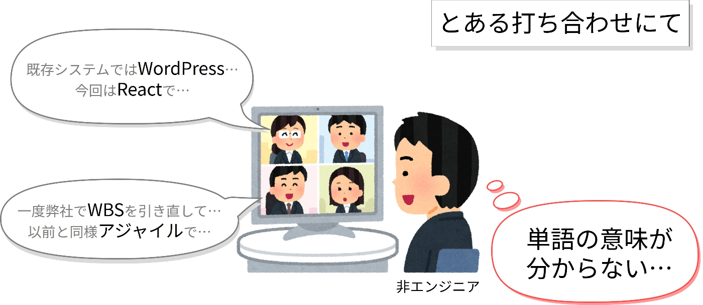  
...そうですよね！やってますよね！  
Zennユーザーの皆さんならそう答えてくれると信じています。

みなさんが会社や学校などの組織に入りたてだった頃を思い出してください。  
**先輩の話している知らない言葉** は**業界用語** なのか、**社内（組織内）用語** なのか、**ジェネレーションギャップ** なのか**土地柄** なのか、そんな経験あると思います。  
Web会議が普及した現代においては、会議裏のウィンドウで公然とその単語を検索エンジンで調べるようになりました。  
少なくとも、チームメンバーのT（まだまだ下っ端ピチピチ若手エンジニア）は分からんこといっぱいなので、そういった経験は豊富だそうです。

でも、会議の裏で検索かけるのは手間ですよね。

他にも手間なことはあります。  
例えば、**司会** 、**書記** といった役割です。  
チームメンバーのT（しばらく下っ端雑用担当エンジニア）は、書記を始めとしたさまざまな役割を任されがちです。  
名誉なことです。でもできれば手間はかけたくないです。手間はかけずに名誉だけ欲しいそうです。  
最近はAIによる文字起こし機能がリリースされ、書記にかかる負担は減ってきていますが、**司会** の負担は変わりません。

司会も省力化したいですよね。

じゃあそれらを**AIエージェント** にやらせちゃえ！  
ということで、Web会議サポートAIエージェント **「Meetiness」** をつくってみました。  
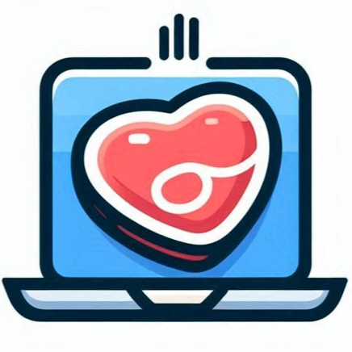  
（「内容の充実していること、肉のようなこと」という意味の「Meatiness」という単語を文字って「Meetiness」。画像はアプリアイコンのイメージ。）

#  やりたいこと

##  例えば、用語解説

Web会議とは別のウィンドウで発言者が用いる単語を検索するのは今日でおしまいです。  
AIエージェントに辞書はもちろん、組織内の資料なども学習させ、会議参加者に合わせて適切に用語解説させましょう。  
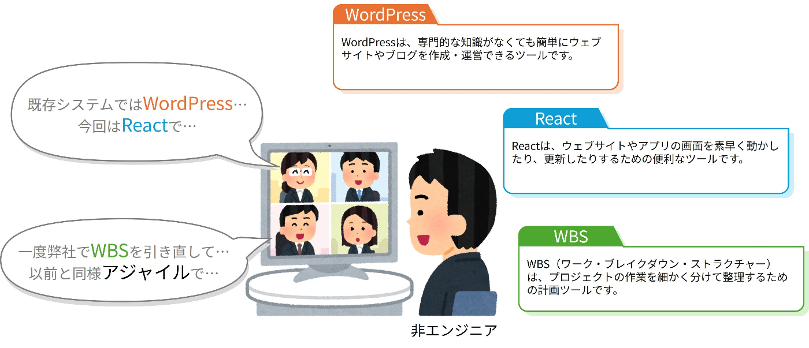

##  例えば、前回の会議の振り返り

書記は前述の自動文字起こし機能による議事録生成に取って代わられることが多くなっていますが、司会は未だ人が行っている場合が多いです。  
司会を補助する機能として、前回会議の振り返りはAIエージェントに任せましょう。  
昨今のWeb会議ツールは会議の録画から自動生成された議事録をダウンロードすることができます。  
それをAIエージェントに要約させ、毎回の会議の冒頭で共有できるようにします。これがあれば、**会議の初めに『前回何話したっけ？』となることはもうありません** 。  
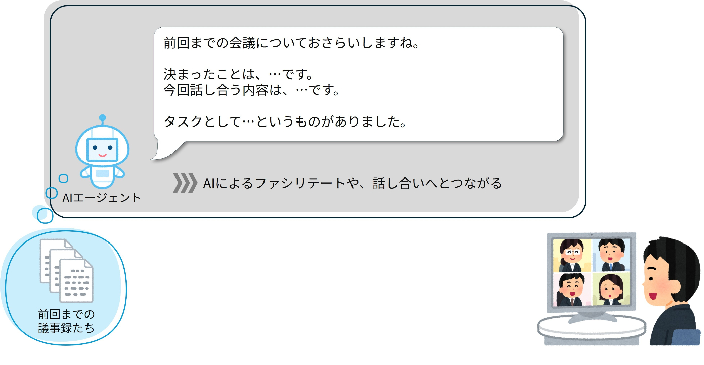

#  サービスについて

###  「Meetiness」ダウンロードはこちらから

<https://github.com/YAKIONIGIRIs/zenn-hackathon-2025/tree/develop>

##  ユーザー像

このプロジェクトが対象とするのは、Web会議を使用するすべてのユーザーです。

初めて会話する商談先や異業種・他部署の方が参加する話し合いの場など、ディスコミュニケーションが発生しやすいビジネスシーンのWeb会議で、「Meetiness」はスマートな会議進行と認識のすり合わせをサポートします。

ビジネスシーンに限らず、オンライン飲み会での活用もユースケースの一つです。  
「Meetiness」を使えば、もうジェネレーションギャップやオタクトークで置いてけぼりにする・される心配はありません。

##  デモ動画

「旧来型の現地開催会議」を超えた「現在のWeb会議」をさらに超えた「新しいWeb会議」。  
みなさんにお見せしましょう。

そんなことできるのかって？  
できるんです。  
そう、AIエージェント **「Meetiness」** ならね！

<https://youtu.be/Yagm1Nd6Xwc>

##  前提

本サービスではChrome拡張機能を使用しています。  
サービスを使用する際はChrome上でお願いします。

!

他ブラウザでの動作確認は行っていません。また、動作確認時点でのバージョンはChrome 132.0.6834.160です。

##  導入方法

###  1\. Chrome拡張機能をインストール

Chrome上にChrome拡張機能をインストールします。

!

現時点ではデベロッパーモードで拡張機能を読み込む必要があります。

まずはGitHubからソースコードをダウンロードします。

<https://github.com/YAKIONIGIRIs/zenn-hackathon-2025/tree/develop>

次にChrome拡張機能を開きます。
    
    
    chrome://extensions/
    

を検索窓に入力します。

デベロッパーモードに変更したのちに、ダウンロードしたリポジトリの`meet-transcription-extension`フォルダを取り込みます。

その後、[Google Meet](https://meet.google.com/)にアクセスし、先ほど追加した拡張機能のアイコンをクリックします。  
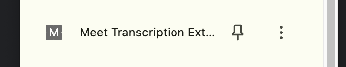  
すると、名前を入力する画面が右上に現れるため、ここにあなたの名前を入力します。  
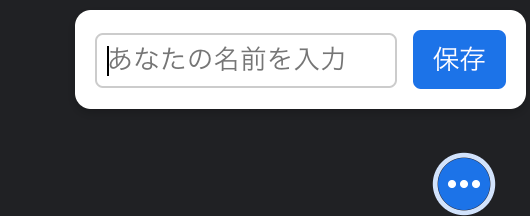

（Google Meetの字幕機能では、自分の発言は「あなた」として文字起こしされてしまうため、話者を特定するために名前を入力します。）

###  2\. Google Meetを起動する

Chromeで任意のGooogle Meetを起動します。  
Gooogle Meetを起動したら、字幕機能をオンにします。

字幕機能をオンにする方法

Gooogle Meet画面上にある「…」となっているボタンから「設定」を選択します。  
「字幕」タブにある「会議の使用言語」を`日本語`にして、「字幕を表示」を選択します。

!

字幕機能をオンにするのは、Google Meet参加者のうち1名のみにしてください。そうでないと、複数のクライアントから字幕がアップロードされ、補足情報の表示に影響を与えます。

###  3\. 補足情報を表示する

!

アドオンは現在非公開です。  
以下はアドオンをインストールして実行する方法を示しています。  
また、導入に当たっては有償版のGoogle Workspaceの契約およびGoogle Cloudへのアクセス権が必要です。

Meet Add-ons SDKのドキュメントの[Meetアドオンをデプロイする](https://developers.google.com/meet/add-ons/guides/deploy-add-on?hl=ja)を参考に、Meetinessのアドオンをデプロイします。なお、ここではプロジェクトの作成などの説明は省略します。

  1. [Google Workspace Marketplace SDK](https://console.cloud.google.com/apis/api/appsmarket-component.googleapis.com/)を有効化します。
  2. **[HTTP deployments]** タブをクリックします。
  3. **[新しいデプロイを作成]** をクリックし、アドオンのデプロイ ID (例: `meetiness-addon`)を入力します。
  4. 次へをクリックし、`DEPLOYMENT.JSON`に次のように入力します。

    
    
    {
      "addOns": {
        "common": {
          "name": "Meetiness - Web会議サポートエージェント",
          "logoUrl": "https://raw.githubusercontent.com/YAKIONIGIRIs/meet-addon/refs/heads/main/meetiness_logo.png"
        },
        "meet": {
          "web": {
            "sidePanelUri": "https://yakionigiris.github.io/meet-addon/hello-world-next-js/sidepanel",
            "addOnOrigins": ["https://yakionigiris.github.io"],
            "darkModeLogoUrl": "https://raw.githubusercontent.com/YAKIONIGIRIs/meet-addon/refs/heads/main/meetiness_logo.png"
          }
        }
      }
    }
    

  5. 作成したデプロイメントの **[インストール]** をクリックします。

この手順を踏むと、Google Meetのアクティビティからアドオンにアクセスできるようになります。

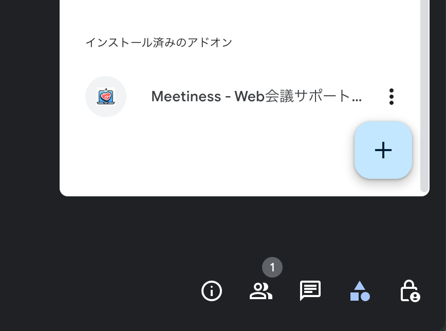

##  システム アーキテクチャ図

今回はGoogle Cloud上でサービスの構築を行いました。  
使用したプロダクトは以下の通りです。

  * Cloud Run
  * Firestore
  * Gemini API in Vertex AI

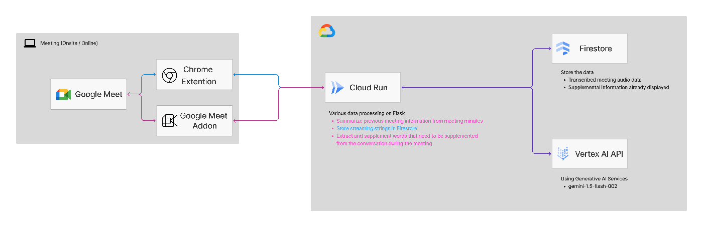

###  クライアントの構成（画像左）

  1. クライアントはChromeにChrome拡張機能を導入し、Google Meetを立ち上げます。  
この拡張機能でGoogle Meetが行う自動文字起こしをキャプチャし、サーバーに転送します。

  2. Google Meetにアドオンを追加します。  
このアドオンはユーザーの立場（役職）を選択して、それに合わせた翻訳（用語解説）をリアルタイムでサーバーから受け取り表示させます。  
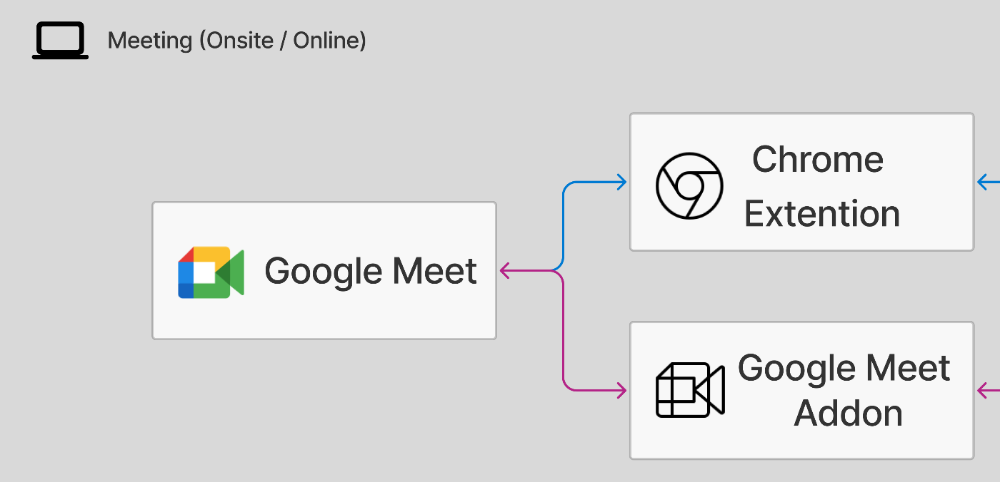

###  サーバーの構成（画面右）

  1. クライアントのChrome拡張機能から文字起こしされたデータをCloud Runで受け取ります。  
Cloud Runの上ではFlaskが動いており、受け取ったデータを整形してFirestoreに保存します。

  2. クライアントのGoogle MeetアドオンからCloud Runは定期的にリクエストを受け取り、アドオンで選択されたユーザーの立場（役職）とFirestoreに保存された文字起こしデータをVertex AI APIに投げます。  
Vertex AI APIはユーザーの立場（役職）に合わせた翻訳（用語解説）をCloud Runに返します。  
Cloud Runはそれをクライアントのアドオンへ表示させます。  
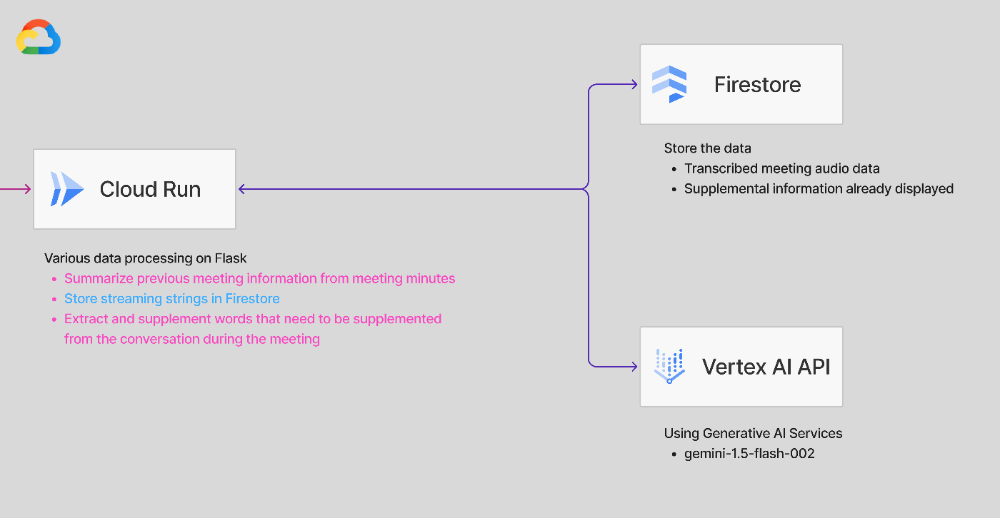

##  プログラムの工夫点

###  文字起こしの取得

録画済みの動画からSpeech-to-Text APIを使って文字起こしすることは容易ですが、リアルタイムで文字起こしを取得するAPI等は公開されていません。  
そこでDOMを解析して、Google Meetの字幕を取得することにしました。

Google Meetの字幕は
    
    
    

    　トランスクリプトの内容
    

    

となっていることがわかったので、次の方法で文字起こしを取得しました。

<https://github.com/YAKIONIGIRIs/zenn-hackathon-2025/blob/4274098cd0863a9b4fe78d0d3410ab4a237b1d13/meet-transcription-extension/content.js#L12-L50>

（当然ながら、Google MeetのUIが変更された場合はこの方法は使えなくなります。）

###  Google Meet アドオン

実は、**Google Meet Add-ons SDKが一般公開になったのは[2024年9月](https://workspaceupdates.googleblog.com/2024/09/google-meet-add-ons-sdk-is-now-available.html)** と、比較的最近のことです。  
アドオンを利用することでユーザーはMeetの画面から離れる必要がないため、UXの向上が期待できます。  
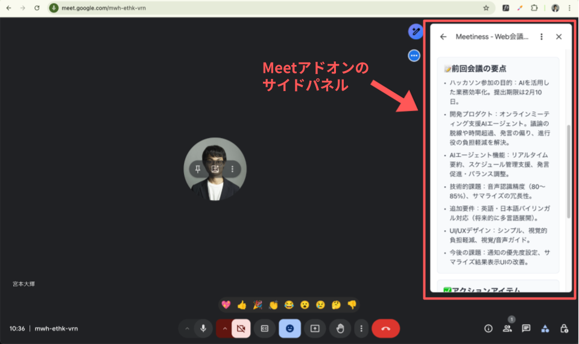

下記にTypeScript / Next.js / Chakra UIを使った実装例を示しているため、開発の参考にしていただけるのではないかと思います。

<https://github.com/YAKIONIGIRIs/meet-addon/tree/main/addons-web-sdk/samples/hello-world-next-js>

#  これからの展望

##  マルチプラットフォーム化

現在はGoogle Meetでのみの動作となっていますが、別のWeb会議ツール、別のブラウザ上でも動作を行えるようにします。

##  アドオンの公開

現在はGoogle Workspaceにアドオンを追加する形になっていますが、正式版では申請を行い自由に「Meetiness」を使えるようにします。

##  翻訳精度の向上

Web会議の参加者個々人にあらかじめ語彙プールを設定しておき、自分と相手の語彙プールの差から適切な単語に対して適切な翻訳（用語解説）が行えるようにします。  
また翻訳にあたってインターネット上のデータだけでなく、組織内のネットワークに点在する資料など、任意のデータを学習できるようにします。

##  司会機能の充実化

前回の会議の振り返りを行う司会補助機能において、AIエージェントが音声を発することによって、UXの向上を目指します。  
また、前回会議の振り返り以外司会の役割や、タイムキーパーさえも「Meetiness」に任せられるようにします。  
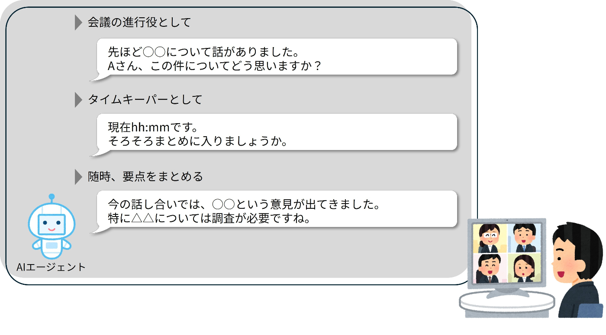

#  完走した感想ですが

##  WebミーティングにBotを参加させたかった。

Web会議を拡張するサービスとしては、[Notta](https://www.notta.ai/)といったものがあります。こちらは、BotがWebミーティングに参加するようです。  
このような形式にすれば画面共有や、マイクで機械音声をしゃべらせるなど、より斬新なUXを提供できると考えましたが、そのようなAPIが提供されていないこともあり実装難易度の高さから断念。  
くやしい。

##  もっとスマートに文字起こしのデータを取得したかった。

現在はGoogle Meetが画面上に表示させる字幕をHTMLから読み取るという愚直も愚直な実装を行っています。  
提供されている機能として、会議終了後にの文字起こしをダウンロードできるものはありましたが日本語には対応しておらず、またリアルタイムで文字起こしを入手するAPIは見つけられませんでした。  
Googleさん、リアルタイムで文字起こしを受け取れるAPIの公開をよろしくお願いします！

##  でもやっぱり楽しかった！

つらつらと無念も述べましたが、開発は楽しいですね！  
特に、開発メンバー3人のうち2人は生成AIを活用した開発は初体験で、その威力に圧倒されました。  
噂には聞いていましたが、ここまでとは。Chromeの拡張機能も、もはや自然言語で作れちゃうんですね。  
もう前までの自分には戻れません。  
またハッカソンなど理由を見つけて、のびのびと開発していきたいです。
