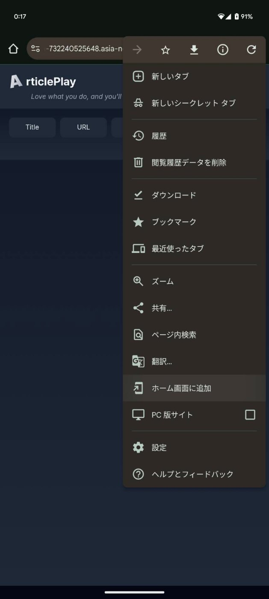
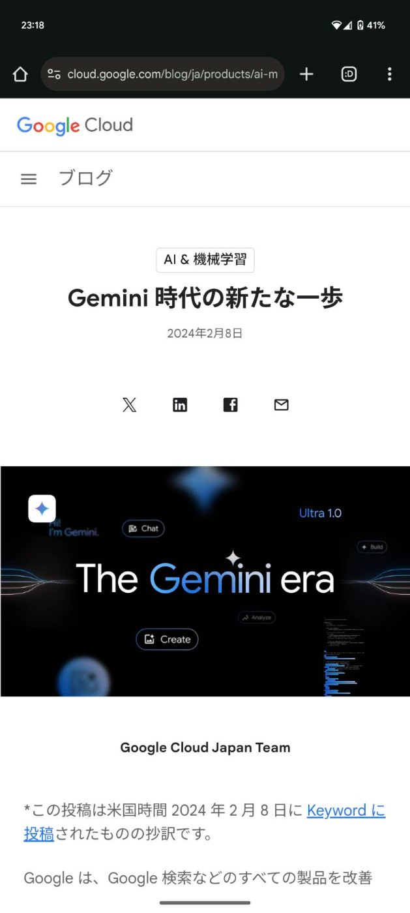
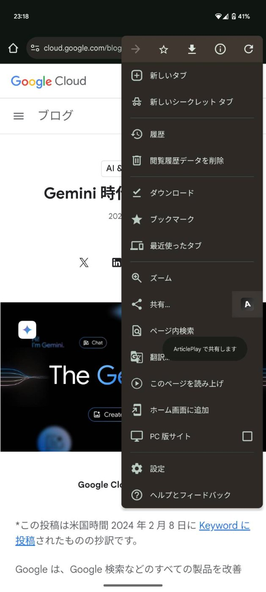
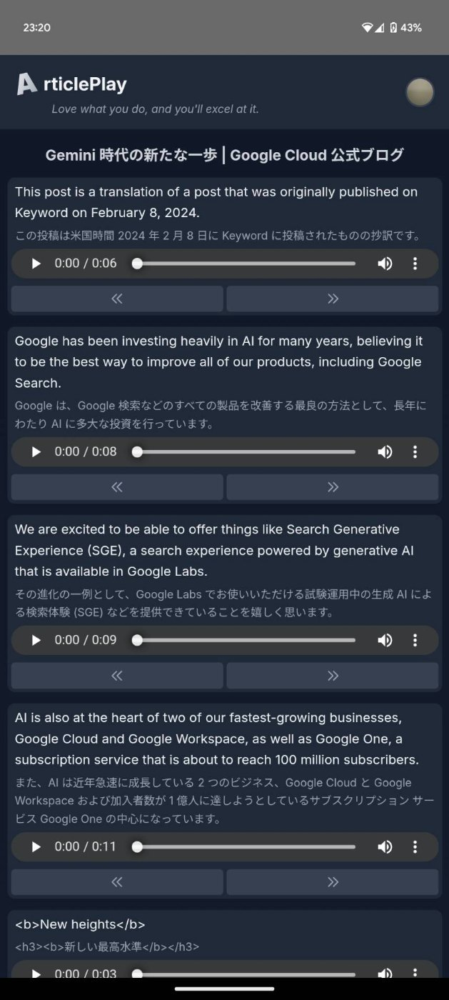
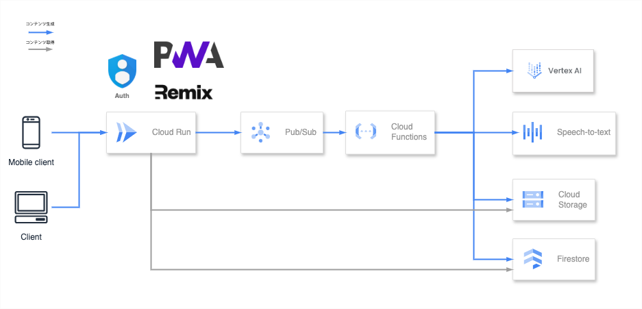

##  はじめに

本記事では [AI Agent Hackathon with Google Cloud](https://zenn.dev/hackathons/2024-google-cloud-japan-ai-hackathon) で個人開発した英語学習アプリのプロジェクトについて書きます。

##  プロジェクト概要

<https://youtu.be/8d6eHVT_kj4>

###  背景

英語学習は多くの人にとって長期的な取り組みになります。私自身も、過去に英語学習を続けることに苦労してきた経験がありました。また周りにも同じように感じている友人がいることに気が付きました。そこで、英語学習に対するモチベーションを維持しつつ、実践的なスキルを身につけるための新しいアプローチを考えることにしました。

###  対象ユーザー像

本プロジェクトは、**英語を学習しているすべての日本語話者を対象** に、**効率的で実践的な学習アプローチを提供** することを目的としています。特に**リーディングとリスニングのスキル向上** を求めている学習者に向けて、**現状の学習方法に足りない要素を補い、効果的な習得を支援します。**

####  想定される対象ユーザー

  * 独学で英語を学ぶ成人学習者（資格試験対策、留学・ワーホリ準備など）
  * ビジネスパーソン（業務上の英語対応が必要な人、海外出張や英語会議への対応が求められる人）
  * エンタメやニュースを英語で楽しみたい人（海外ドラマ・映画、ニュース記事をスムーズに理解したい人）

###  英語学習者が抱える課題

英語学習方法はさまざまですが、それぞれに長所と短所があります。本プロジェクトでは、既存の学習方法の課題を補完し、より効果的な英語習得を支援します。

**学習方法** | **利点** | **課題**  
---|---|---  
**英語教材・参考書（市販の本）** | 文法や語彙を体系的に学べる | 内容が教科書的で興味を持ちにくい  
**Duolingo などの語学アプリ** | ゲーム感覚で継続しやすい | 内容が実践的ではない  
**YouTube・Netflix・Amazon Prime Video（英語字幕付き動画）** | ストーリーを楽しめる | 学習にまとまった時間が必要／早送りや巻戻しの制御が細かくできずリスニングの学習が非効率  
**英語ニュースサイト（BBC, CNN など）** | 最新の話題で学べる | 学習にまとまった時間が必要／分からない単語が多いと学習が続かない  
**英語のポッドキャスト・オーディオブック** | リスニング力を伸ばせる | 文字情報なしで内容を把握しづらい／知らない単語が聞き取れない  
  
###  プロジェクトが提供する解決策

上記の課題を解決するために、**ユーザーが選んだWeb上の記事を元に、短いフレーズに分割し、対訳とオーディオを付加した英語学習用のコンテンツを生成** します。

**ユーザーの興味や関心事を学習コンテンツに変換することができるため、モチベーションを維持しながら、リーディングとリスニングを同時に短い時間で効率的に学習できるサービス** を提供します。

####  1\. 興味関心を学習コンテンツ化することで、モチベーション維持

**日頃からチェックしている話題や興味を寄せるトピック** について、英語でどのように表現するのか気になりませんか？  
**自身の興味がある対象をそのまま学習コンテンツに** できるため、**生きた英語を楽しみながら学習** することができます。

また**学習コンテンツの生成はボタン一つで簡単** です。スマホで調べ物をしたり、普段の使い勝手の中にシームレスに組み込んでいるため、ユーザーは**気軽に学習コンテンツをストック** していくことができます。

####  2\. 高品質なオーディオで効率的な反復学習

Web上の記事の内容は短いフレーズに分割されます。短いフレーズのすべてに対して、**高品質でネイティブなオーディオを生成** します。  
このオーディオに対して、**2秒進む・2秒戻るといった細かい制御** ができるようになっています。それにより、**直前に聴き取ることができなかったフレーズをピンポイントで再確認** できるようになっています。  
これにより、動画配信サービスの海外ドラマなどで英語を学習する際、コンテンツの進行の制御が難しく、戻りたいシーンより前に戻り過ぎてしまうなどのストレスを感じることはありません。

####  3\. いつでもどこでもスキマ時間で活用

ユーザーが生成したコンテンツは、**自身で管理し、いつでもどこでも簡単にアクセスできます** 。コンテンツ一覧で**対象のコンテンツをすぐに見つけるためのフィルタリング機能** があります。**コンテンツは短いフレーズに分割されているため、必要な時に必要な箇所だけ、効果的に学習** することができます。

このように **「教材/コンテンツの内容に興味が持てない」「リスニングの学習が非効率」「学習にまとまった時間が必要」** といった従来の学習方法の課題を解決し、学習者がより効果的に英語を習得できる環境を提供します。

##  プロダクトの概要

###  アプリケーションの使い方

現在は[ベータ版（ArticlePlay）](https://gcp-llm-73224052564.asia-northeast1.run.app/)として限定的にアクセスできる状態ですが、システムの都合により、予告なくアクセスが一時停止となる場合があります。興味を持っていただけた方には、ぜひ実際に触っていただけると嬉しいです。

アプリケーションへアクセス後、**「New」** ボタンを押下、入力欄にコンテンツを生成したい URL を貼り付け、**「Save」** ボタンを押下でコンテンツの生成が開始します。数分後、コンテンツの生成が完了し、一覧に表示され、閲覧が可能となります。

以降、よりシームレスな体験をしていただくために、スマホでPWAのインストールから、ブラウザでの **「共有」** によりコンテンツを生成し、閲覧するまでの一連の操作を示します。

  1. ブラウザでアプリケーションにアクセスし、メニューから「ホーム画面に追加」を選択  

  2. PWAアプリケーションをインストール  

  3. ブラウザで普段どおり興味のある記事を閲覧する  

  4. ブラウザのメニューから「共有」を選択する  

  5. PWAアプリケーション上で「共有」によりコンテンツの生成が開始されたことを確認する  

  6. PWAアプリケーション上でコンテンツの生成が完了したことを確認する  

  7. PWAアプリケーション上でコンテンツを楽しむ  

###  アーキテクチャ

**Cloud Run** 上でRemixでPWAアプリを動かします。**Pub/Sub** 経由で**Cloud Functions** をトリガーできるようにしています。**Gemini API in Vertex AI** 、**Text-to-Speech API** を活用し、コンテンツを生成し、**Cloud Storage** と**Firestore** で管理しています。**Google Cloud** の各種サービスを活用し、スケーラブルかつ非同期な処理を実現しています。

####  PWA アプリのインストール

  * ユーザーはネイティブアプリのように利用できる
  * オフラインキャッシュ機能でスムーズに閲覧ができる

####  ユーザー認証

  * **Google Identity** でGoogleアカウントによる認証ができる
  * 認証済みユーザーは、自分専用の学習データを管理できる

####  ユーザー操作（共有・貼付）

  * ブラウジング中に学習したいページを共有する 
    * もしくは **Cloud Run** 上のPWAアプリでユーザーが学習したい記事の URL を入力する
  * アプリは **Pub/Sub** にデータを送信する

####  生成AIによる記事抽出と自然言語処理

  * **Pub/Sub** をトリガーに **Cloud Functions** が動作する
  * **Gemini API in Vertex AI** で以下の処理を実行する 
    * 情報の抽出
    * 自然言語処理（文章分割、翻訳、フォーマット）

####  生成AIによるオーディオの生成

  * **Text-to-Speech API** で英語テキストの音声を生成する

####  コンテンツの管理

  * **Cloud Storage** に記事データとオーディオを保存する
  * **Firestore** に格納先のメタデータを記録する

####  ユーザー操作（閲覧）

  * 処理完了後、アプリからコンテンツにアクセスができる
  * 一覧画面でタイトル、日付、URLでフィルタリングできる
  * 詳細画面でコンテンツを使用できる

###  技術的なポイントの解説

####  Cloud Run & Cloud Functions

  * **費用対効果、スケーラビリティ** の観点からフルマネージドなサーバーレスのサービスを活用
  * 生成AIによるタスクが多いことにより、レイテンシーが大きくるため、 **Pub/SubとCloud Functions** で非同期な処理にすることで、**ユーザー体験を向上**
  * 今後、より多くのタスクを処理する必要が出てきても、**Pub/Subによるイベントドリブンなアーキテクチャにより、Cloud Functionsによる機能の拡張が容易**

####  Gemini API in Vertex AI & Text to Speech

  * 今現在も様々なモデルが増え続ける中で**最新のモデルへの追従が容易**
    * 費用対効果と精度を検証し、gemini-1.5-flashを使用
  * Geminiの処理の中で、robots.txt を自動で考慮するため、**記事抽出の可否を適切に判断可能**
  * **精度向上** への取り組みとしての**タスク分割の粒度とプロンプトエンジニアリングを検証** した

記事の抽出、言語判定（日本語か英語か）、短いフレーズへの分割、対訳の生成、オーディオ生成...etc サービスとして扱うコンテンツを作るためには細かいタスクがいくつもある。**タスクの数が多く、更に各タスクの前提や制約を付け加えていくと、指示に厳密に従わせることが難しくなる。**

**何度か検証する中でGemini 1.5 flashは大規模で強力なモデルであることが分かった。** 今回のミニマムなコア機能を実現する程度のタスクであれば一度のプロンプトで、**タスク間の繋がりを捉え、安定した出力** をしてくれた。**品質と費用対効果の観点から特化したモデルであるText to Speech** を使用し、**オーディオ生成のタスクのみを分割** することに決めた。

**機械翻訳の分野で長年の研究と大規模なデータを活用した強力な翻訳技術と検索エンジン等のウェブ関連技術を扱うGoogleのAIサービスは、本プロジェクトの要件に完璧にフィットしていた。GeminiとText to Speechだからこそ、安全に高品質なコンテンツを生成することができたと考える。**

####  Remix & PWA

  * PWAにすることで**ユーザー体験** を向上 
    * ユーザーが URLをコピペするのは手間になる
    * ブラウジング行為を邪魔したくない
    * **共有** するだけで、コンテンツ生成する
  * オーディオ再生に **2 秒進む・戻る機能** を活用し、特定フレーズを反復学習できる

##  まとめ

本プロジェクトは、**Google Cloud のサーバーレス技術と AI を活用し、英語学習をより効率的かつ楽しさを持って実践できる新しい方法を提案** しています。特に、**記事の分割・翻訳・オーディオ生成機能が学習効率を高め、新しい学習スタイルを持つ** ことができるようになる点が特徴です。これをベースに英語学習のニッチな課題を解決する機能や、スピーキング向上のための新機能の開発にも取り組み、より多くのユーザーに価値を提供できるプラットフォームにしていきたいと考えています。

ベータ版ではすでにユーザーからアーカイブやお気に入り機能などの要望があり、正式リリースに向けてフィードバックを反映させながら、より使いやすいシステムへと進化させていきます。

それから、**今回Google Cloud を初めて本格的に触ってみて、利便性と可能性を実感** しました。特に **Cloud Run のデプロイ速度や、AI サービスの柔軟性に感動** しました。Google Cloudはこれからも積極的に活用していきたいと考えています。またハッカソンに参加することで、技術的な面や開発スタイルに関する学びもありました。今回、締切の一週間前にハッカソンの存在に気が付いたということで、非常に短い期間での開発になりましたが、**問題解決のアプローチ、実装の進め方に多くの気づきがあり充実した時間** になりました。**運営の皆様にはこのような機会を設けていただき感謝したいと思います。**

##  参考資料・付録

  * [ArticlePlay ソースコード](https://github.com/tsuvic/gcp-llm)
  * [Cloud Run](https://cloud.google.com/run)
  * [Cloud Pub/Sub](https://cloud.google.com/pubsub)
  * [Cloud Functions](https://cloud.google.com/functions)
  * [Vertex AI](https://cloud.google.com/vertex-ai)
  * [Cloud Text-to-Speech](https://cloud.google.com/text-to-speech)
  * [Cloud Storage](https://cloud.google.com/storage)
  * [Firestore](https://cloud.google.com/firestore)
  * [Generative AI | Google Cloud](https://cloud.google.com/ai/generative-ai)
  * [Generative AI 101: GenAI on Google Cloud | Datatonic](https://datatonic.com/insights/generative-ai-google-cloud/)
  * [Harnessing the Power of Generative AI with Google Cloud](https://promevo.com/blog/generative-ai-with-google-cloud)
  * [Cloud Run で AI アプリケーションの開発を加速する (日本語)](https://io.google/2024/explore/bb386f46-6c62-4f31-b08e-404321569c73/intl/ja)
  * [Google Cloud で生成 AI アプリケーションを作ろう！パート 0 (日本語)](https://zenn.dev/google_cloud_jp/articles/google-cloud-generative-ai)
  * [Cloud Run の関数と Gemini を使用して (日本語)](https://codelabs.developers.google.com/codelabs/how-to-gemini-text-summarization-cloud-run-functions?authuser=8)

