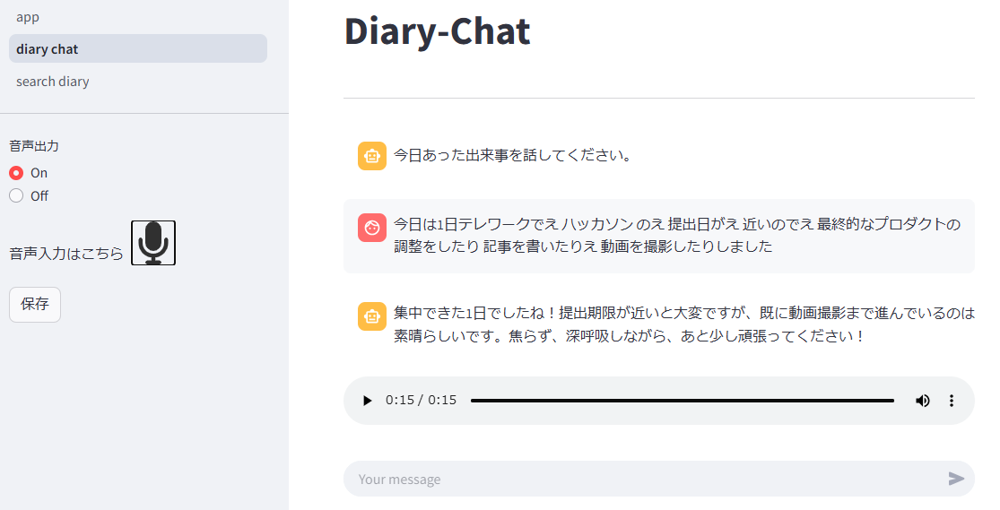
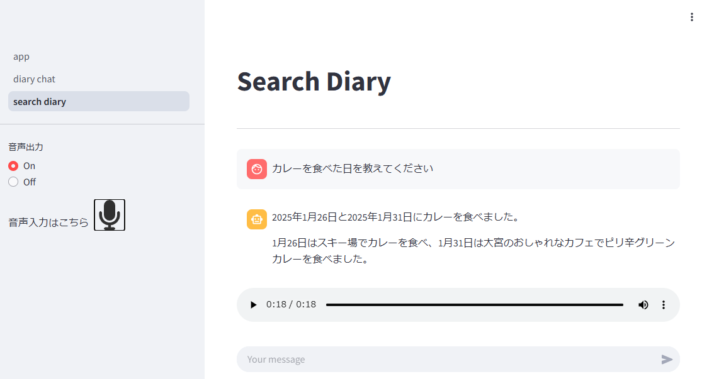
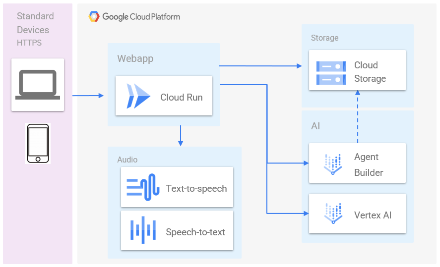
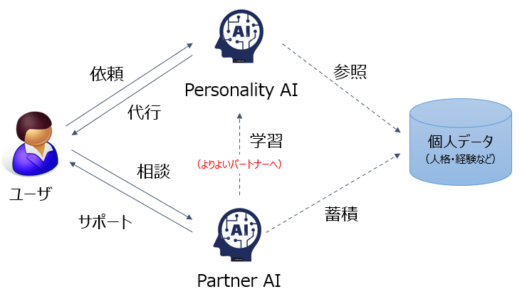

#  (AI agent Hackathon)Partner AI ～内省のススメ～

##  Partner AIとは

Partner AIとは、自分の人生を豊かにするサポートをしてくれるAIです。  
日記をつけたり、過去の経験を検索したり、調べものをしたり、自分が生きていく中で、  
様々なことをサポートする自分専用のAIがいるといいな…と思い立ち、Partner AIを開発しています。

今回のハッカソンでは、以下の2つの機能を、Partner AIの機能として、実装してみました。

  1. 日記を書く機能（対話式）（Diary Chat）
  2. 日記から思い出す（調べる）機能（Search Diary）

実装した機能の画面は以下となります。

■ 日記を書く機能（対話式）（Diary Chat）  

■ 日記から思い出す（調べる）機能（Search Diary）  

■プロダクトの紹介・デモ動画  
<https://youtu.be/NJcb2f3oRKE>

##  本プロダクトを実装した背景

まず、「人生を豊かにする」というキーワードで、Partner AIの構想を検討したところ、  
**「内省（振り返り）」** が、自発的に成長する人材育成に有益だと言われており、  
「内省する」行為をプロダクトでサポートできないか、と考えました。

そこで、「内省（振り返り）」を行いやすい行為は何かということで、思い至った結果が、 **「日記を書く」** でした。また、「過去の行いや言動を振り返る」ことが重要となるため、**「日記から思い出す（調べる）」** 行為が必要だと考えました。

この **「日記を書く」「日記から思い出す（調べる）」** という行為は、古くからノートを使って行われてきましたが、デジタル化もされてきており、「日記を書くこと」「日記から思い出すこと」は、だいぶ容易になってきていると思います。

しかし、一方で、「内省（振り返り）」という行為が、まだまだ世の中で一般化されている状態ではないと思っています。

そこで、より多くの人が気軽に「内省（振り返り）」が行え、各人の人生がより豊かになることを目指して、本プロダクトの開発に至りました。

##  プロダクトが対象とするユーザ像と課題

本プロダクトが対象とするユーザ像は、以下となります。

【ユーザ像】

  1. 日常が忙しく、内省に多くの時間を取ることが難しい人（より効果的に内省したい人）
  2. 日記を書く習慣がなかったり、日記を書くことが面倒だと思っている人
  3. 過去の行為や言動を思い出せない人、日記から思い出す（調べる）のに時間が掛かる人

また、上記のユーザが持っている課題として、以下を想定しました。

【課題】

  1. 日記を書くこと（デジタルであっても）が面倒くさい。
  2. 日記を書いているが、うまく深堀り（内省）ができていない。
  3. 日記の中から、調べたい内容を効果的に見つけ出せない。

##  課題へのソリューションと特徴

前項で上げた課題へのソリューションとして、以下の機能を持ったプロダクトを開発しました。

  1. 入力負荷を軽減するための音声ベースのインターフェース。
  2. ユーザからの内省の内容に、合いの手やアドバイスをくれるAIカウンセラー。
  3. 内省の内容（会話）を要約して、日記として、ストレージにアーカイブしてくれるAIライター。
  4. 日記の中から、質問に応じた内容を抽出してくれるAIサーチャー。

本プロダクトで意識したポイント（特徴）は以下となります。

  * 内省は、リラックスした状態で実施できるよう、音声による入出力をベースにしています。
  * 1日の深堀りが効果的にできるように、AIカウンセラーとの対話形式としています。
  * AIカウンセラーとの会話内容を要約して、日記形式で保存するようにしています。
  * 日記をベクトル化することで、曖昧な表現でも適切な情報を抽出できるようにしています。

##  システム・アーキテクチャ

本プロダクトのアーキテクチャを以下に示します。

  * 本プロダクト本体は、Cloud Run上にWebアプリ（Streamlit x Langchain）で配置されています。
  * 音声インターフェースを実現するために、text-to-speechとspeech-to-textのAPIを実行することで、音声会話を実現しています。
  * 要約された日記（テキスト）は、Cloud Storageに日単位で保存しています。
  * Cloud Storageをデータソースとして、Agent Builderを用いて、RAG環境を構築します。
  * ベクトル化された日記を、WebアプリからAgent BuilderのAPI経由で検索しています。

今回のアーキテクチャの特徴としては、可能な限り、GCPの強力なサービス郡を活用することで、開発スピードを上げている点です。特に、Agent Builderに関しては、本当に簡単にRAG環境が構築できたので、とても驚いています。

また、開発スピードが上がるということは、その分、アイディア創出やプロダクト改善に多くの時間を割けるということで、プロダクトの価値を高めることに繋がるため、今回は、GCPの利点を活かしたアーキテクチャを設計できたのではないかと思っています。

##  本プロダクトの使い方

  1. まず、1日の最後に5分だけでよいので、内省の時間を設けてください。 **（ここが一番重要です）**
  2. 内省は、可能な範囲で、リラックスした状態で、静かな所で実施してください。
  3. 本プロダクトにアクセスして、「Diary Chat」へアクセスしてください。
  4. マイクをOnにして、今日の出来事を話してください（マイクをOffにすると入力完了となります）。
  5. AIカウンセラーがアドバイスをくれるので、話したいことがあれば、好きなだけ話してください。
  6. 内省（振り返り）が十分できたと思ったら、「保存」ボタンを押してください。
  7. Google CloudのAgent Builderが、1日に1回、保存された日記をベクトル化します。**（自動）**
  8. 「Search Diary」にアクセスして、思い出したい内容を質問してください。

##  実装コードについて

プロダクトコードは、GitHubに公開していますので、GitHubをご確認ください。  
  
<https://github.com/INTREPIDA1979/partner-ai-web.git>

##  本プロダクトの改善点

今回の期間で実装しきれなかった改善点を以下に記載します。

  * **プロンプトの改善**
    * 内省の質を向上させるために、AIカウンセラーに与えるシステムプロンプトを調整したい。
    * 日記を保存するときの要約のレベル感やフォーマットを整理しておきたい。
  * **Function Callingの導入**
    * 日記を保存する際、”保存”ボタンを押下しているので、会話の中で保存できるようにしたい。
  * **Agent切り替え**
    * Diary ChatやSearch Diaryの呼出し元となるAI（Partner AI）を置いて、音声のみで切り替えられるようにしたい。

##  Partner AIの今後の方向性

Partner AIは、主に、以下の3つの方向性で進めていきたいと考えています。

  * **ユーザの利便性向上のための機能追加**
    * 検索機能やリマインド機能など、ユーザを助けてくれる機能の拡充
  * **蓄積したデータからユーザ傾向を分析する**
    * 日記で蓄積された自分の経験（データ）を活用した分析、および、予測モデルの開発
  * **Partner AIのキャラクター化**
    * 自分の個性や性格にあった人格を持つPartnerAIの開発
  * **リアルタイム会話**  
‐ ユーザ入力から回答までのリアルタイム性の追求

##  本プロダクトとPersonality AIの関係性

前回の[AI Hakkathon with Google Cloud](https://googlecloudjapanaihackathon.devpost.com/?ref_feature=challenge) では、「[Personality AI](https://devpost.com/software/personalityai-as-a-service)」というテーマで、本人らしいAIをどのように創造するかを、世の中の性格診断や本人の経歴（キャリア）などの情報を用いて、人格を表現しました。

そこで、次のステップとして、人を形成する要素として、人格と並ぶ要素となるのが、その人の「経験」となるため、今回のハッカソンでは、**「経験」を日記を通して蓄積する** という方法で試みています。

そのため、本プロダクトで取得される「経験（日記データ）」を、Personality AIに組み込むことで、より自分らしいAI（Personality AI）を創造できると思われ、今後のテーマとして、取り組んでいく予定です。

一方で、Personality AIが、より本人らしいAIになるということは、そのPersonality AIを使って、Partner AIを学習させることで、Partner AIをその人にとっての最適なサポートができるAIに成長させることができるのではないかと考えています。

上記のように、Personality AI（本人らしいAI）とPartner AI（自分をサポートしてくれるAI）には、密接な関係があり、この2つのAIを成長させることにより、個人にとっての豊かな人生を実現する一助になることを目指しています。

##  Personality AI と Partner AI が描く未来

Personality AIのテーマを進めるにあたり、「経験の蓄積」「時間の蓄積」など、自分のことをよく分かってくれる、一緒に時を過ごしてくれる、自分を常にサポートしてくれる、「Partner AI」の必要性に気づきました（個人データの収集・蓄積という観点においても）。

Personality AIは「私」、Partner AIは「あなた」を模したAIとなりますが、より変化の激しい時代を生きていく人々にとって、家族や友人と同様に、Personality AIやPartner AIがなくてはならない存在、心の拠り所になる存在になってほしいと願っています。

人とAIが自然にコミュニケーションを取っている時代がすぐそこまで来ているのかもしれませんね。
