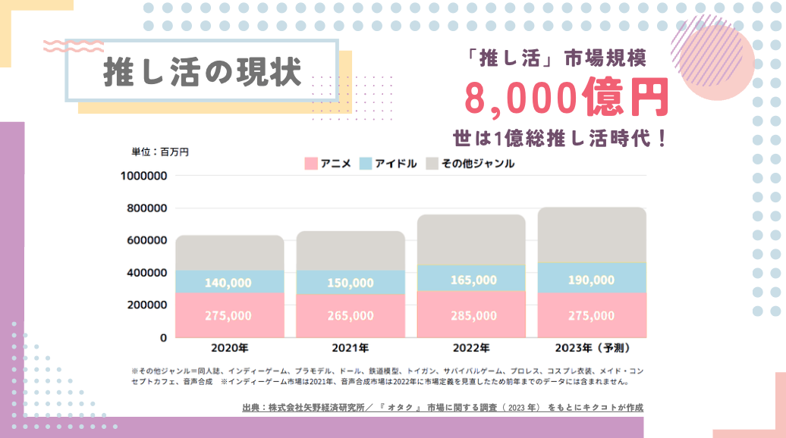
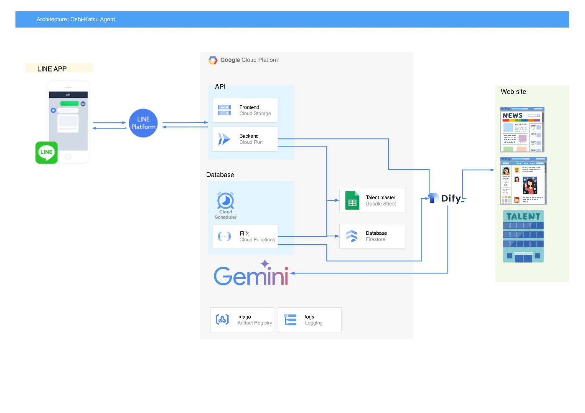
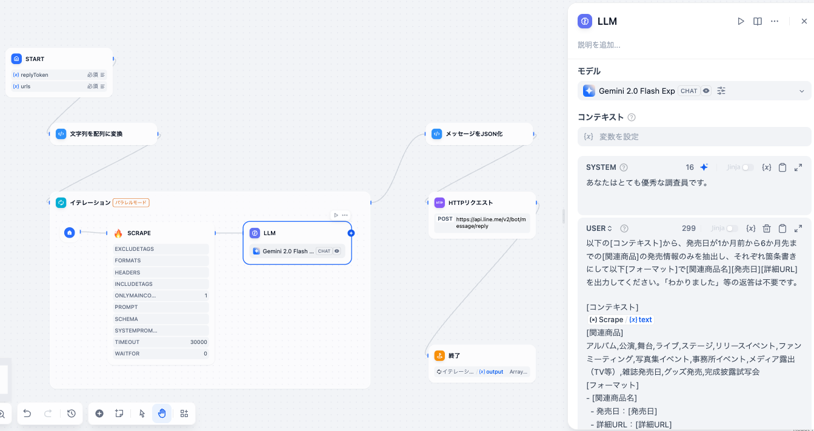

##  概要

##  使い方

  * 主に芸能人の「推し」をもつファンの方々を対象にしています。

  * 簡単3ステップで、いつでも推しの情報を確保できます。

    * LINEから簡単にお友達登録
    * 推しを登録
    * いい感じの最新情報をゲットする
    * URLからサイトにアクセスし速攻で買ったり予約できるのが良き

<https://youtube.com/shorts/uEzqNbsKboY>

##  システム構成

推し活をする人々は、自分の勘と**経験** を頼りに情報サイトを調べて回る**忠誠心** と、  
情報量が多すぎるサイトの中から、必要な部分だけを見つけ出す**心眼** をもっています。  
私たちはこれをシステムに置き換えました。  
  
すなわち、  
**経験 → データベース化**  
**忠誠心 → ジョブスケジューラー化**  
**心眼 → 生成AI化**  
となります。

  1. **推し** 毎に異なるリサーチ用のウェブサイトを、あらかじめ職人さんが調べてマスター化しておく
  2. ジョブスケジューラーでバッチを起動し、ウェブサイトを巡回し、スクレイピング
  3. 膨大なテキストの中から**推し** の情報だけを「抽出」し、スマホでも見やすいように「要約」

この「3」の部分で生成AIが非常によい活躍をしています。  
以下は Cloud Schedulerからリクエストする APIのワークフローで、処理部分は Difyで作成しており、画面中央の「LLM」ブロックには、生成AIの「Gemini 2.0 Flash」を使っています。

プロンプトは以下となります。
    
    
    あなたはとても優秀な調査員です。
    
    以下の[コンテキスト]から、発売日が1か月前から6か月先までの
    [関連商品]の発売情報のみを抽出し、それぞれ箇条書きにして
    以下[フォーマット]で[関連商品名][発売日][詳細URL]を
    出力してください。「わかりました」等の返答は不要です。
    
    [コンテキスト]
    {{#1739101835490.text#}}
    [関連商品]
    アルバム,公演,舞台,ライブ,ステージ,リリースイベント,
    ファンミーティング,写真集イベント,事務所イベント,
    メディア露出（TV等）,雑誌発売日,グッズ発売,完成披露試写会
    [フォーマット]
    - [関連商品名]
      - 発売日：[発売日]
      - 詳細URL：[詳細URL]
    
    

これにより、訓練されたファンが針の目を通すようにして探していた情報が、一瞬で見つけられるようになります。  
また、LINE上で動作するようにしたので、子育てや仕事で時間がなくても、スキマ時間でちょちょいとやれば、情報に置いていかれないで済みます😤！

##  今後の展望

  * 脱Dify 
    * 試行錯誤をしたかったので、とりあえずDifyで作りましたが、無料だと1人しか開発できないので、ロジックが固まった分からコードを書いてCloud Runで動かそうと思います。
  * 調査が終わった時に、サーバーから自主的にLINEに応答する 
    * モバイルサイトで人間が待てる時間は3秒と言われますが、スクレイピングと要約に3秒以上かかる事が多いため、苦肉の策で、スケジューラーによる事前データ生成フローとしました。しかし見られないかもしれない情報を集めるコストがもったいないのです。 ** LINE 応答メッセージ** を使えば、処理が終わった後に「調査終わりましたよ〜」と通知ができると風の噂に聞いたので導入したいです。
    * 参考）<https://developers.line.biz/ja/docs/messaging-api/sending-messages/#reply-messages>
  * 推しやリサーチ用URLを、ユーザー自身が登録できるように 
    * リサーチ用のウェブサイトの収集は推し活ナレッジの神髄なので、みんなの集合知で推し活を盛り上げる仕組みがあると幸せになれると思います。

##  奥付

この作品は、「[ぴこかんむり＆温泉♨BBA](https://peraichi.com/landing_pages/view/picoonsen)」がお届けいたしました。
