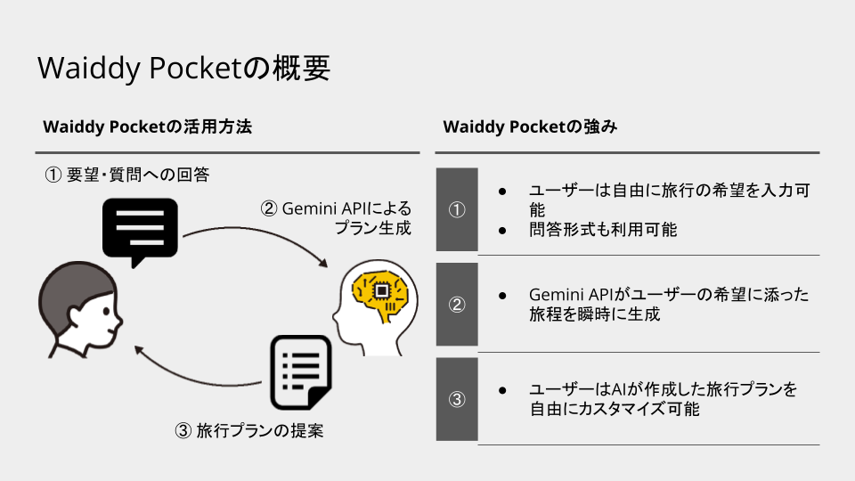
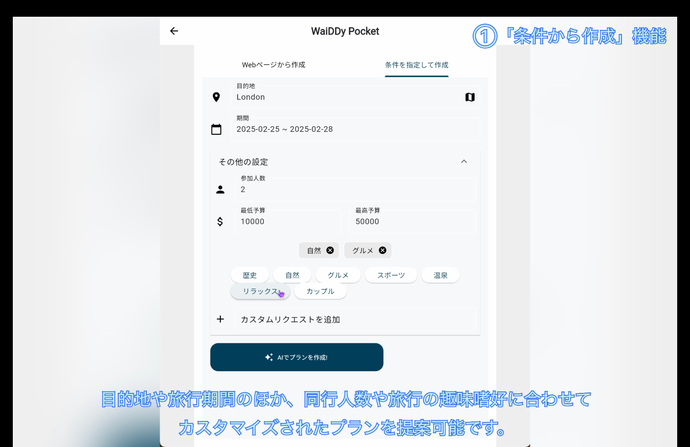
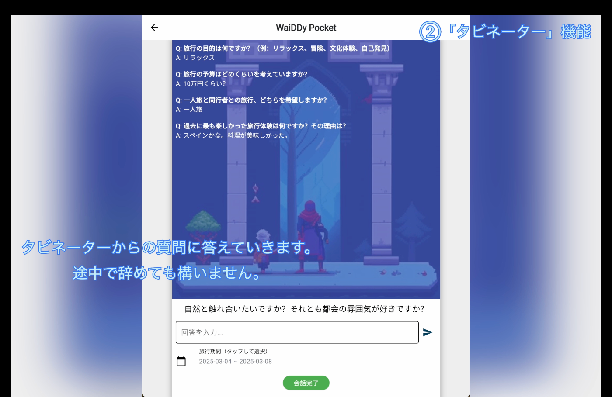
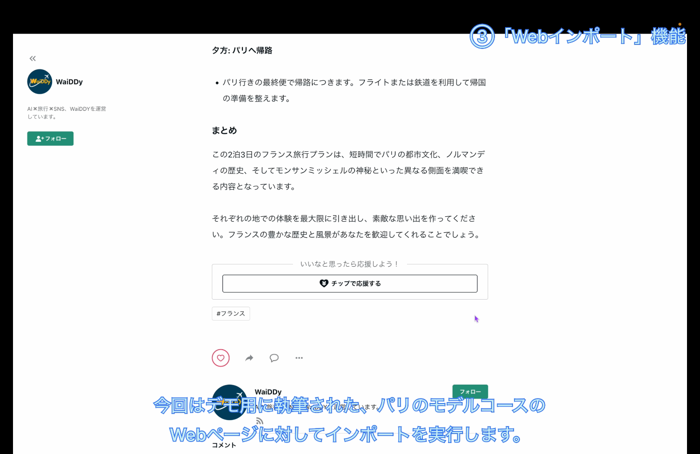
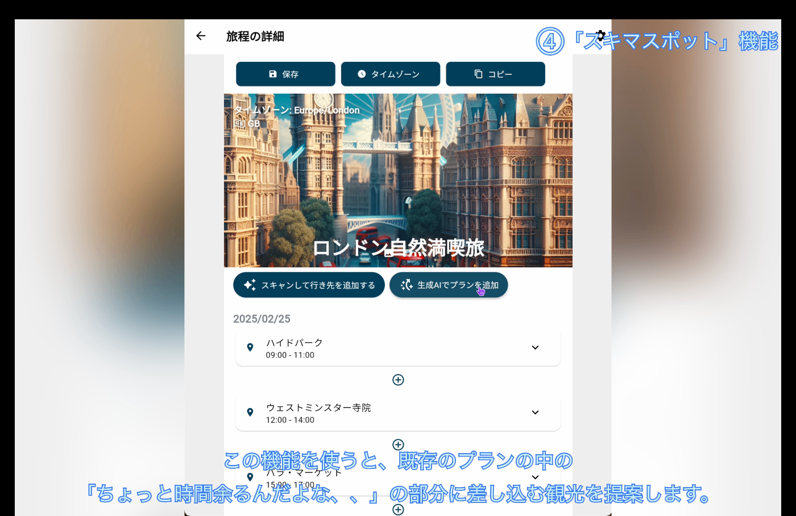
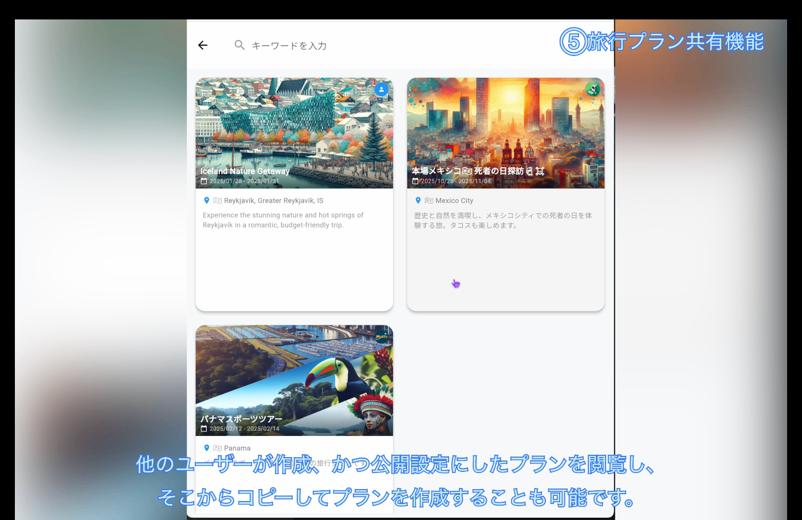
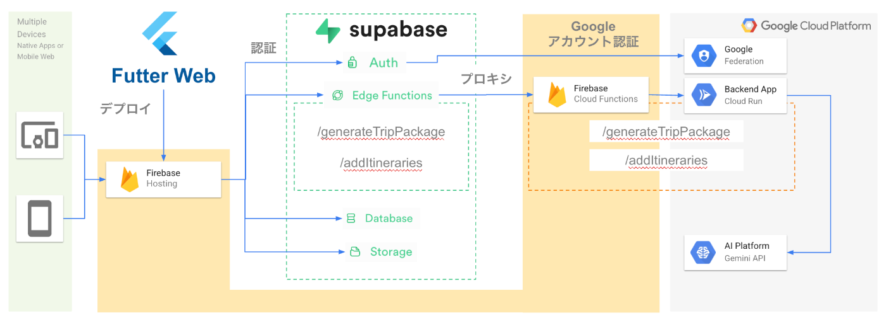

#  Google Cloud AI Agent Hackathon: AI旅行プラン生成サービス「WaiDDy Pocket」のご紹介

##  WaiDDy Pocket とは？

###  本ソリューションが対象とするユーザー像

  * 「旅行は好きだけど、旅程を作るのはめんどくさい...」
  * 「旅程を考えたけど、計画通りに旅行できなかった...」

平日は仕事に追われ、帰宅したらベッドにダイブ、、！気づけば週末、遊びに行きたいけど計画する余裕なんてゼロ…。だからいつも結局ゴロゴロして終わっちゃう、、、  
そんなあなたへお届けします！AIがサクッと最適な旅行プランを提案する「WaiDDy Pocket」があれば、"ノープラン週末"とはもうサヨナラ。スマホひとつで、週末のワクワクが手に入る！!

###  プロダクトの概要

「WaiDDy Pocket」は、AIによる最適な旅行プラン提案を実現したWebアプリケーションであり、ユーザーが自然言語で入力した要望（行き先、日程、予算、好みなど）をもとに、AIが最適な旅行プランを生成します。旅行プランには、観光スポットだけでなく、宿泊施設や交通手段の提案も含むことができ、「WaiDDy Pocket」ひとつでスムーズな旅行計画が可能です。

アクセスリンク：<https://pocket.waiddy.com/>

###  主な機能

  * ユーザー登録・ログイン（Googleアカウント対応）
  * プラン生成リクエスト（テキスト入力・選択式入力） 
    * 条件を指定して生成（人数や目的地、好みなど）
    * 公開Webページのコンテンツをもとに生成
    * AIガイド（タビネーター）によるプランの生成（アキネーターみたいなイメージ）
  * AIプラン生成（Gemini Vertex AIを用いた自動生成）
  * 他の人の作った旅行プランの閲覧
  * **今後の展望）外部サービスとの連携（予約サイト、地図アプリなど）**

* * *

###  アプローチしたユーザーの課題

「WaiDDy Pocket」は、旅行計画における以下の課題を解決することを目的としています。

  1. **旅程を考える時間がない**  
「行きたい場所はあるんだけど、どんなスポットに行くべきか調べる時間がない！」 
     * 仕事や日常生活で忙しく、旅行プランをじっくり考える余裕がない人向けに、生成AIが短時間で外せないスポットをまとめた旅行計画を提案。  

     * WaiDDy Pocketの「条件から生成」機能では、抑えるべき条件をしっかりと押さえた上で、生成AIが旅行プランを生成します。

* * *

  2. **行きたい旅行先が決まらない**  
「突然明日から数日休みになったから旅行したいけど、どこに行こうかな？」 
     * あなたの要望を聞き出すコンシェルジュ（タビネーター）があなたに質問をし、あなたの答えに基づいておすすめの行き先、観光スポットを提案！  

     * WaiDDy Pocketの「タビネーター」機能なら、ノープランのあなた（失礼）に対して、コンシェルジュの方から質問を投げかけてくれます。あなたのやることはその質問に答えていくことだけ！「あっ！」という間に旅行プランの出来上がりです。

* * *

  3. **モデルコースをカスタマイズしたい**  
「インターネットで行きたい場所をまとめたモデルコースを見つけた！でも、モデルコースよりももうちょっと長期間の旅行だから他にも行くべきところを追加したい！」 
     * モデルコースに記載されたルートを生成AIがインポート！しかもこの旅行プランに対して、観光スポットを追加でカスタマイズし、モデルコース内に組み込みが可能。  

     * WaiDDy Pocketの「Webページインポート」機能なら、インターネット上に公開されたモデルコース記事のURLを渡すだけで、生成AIがその記事の内容を抽出してWaiDDy Pocket内の旅行プランとしてプランを自動生成します。(抽出先のウェブサイトの、スクレイピングに関する規約にはご注意ください)
     * この生成されたプランに対して手動で行きたい観光スポットを追加し、旅行のしおりとしてWaiDDy Pocketをご利用いただくこともできます。

* * *

  4. **スキマ時間を有効活用**  
「旅行に来たはいいけど、次の予定までちょっと時間あるな、、どうしよう？」 
     * 旅行先で不意に発生するなんとも言えない微妙なスキマ時間で、グダグダしてしまい友達とちょっとキマづくなった経験、ありませんか？  

     * WaiDDy Pocketの「スキマスポット」機能なら、旅程をしっかり管理してスキマ時間を検出し、AIがそこに入れ込むべきぴったりなスポットをご提案します！

* * *

  5. **旅行プランを公開・閲覧**  
「来週ここいくんだけど、みんなどんなところを周るんだろう？」 
     * 旅行はいつだって初めての場所が多いから、他の人のプランを参考にできると安心ですよね。  

     * WaiDDy Pocketの公開・共有機能なら、自分の作成した旅行プランを公開・他のユーザーが公開した旅行プランを閲覧可能で、それをコピーして自分だけのオリジナルプランを作成することできます！みんなで最強の旅行プランを目指しましょう！

* * *

##  デモ動画

上記の5機能のデモ動画が下記になります。  
-「条件から生成」機能  
-「タビネーター」機能  
-「Webページインポート」機能  
-「スキマスポット」機能  
-「旅行プランの公開共有」機能

ぜひご覧ください！

<https://youtu.be/Bcuqy9xbYvM>

##  システムアーキテクチャ

「WaiDDy Pocket」は、Flutter と Firebase / Google Cloud のバックエンドサービスやAIサービスを活用し、スケーラブルなWebアプリケーションとして構築されています。  

###  使用技術

  * **フロントエンド** ：Flutter Web
  * **バックエンド** ：Google Cloud Platform / Firebase / Supabase
  * **データベース** ：Supabase Database
  * **AIエンジン** ：Gemini Vertex AI（Google Cloud）
  * **認証** ：Google OAuth
  * **外部連携** ：Google Maps API

##  今後の展望とロードマップ

WaiDDy Pocketは、常に進化を続けるサービスです。今後のアップデート予定としては、以下のような展開が考えられます。

  * **外部サービスとの連携強化**  
予約サイトや現地交通情報、さらには飲食店情報との連携を進め、旅行全体を一元管理できるエコシステムを構築していきたいです。

  * **ユーザーインターフェースの改善**  
利用者からのフィードバックをもとに、より直感的で使いやすいデザインに改良。誰でも簡単にカスタマイズできるインターフェースを目指します。

  * **パーソナライズ機能の拡充**  
過去の利用履歴や好みの分析を行い、より精度の高いプラン提案を実現。リピーター向けに、常に新しい発見がある機能を提供します。

  * **多言語対応とグローバル展開**  
初期は主に日本市場向けであり、英語・日本語のみの対応ですが、将来的にはより多くの多言語対応を進め、海外旅行者やグローバルユーザーにも最適な旅行プランを提供する予定です。

  * **Agentic/RAGシナリオへの対応**  
現状では素の生成AIの力に頼った構成ですが、ユーザーからの公開設定された旅行データや、運営チームが別途バックエンドに集めているデータが溜まり次第、その知識DBをクエリしつつ旅行プランの生成ができるようにパワーアップ予定です。特にタビネーター部分はAI Agentの概念とも通じる部分であるため、今後のAgenticなシナリオ対応への進化もご期待ください。

##  お問い合わせと利用開始方法

WaiDDy Pocketは、シンプルな登録プロセスで今すぐ利用を開始できます。  
以下のリンクからアクセスし、みなさまがお持ちのGoogleアカウントを使ってログインするだけです。

  * **アクセスリンク** : [WaiDDy Pocket](https://pocket.waiddy.com/)

またサービスに関するご質問やフィードバック、機能追加のご提案などは、下記お問い合わせフォームからお気軽にご連絡ください。

  * **アクセスリンク** : [WaiDDy Pocketに関するお問合せ](https://docs.google.com/forms/d/e/1FAIpQLScggXYFzzrirhabI8Ch4OvnpG7dshN8BiC-uvySp_5dRuhg8g/viewform)

##  まとめ

WaiDDy Pocketは、AI技術とクラウドサービスを融合させた、これまでにない旅行プラン生成サービスです。

  * **忙しい現代人のために** 、短時間で最適な旅行プランを提供
  * **旅行初心者から上級者まで** 、誰もが手軽にカスタマイズ可能なプラン作成
  * **未来の旅行体験** を見据え、外部サービスとの連携や多言語対応を進めるロードマップ
  * **みんなで作り上げる旅行プラン** をモットーに、ユーザーの旅行に関する知見や経験が蓄積されたプラットフォームに

旅行の計画をもっと楽しく、もっと自由に。WaiDDy Pocketを使えば、あなたの理想の旅がすぐそこにあります。ぜひ一度、公式サイトにアクセスして、次の旅の一歩を踏み出してみてください！

* * *

##  開発後記

###  わと （開発）

今回は初めてFlutterを利用してWebアプリケーションを作成しました。Google認証などで初っ端からつまづいたほか、ネイティブ側では引っ掛からなかったCORSに引っかかりまくったりなど、何度も匙を投げそうになりました。😅 やはりどうしても気になるのが Material UI っぽさが抜けないところです。チームにUIデザイナーの方なんかを招き入れられたら、この辺りはもう少し良くなるのかなぁと感じました。特にtoC向けのアプリケーションではUIは大事ですね。そんなこんながありつつも、最終的になんとか形になったのは、他でもないチームメンバーのおかげだと思います。今回、Gemini APIを利用して学べたこともたくさんありますし、いろいろな機会を与えてくださったハッカソンには感謝しかありません。ありがとうございました！💯 近日中にAppStoreやGoogle Play Storeでも公開したいと思いますので、その際にはぜひお手元でお試しいただけますと嬉しいです！

###  Shu (開発)

Flutterでここまで実装を作りこんだのは初挑戦でした！  
Firebase・Cloud Run・Supabaseをフル活用して、サーバーレスなアプリケーションを開発できたかと思います。  
開発の中で詰まったポイントは以下です。  
・Flutter Webだと直接Googl Maps APIを呼べない  
⇒Edge Functions側で呼び出すことで回避しました。

・Edge Functionsでは、Denoのランタイムしか現在は提供されておらず、TypeScripのバックエンドサービスしかデプロイできなかった  
⇒Edge FunctionsをBFFとして扱い、Cloud Run側にバックエンドサービスを実装することでPythonを使用したバックエンドサービスを利用できるようにしました。

まだまだ、実装側でやりたいことがあるので、このハッカソンが終わった後も開発を進めようと思います！  
最後に、この度はハッカソン開催ありがとうございました！チュートリアルセッションなど良い学びの機会になりました！お疲れ様でした👏👏👏
