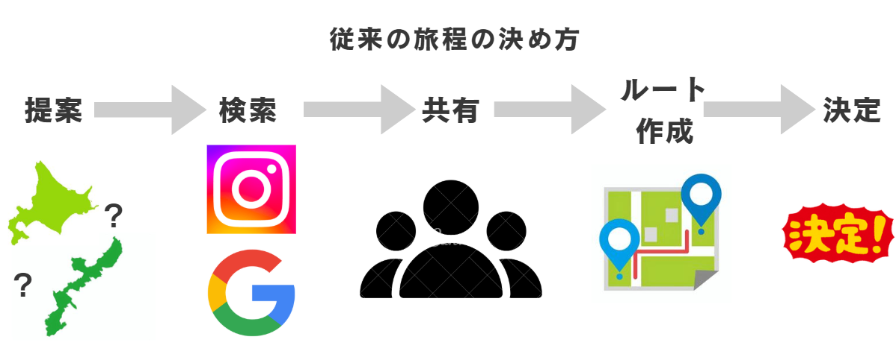
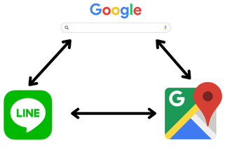
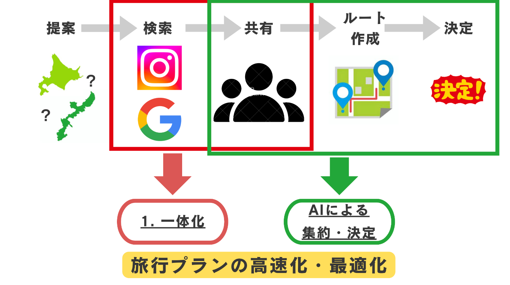
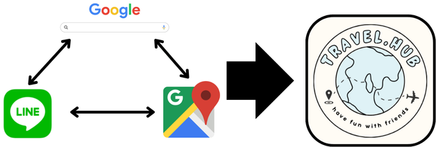
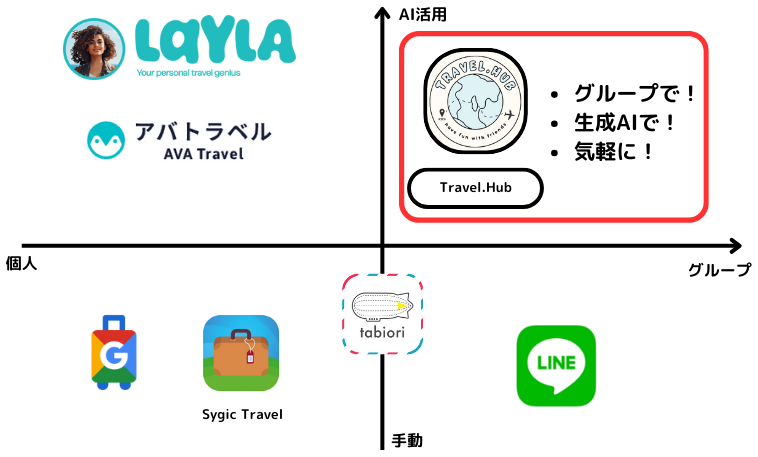
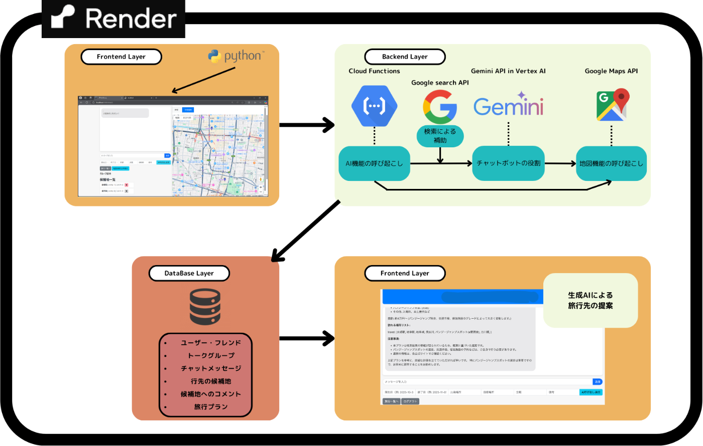

  
_制作したwebアプリ：[Travel.Hub]のアイコン_

###  制作したwebアプリのURL

<https://travel-hub-submit.onrender.com>

##  はじめに

皆さん旅行は好きですか？旅行先を決める際、どのように計画を立てますか？旅行の計画を立てるのって楽しいですよね。しかし観光地を調べたり、どこへ行くか友人や家族といちいち話し合ったりと面倒なことも多いですよね。そこで私たちは、「グループ旅行の計画を立てる」ことに特化したプロダクトを開発しました。

##  ユーザー像

  * 年齢層：18 ~ 25歳
  * 旅行スタイル：基本的にグループで旅行をする
  * グループ内での役割：リーダー、まとめ役

ここでは、**グループで旅行をしようとしている男子大学生のリーダー：A君** としてペルソナをまとめました。

##  従来の旅程の決め方

まず、A君がどのように旅行の予定を決めるかを以下にまとめました。

###  1\. 大まかな観光地の提案

LINEなどを使って、グループのメンバーにざっくりとした行先を提案します。例えば、「夏休みに沖縄行きたい！」とかですかね。

###  2\. 各々観光地を検索

googleやinstagramなどを使って、沖縄でいきたい場所をA君を含めたグループの個人で調べます。

###  3\. 調べたものをグループチャットで共有＆行先の決定

再びLINEに戻って、各々調べたものをグループに共有します。  
A君はグループ各個人の意見を全て考慮した上で、行先を決定します。

###  4\. ルート作成

観光地をどのような交通機関で、どのように回るかをグーグルマップやヤフー乗換案内などを使って決めます。

###  5\. 交通やホテルの決定

4で決めたルートに合うように、googleなどでバス・新幹線などの交通やホテルの予約を行います。

##  課題について

上記の旅程を決める工程をもとに、リーダー役であるA君においてどのような問題や課題があるかを2点に絞って整理します。

###  1\. 旅行先について調べる手間

上のように予定を決めるとき、A君は言い出しっぺなのもあり、率先して旅行先について調べる必要があります。その際、検索エンジンやマップ、メッセージアプリの利用が必要ですが、そのアプリ間の移動が煩わしいでしょう。いくつものタブを切り替えながら計画を立てていくのは面倒ですよね。  
  
_アプリ間の移動_

###  2\. グループメンバーの意見を考慮した行先とルートの決定

リーダ役のA君は他のメンバーが行きたい場所や興味のある場所をすべて把握する必要がありますが、当然難しいですよね。従来の方法ではグループ全員の観光候補地を確認するために、チャットをさかのぼり泥臭く一つずつ調べるか、グーグルマップなどのピン止めの共有を利用しなければいけません。  

##  ソリューション

以上の項目を、私たちが解決を目指すべき問題として認識し、プロダクトの設計を行いました。  
  
_travel.hubによる旅行計画_

###  1\. 旅行先について調べる手間 ➡ チャット、マップ、生成AIの一体化

もしも必要なアプリがすべて統合されていたら、アプリ間の移動がなくなりとても便利ですよね。このtravel.hubではグループチャット、生成AIによる検索、グーグルマップをすべて1つの画面で操作できるようにし、**会話や生成AIによる検索、観光地の場所の確認が同時にできる** ようにUIを設計しました。  
  
_既存の方法を統合し、手間を削減する_

###  2\. グループメンバーの意見を考慮した行先とルートの決定 ➡ AIによる意見の集約 + ルート決定

私たちはマップを活用することで、**他のメンバーが行きたい場所や興味ある場所を視覚的に把握** することができると考えました。この機能は、行きたい場所を各々がマップ上でピン止めすることで実現しました。さらに、そこへ評価ボタンを実装することで、**SNSの「いいね」感覚で投票をその場で行える** ようにしました。  
加えて、グループメンバーがマップ上に追加した場所とその評価をもとに、**生成AIが旅程を組んでくれる** ようにプロダクト設計をしました。この旅程には、日程や出発地などの基本的な情報も加味して決定されます。これによってスムーズに観光地を回れるようになるでしょう。

次により詳しい機能や、他アプリと異なる点について説明していきます。

##  travel.hubの機能と特徴、類似アプリとの違い

###  メンバーとの会話と同じようにAIを呼び出せる

**「@AI」をつけてメッセージを送信するとAIを呼び出すことができ** 、AIの応答がグループチャット内に共有されます。また、テンプレをもとに呼び出すこともできます。テンプレには旅行の開始日、終了日、出発地、目的地、金額、その他備考を含むことができます。変更がしたくなった際にはこれにより、**普段生成AIを使い慣れていない人にとっても、AIを呼び出しやすい** ものになっています。

###  候補地の可視化＋投票（評価）機能

チャットルーム中の「地図を開く」ボタンを押すことで、マップを右半分に表示することができます。このマップには、各々が追加したした観光の候補地がピンで表現されています。また、左側下半分には各々が追加した候補地がリストになって表示されます。さらにそこには評価ボタンが設置されており、これにより投票を行うことができます。

###  グループチャット機能＋生成AIによる補助

現状では生成AIが旅行の計画立てを手伝ってくれるアプリはすでに存在しています。また、LINEやdiscordなど、グループ内でチャットを行い、リンクなどを共有できるアプリも存在しています。しかしながら、**AIに相談することができ、そのAIの応答がグループ全員に共有され、他メンバーが行きたい場所をすべて把握できる** ようなアプリはありませんでした。travel.hubはこのような「複数人で旅行計画を立てる際にほしい機能」を詰め込んだ、夢のようなアプリです。  
  
_従来のアプリとの比較_

##  システムアークテクチャ

###  使用した技術

  * **Cloud Functions AI**  
呼び出しAPI（curlコマンド参照）として利用しています。サーバーレスの仕組みを活かし、特定のトリガー（例：ユーザーからのリクエスト）に応じて自動的に実行。チャットbotやGoogle Mapsなど外部サービスへのリクエスト発行やレスポンス処理を短いレスポンス時間で実現しています。

  * **Gemini API in Vertex AI**  
ユーザーがアプリ内で自然言語の問い合わせを行った際、応答内容の生成に使用します。ユーザー入力と検索結果を組み合わせ、高精度な自然言語生成により、より包括的かつユーザーフレンドリーな旅行プランの提案を実現しています。Vertex AIの管理下にあるGemini APIは、スケーラブルな環境で実行され、高負荷状態でも安定した応答を保証します。

  * **Google Search API**  
ユーザーの入力に応じ、関連性の高い情報やトピックをピックアップするために使用します。Webサイトからの情報抽出に加え、参考となるURLも併せて返すことで、抽象的な要求にも具体性のあるプランニングが可能となります。AIの回答にリアルタイム性を持たせるため、最新の検索結果を取り込む仕組みとなっています。

  * **Google Maps API / Places API**  
観光地名を基に、Places APIで該当の観光地データを取得します。候補地を保存したデータベースと連携し、PlacesIDを利用して正確な緯度・経度の情報を取得。これにより、マップ上に観光ポイントとしてピンを表示し、視覚的に旅行プランをサポートすることができます。ユーザーは地図上で位置情報も確認でき、ナビゲーションなどの付加価値サービスも実現可能です。

  * **Python / Flask**  
Webアプリケーションのフレームワークとして採用しました。Pythonのシンプルな文法と豊富なライブラリを活かし、開発効率や可読性を向上させます。Flaskは軽量な設計でありながら拡張性が高く、プロジェクトの要件に合わせた柔軟なルーティングやミドルウェアの組み込みが容易です。

  * **SQLAlchemy & SQLite**  
ORM（Object Relational Mapping）としてSQLAlchemyを利用し、データベースとのやり取りをPythonのオブジェクト指向で実装しました。SQLiteは軽量なデータベースで、開発段階や小規模運用に適しており、迅速なプロトタイピングと安定したデータ管理を実現しています。

  * **Socket.IO**  
リアルタイムチャット機能の実現に使用しています。WebSocketに準じた双方向通信を提供し、クライアントとサーバー間で即時のデータ・メッセージ交換を可能にしました。リアルタイム性が求められるチャット機能において、ユーザー体験の向上に寄与しています。

  * **Bootstrap**  
レスポンシブなUIデザインを実装するためのフロントエンドフレームワーク。モバイルファーストの設計思想により、様々なデバイスに最適化された表示を実現しました。既定のスタイルやコンポーネントが豊富なため、開発速度の向上にも貢献しています。

  * **jQuery / jQuery UI**  
DOM操作やUIエレメント（例：datepicker）の実装に利用しています。簡潔なAPIにより、動的なコンテンツ更新やアニメーション、イベントハンドリングが容易に行えます。特にdatepickerなどのウィジェットは、ユーザーが快適に日付の選択を行えるようにするために役立っています。

  * **Google OAuth 2.0**  
認証機構として採用。ユーザー認証のためにGoogleアカウントを利用し、シングルサインオンの実現をサポートします。セキュリティ面でも高い信頼性を確保するため、最新の認証プロトコルに基づいた安全なアクセスを提供しています。

  * **Render**  
Pythonを簡単にデプロイする方法としてRenderを採用しています。サーバーレスな環境でありながら、バックエンドのセットアップやインフラ管理を最小限に抑えつつ、スケーラブルなアプリケーションの構築が可能です。旅行プラン補助チャットボットのAPIサーバーとして機能し、Cloud Functionsと連携しながら、リクエストの処理やデータ管理を担います。無料プランでも一定のリソースを確保できるため、開発・テスト環境としても活用しています。

###  アーキテクチャ図

以下のフロー図で表されるとおりに情報を処理します。  

##  デモ動画

<https://youtu.be/zHDjyZDsaS0>

##  今後の展望

###  グループチャット機能の充実

今回のプロダクトは、生成AIを用いて旅程計画を立てるということを重視して作ったため、チャット機能としてはメッセージの送信機能しか実装していません。他のチャットアプリと同様に、写真や動画の送信、メンションやアナウンス機能などを追加することでより快適にアプリを使用できます。

###  アンドロイドやiOSでの実装

今回はwebアプリとして実装しましたが、アンドロイドやiPhoneで使いたいという人も多いはずです。webアプリではなく携帯用のアプリとして実装すればより汎用性が高まり、操作性も上がるでしょう。

###  旅行中、旅行後も使える機能の追加

このtravel.hubは旅行に行く前の段階で利用することを想定して設計しました。しかし旅行中や旅行後にあると便利な機能を組み込むといった拡張も考えられます。例えば、旅行中の立替や割り勘などを処理してくれるシステムや、旅行後に写真・メッセージなどをアルバムのようにまとめてくれるシステムなどがあるといいですよね。

##  著者

<https://x.com/sime_sabaaaaaa>  
<https://x.com/yk_kuinfo?s=21>
