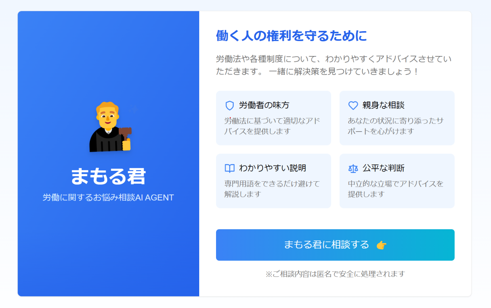
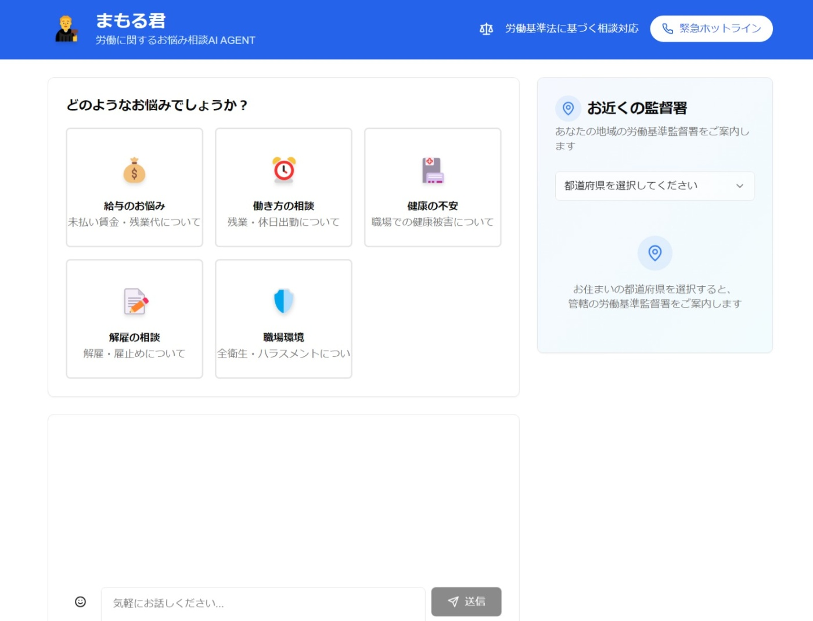
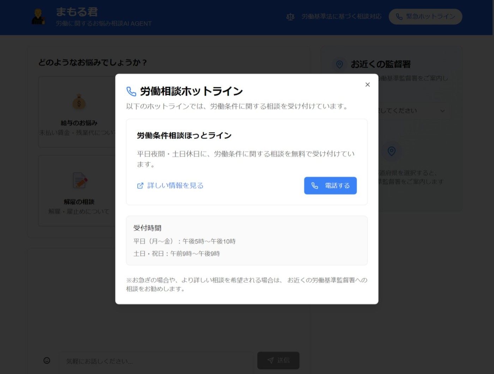

##  労働相談AIエージェント「まもる君」について

###  はじめに

  
  

<https://www.youtube.com/watch?v=MrRdRjWBk5Q>

<https://github.com/x-ray-ctr/mamoru_agent>

本稿では、国内で働くすべての労働者の皆様が抱える労働環境上のさまざまな悩みを、先進技術によって迅速かつ的確に解決するために開発されたAIエージェント「まもる君」の概要をご紹介いたします。特に、未払い賃金、長時間労働、ハラスメント、安全衛生といった問題に対し、専門的な知見と最新のAI技術を融合させたサポートを提供することを目的としております。

本プロジェクトは、従来のデータベースに頼らず、全国の労働基準監督署の情報を独自の手法で管理することで、システムの軽量化と柔軟な運用を実現しています。2024年のGoogle Cloud Japan AI Hackathonに向けた挑戦の一環として、利用者視点に立った設計と最先端技術の融合により、革新的な労働相談プラットフォームの実現を目指しております。

###  現代の労働現場が抱える課題

現代社会において、多くの労働者が以下のような問題に直面しています。

  1. **情報の非対称性**  
労働法や各種相談窓口に関する情報が十分に周知されておらず、適切な支援を受けるための情報収集に多大な時間と労力を要する状況があります。

  2. **アクセスの困難さ**  
労働基準監督署やその他の相談機関の所在地や連絡先が明確でないため、実際に訪問や問い合わせが困難なケースが見受けられます。

  3. **心理的な障壁**  
専門家への相談に対する抵抗感や、相談内容が十分に整理できずに不安を感じるなど、心理的なハードルが支援への一歩を踏み出す妨げとなっています。

これらの課題が、労働者の本来受けるべき支援を阻み、問題が深刻化する要因となっております。

###  「まもる君」による解決策

「まもる君」は、上記の課題に対して以下の特徴をもって解決に取り組みます。

  1. **全国対応のシンプルなシステム**  
労働基準監督署の情報は、システム内部にあらかじめJSON形式などで整理されており、データベースに依存しない設計となっています。これにより、地名やキーワードに基づいた動的な検索が可能となり、システム全体の軽快な運用を実現しています。

  2. **AIによる即時対応**  
利用者からの入力内容をリアルタイムで解析し、geminiを基盤とするアドバイスを提供いたします。労働法に則った具体的な支援策や次のステップへの案内を、分かりやすく丁寧な言葉でご説明します。

  3. **プライバシーの徹底保護**  
システム設計においては、ユーザーの個人情報の保存を一切行わず、相談内容はセッション終了とともに完全に破棄されるため、安心してご利用いただけます。

  4. **地域に根ざした支援体制**  
利用者が入力された位置情報や都道府県名に基づき、最寄りの労働基準監督署や相談窓口を即座にご案内します。たとえば「東京都」と入力された場合、該当する監督署の一覧を提示し、迅速な対応を可能にします。

###  対象となる利用者

「まもる君」は、以下のような方々を主な対象としています。

  * **一般労働者**  
未払い賃金や長時間労働、ハラスメントなどの問題に直面している方々。

  * **非正規雇用者**  
パートタイムや派遣社員など、契約内容や労働条件に不安を感じる方々。

  * **外国人労働者**  
言語の壁により労働法に関する情報を得にくい方々。

  * **中小企業経営者**  
従業員の労働環境改善や法令遵守に関する情報を求める経営者の方々。

###  システム構成と技術的な特徴

「まもる君」は、以下の主要な要素で構成され、利用者の利便性と安全性を両立しております。

  1. **ユーザーインターフェース**  
直感的で操作しやすいデザインにより、利用者はカテゴリの選択、相談内容の入力、アドバイスの受け取りをシンプルに行うことができます。

  2. **AIエンジン**  
gemini-1.5-flashを駆使し、入力されたテキストから利用者の意図を的確に読み取り、労働法に基づくアドバイスや具体的な行動提案を生成します。

  3. **労働基準監督署案内機能**  
全国の労基署情報はプログラム内部にあらかじめ登録されており、ユーザーが入力した地名やキーワードに応じた動的なリスト検索が可能です。

  4. **マルチステップ相談フロー**  
利用者は、まず相談カテゴリを選び、次に具体的な状況や位置情報を入力します。これにより、最適な労基署の案内や具体的な行動指針が自動的に提供されます。

###  技術スタック概要

本プロジェクトで採用している主な技術スタックは以下の通りです。

####  バックエンド

  * **FastAPI**  
Python 製の高速でシンプルな Web フレームワーク。API の実装とクリーンアーキテクチャに基づく設計に利用。

  * **Uvicorn**  
ASGI サーバー。FastAPI アプリケーションの実行環境として採用。

  * **Anyio**  
非同期処理のためのライブラリ。非同期 I/O を統一的に扱い、Gemini LLM との連携で活用。

  * **python-dotenv**  
環境変数（.env ファイル）の読み込みをサポート。API キーやその他設定情報の管理に使用。

  * **Pydantic**  
データ検証およびシリアライゼーションライブラリ。FastAPI のリクエスト・レスポンスモデルの定義に利用。

  * **pydantic-ai**  
LLM とのインターフェースにおける型安全なデータモデルの拡張を提供。Gemini-1.5-flash との統合時に役立ちます。

  * **python-multipart**  
マルチパートリクエスト（ファイルアップロードなど）の処理をサポート。

####  LLM (Large Language Model)

  * **Gemini-1.5-flash**  
外部 LLM サービス。非同期処理により、ユーザーの質問に対するアドバイスや回答を生成するために利用。

####  フロントエンド

  * **Next.js**  
React ベースのフレームワーク。ユーザーインターフェースの構築と、ステップ・バイ・ステップの対話フローの実現に使用。

* * *

この技術スタックにより、システム全体は型安全かつ非同期処理に対応した堅牢な設計となり、ユーザーフレンドリーな労働相談プラットフォームの実現を目指しています。

###  今後の展望

「まもる君」では、さらなる機能拡充を見据えて以下の取り組みを進めております。

  * **多言語対応の強化**  
外国人労働者向けに、英語、中国語、ベトナム語など、多様な言語でのサポートを拡充してまいります。

  * **証拠データ解析の精度向上**  
AI技術の進化を取り入れ、証拠資料からのデータ抽出精度をさらに高めることで、より確実な情報提供を実現します。

  * **音声対応機能の導入**  
音声による相談入力および回答出力を可能にし、利用者のさらなる利便性向上を図ります。

  * **教育ツールとしての展開**  
労働法に関する知識の普及を目的とし、学校や企業向けの教育ツールとしても活用できるプラットフォームの構築を進めております。

###  おわりに

労働相談AIエージェント「まもる君」は、テクノロジーの力を駆使して、労働者の皆様が直面する課題を根本から解決するための革新的なプラットフォームです。誰もが安心して働ける環境を実現するため、私たちは「まもる君」を通じて、迅速かつ的確な支援を提供してまいります。共に、より良い未来の実現に向けて歩んでいきましょう。
