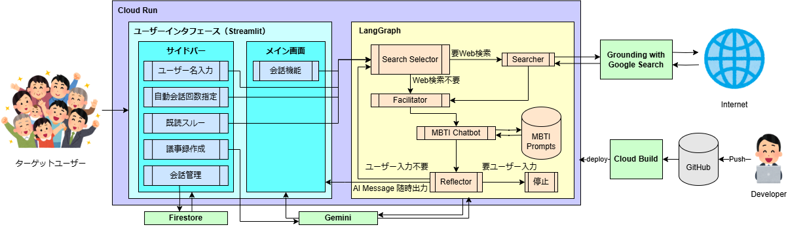

##  デモ動画

<https://www.youtube.com/watch?v=pQe41JzKs8A>

##  はじめに：日本の生成AI活用、実は「もったいない」状況？

日本の生成AI普及率は、2024年時点でわずか9％で世界と比べると低いです。利用しない理由の多くは「使い方がわからない」「生活に必要ない」というもので、実に8割近くの方が、そう感じているという調査結果もあります。  
<https://www.nikkei.com/article/DGXZQOUA036VW0T00C24A7000000/>

そのような方の中には、「生成AIの本当の力」にまだ気づいていないだけの方も多いのではないでしょうか。

新しいツールや技術に触れることは、少なからず抵抗を感じるもので、「今のままで十分」、「新しいことを覚えるのは面倒」と思うこともあると思います。現状維持は楽ですし、新しいことを始めるにはエネルギーが必要です。だからこそ、生成AIも「自分には関係ない」と、無意識のうちに遠ざけてしまっている方も少なくないと思います。

アプリとしてのChatGPTやGeminiは使いこなせれば非常に有用なのですが、

  * 普段から使い慣れたインターフェースではない
  * うまく質問しないと良い感じの答えが返ってこない
  * 「楽しい！」と思える体験ではない

といった点が、利用のハードルを上げているのかもしれません。

そこで、「もっと気軽に、楽しく、そして自然に生成AIを活用できる方法はないだろうか？」と考えました。

その答えが、「複数AIとグループチャットのようにワイワイ会話しながら、様々な問題を解決できる」 アプリです。

この記事では、そのようなアプリについて詳しくご紹介していきます。

##  1\. ターゲットユーザーと潜在ニーズ

このアプリのターゲットユーザーは、「生成AIを使ったことがない全ての人」です。ビジネスパーソンはもちろん、主婦の方や定年退職後の方まで、老若男女問わず、誰もが気軽に使える存在を目指しています。そこで、具体的なペルソナを設定し、それぞれの潜在ニーズを深掘りしてみました。

###  1.1. ビジネスパーソン

例えば、メーカーで営業職として働く30代男性の中堅社員を想定します。彼は顧客とのフリートークが苦手で、良好な関係を築くことに悩んでいます。

潜在ニーズ

  * 移動中に「今日訪問する〇〇社の担当者は、どんな話題に興味がありそう？」と気軽に質問できる相手が欲しい。
  * 商談前に、自信を持って会話に臨めるような、気の利いた雑談ネタや相手に合わせたトークスクリプトの提案が欲しい。

このアプリは、そんな彼の「頼れる相談相手」として、商談成功をサポートできると思います。

###  1.2. 主婦

40代女性の主婦で、2人のお子さんを育てながらパートタイムで働いている方を想定します。仕事から帰宅後、献立を考えるのは一苦労です。レシピサイトを見ても、必要な材料が揃っていなかったり、調理に手間がかかったりして、理想の料理を作れないこともあります。

潜在ニーズ

  * 「冷蔵庫にある食材だけで、簡単に作れる夕食のレシピは？」と気軽に質問できる場が欲しい。
  * 栄養バランスが良く、家族が喜ぶ献立の提案だけでなく、「献立を決める」という日々の負担を減らしたい。

このアプリがあれば、「献立決め」という、意外と体力を使う意思決定をサポートしてもらえると思います。

###  1.3. 定年退職後の方

60代男性で、元運送業の管理職だった方を想定します。定年後の趣味として自転車を始めましたが、職場を離れると、気軽に質問できる相手が周りにおらず、寂しさを感じています。

潜在ニーズ

  * 自転車のメンテナンス方法や、おすすめのサイクリングコースなど、気軽に質問できる場が欲しい。
  * 同じ趣味を持つ仲間と繋がり、情報交換や交流を楽しみたい。

このアプリは、彼にとっての「自転車仲間」のような存在となり、趣味の世界を広げるきっかけとなると思います。

##  2\. システムアーキテクチャ

フロントは、開発の迅速さを優先すべくStreamlitを採用しました。メイン画面にはユーザーと複数AIの会話機能をつけ、サイドバーではユーザー名入力、自動会話回数設定、既読スルー、議事録作成、会話管理の機能をつけました。

会話機能の裏側は、16人の異なる特性を持ったAI達が、Web検索が必要か、誰が発言するか、ユーザーからの応答が必要か、を自律的に判断できるようにすべく、LangGraphを用いてAgenticなシステムを実現しました。

また、開発効率性と運用性を高めるべく、Docker、Cloud Run、Cloud Buildを活用しました。

###  2.1. ユーザーインターフェース (UI)

####  2.1.1. デザインコンセプト：シンプルで直感的なグループチャット

UIデザインにおいては、「シンプルで直感的なグループチャット」をコンセプトとしました。ユーザーが迷うことなく、自然な会話の流れに集中できるよう、以下の点に配慮しました。

  * メイン画面: チャット機能に特化し、余計な要素を排除。
  * サイドバー: オプション機能を集約し、必要に応じて表示/非表示を切り替え可能。
  * レスポンシブデザイン: Webブラウザ、スマートフォンなど、様々なデバイスで快適に利用可能。

####  2.1.3. 機能詳細

Streamlitの機能を活用し、以下の機能を実装しました。

  1. メインチャット機能:

  * `st.chat_message` を使用し、ユーザーとAIの発言を視覚的に区別。
  * 当初はストリーミング出力を検討しましたが、以下の理由から、一括表示方式を採用しました。 
    * 通常のグループチャットでは、ストリーミング出力は一般的ではない。
    * 人間は、ストリーミングが必要なほどの長文を送信することは稀である。
    * LangGraphでは、途中でのストリーミング出力は技術的な難易度が高い。
  * 結果として、一括表示方式は、より自然なグループチャット体験となりました。

  2. ユーザー名入力:

  * AIがユーザーの名前を呼ぶことで、より没入感のある体験を提供。
  * 「AIとの会話に自分も参加している」という臨場感を高めます。

  3. 最大自動会話回数:

  * AI同士の自動会話の最大回数
  * AIがユーザーに質問している場合は、最大回数に達する前に停止します。
  * この機能を設けた理由は、ユーザーのニーズ（AI同士の議論を深めたい、自分の考えを詳しく伝えたいなど）に合わせて、会話の主導権を調整できるようにするためです。

  4. 既読スルー:

  * ユーザーが自分の発言をスキップし、AIに会話を継続させる機能。
  * 「何を話せば良いかわからない」「AI同士の会話をもっと聞きたい」といった状況に対応し、より気軽に相談できる環境を提供します。

  5. 議事録作成:

  * 会話の要約を生成する機能。
  * 「相談した結果、何が分かったのか」を明確にし、問題解決をサポートします。

  6. 会話管理（新規チャット作成・過去の会話履歴）:

  * 新しいチャットルームを作成し、話題ごとに会話を整理できる機能。
  * 過去の会話履歴を保存し、後から参照したり、中断した会話を再開したりできる機能。
  * Local Storageを利用して初期アクセス時に生成した一意のユーザーIDを保管・取得し、Cloud FirestoreにそのIDとセットで会話データを保管することで実現。

###  2.2. 複数AIの設計

####  2.2.1. MBTIに基づく多様な役割分担

複数AIの設計において、各AIに異なる役割と特性を付与する方法として、MBTI（Myers-Briggs Type Indicator）を採用しました。

<https://www.mbti.or.jp/what/>

複雑化する現代社会において、より良い意思決定を行うためには「多様性のある議論」が必要だと感じています。そのため多様なMBTI特性をAIに組み込むことで、多角的な視点からの議論を促進し、ユーザーがより包括的でバランスの取れた結論に到達できるよう支援できると考えました。

####  2.2.2. LangGraphによる柔軟なAI制御

AIの制御には、LangGraphを採用しました。LangGraphは、LLM（大規模言語モデル）を用いた条件分岐、繰り返し処理、状態管理などを、グラフ構造として視覚的に定義・管理できるフレームワークです。

LangGraphの採用理由は、以下の通りです。

  * 柔軟性: 複雑なLLM間の相互作用を、直感的かつ柔軟に設計できる
  * 可視性: グラフ構造により、LLMの動作フローが一目で把握できる
  * 保守性: 状態管理や条件分岐のロジックが明確になり、保守・拡張が容易になる

####  2.2.3. ノード構成と役割

LangGraphを用いて、以下の5つのノードからなるシステムを構築しました。各ノードでは、LLMとしてGeminiを使用しています。

  1. Search Selector

  * 役割: 会話履歴を分析し、Web検索の必要性を判断
  * 動作: 
    * LLMが、会話の内容に基づいて検索の要否を判定
    * 不要な場合は、Facilitatorノードに直接遷移
    * 必要な場合は、Searcherノードに遷移

  2. Searcher

  * 役割: Web検索を実行し、関連情報を取得
  * 動作: 
    * Google検索のGrounding機能を利用し、信頼性の高い情報を取得
    * 検索結果は、LangGraphのStateに格納

  3. Facilitator

  * 役割: 次に発言すべきMBTI特性のAIを選択する
  * 動作: 
    * LLMが、会話履歴と各MBTIの特性に基づいて、最適なAIを選択
    * 動的にAIを選択することで、会話の流れに自然さと多様性をもたらす

  4. MBTI Chatbot

  * 役割: 各MBTI特性のAIが、自身の特性に基づいて発言を生成
  * 動作: 
    * Facilitatorによって選択されたMBTIタイプに対応するプロンプトが与えられる
    * プロンプトには、「〇〇（MBTIタイプ名）になりきってください」といったような指示が含まれる
    * 会話履歴と、Searcherによって取得された検索結果（存在する場合）を参照し、発言を生成

  5. Reflector

  * 役割: 会話がユーザーに向けられているかどうかを判断する
  * 動作: 
    * LLMが、会話の流れから、ユーザーへの応答が必要かどうかを判定
    * ユーザーへの応答が必要な場合は、会話を停止
    * AI同士の会話が続く場合は、処理を継続
    * 無限ループを避けるため、最大会話回数を設定

####  2.2.4. Agenticなシステムの実現

この設計のポイントは、Search Selector、Facilitator、Reflectorの3つのノードが、**LLMの判断によって条件分岐を制御している** 点です。

これまでのプログラミングの常識では、条件分岐は決定論的にあらかじめ定められたルールに基づいて行うものでした。しかし、LLMに判断を委ねることで**会話の文脈に応じてよしなに決まる** ようになります。

これにより、ユーザーだけでなく開発者ですらシステムが自律的に判断し、行動を選択しているかのように感じられるため、Agenticなシステムに近い状態とも言えるのではないかと思います。

###  2.3. 開発効率と運用効率を高める工夫

####  2.3.1. コンテナ化による可搬性と再現性の確保

アプリケーションの可搬性と再現性を高めるため、Dockerを利用してコンテナ化を行いました。これにより、開発環境と本番環境の差異をなくし、環境構築の手間を削減しました。

####  2.3.2. Cloud Runによるサーバーレスなデプロイとコスト最適化

デプロイ先には、Google Cloudのサーバーレスコンテナ実行環境であるCloud Runを選択しました。Cloud Runの採用理由は、以下の通りです。

  * ゼロスケール: リクエストがない時にはインスタンスがゼロになり、利用料金が発生しないため、コストを最小限に抑えられる
  * 開発者用リンク: インフラ周りの設定（ネットワーク構成など）を意識することなく、アプリを全世界に公開し、他の端末から動作確認できるため、開発効率が大幅に向上する

####  2.3.3. Cloud BuildとGitHub連携によるCI/CDの自動化

開発効率をさらに高めるため、Cloud BuildとGitHubを連携させ、CI/CD（継続的インテグレーション/継続的デリバリー）パイプラインを構築しました。

  * 自動デプロイ: GitHubへのPull Requestがマージされると、自動的にCloud Buildがトリガーされ、新しいコンテナイメージがビルドされ、Cloud Runにデプロイされる。
  * 簡単設定: Web UI上での簡単な操作（数クリック）で、CI/CDパイプラインを構築できる。

##  まとめ：AIとの新しい付き合い方

本記事では、日本の生成AI活用者が低い課題の解決策として、複数AIとのグループチャットを提案しました。

このアプリは、MBTIに基づいた個性豊かなAIたちが連携し、ユーザーの曖昧な問いかけや漠然とした悩みにも、多角的な視点から答えを導き出します。従来のアプリとは異なり、「AIと気軽に相談できる」体験を提供できると思います。

このようなアプリを通じて、一人でも多くの方が生成AIの力を実感し、日々の生活や仕事を豊かにしてくれることを願っています。

##  GitHub

<https://github.com/xxkuboxx/ai-agent-project-20250103>
