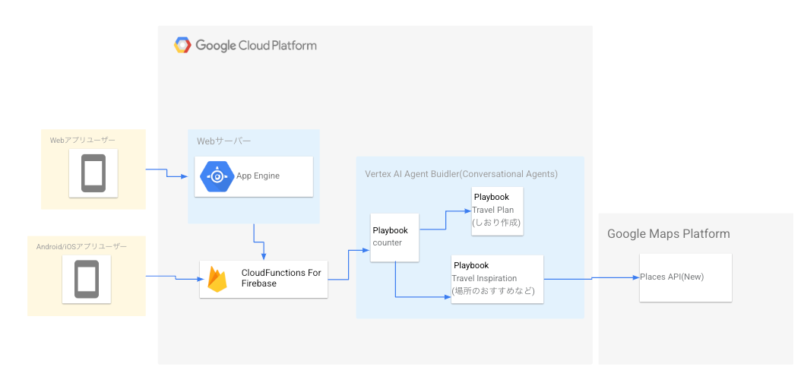

この記事は[AI Agent Hackathon with Google Cloud](https://zenn.dev/hackathons/2024-google-cloud-japan-ai-hackathon)提出用に書いた記事です。

#  『旅行計画お助けマン』の概要

「旅行計画お助けマン」は、グループでの旅行計画作成において、参加者全員が自由に意見交換できる環境を保ちつつ、最終的なしおり作成という手間のかかる作業をAIが自動で引き受けるサービスです。

  * 会話に専念できる環境: 旅行の計画段階では、細かな情報の整理や日程の組み立ては後回しにして、楽しくアイデアを出し合える雰囲気を重視。
  * しおり自動作成: 会話内容をキャプチャーし、各ユーザーの意見や提案を的確に整理。最終的に、誰でも理解しやすいフォーマットで旅行のしおりを自動生成します。
  * 柔軟な対応: 突然の予定変更や新たなアイデアにも、AIが動的に反映できるため、常に最新のプランを共有可能。

#  ターゲットユーザー

「旅行計画お助けマン」は、以下のようなユーザーに最適です。

  * 旅行計画そのものを楽しむ派  
旅行の魅力は、目的地の選定やルート、アクティビティなどを自分たちで考えるプロセスにもあると感じる人たち。

    * ポイント: 全体の大筋は自分たちで決めたいが、細かい部分（具体的な時間割や場所の詳細情報など）は専門のAIに任せたいというニーズに応えます。
  * 面倒な作業を自動化したい派  
旅行の楽しみは計画段階にこそあるものの、具体的なスケジュールや移動手段、施設情報の整理は手間がかかるという意見に対して、

    * ポイント: AIが自動的に会話内容を整理・分析し、視覚的にわかりやすいしおりを作成することで、ユーザーは「考えること」に集中できる環境を提供します。
  * グループでの意見調整が苦手な人  
複数人で意見を出し合うと、どうしても話が脱線したり、誰の意見を最終プランに反映すべきかが曖昧になりがちです。

    * ポイント: 「旅行計画お助けマン」は、各ユーザーの意見を公平に取り入れ、バランスの取れたプランニングを実現します。

#  『旅行計画お助けマン』の特徴

旅行計画お助けマンはそんなユーザーの悩みを解決します。  
以下では、その主要な機能と特徴について詳しく解説します。

##  機能1. 旅行のしおりを自動作成

旅行計画お助けマンはAIを使って旅行のしおりを自動作成します。  
具体的には、複数ユーザーの音声会話を取得し、それを元にまとめた最終的な旅行計画をしおりに落とし込みます。

##  機能2. おすすめ機能

旅行計画お助けマンは、ユーザーが求めた場合に、おすすめのお店や場所を教えてくれます。  
例えば沖縄旅行を考えた時に、「ソーキそばを食べる計画は作ったが、具体的なお店はAIに任せたい」という時に使えます。

#  システムアーキテクチャ

この図は Google Cloud Platform 上で構築された「旅行計画お助けマン」のアーキテクチャを示しています。ユーザーのリクエストに応じて旅行計画を立てたり、目的地のおすすめを提供するために、さまざまな Google Cloud サービスが連携しています。  

##  システム全体のフロー

  1. ユーザー (Web / モバイル) からのリクエスト
  2. 旅行プランの作成やおすすめの観光地のリクエストを送信
  3. Web サーバー (App Engine) または Firebase Functions がリクエストを処理
  4. 旅行プランの場合 → Vertex AI Agent Builder (Travel Plan Playbook) に送信
  5. 観光情報の検索の場合 → Vertex AI Agent Builder (Travel Inspiration Playbook) に送信  
6.Playbook (AI) の実行  
7.旅行プランの最適化や、Google Maps API との連携による観光情報取得  
8.レスポンスの返却  
9.旅行プランの詳細や、観光地のおすすめをユーザーに返す

###  1\. ユーザーインターフェース

  * Web アプリユーザー  
Web アプリのユーザーは App Engine を介してシステムと通信します。
  * Android/iOS アプリユーザー  
モバイルアプリのユーザーは Cloud Functions for Firebase を通じてシステムとやり取りします。

###  2\. バックエンド

Web サーバー

  * App Engine  
Web アプリユーザーのリクエストを受け取り、適切な処理を行います。  
必要に応じて、Firebase の Cloud Functions や Vertex AI Agent Builder と連携します。
  * Cloud Functions for Firebase  
ユーザーからAI Agentへのリクエストを処理します。  
Vertex AI Agent Builder と連携し、会話型 AI に情報を提供する役割を担います。

###  3\. AI モデル (Vertex AI Agent Builder)

  * Playbook (Conversational Agents)  
ユーザーのリクエストに応じた 会話型エージェント を提供し、以下の 2 つの Playbook を実行します。

  * 1.Travel Plan (しおり作成)  
旅行のスケジュールやプランを作成するエージェント  
ユーザーの要望に応じてカスタムの旅行プランを生成

  * 2.Travel Inspiration (場所のおすすめなど)  
観光地やレストラン、ホテルのおすすめを提示するエージェント  
Google Maps Platform の Places API と連携して、人気スポットや評価の高い場所を取得

  *     3. Playbook: counter  
ユーザーからのリクエストの窓口になるエージェント

###  4\. Google Maps Platform

Places API (New)  
「Travel Inspiration」Playbook から呼び出され、目的地の情報を取得する役割を担う。  
レストラン、観光地、ホテルなどの情報をリアルタイムで検索・提供。

#  デモ

Youtubeにデモを上げましたので、ぜひご覧ください。  
※無音ですが、実際にはText To Speechにサンプルの原稿を喋らせています。  
<https://youtu.be/mFyX-7UH_M4>

#  今後の展望

「旅行計画お助けマン」は、現在のプロトタイプ段階からさらに進化を遂げるため、以下のような機能改善と新たな機能の実装を計画しています。

##  しおりの利便性向上

現時点では、マークダウン形式のしおりを出力するだけの機能になっていますが、最終的に完成したしおりをアプリ内に保存して自由に閲覧、編集できるようにしたいです。  
また、複数人で同じしおりを閲覧、編集できるようにしたいです。

##  Speech to Textの精度向上

現時点では、しおりはマークダウン形式で出力される仕組みですが、将来的にはアプリ内にしおりを保存し、ユーザーが自由に閲覧、編集できる環境を整えたいと考えています。グループ内での情報共有がよりスムーズになるよう、複数人で同時に閲覧・編集が可能なコラボレーション機能の導入も視野に入れています。

##  AIエージェントからのレスポンス精度向上

開発当初は限られた時間内での突貫工事もあり、AIエージェントのレスポンスには一部改善の余地があると認識しています。今後は、旅程が現実的かどうか（時間配分、予算、移動手段の現実性など）をより細かく検証し、実際の旅行における注意点やアドバイスできるようにしたいです。

##  連携するAIエージェントの追加

将来的には、旅行計画だけでなく、決定した旅程に基づいたホテルや飛行機の予約など、実際の予約業務にまで連携するAIエージェントを追加することを目標としています。これにより、旅行の計画から予約、そして旅行当日のサポートまでを一元的に管理できる、ワンストップサービスの実現を目指します。

#  ハッカソンをやってみての感想

今回の「AI Agent Hackathon with Google Cloud」に参加する中で、これまであまり触れる機会のなかったGoogle CloudのAIサービスに深く関わることができ、非常に面白かったです。特にVertex AI Agent Builderを活用した開発プロセスでは、AIエージェントが今後の生活をより便利にする可能性を強く実感しました。短期間でプロトタイプを構築する過程では、様々な試行錯誤や意外な発見があり、技術的な面だけでなく、ユーザー視点での利便性や未来のサービス展開についても多くのヒントを得ることができました。

#  最後に

最後まで記事をご覧いただき、本当にありがとうございました。今回のハッカソン参加を通じて、AI技術の可能性とそれを活用したサービスがどれほど生活を豊かにできるかを改めて実感しました。  
「旅行計画お助けマン」は、ユーザーが旅行計画において抱える悩みを解消し、より楽しく、ストレスフリーな旅行体験を提供するための一つの試みとして作りました。  
ほぼ自分用で作った、みたいなところもあるので今後もどんどんカスタマイズしてアップデートしていきたいと思います！
