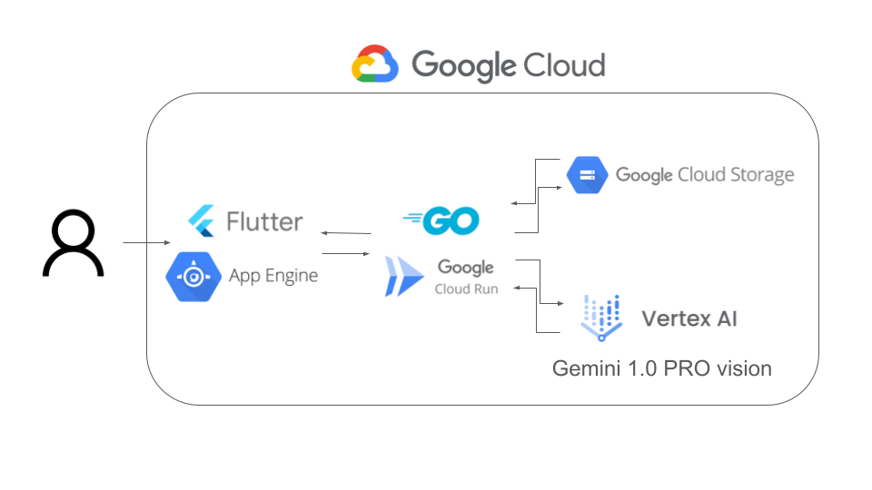

本記事は，[AI Agent Hackathon with google cloud](https://zenn.dev/hackathons/2024-google-cloud-japan-ai-hackathon) の提出物として作成したものです．

###  チーム名

AI モノリス・オデッセイ

###  チームメンバー

  * [@Kenty](https://zenn.dev/ken_ty) (バックエンド，フロントエンドの仕上げ)
  * [@yamamomo](https://zenn.dev/yamamomo) (フロントエンドの叩き台，ブログ執筆)

##  はじめに

近年、急速に発展するAI技術は、芸術やメディアの表現方法に革新をもたらす一方で、情報の信頼性に対する新たな課題も浮上させています。まず、偽画像やディープフェイクの氾濫が挙げられます。AIによって現実と区別がつかないほどの精巧な偽画像が生成され、SNSやオンラインプラットフォームを通じて容易に拡散されることで、真実の情報と偽情報との境界が曖昧になり、社会全体の情報リテラシーが試される状況となっています。

また、悪意ある情報操作やフェイクニュースの流布も深刻な問題です。特定の意図を持って偽情報を作成・拡散する事例が増加しており、これにより個々人が誤った判断を下すリスクが高まっています。結果として、経済的な損失や社会的混乱、人間関係の悪化など、さまざまな不利益が生じる可能性があります。

さらに、情報過多の時代背景も大きな要因です。インターネットやソーシャルメディアの普及により、誰もが簡単に情報を発信・受信できる環境が整った一方で、膨大な情報の中から正確なものを見極めるのは困難な課題となっています。このような中、個人が情報を批判的に吟味し、信頼できる知識を自ら構築するための教育的アプローチが求められるようになっています。

こうした状況を受け、私たちは，「AI Vision Quest」を開発しました．本アプリは，芸術作品の解釈を通じて、利用者が真偽を見極めるための審美眼と情報リテラシーを養う教育ツールです。作者の意図とAIによる代替解釈を比較することで、参加者自身が情報の本質を考察し、判断力を磨く機会を提供します。これにより、現代社会で求められる批判的思考の育成に寄与することを目指しています。

##  プロジェクト概要

###  ターゲットユーザーと課題

本プロジェクトは、アート愛好家、クリエイター、学生、さらには情報リテラシーの向上を目指す一般ユーザーを主な対象としています。プレイヤーは、提示される作品画像と２種類の解説（作者自身による意図の説明と、AIが独自に分析した解釈）から、本来のメッセージを見抜くことで、鑑賞眼や批判的思考、判断力を鍛えます。さらに、情報過多やフェイク情報が氾濫する現代社会において、正確な情報選別力を育む教育ツールとしても期待され、参加者に新たな視点と知識を提供することを目指しています。

###  課題へのソリューションと特徴

『AI Vision Quest』は、現代社会における情報過多やフェイク情報の拡散という深刻な課題に応えるために開発された革新的なソリューションです。本アプリは、アート作品の解釈を題材に、作者が込めた本来の意図と、AIが生成した多角的な代替解釈を比較するクイズ形式のゲームとして設計されています。プレイヤーは、提示された作品画像と2種類の解説から、どちらが正真正銘の作者解釈であるかを選択することで、鑑賞眼や批判的思考力、判断力を養います。  
  
具体的な特徴として、まず作者による解釈は、視覚的要素の具体的な記述や制作意図、使用された技法、表現手法について明瞭に語られており、作品の背景や文脈を深く理解できる内容となっています。一方、AIが生成する解釈は、作品の文脈を考慮し、技術的観察に基づいた多角的な視点での分析を提供。これにより、単なる表面的な鑑賞にとどまらず、利用者自身がアートの奥深さと情報の真偽を自ら見極める力を養うことが可能となっています。  
  
また、利用者のレベルに合わせた難易度設定や、画像フォーマット、解釈テキストの品質検証、エラーハンドリングなどのシステム面での堅牢性も確保され、誰もが安心してプレイできる環境が整えられています。これらの取り組みにより、『AI Vision Quest』は、芸術鑑賞と情報リテラシー向上の両立を図る新たな教育ツールとして、現代社会の課題解決に大きく貢献することを目指しています。

##  システムアーキテクチャ

以下にシステムアーキテクチャを示します。フロントエンドはApp Engine上にデプロイされたFlutter WebアプリケーションでUI/UXを提供し、バックエンドはCloud Run上のGoアプリがリクエスト処理やデータ連携を担います。また、Google Cloud AIサービスとgemini 1.0 pro Visionを組み込み、画像とテキストを入力として新たなテキストを生成する高度な機能を実装しています。これにより、スケーラブルなバックエンドAPIを実現し、柔軟な拡張が可能です。

##  技術スタック

本ハッカソンの要件になっているものおよびFlutterについて概要を説明します．

###  Vertex AI Gemini 1.0 Pro Vision

Gemini 1.0 pro Visionは、Vertex AI上で利用可能な先進の画像・テキスト統合モデルです。画像とテキスト情報を組み合わせ、文脈に沿った新たなテキストコンテンツを自動生成する能力を備えています。豊富な学習データに基づく高精度な解析により、コンテンツ生成や情報抽出など多様な業務に柔軟に対応可能です。ビジネスや研究現場で、効率的なデータ活用と高度な自動化を実現する強力なツールとして注目されています。

###  App Engine

App Engineは、Google Cloudが提供するフルマネージド型のPaaS（Platform as a Service）です。アプリケーションのデプロイやスケーリング、負荷分散などを自動的に行い、開発者はコードに専念できます。言語選択の幅も広く、統合されたログ管理機能やバージョン管理機能などにより、安定した運用をハッカソンのような短期的な開発プロジェクトにおいても構築可能です。

###  Cloud Run

Cloud RunはGoogle Cloudが提供するサーバーレスコンテナ実行環境で、Dockerコンテナをデプロイするだけで自動スケーリングや負荷分散を利用できます。フルマネージドのためインフラ管理の手間を大幅に削減でき、リクエスト単位の従量課金によって高コストパフォーマンスを実現。小規模から大規模まで柔軟に対応可能です。また，ワークフロー全体としてAI処理をオーケストレーションすることも可能です．

###  Flutter

Flutterは、Googleが開発したオープンソースのUIフレームワークで、Dart言語を用いてクロスプラットフォーム対応のモバイル、Web、デスクトップ向けアプリを単一コードベースで構築可能です。高速な描画エンジンと豊富なウィジェットが特長で、ホットリロード機能により効率的な開発を実現します。また、公式ドキュメントが充実しているため初学者にも学習しやすく、多様なデバイスでのユーザ体験を向上させる柔軟なUIを容易に実装でき、世界中で広く利用されています。

##  デモ動画

実際のデモ動画です．

<https://youtu.be/VTlkQTctkoQ>

###  アプリURL

[AI Vsion Quest](https://vibrant-tiger-449702-h0.de.r.appspot.com/)

###  ソースコード

<https://github.com/ken-ty/zenn_ai_hackathon_2501_ws>

##  まとめ

『AI Vision Quest』は、アート作品の真意とAIが生み出す多面的な解釈を比較することで、情報リテラシーと批判的思考を育む革新的なクイズゲームです。プレイヤーは、提示された作品画像と作者による解説、及びAI生成の代替解釈から本来の意図を見抜く挑戦に挑みます。これにより、現代社会に蔓延するフェイク情報や情報過多の課題に対して、アートを通じた新たな視点と学びを提供します。また、堅牢なシステム設計と多様な難易度設定により、初心者から上級者まで安心して参加できる環境を実現。本プロジェクトは、技術と芸術の融合による未来志向の教育ツールとして、より豊かな情報社会の実現を目指します。

##  執筆者の感想 〜ハッカソンに参加して本当に良かった〜

最後までお読みいただき、誠にありがとうございます。今回の素晴らしいハッカソンを開催してくださった主催者様、そしてともに挑んでくださったチームメンバー[@Kenty](https://zenn.dev/ken_ty)に、心から感謝いたします。私はFlutter歴わずか１か月ほどの初学者であり、ハッカソン自体も初参加でしたが、未知の領域に飛び込むことで大きな学びを得ることができました。生成AIによる社会の急速な変化に対応するため、自らAIアプリを開発する経験はまさに爆速成長の機会となりました。この場を借りて改めて感謝させていただきます.ありがとうございました!!
