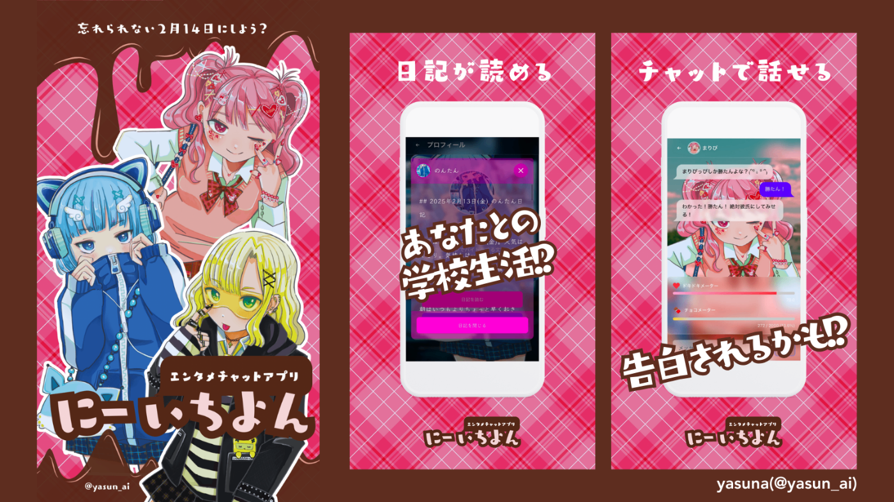
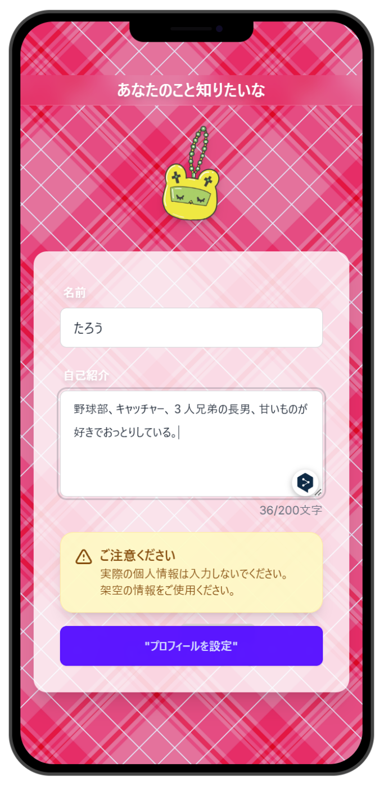
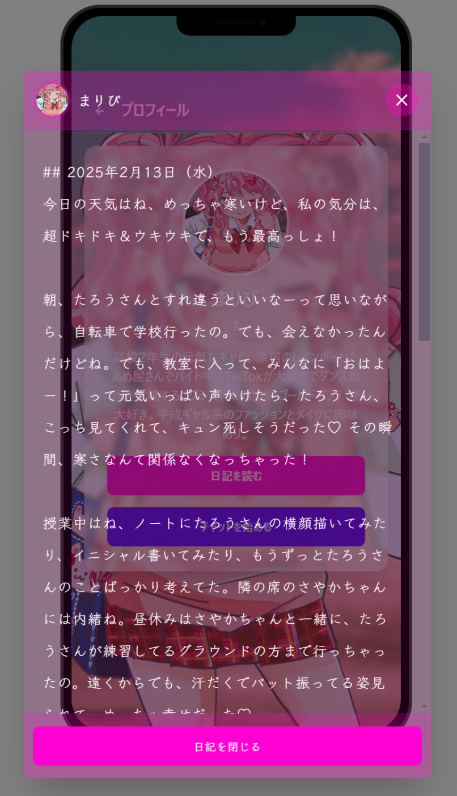
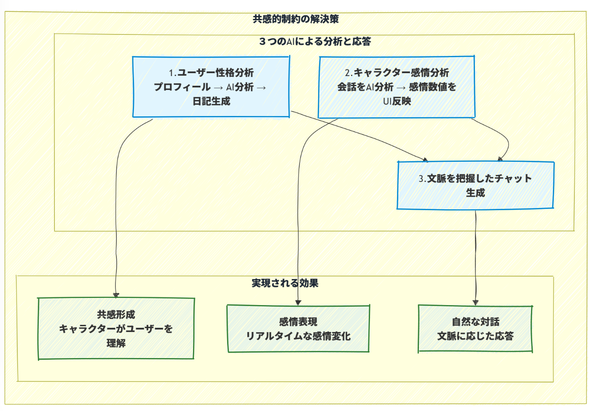
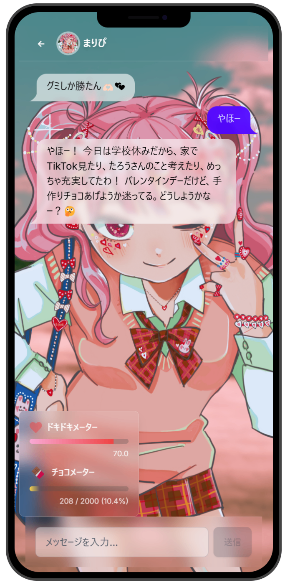
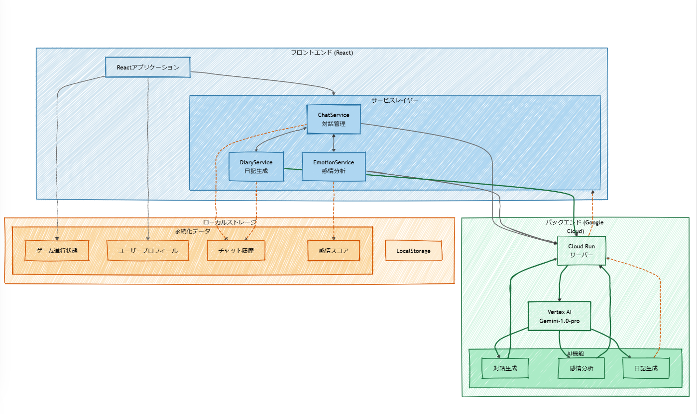
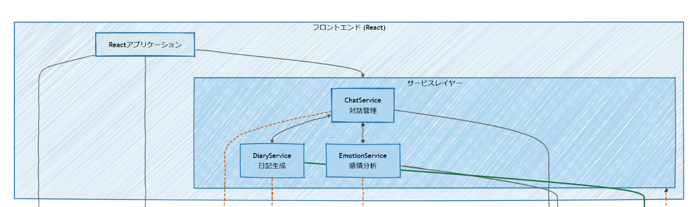
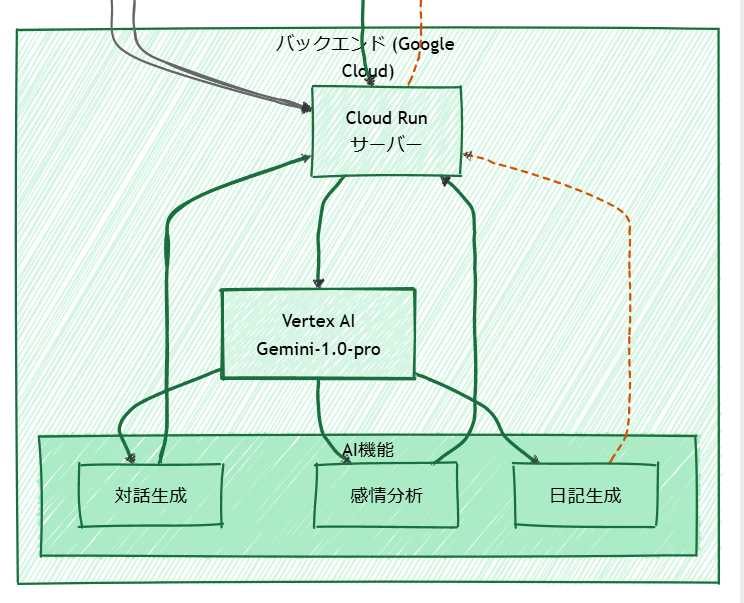
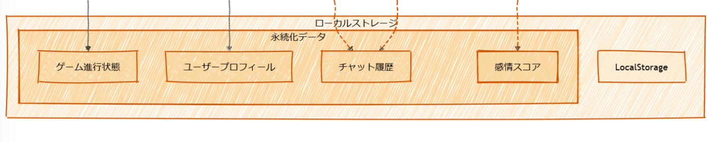
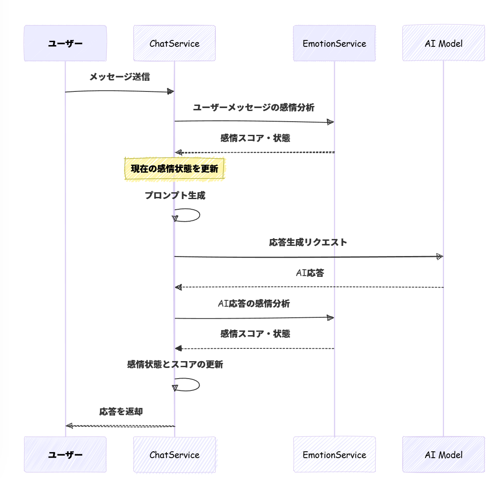

##  はじめに

本記事は[AI Agent Hackathon with Google Cloud](https://zenn.dev/hackathons/2024-google-cloud-japan-ai-hackathon)への参加のため執筆しています。

こんにちは、個人開発者のyasunaです。  
今回は本ハッカソンによせて、個性豊かな３人の女子高生たちとバレンタインデーを楽しむエンタメチャットアプリ「にーいちよん」を開発しました。  

##  開発期間

このアプリは2025年になってから約4週間で開発しました。(1日2~3時間程度)

###  デモ動画

<https://www.youtube.com/watch?v=GFBH4dtzuZE>

##  ユーザー像

それでは、本アプリのユーザー像について解説します。

!

ユーザー像：  
**学生時代のバレンタインデーを楽しみたい人**

このアプリのユーザーに当てはまる人はずばり**老若男女** です。  
誰もがバレンタインというイベントに対してトキメキたいしもっともっとエンジョイしたいはずです。

このアプリの最大の特徴はバレンタインというシーンをあらかじめ設定していることです。  
みんなが想像するバレンタインはどんなシーンがあるでしょうか？

「自分は果たしてチョコレートをもらうことができるのだろうか？」  
「あの子は誰にチョコレートを渡すんだろうか？」  
「あの子は前日にチョコレートは作ったんだろうか？手作りするならどんな形？」

バレンタインと一言で言っても、その中にはさまざまな場面とドラマがあります。  
AIを活用したアプリというとどうしても業務効率化など便利な方向のものが多いですが  
あえてエンターテインメントとしてユーザーに楽しんでもらえるものを届けたいと考えました。

##  課題

想定するユーザーは常に課題を抱えています。  
ここでは「学生時代のバレンタインデーを楽しみたい人」が抱える課題について3点挙げさせていただきます。

!

1.立場的制約(学生じゃない・男じゃない)  
2.出会い的制約(実際に脈アリの子がいない)  
3.共感的制約(知らない女の子に共感できない)

##  課題へのソリューション

###  1.立場的制約へのソリューション

学生時代のバレンタインデーを楽しみたい人はもう学生ではない人も含まれます。  
年齢や立場関係なくシチュエーションを楽しむにはエンターテイメントが必要です。

このアプリケーションを通して実年齢や立場を超えた仮想のプロフィールを作ることにより  
にーいちよんの世界で学生時代のバレンタインデーを思い切り楽しむことで解決します。  

学生時代のバレンタインデーを楽しみたい人は実は女の子も多かったりします。  
女の子はチョコを渡す側、男の子はもらう側みたいな空気がありますよね。女である私も男の子の立場でのドキドキを味わってみたかった。  
このアプリケーションを通してユーザーがたとえ女の子だったとしてもバレンタイン当日に本命チョコをもらえるかもしれません。  
**エンターテイメントのロールプレイには社会的性別や立場は関係ないということで解決します。**

###  2.出会い的制約へのソリューション

学生時代のバレンタインデーを楽しみたい人は、実際に脈アリの子がいない場合もあります。  
実世界での出会いは残念ながらバレンタイン付近に突然脈ありの子が現れることはあまりありません。

そこで、にーいちよんでは３人の全く個性が違ったキャラクターとバレインタイン当日の会話を楽しむことができます。  
そして当日だけではなく、その前日にあなたと過ごした学校生活の日記を読むことができます。  

それにより「いきなり出会う」という訳ではなく、ある程度あなたとの関係性を構築できているということを担保にしながら、バレンタイン当日の会話に臨み自然な"出会い"を演出することで出会い的制約を解決します。

###  3.共感的制約へのソリューション

すでに知っているキャラクターであれば一緒にバレンタインデーを楽しむことができるかもしれませんが、自分についてある程度知ってもらわないとキャラクターへ共感することは難しいです。

そこで共感的制約についてはソリューションは3つあります。  

１つ目は、ユーザーの性格分析です。ユーザーは名前とプロフィールを入力することでキャラクターと同じ学校に通う生徒になります。  
そして、ユーザープロフィールをもとにAIエージェントが性格分析をして性格に合わせてキャラクターがあなたとの日記を創造してくれます。

２つ目は、キャラクターの感情分析です。  
チャットでは、ユーザーが入力した言葉を受けてキャラクターがどう思ったかという気持ちをAIがリアルタイムで判断します。  
キャラクターの感情の数値はドキドキメーターとチョコメーターに反映されUIに表示されます。

３つ目は、感情分析結果に基づくチャットの生成です。  
性格分析による日記や会話をもとに感情を分析した結果をリアルタイムに返答へと反映します。  

キャラクター感情に基づく返答はユーザーに大きく委ねられているため、  
学生時代のバレンタインデーのドキドキを感じやすくなったり、共感的制約を解決します。

##  システム構成

本アプリのシステム構成を紹介します。  

  1. **フロントエンド層**  
  
**Reactアプリケーション (UI)**

**サービスレイヤー**

     * ChatService(テキスト生成エージェント)

       * 対話履歴の管理
       * プロンプトの生成
       * 応答の整形
       * 文脈の維持
     * DiaryService(日記生成エージェント)

       * ユーザープロフィールによる性格分析
       * キャラクターによる思考生成
       * キャラクターによる日記生成
     * EmotionService(感情分析サービス)

       * リアルタイム感情分析
       * 感情値の計算
       * キャラクター別係数の適用
       * 閾値管理
  2. **バックエンド層 (Google Cloud)**  
  
**Cloud Run**

     * サーバー 
       * フロントエンドからのリクエスト処理
       * Vertex AIとの通信制御

**Vertex AI (Gemini-1.0-pro)**

     * 対話生成
     * 感情分析
     * 日記生成
  3. **永続化層 (LocalStorage)**  

#  AIエージェントの実装

このアプリケーションでは、日記生成エージェントと感情認識型対話エージェントの２つを実装しています。

##  日記生成エージェントについて(DiaryService)

日記は段階的な生成プロセスで実行されています。

  1. ユーザーの分析(心理カウンセラー)
  2. 思考生成(キャラクター)
  3. 日記作成(キャラクター)

の３段階で行われます。

それぞれプロンプトを動的に生成しており、生成結果を段階的に渡しています。

  1. ユーザーの分析(心理カウンセラー)

    
    
    あなたは心理カウンセラーとして、以下の人物の性格分析を行ってください。
    分析結果は、後で女子高生が片思いの気持ちを書くための参考情報として使用されます。
    
    対象の人物：
    名前：${userProfile.name}さん
    プロフィール：${userProfile.description}
    
    以下の項目について、具体的に分析してください：
    
    1. 性格特性
    - 外向性/内向性
    - 几帳面さ/おおらかさ
    - コミュニケーションスタイル
    
    2. 趣味・興味
    - 好きそうな活動
    - 休日の過ごし方
    - 興味を持ちそうな話題
    
    3. 学校生活での様子
    - 友人関係
    - 授業中の態度
    - 部活やイベントでの行動
    
    4. 恋愛傾向
    - 異性との関わり方
    - 恋愛に対する考え方
    - アプローチされた時の反応
    
    分析は具体的なエピソードを交えて、200文字程度でまとめてください。
    

  2. 思考生成(キャラクター)

    
    
    あなたは${character.name}として、片思いの気持ちを独白形式で表現してください。
    ${character.description}という設定を意識して書いてください。
    
    片思いの相手の特徴：
    ${Profile}
    
    以下の時間帯ごとの心情を、具体的な場面や行動とともに書いてください：
    
    1. 朝
    - 登校時の期待感
    - 朝の挨拶や廊下でのすれ違い
    - 朝礼や HR での様子
    
    2. 昼
    - 授業中にこっそり見つめる様子
    - 昼休みの様子
    - 共同作業や当番活動での出来事
    
    3. 放課後
    - 部活動や委員会活動での関わり
    - 下校時の様子
    - バレンタインのチョコレート作りの計画
    
    それぞれの場面で感じた気持ちや印象を、${character.name}らしい言葉遣いで表現してください。
    全体で300文字程度にまとめてください。
    

  3. 日記作成(キャラクター)

    
    
    あなたは${character.name}として、2025年2月13日の日記を書いてください。
    ${character.description}という設定を意識して書いてください。
    
    今日の出来事と気持ち：
    ${thoughts}
    
    以下の要素を含めて日記を書いてください：
    
    1. 日記の基本要素
    - 2025年2月13日の日付
    - 天気と気分
    - 時系列に沿った出来事の記述
    
    2. 文体とトーン
    - ${character.name}らしい言葉遣い
    - 独り言のような親密な文体
    - 繊細な感情表現
    
    3. 内容の構成
    - 朝から夜までの時間の流れ
    - 学校生活の細かい描写
    - 片思いの気持ちの表現
    - 明日のバレンタインへの期待と不安
    
    4. 表現上の注意点
    - 絵文字は使用しない
    - 300文字程度の長さ
    - 情景描写を交えた表現
    - 心情の変化がわかる展開
    - キャラクターの口癖や特徴的な表現を適度に使用
    
    日記を書く際は、バレンタイン前日という特別な日であることを意識し、キャラクターの個性が強く出るように書いてください。
    

段階的に思考をしてつなげることであなたとキャラクターが生きる学校生活の日記を作成することができます。

##  感情認識型対話エージェント(ChatServiceとEmotionService)

次にキャラクターとチャットを行う部分のAIエージェントのフローについて紹介します。

本アプリではチャット機能と感情分析機能を組み合わせることにより、  
ユーザーとキャラクター両方の感情を認識した対話を実現しています。

これにより、ユーザーの感情を揺さぶり共感性の高い会話ができます。  
ユーザー入力から応答までのフローは以下の通りです。

このエージェントのフローにおけるポイントは３つです。

1.感情分析の二重処理  
ユーザーの入力メッセージと、キャラクターの応答の両方に対して感情分析を行っています。

2.状態の管理の重視  
感情スコアと状態を継続的に更新しています。

3.プロセスの知的制御  
感情分析結果に基づいてプロンプトを動的に生成しています。

##  謝辞

ハッカソンという素晴らしい機会をいただき本当にありがとうございます！

このアプリケーション開発においては以下の2冊を参考にさせていただきました！  
[AITuberを作ってみたらプロンプトエンジニアリングがよくわかった件](https://bookplus.nikkei.com/atcl/catalog/24/11/07/01683/)  
[LangChainとLangGraphによるRAG・AIエージェント［実践］入門](https://gihyo.jp/book/2024/978-4-297-14530-9)

なお個人的にこのアプリケーションのデモを2月14日に公開する予定ですので  
ぜひXをフォローしていただけると嬉しいです。

ここまで読んでいただきありがとうございました！ハッピーバレンタイン！

<https://x.com/yasun_ai/status/1885981953620602884>
