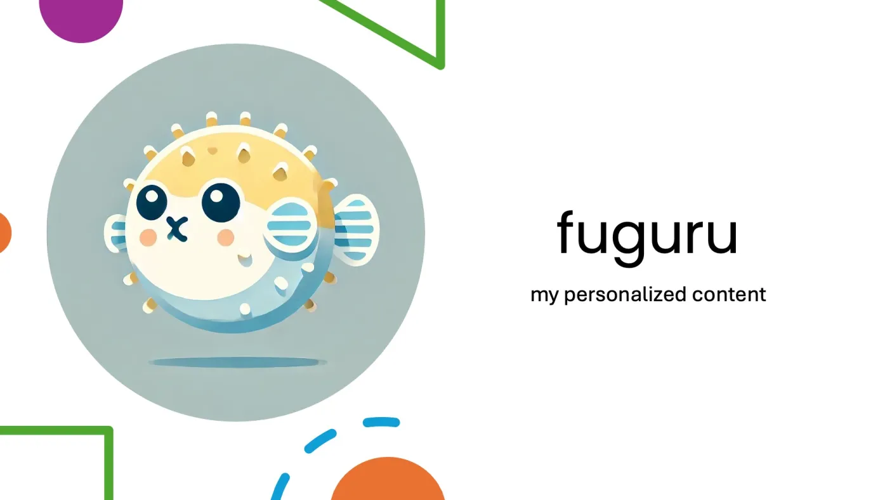

こちらの記事は [AI Agent Hackathon with Google Cloud](https://zenn.dev/hackathons/2024-google-cloud-japan-ai-hackathon) の応募記事です。

#  fuguruってなに？

fuguruは、あなた専用のコンテンツを提供するアプリです。資料をもとに既知の情報を省き、必要な知識を整理してあなたの背景に寄り添ったパーソナライズされたコンテンツを手軽に得ることができます。

#  問題点と解決策

###  AIとは

AI（人工知能）とは、人間の知的活動をコンピュータで再現する技術のことです。機械学習や深層学習などの手法を用いて、データから学習し、推論や判断を行う能力を持ちます。

###  問題点

上記の文章を読んで「AIなんてもう知ってるよ、、」「知りたいのはそこじゃない…」と思うかもしれません。

AIを既に知っているのに、「AIとはOOOで、うんたらかんたら、、、」という長い導入から始まると、本文を読むまでに疲れてしまいますよね。

もちろん、人それぞれ持っている知識は異なります。しかし、コンテンツの多くは幅広い人が読みやすいように書かれているでしょう。

そのため、あなたが既に知っている情報であっても説明されてしまい、人によっては「これもう知っているんだけどな...😢」「またこの内容か、、、」ともどかしく感じてしまいます。

###  対象とするユーザー

上記の問題は、エンジニア、研究者、大学生…（そしてこの記事を読んでいるあなた）のように、**意欲的に学習している人** が陥ってしまいます。

具体的なシチュエーションとしては、

  * エンジニア用のブログや記事は、異なる技術背景を持つ読者に向けて書くことが多く**初歩的な内容を導入として含んでいる** ことがあります。私も「最初の方を読んでおかないと途中でわからなくなるかも、、」と思って一通り目を通して結局全部知っていたということが多くあります。

  * 大学の授業では異なる科目で、以前学んだ内容を学ぶことがあります。例えば、私自身も「機械学習」の授業で別の「統計」の授業で既に習った「確率」のことをもう一度習った経験があります。この時にすでに知っている部分は飛ばして勉強できたら効率的だと思いました。

###  解決策

私たちのグループは今回のハッカソンでパーソナライズされた記事や資料などのコンテンツを作成することを実現しました。

このサービスは情報が溢れる現代において起こりうる上記のような問題に対処できるように以下の機能を搭載しています。

  * 資料から以前読んだ内容を削除する
  * 資料から情報を取得し、ユーザーのプリファレンスに合わせて「知識カード」として保存する
  * ユーザーに知識を復習する機会を提供する

これによって、個人に特化した資料を作成すると同時に、情報化社会の中で「情報に溺れない」ように知識をあなたに分かりやすい形で保存します。

###  GeminiやChatGPTで十分じゃないの？

一般的にGeminiやChatGPTなどの生成AIを使ったサービスではあなたの資料を利用して、情報を補完します。その一方でこのアプリは既に知っている内容を削除することに特化しています。

fuguruは、学んだ内容を削除し、あなたに合わせた必要な情報だけを残して効率よく学べるように整理します。  
生成AIを情報を足し算するのではなく、**引き算として利用する** というのは新しく、革新的に感じています。

#  使い方

##  デモ

<https://youtu.be/KaBPv0tJiAE>

##  作成したもの

###  Web版

<https://fugu-446106.web.app>

###  iOS版

<https://testflight.apple.com/join/eUjA8DCw>

###  Andriod版

テスト用のリンクが間に合いませんでした。デモ上でAndroid版の動作を公開しています。

###  サンプルデータ

####  `HTML`形式 (URLをfuguruでペーストしてください)

<https://acanmnm.github.io/FUGURUdocs/docs/FuguDishes.html>

####  `PDF`,`DOCX`形式 (ファイルをダウンロードして、fuguruでアップロードしてください)

<https://drive.google.com/drive/folders/1EkNv5PO40-le4S84RXZGIHGH_CJlivcS?usp=sharing>

##  まずはユーザー登録

ユーザー登録はメールアドレスとパスワードで行えます。

その後、名前、プリファレンス、言語を入力します。プリファレンスとは後ほど説明する知識カードのパーソナライズ機能に利用します。今は「関西弁にしてください」と入力します。プリファレンスはいつでも変えることができます。  
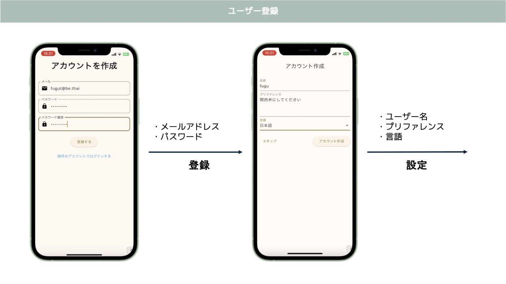

##  資料を追加して知識カードを作成しよう！

###  資料を追加してみよう

資料をアップロードするには、下図のように、右下の+をタップすることで追加できます。  
`HTML`,`DOCX`,`PPTX`,`TXT`,`MD`,`PDF`のファイル形式に対応しています。

`HTML`の入力はURLによるアップロードとなりますが、下記の点に注意してください。

  * 入力は各webサイトの利用規約を順守してください。
  * 私的利用の範囲内で利用してください。

下図の中央のように🔗のマークからURLを入力出来るようになります。

`DOCX`,`PPTX`,`TXT`,`MD`,`PDF`等その他のファイルはアップロードしてください。URLによる入力は対応していません。  
下図の中央にある🔗の右側の📄のマークを押すとアップロード出来るようになります。

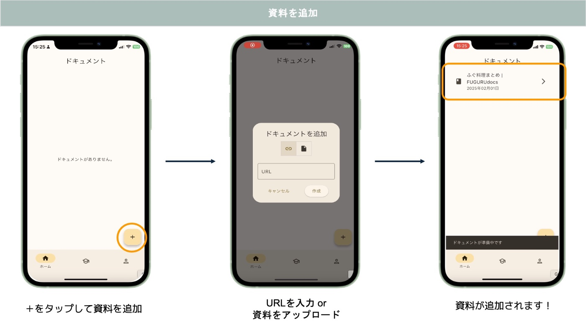

###  資料を確認してみよう

資料はわずか10秒程度でプレビューを利用できるようになります。  
プレビューでは、処理が終わっていない箇所が暗い色で示されています。また、知識カードが作成されると下図のように右上の💡マークが光ります。💡をタップすることで知識カードを確認できます。  
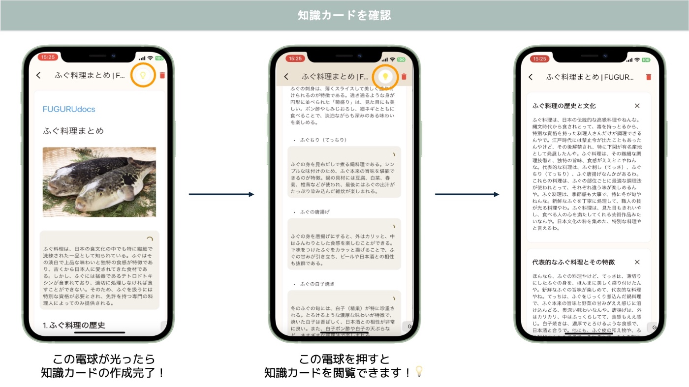

###  追加の資料をアップロードして重複した内容を取り除こう！

追加の資料を同様の方法でアップロードすると、知っている知識が除去されます！  
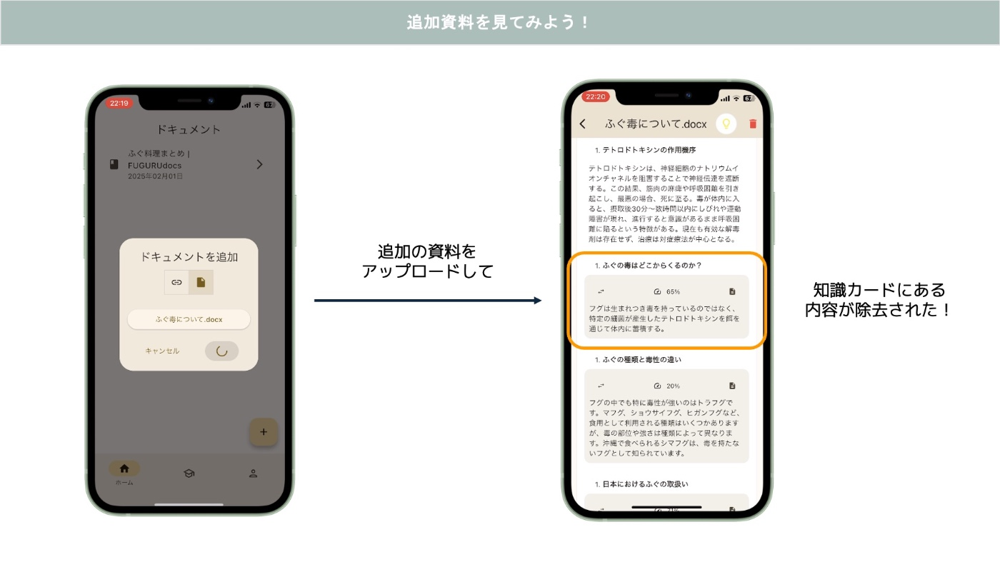

除去された部分は茶色に縁取られています。この縁の左にある↔︎マークを押すと、元の文章を見ることが出来ます。中央の65%という数字は元の文章に比べて文字数が65%削減されたことを表します。右側にある📄マークを押すと該当した知識カードを見ることが出来ます。  
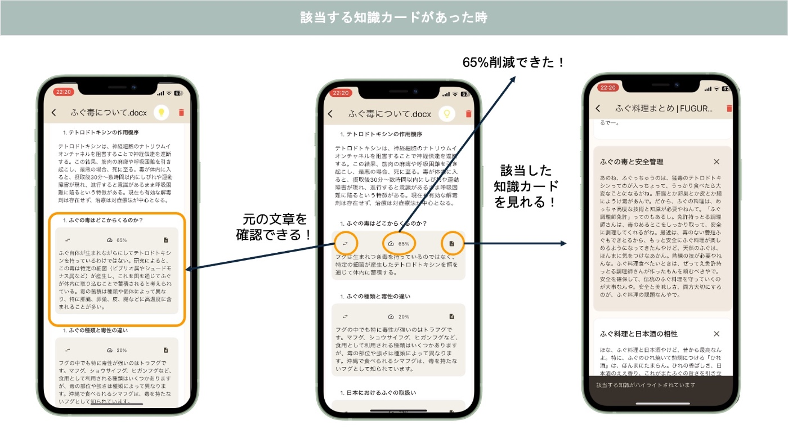

そして、知識カードと見比べると、確かにすでに学んだ内容が取り除かれています。  
その部分だけ取り除くと読みにくい文章になる恐れがあるので再構成した上で提供します。  
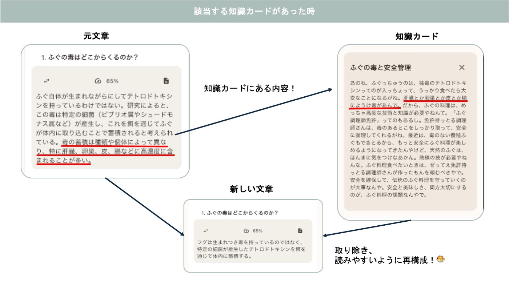

###  知識カードのプリファレンス機能

知識カードはユーザーごとのプリファレンスにあった形で提供されます。左は初期設定で「関西弁にしてください」と入力していたので知識カードが関西弁の表記になっていて、右は小学生がわかりやすい文章になっています。

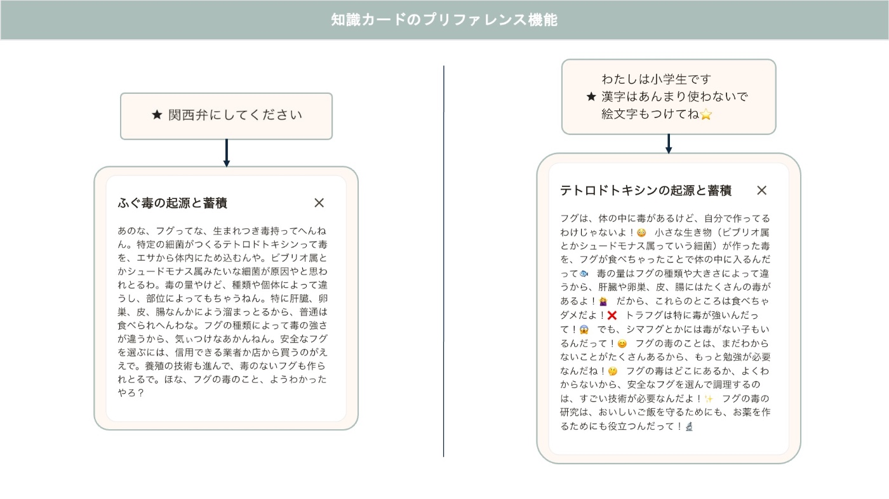

##  知識を復習する

ホーム画面から知識を復習することが出来ます。  
知識のページで下図のように右上のカードのマークを押すことで知識カードを確認することが出来ます。  
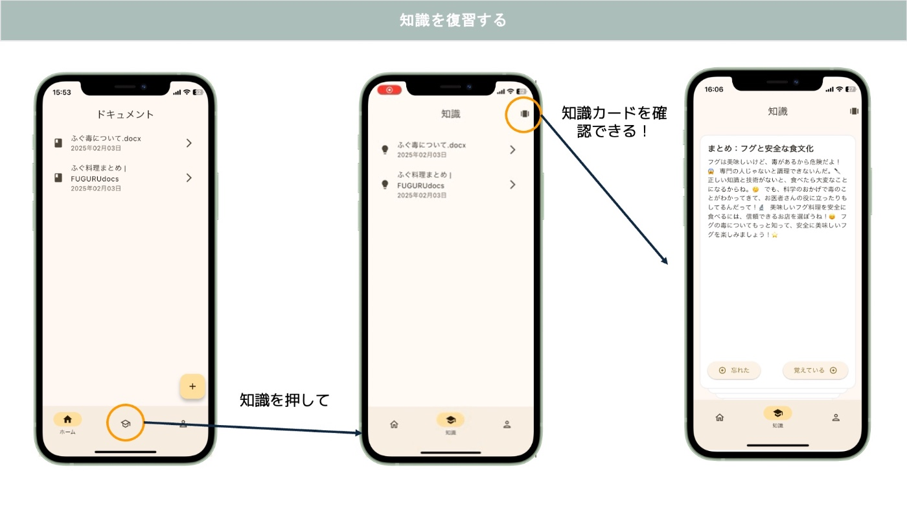

覚えていたら右へスライドし、忘れたら左にスライドすることで簡単に復習することが出来ます。また、次回以降は忘れたものを優先的に表示されるように最適化しています。  
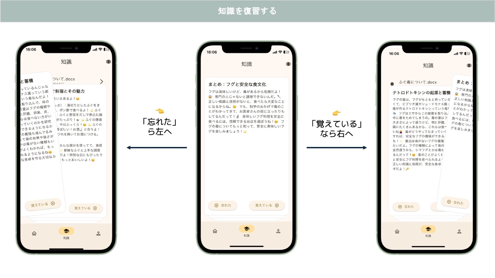

#  システムアーキテクチャ

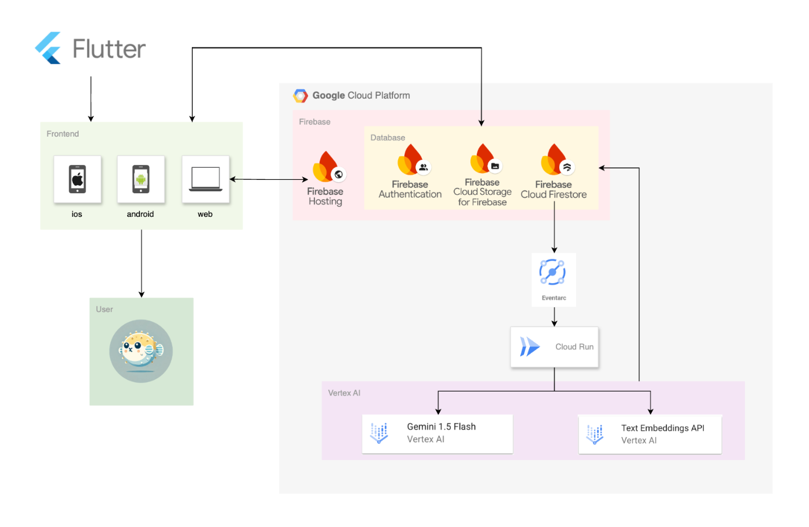

##  Flutter

Web版,iOS版,Andriod版をFlutterで作成しました。  
Flutterのマルチプラットフォームという利点によって約1ヶ月という短い時間の中でAndroid, iOS,web版を作成することが出来ました。  
また、豊富なパッケージの利用により高品質なサービスの提供を実現しました。

##  Firebase

私たちのプロジェクトでは、Firebaseの多彩な機能を最大限に活用し、高速で安全かつコスト効果の高いシステムを構築しました。

  * **Firebase Authentication** を利用してユーザー情報を安全に管理しています。これにより、認証基盤を簡便に実装し、ユーザーのデータ保護とプライバシーを確保しました。

  * **Cloud Storage** を利用してPDFやDOCXなど多種類のファイルを安全に保存し、スムーズなファイルアップロード、アクセスを実現しました。

  * **Firebase Hosting** を利用してWeb版をHostingしています。これにより、安全な接続とスケーラブルな対応を実現しました。

  * **Firestore** のミリ秒単位の高速データ処理能力を活用し、**Eventarc** と**Cloud Run** を組み合わせることで、高速な並列処理を実現しました。スケーラブルでリアルタイムなデータ処理を可能にしています。さらに、[Firestoreのベクトル検索機能](https://firebase.google.com/docs/firestore/vector-search?hl=ja)を導入し、閾値付き検索を活用しています。Geminiでの処理前に処理不要なデータをフィルタリングすることで、不必要なリソースの利用を防ぎ、システム全体の高速化と大幅なコスト削減を達成しました。

具体的には、下図のように、マークダウンに変換された資料をマークダウンの構文や（ヘッダーなど）にしたがって分割し、分割されたそれぞれの箇所について知識カードとのコサイン類似度を取り(*1)、閾値よりも低い場合(*2)だけその後の処理行うようにしました。

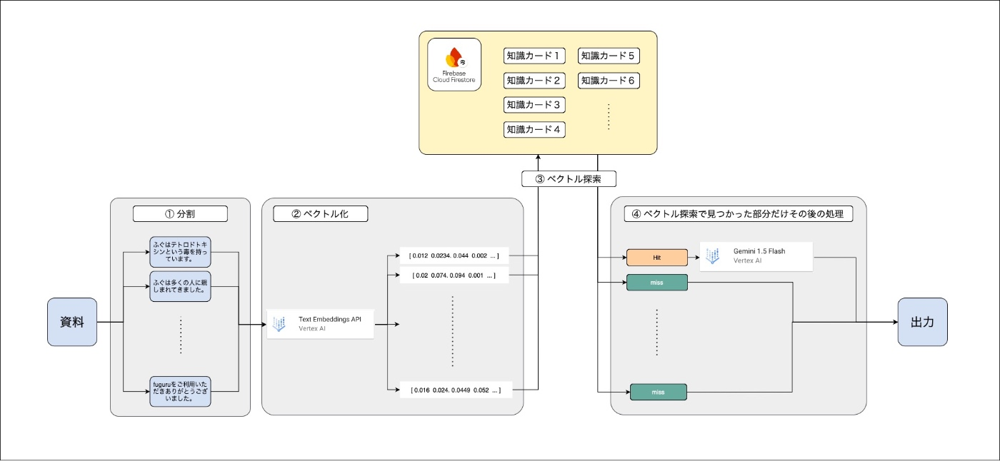

*1:分割された箇所がヘッダー、リスト、表、URLや画像であった場合には可読性向上のためにその後の処理をしないようにしています。

*2:Firebaseのベクトルインデックスでは、コサイン類似度は0から2で表され、0に近いほど2つのベクトルが似ているということを意味します。

##  Vertex AI

####  Gemini 1.5 Flash

低価格で高速なモデルということで重宝しました。資料を効率良く読むために長い時間をかけて効率化された資料を作成していては本末転倒です。  
fuguruでは非同期処理に対応したGemini 1.5 Flashの利用により1000文字程度の本文を含む資料を30秒程度で全ての処理を完了します。Cloud Runにより並列処理も実現しているので文字数が増えてもスケーラブルに対応しています。

####  Text embeddings API

ベクトル探索用の埋め込みは下記のタイプを利用しています。**Text embeddings API** のバッチ処理により文章量によらず高速に処理することを実現しています。  
モデル：text-multilingual-embedding-002

##  EventarcによるFrontendとBackendの接続

FrontendとBackendを直接的にやりとりを行うと認証関係等で実装上複雑になります。そこで、Eventarcの活用によりFrontendからFirebaseへ追加されたことをトリガーとしてBackend処理を行い、処理が終わったら結果をFirebaseに追加、更新することで、安全に処理できるようになっています。

#  今後の展望

##  コンテンツの多様化

現状、fuguruではpdfやマークダウンなどの文書を扱っています。しかし、世の中に存在するコンテンツはこれだけではありません。  
YouTubeなどの動画形式や会議の議事録などの音声データなど幅広い形式に対応できるように開発を進めていきたいです。

##  コンテンツの表示形式

現状、資料の形式によらずマークダウンでの出力となっています。これにより表示の崩れが発生したり、マークダウンで表現できないデザインは対応出来なかったりという問題点があります。将来的には、コンテンツをそのままの形式で情報だけを取り除けるように進めていきたいです。  
特に上記で挙げたようなテキスト以外の動画形式を入力して、「動画の中から重複内容を除去した動画を見れたら」理想的ですよね。

##  知識の活用

現状、fuguruで保存した知識は主に不要な情報を削除するために使われます。この知識をさらに活用していくことも考えています。  
例えば「知識マップ」の実装です。保存した知識同士の関連性を図で表すことにより、知識の復習をしやすくし、さらには資料を読んだだけでは気づけなかった資料同士の類似性を発見することができます。  
上記のようなものに限らず、知識を上手に活用していきたいです。

#  自己紹介

私たちは東京科学大学(旧・東京工業大学)の情報工学系に所属している3人で以上のサービスを開発しました。

  * [一瀬達矢](https://tatsuya736482.github.io/myprofile/)
  * [Thanasan Kumdee](https://thnsnkmd.com/en)
  * [松下直矢](https://acanmnm.github.io/yaa/)

#  お問い合わせ

お問い合わせはこちらまでお願いします。  
mail: fugu76994@gmail.com

#  注意事項

  * 入力はwebサイトの利用規約を遵守してください。
  * 私的利用の範囲内で利用してください。
  * fuguruはテスト版になりますので、使用は利用者の自己責任で行われ、その性能や結果については何ら保証されません。

