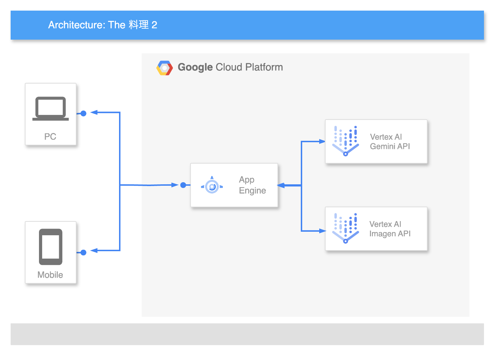

#  はじめに

AI Agent Hackathon with Google Cloudに参加させていただきます！おじゃまします！！

#  概要

退屈な食生活を壊す、破壊的・創造的料理レシピ生成AIエージェントが生まれました。

> 『破壊の裏に創造あり! 創造の裏に破壊あり! 破壊と創造は表裏一体!! 壊して創る!! これすなわち大宇宙の法則なり!!』アレックス・ルイ・アームストロング 「鋼の錬金術師」より

##  デモ動画

動画のような感じでレシピを出力してくれます。  
（20秒くらい待つ😇）  
<https://www.youtube.com/watch?v=IsTTngG2TJ0>

#  プロジェクトについて

Webアプリ  
<https://the-ryouri-2.uc.r.appspot.com/>  
リポジトリ  
<https://github.com/yhfs21/the-ryouri-2>

##  コンセプト

いつもの食事、飽きていないか？  
ここから先は"未体験ゾーン"だ...！！！！🚗

##  背景

昨年夏バテで体重を落としてしまったため秋ごろから食事量を増やして増量しようとしているのですが、何を食べるかを考えるのが面倒→いつも同じものを食べてしまう→食事への興味が少しずつ失われていく→...  
という良くないサイクルに陥ってしまいました。  
このような現状を打破すべく、思わず興味を引かれてしまうような料理を提案するシステムの開発を始めました。

##  想定するユーザー像まとめ

  * 食事に興味がないわけじゃないけど、積極的に調べるほどではないそこのあなた（私もです）
  * 何を食べるか考えるのが面倒だと思ってしまうそこのあなた（私も）
  * いつも同じもの食べちゃっているな〜というそこのあなた（私）
  * とはいえよくあるありふれた料理をわざわざ作ったり食べに行ったりするのもな〜と思ってしまうそこのあなた（）
  * 人生に刺激が欲しいそこのあなた

##  課題まとめ

  * 食事を楽しみたい気持ちはあるが、自分が何を食べたいかが分からない
  * 新しい料理との出会いがない、出会い方が分からない
  * どこかで見たり聞いたりしたことがある料理は新鮮さに欠けると思ってしまう

##  ソリューション

  * もう全部AIに考えてもらっちゃう。

##  システムアーキテクチャ？

  * App EngineでNext.jsアプリをホスト。
  * ユーザーはWebブラウザからアプリにアクセス。
  * ユーザーが入力した食材に基づき、Gemini APIとImagenとAPIを呼んでレシピを生成する。
  * 以下、概要図。シンプル！  

##  ロジック概要

  1. 使う食材の情報を伝える。
  2. 普通の料理人AI、常識を破壊するエゴイストAIの意見を取り入れてレシピを作る。
  3. 完成した料理っぽい感じの画像をいい感じに生成する。
  4. レシピと画像をユーザーに返す。

##  ポイント

###  マルチエージェントLLM風

  * LangChainのAgentExecutorを利用し、マルチエージェントLLM風に料理を検討する仕組みを作りました（作ろうとした）。
  * 下記の2個のエージェントを活用することで、ユーザーに提案しようとしている料理が本当に意外性のあるものなのかをシステム内で判定できるようにし、意外性の精度を高めるのが狙い。 
    * ユーザーが入力した食材が使われる一般的な料理を提案するエージェント
    * ユーザーが入力した食材が使われる、あまり一般的ではなく意外性がある料理を提案するエージェント
  * 本当は各エージェントに個別のドメイン知識を与えたかったのですが（データソースとなるwebページを与えたり、ファインチューニングした学習モデルを利用したりするなど）、ちょっと余裕がなかったので普通に既存LLMを利用しました。（モデルを変えてみるくらいはすればよかった）

AgentExecutor。SystemPromptがThe 料理 2.0の全てです。
    
    
    import { ChatPromptTemplate, SystemMessagePromptTemplate, HumanMessagePromptTemplate } from "@langchain/core/prompts";
    import { AgentExecutor, createToolCallingAgent } from 'langchain/agents';
    import { ChatVertexAI } from "@langchain/google-vertexai";
    
    const system_prompt = SystemMessagePromptTemplate.fromTemplate([`
    あなたは調査アシスタントです。以下のルールに従って、必ずツールを活用して回答してください。
    
    ## あなたの役割
    - ユーザーが指定した食材に対して、最初に「一般的な料理」を調べてください。
    - 次に、「意外性のある料理」を調べてください。
    - 最後に「意外性のある料理の簡単なレシピ」を提供します。
    
    ## ルール
    1. **必ず各ツールを1回以上呼び出してください**。
    2. 自分で考えた料理を直接提案することは許可されていません。
    3. ツールから得られた情報を基にまとめてください。
    4. ツールが返す結果が空の場合でも、ツールをもう一度使って再確認してください。
    5. 必要以上に推論を繰り返さないでください。7ステップ以内に答えるようにしてください。
    
    ## 使用できるツール
    - **findCommonDish**: 一般的な料理を調査します。
    - **findCreativeDish**: 意外性のある料理を調査します。
    
    ツールを使用しない回答は間違いと見なされます。
    `]);
    const chatPrompt = ChatPromptTemplate.fromMessages([
      system_prompt,
      ["placeholder", "{chat_history}"],
      HumanMessagePromptTemplate.fromTemplate(`{input}`),
      ["placeholder", "{agent_scratchpad}"],
    ]);
    const llm = new ChatVertexAI({
      model: process.env.LLM_MODEL,
      temperature: 0.2,
      maxRetries: 2,
    });
    const agent = await createToolCallingAgent({
      llm: llm,
      tools: tools,
      prompt: chatPrompt,
    });
    const executor = new AgentExecutor({
      tools: tools,
      agent: agent,
      verbose: true,
      maxIterations: 10,
    });
    

2個のエージェント
    
    
    import { tool } from "@langchain/core/tools";
    
    const tools = [
      tool(
        async (input) => {
          const llm = new ChatVertexAI({
            model: process.env.LLM_MODEL,
            temperature: 0.2,
            maxRetries: 2,
          });
          const response = await llm.invoke(input);
          return `${response.content}`;
        },
        {
          name: 'findCommonDish',
          description: '特定の食材を使用する一般的な料理について調べるときに使う。',
        }
      ),
      tool(
        async (input) => {
          const llm = new ChatVertexAI({
            model: process.env.LLM_MODEL,
            temperature: 0.9,
            maxRetries: 2,
          });
          const response = await llm.invoke(input);
          return `${response.content}`;
        },
        {
          name: 'findCreativeDish',
          description: '特定の食材を使用するが一般的ではなく、意外性のある料理について調べるときに使う',
        }
      ),
    ];
    

###  参考？画像も生成

  * 上記のレシピ生成AIの出力をもとに、完成品のイメージ画像も生成してしまいます。 
    * 初めに画像生成用のプロンプトを作ります。Vertex AIのgeminiを使います。
          
          const processedPrompt = `
          「${prompt}」という文章でレシピが説明されています。
          この料理の完成画像をAIで生成したいです。
          画像生成のための英語のプロンプトを生成してください。
          プロンプトの英文のみを返してください。
          `;
          

    * Imagen APIに投げます。終わり。  
コードはいろいろ省略していますが、大体こんな感じです。
          
          const response = await fetch(`${process.env.GENERATE_IMAGE_API_URL}`, {
            method: "POST",
            headers: {
              "Authorization": `Bearer ${accessToken.token}`,
              "Content-Type": "application/json",
            },
            body: JSON.stringify({
              instances: [{prompt}],
              parameters: {
                sampleCount: 1,
              }
            }),
          });
          const data = await response.json();
          const base64Image = data.predictions[0].bytesBase64Encoded;
          

##  感想、今後の展望

この記事を読んでマルチエージェントが面白そうだな〜と思っていたので挑戦してみました。  
ログを見たらtoolを呼んでいるっぽかったので多分できていると思います。  
この概念を知ったとき、n年前にGAN(Generative Adversarial Networks)が複数種類のDNNを互いに高めあうように学習させてタスク解決の精度を向上させていたのを思い出しました。  
AIが自己成長するような仕組みを作られればできることの幅がかなり広がると思うので、これからもキャッチアップしていきたいと思います。  
[https://qiita.com/oktamajun/items/34c2287a9f4d9ac9c298#複合aiシステムcais-compound-ai-systemsの魅力](https://qiita.com/oktamajun/items/34c2287a9f4d9ac9c298#%E8%A4%87%E5%90%88ai%E3%82%B7%E3%82%B9%E3%83%86%E3%83%A0cais-compound-ai-systems%E3%81%AE%E9%AD%85%E5%8A%9B)

今回は完成した料理のイメージ画像？の画像生成を行いましたが、本当は調理動画の自動生成も考えていました。  
ただ、GoogleのVeo2はまだ日本では利用できず断念。  
<https://deepmind.google/technologies/veo/veo-2/>  
runwayも試してみましたが、なかなか思うようなクオリティの動画を生成することができず、今回は諦めました。  
よくPVで見るような、非現実的なエフェクトたっぷりの動画だとAI産でも違和感なく受け入れられる気がするのですが、今回私がテーマにした料理のような現実感が欲しい内容だとクオリティを上げるのは難しそうだと感じました。（知らんけどうまくやるコツはありそう）  
<https://runwayml.com/>

あとApp Engineへのデプロイが楽ちんだったので個人開発でまた使いたいです。

#  おわりに

楽しかったです。

ナスのガトーショコラ  

