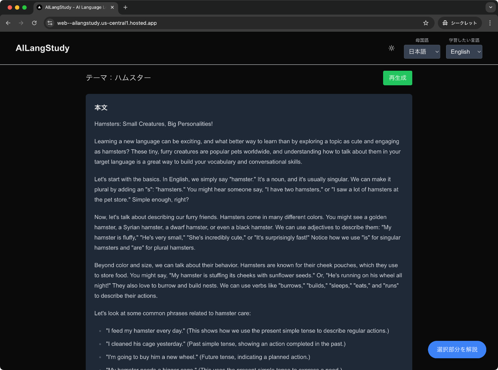
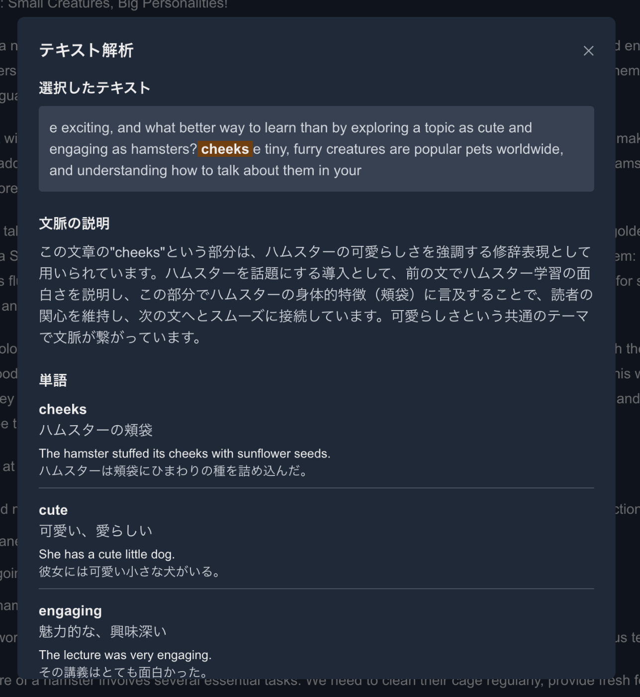

こちらの記事は [AI Agent Hackathon with Google Cloud](https://zenn.dev/hackathons/2024-google-cloud-japan-ai-hackathon) への応募記事です。

##  つくったもの

ユーザがテーマを入力するとAIが例文を作ってくれて  
その英文が読めなかったときにAIが解説してくれて学習をサポートしてくれるツールです。

##  プロジェクトが対象とするユーザー像と課題

新しく言語を学習したいと思っている人を対象としています。特に、ビジネスや趣味で新しい言語を習得したい方や、海外旅行や留学を考えている学生の方々にとって有用なツールとなっています。

なんとなく語学勉強をしたいけど、単語帳をやったり文法を座学で理解したりするのがめんどくさいタイプ向けのツールです。従来の語学学習方法では、文法書を暗記したり、単語帳を繰り返し覚えたりする必要がありましたが、そういった従来型の学習方法に苦手意識を持つ方々に新しい選択肢を提供します。

AIが発達して、言語を学習する意味があるのか？という所もありますが、実際にはAIツールを効果的に活用するためにも言語力は重要です。  
例えば、AIは英語でやり取りしたほうが性能が良い傾向があったりなど、AIとの対話においても言語スキルは必要不可欠です。

##  課題へのソリューションと特徴

文章の例文を、ユーザー入力から作成して、ユーザーが詰まった部分について、AIの解説を受けることが出来ます。これにより、ユーザーは自分の興味のある話題や実際に使用したい場面に即した形で学習を進めることができます。

人間の家庭教師ほどコストを掛けず、気軽に文章を読む実践を通して、語学学習が進められます。また、24時間いつでも利用可能で、自分のペースで学習を進められることも大きな特徴です。さらに、AIによる解説は、ユーザーの理解度に合わせて調整されるため、効率的な学習が可能となっています。

##  例：ハムスターと入力した場合

Hamsters: Small Creatures, Big Personalities!

Learning a new language can be exciting, and what better way to learn than by exploring a topic as cute and engaging as hamsters? These tiny, furry creatures are popular pets worldwide, and understanding how to talk about them in your target language is a great way to build your vocabulary and conversational skills.

Let's start with the basics. In English, we simply say "hamster." It's a noun, and it's usually singular. We can make it plural by adding an "s": "hamsters." You might hear someone say, "I have two hamsters," or "I saw a lot of hamsters at the pet store." Simple enough, right?

Now, let's talk about describing our furry friends. Hamsters come in many different colors. You might see a golden hamster, a Syrian hamster, a dwarf hamster, or even a black hamster. We can use adjectives to describe them: "My hamster is fluffy," "He's very small," "She's incredibly cute," or "It's surprisingly fast!" Notice how we use "is" for singular hamsters and "are" for plural hamsters.

Beyond color and size, we can talk about their behavior. Hamsters are known for their cheek pouches, which they use to store food. You might say, "My hamster is stuffing its cheeks with sunflower seeds." Or, "He's running on his wheel all night!" They also love to burrow and build nests. We can use verbs like "burrows," "builds," "sleeps," "eats," and "runs" to describe their actions.

Let's look at some common phrases related to hamster care:

"I feed my hamster every day." (This shows how we use the present simple tense to describe regular actions.)  
"I cleaned his cage yesterday." (Past simple tense, showing an action completed in the past.)  
"I'm going to buy him a new wheel." (Future tense, indicating a planned action.)  
"My hamster needs a bigger cage." (This uses the present simple tense to express a need.)  
"I'm worried about my hamster; he's not eating much." (Expressing concern using the present continuous tense.)  
Taking care of a hamster involves several essential tasks. We need to clean their cage regularly, provide fresh food and water, and make sure they have enough bedding and toys to keep them entertained. We also need to handle them gently to avoid stressing them out. Consider these phrases:

"Cleaning the hamster cage is a weekly chore."  
"Providing fresh water is crucial for hamster health."  
"Hamsters need a safe and comfortable environment."  
"Handling hamsters should be done gently and carefully."  
"It's important to supervise children around hamsters."  
Hamsters are also popular in children's stories and cartoons. They often represent characteristics like being busy, energetic, and sometimes a little mischievous. This cultural association is reflected in the language we use to describe them. For example, you might hear someone say...

##  解説例：

##  システムアーキテクチャ

##  コンポーネント説明

###  フロントエンド

  * **Web Client** : Firebase App Hostingでホストされているフロントエンドアプリケーション 
    * Next.jsを使用したWebアプリケーション

###  バックエンド (Firebase)

  * **Cloud Functions** : サーバーレスバックエンド機能
  * **Firebase Hosting** : 静的ファイルのホスティング
  * **Firebase Auth** : ユーザー認証管理

###  AI

  * **Gemini API** : Google Cloud Vertex AI上のGemini 1.5 Flash 
    * 高性能な言語モデルによるAI処理

###  データベース

  * **Cloud Firestore** : NoSQLデータベース 
    * スケーラブルなドキュメント指向データベース

##  デモ

<https://youtu.be/uIxbGD3sYrI>

##  プロンプト的に工夫したところ

テーマを入力する際に、例えば日本語で猫といれると、何故か中国語の説明を英語で行う文章が生成されたりして困惑しました。

テーマの文章を、英語に変えてから、英語の例文を作ることで精度が向上しました。

##  振り返り

この語学学習のアイデアにたどり着く前は、Devin AIのようなものが作れないか奮闘していました。最初は browser-use で GitHub Codespaces の Visual Studio Code 上のClineを操作できないか試していました。

browser-useが、Playwrightラッパーなのですが、Playwrightのオプションが使えず、ログインのセッションなどを使い回すテクニックなどが使えず苦戦しました。

そこでcomputer-useを試してみました。こちらはDocker上でAIを動かして画面を操作するというものです。面白いのは、AIから操作するタスクのようなものを定義して、それを操作するのが得意なAIと組み合わせて協調作業をしている点です。

しかし、computer-useも安定性の面で、このまま進めていいものか悩み、そこでOpenHandsに目をつけて、OpenHandsを色々触ってみていました。  
OpenHandsにGitHubと連携する機能があり、便利だなということになり、ここにあまり何かを足してもな...というところで、事前調査の甘さがあったなと痛感しました。

browser-useやcomputer-use、OpenHandsの勘所が分かったのは良かった点です。

好みだと思いますが、OpenHandsのGitHub連携も失敗しているのにGitHub Actionsがグリーンで終わったりなどと、少し利便性にかけるところがあり実際の開発に取り込むことは出来ませんでした。

OpenHandsやDevinっぽいプルリクエスト型開発よりも、ペアプロを好む方も居ると思うのですが  
実際のところCursorやCline、Windsurfを使ってAIとペアプロするのも生産性の上で悪くないのかもしれません。
