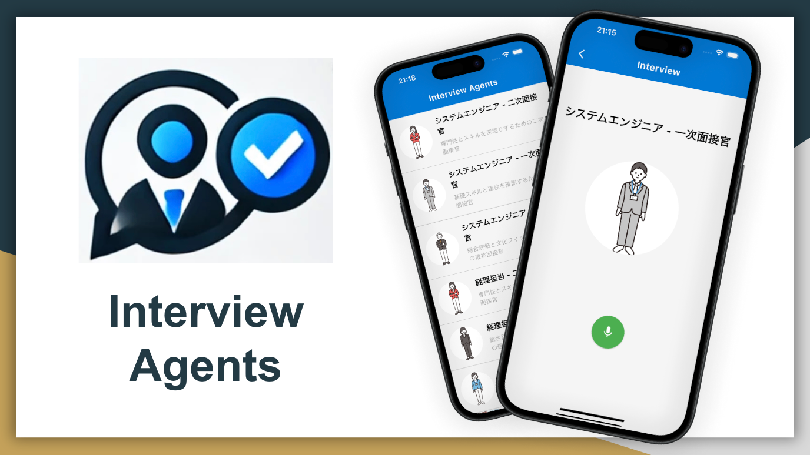
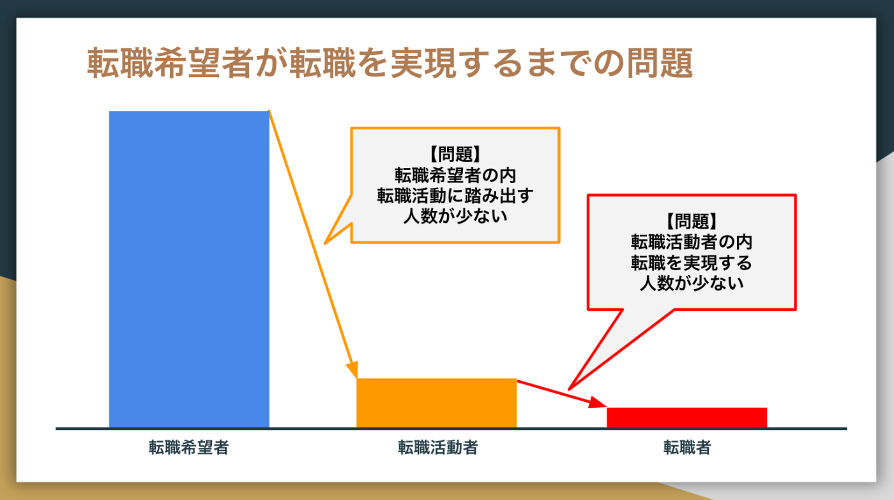
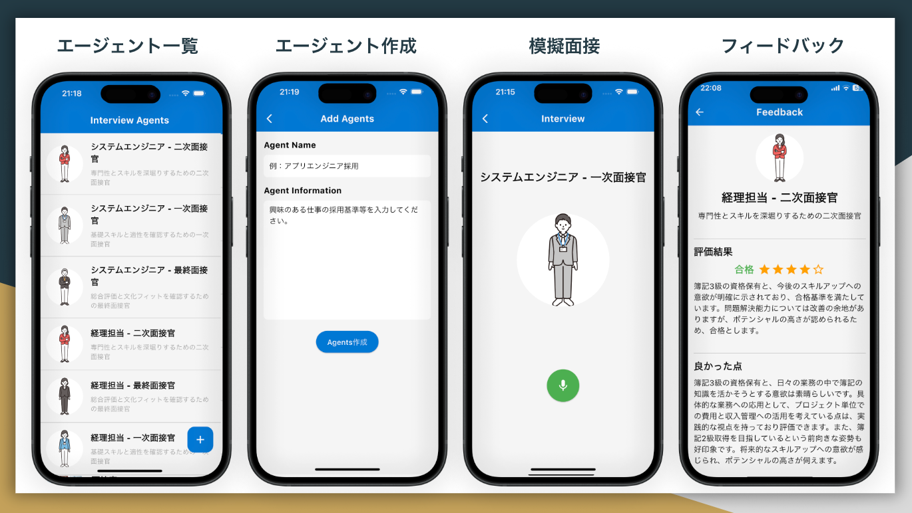
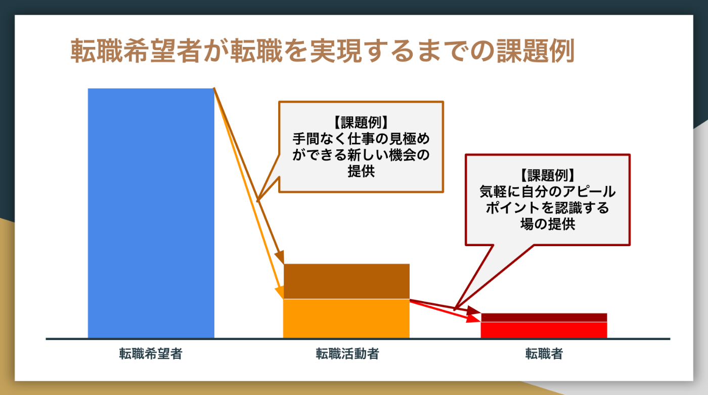
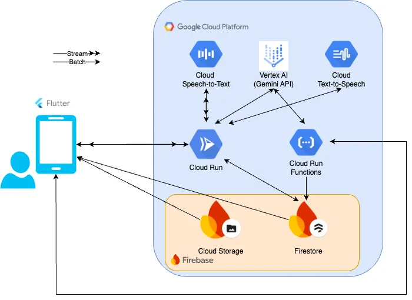

今回、模擬面接を手間なく体験できるアプリ、【Interview Agents】を作りました！  
[AI Agent Hackathon with Google Cloud](https://zenn.dev/hackathons/2024-google-cloud-japan-ai-hackathon)の提出記事になります。

##  はじめに

日本では少子高齢化が進み、生産年齢人口の減少による人手不足が深刻化し、労働生産性の向上が国全体の大きな課題となっています。1980年代以降、労働生産性の高い分野では労働移動が促進され、結果として経済全体の生産性向上につながっており([参考資料](https://www.mhlw.go.jp/wp/hakusyo/roudou/16/dl/16-1-2.pdf))、転職活動を通じた人材の流動性の向上は、経済全体の生産性向上に寄与する重要な要素と考えられます。

現在の転職市場では、異業種・異職種への転職が増加している一方([参考資料](https://www.recruit.co.jp/newsroom/pressrelease/assets/20240424_work_02.pdf))、企業側は人材確保に苦戦しています。2024年12月のdoda転職求人倍率（＝求人数 ÷ 転職希望者数）は3.15倍であり、求人数に対して、転職希望者数が不足してます([参考資料](https://doda.jp/guide/kyujin_bairitsu/))。

転職希望者に目を向けると、「転職希望者」のうち「転職活動者」の割合は、15.1%(2022年12月)と実際に転職活動を始める層は少数派です。さらに「転職活動者」の内、翌年の転職率は37.6%(2021-2022年)と半分に満たない数値です([参考資料](https://www.works-i.com/research/report/item/tenshoku.pdf))。

その要因として「**手間がかかる** 」「**自分にあった仕事がわからない** 」「**アピールポイントがわからなかった** 」などの理由から、転職を実現できないだけでなく、そもそも実際に転職活動に踏み出せていない層が存在します。

【Interview Agents】は、このような問題に対し、転職希望者がまずは気軽にAIエージェントとの対話を通じて、「実際に転職活動を始めるきっかけ」や「転職活動を成功させる気づき」を提供することを目的とした模擬面接アプリです。

転職希望者は、興味のある仕事のオリジナルAIエージェントをすぐに作成し、ニアリアルタイムでの質疑応答・良かった点や改善点のフィードバックを体験します。この体験により、「この職種は意外と向いているかも」「自分にはこんな良いところがある」等を実感し、転職活動に踏み出すモチベーション・自己理解の向上をさせ、より多くの転職希望者に「実際に転職活動を始めるきっかけ」「転職活動を成功させる気づき」の提供を目指します。

* * *

##  ⅰ. プロジェクトが対象とするユーザー像と課題、課題へのソリューションと特徴

###  【対象ユーザー】

【Interview Agents】は、転職市場における以下を主な対象とします。

  * **転職希望はあるが、まだ転職活動に踏み切れていない層**
    * 現状に一定の安心感がある一方、「転職したい」という意欲はあるものの、手間や不確実性、また自分にあった仕事が何か分からないという理由から、具体的な転職活動に踏み出せずにいる
    * まずは低リスクで自分の現状の面接スキルや自己アピールのレベルを客観的に知り、転職活動の第一歩を踏み出すための環境を求めている
  * **既に転職活動に取り組んでいるが、転職を実現できていない層**
    * 既に企業に応募し、面接を経験しているが、模擬面接の機会が不足しているため、企業が求める具体的な対策が十分に行えず、さらなるスキル向上を求めている
    * 異業種・異職種転職を検討しているが、特に自分の適性やアピールポイントが明確でなく、転職活動への大きな障壁となっている

###  【抱える課題】

対象ユーザーが抱えるの課題のうち、今回は以下の課題にフォーカスします。

  1. **手間なく、転職活動の一部を進められる環境の提供**

     * キャリアアドバイザーや転職エージェントに相談するには、事前の予約や日程調整が必要であり、現職が忙しい求職者にとっては、相談の機会自体を確保するのが難しい
     * 対面での模擬面接は、エージェントや面接官との個別対応が必要となるため、実施までの準備負担が大きく、心理的ハードルも高い
  2. **自分に合った仕事を見極める機会の提供**

     * 募集要項だけでは、実際に自分の評価や適性が分からず、結果として自分に最適な仕事や業界を判断する材料が不足している
     * 異業種への転職を希望する場合、同業種とは評価基準や求められるスキルが異なり、自己の適性を客観的に把握しにくい
  3. **自分のアピールポイントを認識する機会の提供**

     * 多くの求職者は、自己分析やフィードバックの機会が少なく、強みやアピール方法を明確にできない
     * 客観的な視点からフィードバックの機会や、業界特有の評価基準を持つ人との繋がりが限られ、適切なアドバイスを得にくい

###  【課題へのソリューション】

転職希望者向けに気軽に自分の現状を知り、転職に向けた具体的な気づきを提供する【Interview Agents】で課題解決を目指します。

ユーザーは、自身が興味のある仕事のオリジナルAIエージェントの作成し、AIエージェントと実際の面接のように質疑応答を音声で行います。質疑応答をもとに、5段階評価と合否判定に加え、良かった点と改善点のフィードバックを受け取れます。これにより、自己の強みや改善点が客観的に把握でき、面接での緊張感や即答力を養いながら、質疑応答やフィードバックでの新たな気づきを得ることができます。

各課題に対しての【Interview Agents】が提供する「ソリューション」と「効果」は以下の通りです。

  1. **手間なく、転職活動を進められる環境の提供**

     * **ソリューション:**

       * AIエージェントによるオンライン模擬面接を提供し、求職者がスマートフォンからいつでも面接練習を行える環境を整える
       * 日程調整や面談予約の手間をなくし、アプリを起動するだけで簡単に利用できるシステムを構築する
     * **効果:**

       * 忙しい現職者でも、まとまった時間を取らずに転職活動の初期ステップとして自己分析や面接練習が可能になる
       * 「転職活動の第一歩」として、気軽に試せる環境を整えることで、転職活動者への移行が促進される
  2. **自分に合った仕事を見極める機会の提供**

     * **ソリューション:**

       * 募集要件等の希望に基づいたオリジナルAIエージェント作成機能を提供し、ユーザーが希望する業界や職種の模擬面接を体験可能にする
       * AIエージェントとのニアリアルタイムな質疑応答を通じて、求職者の回答を解析し、AIエージェント目線での評価、強み・課題をフィードバックする
     * **効果:**

       * 求職者は、様々なエージェントとの対話を通じて、自分に適した仕事や業界の特徴を模索し、具体的な転職活動の方向性を見出す
       * 異業種への転職を希望する人が、具体的な職種の適性検討の機会を得ることで、より的確なキャリア選択につながる
  3. **自分のアピールポイントを認識する機会の提供**

     * **ソリューション:**

       * AIエージェントが、面接中の回答を基に、改善点だけでなく、「良かった点」も明確にフィードバックし、自己の強みを整理できるようにする
       * 採用基準の異なる複数のAIエージェントからのフィードバックを得ることで、より客観的な視点で自己理解が深まる
     * **効果:**

       * 求職者は、面接で自分の強みをより明確に理解し、「自分のアピールポイントが分からない」状態からの脱出に近づく
       * 評価や改善点を把握し、対策を具体的に進めることで、面接力が向上し、転職の成功に近づく

###  【ソリューションの特徴】

  * **オリジナルエージェント作成機能**

    * 募集要件や自身の興味・関心に合わせた面接官役のAIエージェントを作成でき、業界や職種ごとに模擬面接が実施可能
    * 一次・二次・最終面接官の3つのエージェントが生成され、それぞれ異なる視点から質問やフィードバックを提供
  * **ニアリアルタイムな質疑応答**

    * ユーザー音声や生成された音声のストリーミング処理により、スムーズで自然な模擬面接を実現
    * 即答力や反射的な対応力を養う、実際の面接に近い緊張感のある対話環境を提供
  * **具体的なフィードバック機能**

    * AIエージェントが、回答に対して5段階評価と合否判定を行い、改善点だけでなく、既にできている良い点（強み）も客観的にフィードバック
    * ユーザーは、フィードバックを通じて自分のアピールポイントを明確に認識でき、次回以降の面接対策をより具体的に開始可能
  * **直感的なUI/UX**

    * Flutterを採用したシンプルなインターフェースにより、スマートフォンからいつでもワンタップで面接練習を開始可能
    * アプリの起動だけで利用でき、キャリアアドバイザーや転職エージェントに依頼する手間や心理的ハードルを低減

* * *

##  Ⅱ. システム アーキテクチャ図の画像

【Interview Agents】のシステムは、以下の構成により動作しています。

主要なコンポーネントの説明は以下の通りです。

  1. **Flutterアプリ（クライアント機能）**

     * ユーザーの発話を録音し、gRPCサーバへ送信
     * gRPCサーバから取得したエージェント音声を再生
     * エージェント作成、模擬面接、フィードバック画面を提供
  2. **GCP Cloud Run（音声処理・質問やフィードバック生成機能）**

     * gRPCサーバとして、音声データを双方向ストリームで処理
     * Google Cloud Speech-to-Textを活用し、ストリームで音声認識を実施
     * Vertex AIのGemini APIにより、次の質問やフィードバックを生成
     * Google Cloud Text-to-Speechを利用し、エージェントの音声を生成
  3. **GCP Cloud Run Functions（エージェント作成機能）**

     * REST APIを提供し、Vertex AIのGemini APIを通じてオリジナルのエージェントを生成
     * 生成されたエージェント情報をFirestoreに保存し、ユーザーが選択・利用可能な状態に管理
  4. **Firebase（データストア機能）**

     * Firestoreで、ユーザーの面接セッション、エージェント設定、フィードバック結果を一元管理
     * Cloud Storageで、エージェントの画像データを保存・管理

* * *

##  Ⅲ. プロジェクトの3分以内のデモ動画

デモ動画では、本業とは異なる職種である経理補佐の仕事に興味を持ち、試しに本アプリを使って模擬面接を体験する様子を紹介しています。

<https://www.youtube.com/watch?v=4x6DV_N9uJY>

* * *

##  おわりに

今回は、転職希望者に「実際に転職活動を始めるきっかけ」や「転職活動を成功させる気づき」を提供することを目標にした模擬面接アプリ【Interview Agents】を作りました。

本アプリは、スマートフォンでアプリを起動するだけで、手間なく利用できます。ゲーム感覚でエージェントと模擬面接を繰り返しながら「合格」を目指すことも良いでしょう。転職に不安がある人も気軽に試せて、実践的な対策ができる仕組みです。

今後の展望として、転職希望者側だけではなく、企業側が【Interview Agents】を採用基準に導入することで、採用担当者の稼働削減や、書類審査よりも適性を重視したスクリーニングでの利用も考えられます。特に応募数の多い企業では、事前に【Interview Agents】での模擬面接を受け、一定基準を満たした応募者のみを本選考へ進めるといった活用も期待できます。これにより、採用のミスマッチを減らし、企業と求職者の双方にとって最適なマッチングを促進できる可能性もありそうです。
